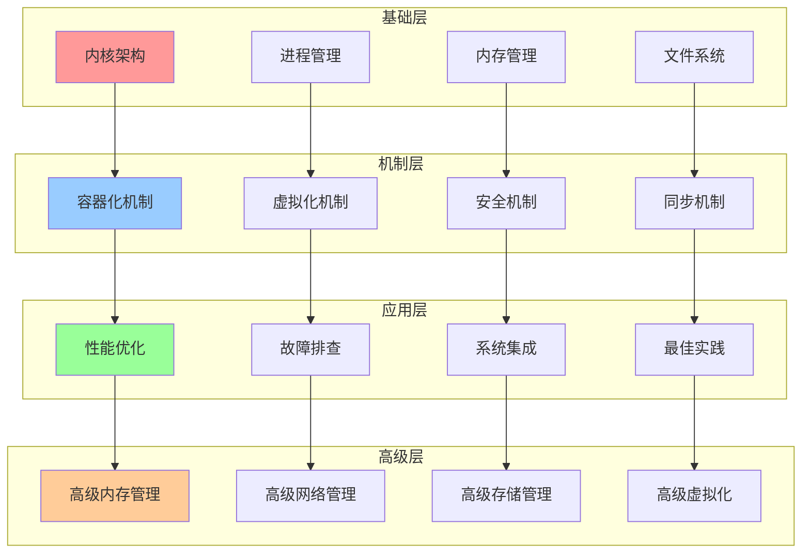
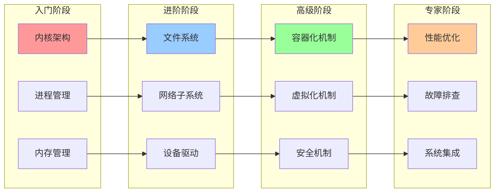
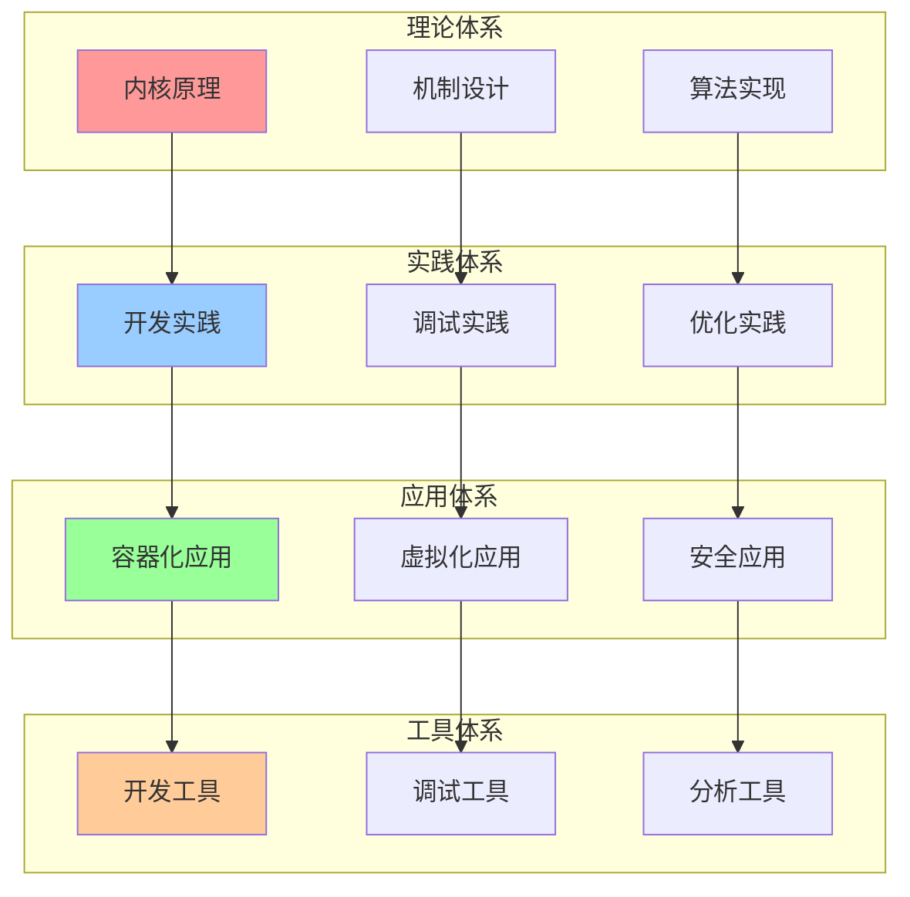

# 内核综合知识地图

## 📑 目录

- [内核综合知识地图](#内核综合知识地图)
  - [📑 目录](#-目录)
  - [1 知识地图全景](#1-知识地图全景)
  - [2 学习路径关系图](#2-学习路径关系图)
  - [3 知识体系关系图](#3-知识体系关系图)

---

## 1 知识地图全景

---

## 2 学习路径关系图

---

## 3 知识体系关系图

---

**最后更新**：2025-11-07
**文档状态**：✅ 完整 | 📊 包含内核综合知识地图 | 🎯 生产就绪
**维护者**：项目团队
