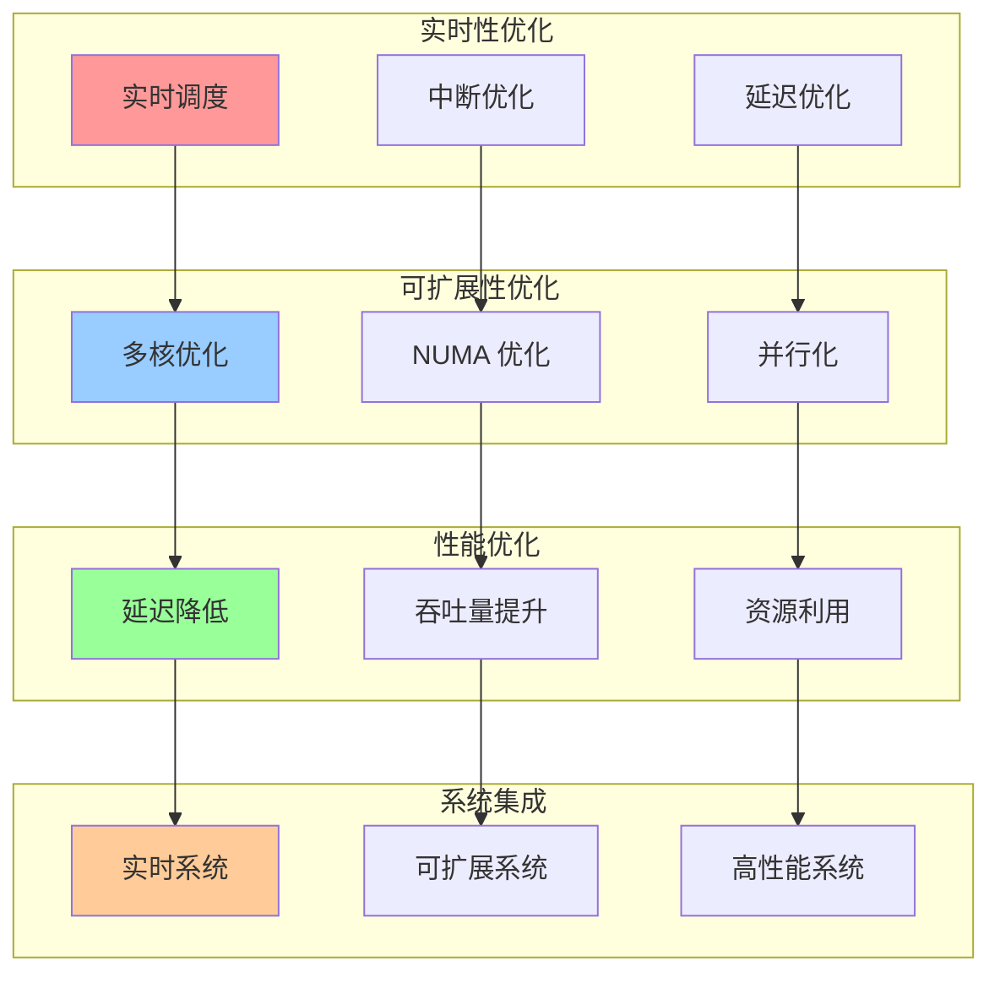
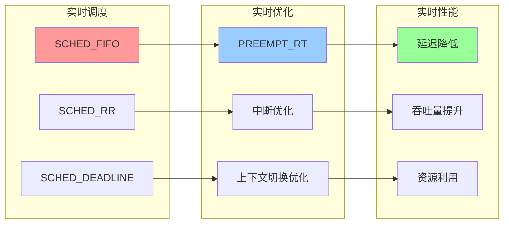
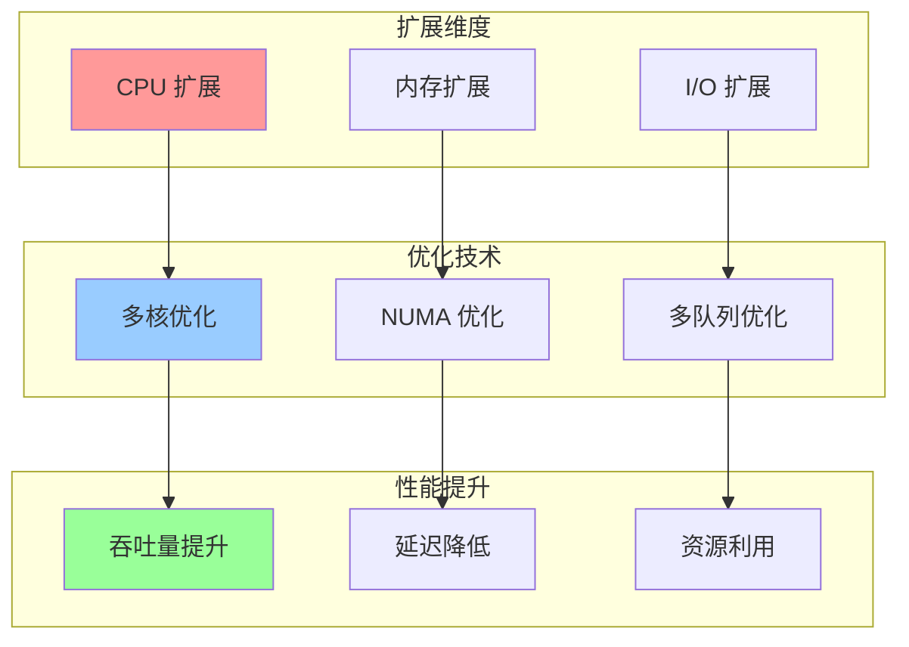

# 内核实时性与可扩展性集成关系图

## 📑 目录

- [内核实时性与可扩展性集成关系图](#内核实时性与可扩展性集成关系图)
  - [📑 目录](#-目录)
  - [1 实时性与可扩展性集成全景](#1-实时性与可扩展性集成全景)
  - [2 实时性优化关系图](#2-实时性优化关系图)
  - [3 可扩展性优化关系图](#3-可扩展性优化关系图)

---

## 1 实时性与可扩展性集成全景

---

## 2 实时性优化关系图

---

## 3 可扩展性优化关系图

---

**最后更新**：2025-11-07
**文档状态**：✅ 完整 | 📊 包含内核实时性与可扩展性集成关系图 | 🎯 生产就绪
**维护者**：项目团队
