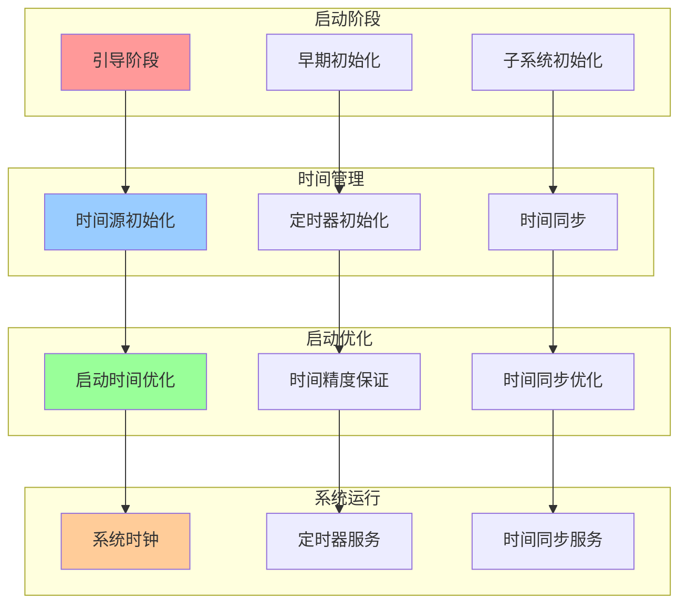
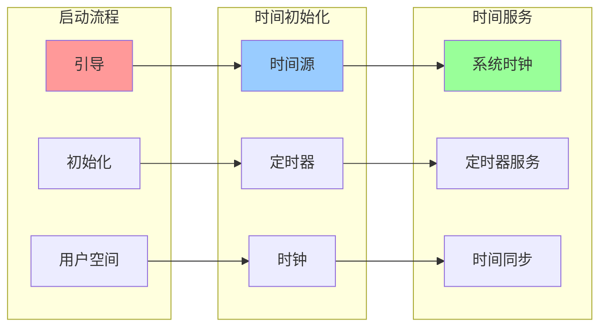
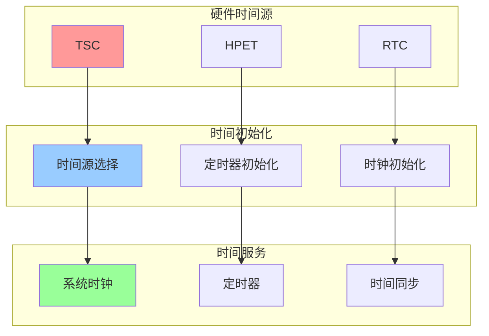

# 内核启动与时间管理集成关系图

## 📑 目录

- [内核启动与时间管理集成关系图](#内核启动与时间管理集成关系图)
  - [📑 目录](#-目录)
  - [1 启动与时间集成全景](#1-启动与时间集成全景)
  - [2 启动时间管理关系图](#2-启动时间管理关系图)
  - [3 时间初始化关系图](#3-时间初始化关系图)

---

## 1 启动与时间集成全景

---

## 2 启动时间管理关系图

---

## 3 时间初始化关系图

---

**最后更新**：2025-11-07
**文档状态**：✅ 完整 | 📊 包含内核启动与时间管理集成关系图 | 🎯 生产就绪
**维护者**：项目团队
