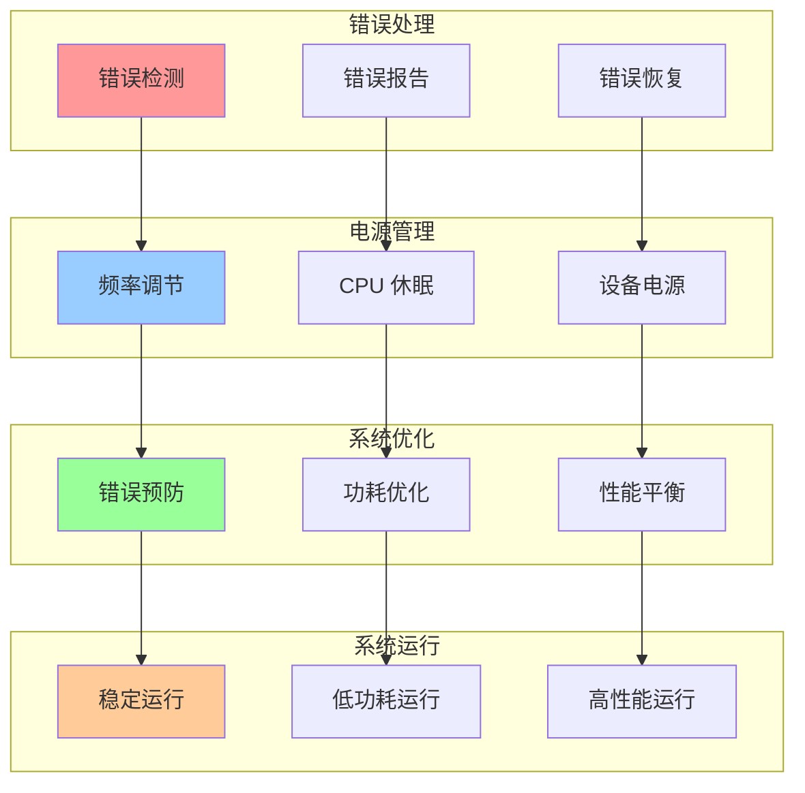
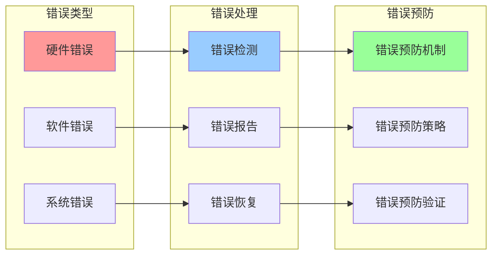
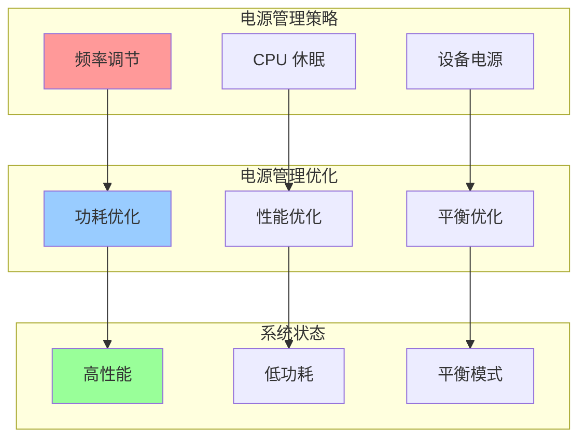

# 内核错误处理与电源管理集成关系图

## 📑 目录

- [内核错误处理与电源管理集成关系图](#内核错误处理与电源管理集成关系图)
  - [📑 目录](#-目录)
  - [1 错误与电源集成全景](#1-错误与电源集成全景)
  - [2 错误处理关系图](#2-错误处理关系图)
  - [3 电源管理关系图](#3-电源管理关系图)

---

## 1 错误与电源集成全景

---

## 2 错误处理关系图

---

## 3 电源管理关系图

---

**最后更新**：2025-11-07
**文档状态**：✅ 完整 | 📊 包含内核错误处理与电源管理集成关系图 | 🎯 生产就绪
**维护者**：项目团队
