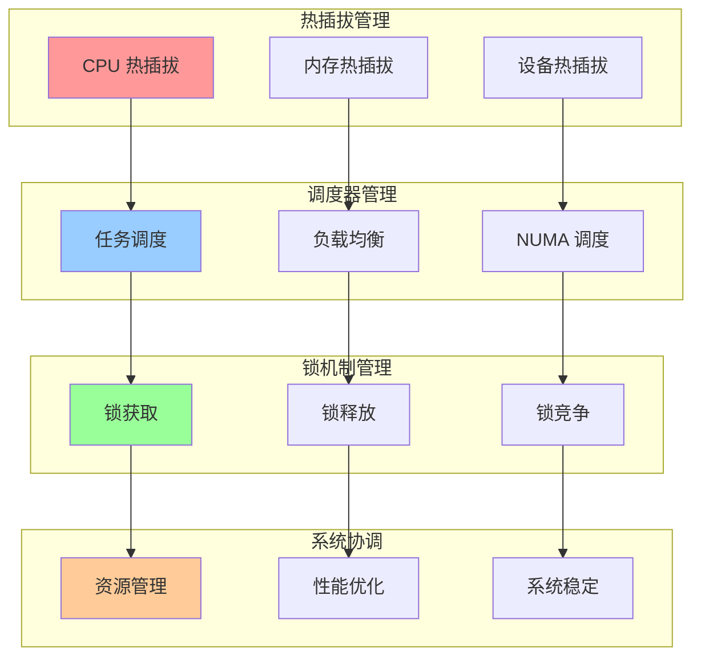
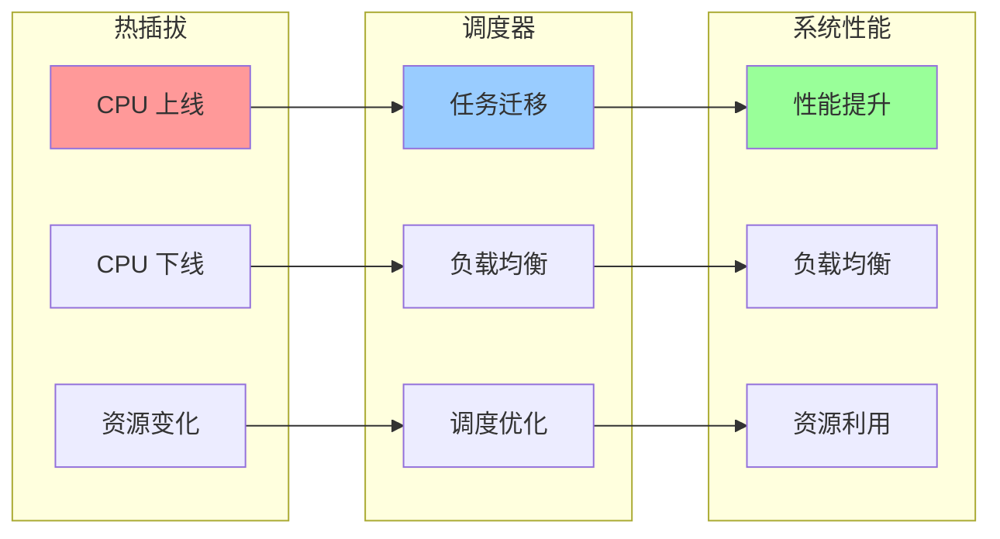
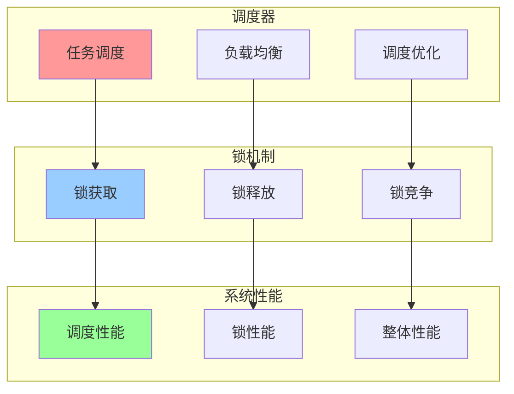

# 内核热插拔、调度器与锁机制集成关系图

## 📑 目录

- [内核热插拔、调度器与锁机制集成关系图](#内核热插拔调度器与锁机制集成关系图)
  - [📑 目录](#-目录)
  - [1 热插拔、调度器与锁集成全景](#1-热插拔调度器与锁集成全景)
  - [2 热插拔与调度器关系图](#2-热插拔与调度器关系图)
  - [3 调度器与锁机制关系图](#3-调度器与锁机制关系图)

---

## 1 热插拔、调度器与锁集成全景

---

## 2 热插拔与调度器关系图

---

## 3 调度器与锁机制关系图

---

**最后更新**：2025-11-07
**文档状态**：✅ 完整 | 📊 包含内核热插拔、调度器与锁机制集成关系图 | 🎯 生产就绪
**维护者**：项目团队
