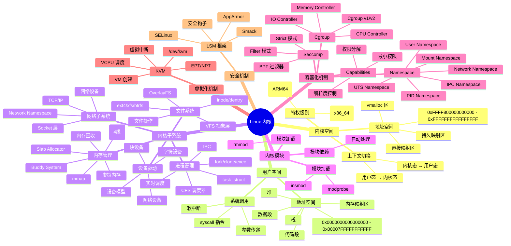

# 内核架构思维导图

## 📑 目录

- [内核架构思维导图](#内核架构思维导图)
  - [📑 目录](#-目录)
  - [1 完整思维导图](#1-完整思维导图)
  - [2 内核子系统思维导图](#2-内核子系统思维导图)
  - [3 内存管理思维导图](#3-内存管理思维导图)
  - [4 文件系统思维导图](#4-文件系统思维导图)
  - [5 网络协议栈思维导图](#5-网络协议栈思维导图)

---

## 1 完整思维导图



---

## 2 内核子系统思维导图

```mermaid
mindmap
  root((内核子系统))
    进程管理
      进程描述符
        task_struct
        pid/tgid
        进程状态
        内存描述符
        文件描述符
      进程创建
        fork()
          写时复制
          复制进程描述符
        clone()
          创建线程
          Namespace 标志
        exec()
          加载新程序
          替换地址空间
      进程调度
        CFS 调度器
          虚拟运行时间
          红黑树
          公平分配
        实时调度
          SCHED_FIFO
          SCHED_RR
      进程间通信
        管道
        信号
        共享内存
        消息队列
    内存管理
      虚拟地址空间
        地址空间布局
        VMA (虚拟内存区域)
        mm_struct
      页表管理
        四级页表
        PTE/PMD/PUD/PGD
        TLB
        地址转换
      物理内存管理
        页帧 (page)
        Buddy System
        Slab Allocator
        kmalloc/vmalloc
      内存映射
        mmap()
        文件映射
        匿名映射
        共享/私有映射
      内存回收
        LRU 算法
        交换 (Swap)
        内存压缩
        OOM Killer
    文件系统
      VFS 抽象层
        file 对象
        dentry 对象
        inode 对象
        superblock 对象
      文件操作
        open()
        read()
        write()
        close()
      文件系统类型
        ext4
        xfs
        btrfs
        OverlayFS
      文件系统挂载
        mount()
        Mount Namespace
        绑定挂载
    网络子系统
      Socket 层
        socket()
        bind()
        connect()
        send/recv
      TCP/IP 实现
        IP 层
        TCP 层
        UDP 层
      网络设备
        网络设备驱动
        数据包接收
        数据包发送
      Network Namespace
        网络隔离
        虚拟网络设备
```

---

## 3 内存管理思维导图

```mermaid
mindmap
  root((内存管理))
    虚拟内存
      地址空间
        用户空间
          代码段
          数据段
          堆
          栈
          内存映射区
        内核空间
          直接映射区
          vmalloc 区
      内存区域 (VMA)
        vm_area_struct
        权限标志
        文件映射
        匿名映射
    页表
      四级页表结构
        PML4
        PDPT
        PD
        PT
      页表项 (PTE)
        物理页帧号
        权限位
        访问位
        脏位
      TLB
        地址转换缓存
        TLB 刷新
    物理内存
      页帧管理
        struct page
        页标志
        引用计数
      Buddy System
        内存分配
        内存释放
        伙伴算法
      Slab Allocator
        小对象分配
        kmem_cache
        kmalloc/kfree
    内存映射
      mmap()
        文件映射
        匿名映射
        共享映射
        私有映射
      写时复制 (CoW)
        共享页面
        页面复制
    内存回收
      LRU 算法
        活跃链表
        非活跃链表
      交换 (Swap)
        交换分区
        交换文件
        页面换出
        页面换入
      内存压缩
        KSM
        页面合并
      OOM Killer
        内存不足处理
        进程选择
```

---

## 4 文件系统思维导图

```mermaid
mindmap
  root((文件系统))
    VFS 抽象层
      核心对象
        file
          文件操作函数
          文件位置
          文件标志
        dentry
          目录项名称
          关联 inode
          父目录项
          dentry 缓存
        inode
          inode 编号
          文件大小
          权限
          时间戳
          文件操作
        superblock
          文件系统类型
          根目录
          超级块操作
      文件操作
        open()
          路径查找
          权限检查
          创建 file 对象
        read()
          vfs_read()
          文件系统 read
        write()
          vfs_write()
          文件系统 write
    文件系统类型
      ext4
        日志文件系统
        大文件支持
        延迟分配
      xfs
        高性能
        大文件系统
        分配组
      btrfs
        写时复制
        快照
        数据完整性
      OverlayFS
        联合文件系统
        上层/下层
        容器镜像
    文件系统挂载
      mount()
        挂载流程
        挂载选项
      Mount Namespace
        独立挂载点
        挂载隔离
      绑定挂载
        目录绑定
        文件绑定
```

---

## 5 网络协议栈思维导图

```mermaid
mindmap
  root((网络协议栈))
    协议栈层次
      应用层
        应用程序
        Socket API
      Socket 层
        socket()
        bind()
        connect()
        send/recv
     传输层
        TCP
          连接管理
          可靠传输
          流量控制
        UDP
          无连接
          快速传输
      网络层
        IP
          IP 数据包
          路由查找
          IP 转发
      数据链路层
        以太网
        MAC 地址
      物理层
        网络设备
    网络设备
      设备结构
        net_device
        设备操作
        统计信息
      数据包处理
        接收流程
          中断处理
          软中断
          协议处理
        发送流程
          队列管理
          设备发送
    Network Namespace
      网络隔离
        独立网络栈
        独立网络设备
        独立路由表
      虚拟网络设备
        veth
        bridge
        vxlan
```

---

**最后更新**：2025-11-07
**文档状态**：✅ 完整 | 📊 包含思维导图 | 🎯 生产就绪
**维护者**：项目团队
