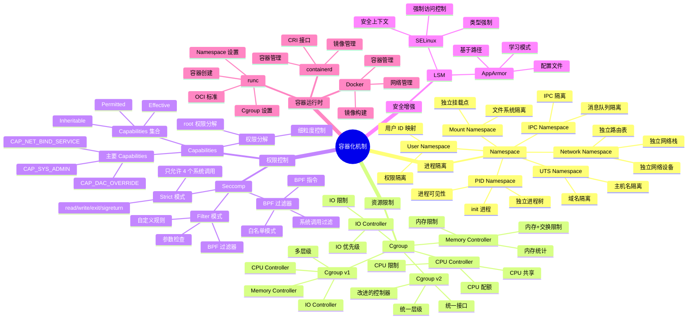
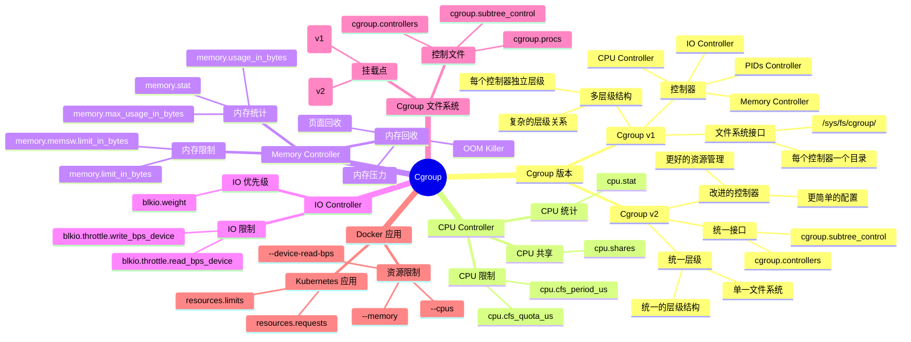
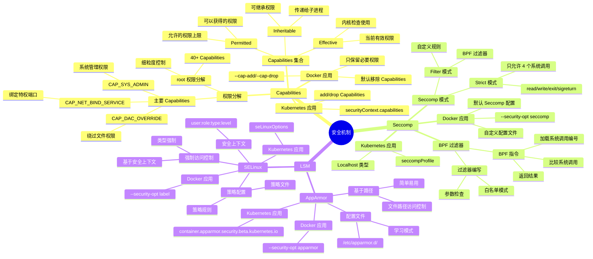

# 容器化机制思维导图

## 📑 目录

- [容器化机制思维导图](#容器化机制思维导图)
  - [📑 目录](#-目录)
  - [1 容器化机制全景](#1-容器化机制全景)
  - [2 Namespace 机制思维导图](#2-namespace-机制思维导图)
  - [3 Cgroup 机制思维导图](#3-cgroup-机制思维导图)
  - [4 安全机制思维导图](#4-安全机制思维导图)

---

## 1 容器化机制全景



---

## 2 Namespace 机制思维导图

```mermaid
mindmap
  root((Namespace))
    Namespace 类型
      PID Namespace
        进程隔离
          独立进程树
          init 进程 (PID 1)
          进程可见性
        内核实现
          pid_namespace 结构
          PID 分配
          进程查找
        API
          clone(CLONE_NEWPID)
          setns()
        Docker 应用
          容器进程隔离
          进程树独立
      Network Namespace
        网络隔离
          独立网络栈
          独立网络设备
          独立路由表
          独立防火墙规则
        内核实现
          net 结构
          网络设备列表
          路由表
        API
          clone(CLONE_NEWNET)
          unshare(CLONE_NEWNET)
        Docker 应用
          容器网络
          网络模式
          Bridge/Host/None
      Mount Namespace
        文件系统隔离
          独立挂载点
          挂载操作隔离
          文件系统视图
        内核实现
          mnt_namespace 结构
          挂载点树
        API
          clone(CLONE_NEWNS)
          unshare(CLONE_NEWNS)
        Docker 应用
          容器文件系统
          联合文件系统
          OverlayFS
      User Namespace
        用户隔离
          用户 ID 映射
          权限隔离
          root 权限限制
        内核实现
          user_namespace 结构
          UID/GID 映射
        API
          clone(CLONE_NEWUSER)
        Docker 应用
          非 root 容器
          权限限制
      UTS Namespace
        主机名隔离
          独立主机名
          独立域名
        内核实现
          uts_namespace 结构
        API
          clone(CLONE_NEWUTS)
      IPC Namespace
        IPC 隔离
          消息队列隔离
          共享内存隔离
          信号量隔离
        内核实现
          ipc_namespace 结构
        API
          clone(CLONE_NEWIPC)
    Namespace API
      clone()
        创建新进程
        指定 Namespace 标志
        创建新的 Namespace
      unshare()
        从当前进程分离
        创建新的 Namespace
      setns()
        加入现有 Namespace
        通过文件描述符
    Namespace 数据结构
      nsproxy
        所有 Namespace 的集合
        每个进程一个
      task_struct
        nsproxy 指针
        指向 Namespace 集合
```

---

## 3 Cgroup 机制思维导图



---

## 4 安全机制思维导图



---

**最后更新**：2025-11-07
**文档状态**：✅ 完整 | 📊 包含容器化机制思维导图 | 🎯 生产就绪
**维护者**：项目团队
