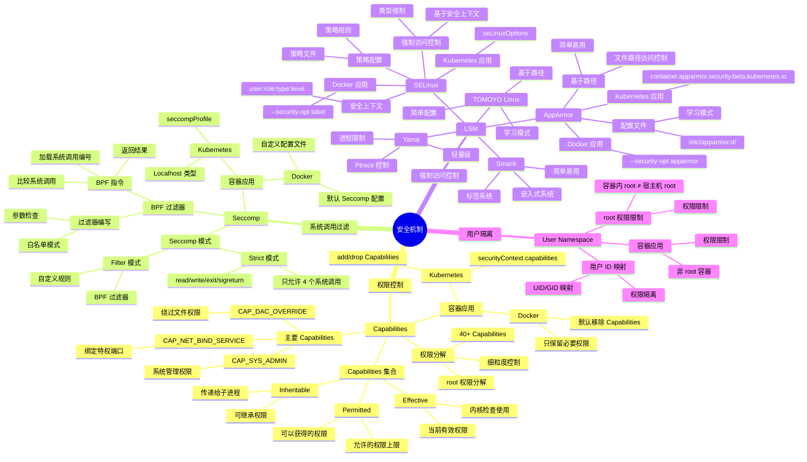

# 安全机制思维导图

## 📑 目录

- [安全机制思维导图](#安全机制思维导图)
  - [📑 目录](#-目录)
  - [1 安全机制全景](#1-安全机制全景)
  - [2 Capabilities 思维导图](#2-capabilities-思维导图)
  - [3 Seccomp 思维导图](#3-seccomp-思维导图)
  - [4 LSM 思维导图](#4-lsm-思维导图)

---

## 1 安全机制全景



---

## 2 Capabilities 思维导图

```mermaid
mindmap
  root((Capabilities))
    权限模型
      传统模型
        root 权限
          全部权限
          安全风险
        普通用户
          权限受限
      Capabilities 模型
        权限分解
          root 权限分解
          40+ Capabilities
        细粒度控制
          精确控制
          最小权限
    Capabilities 集合
      Effective
        当前有效权限
        内核检查使用
        setuid 影响
      Permitted
        允许的权限上限
        可以获得的权限
        进程权限上限
      Inheritable
        可继承权限
        传递给子进程
        exec 继承
    主要 Capabilities
      网络相关
        CAP_NET_BIND_SERVICE
          绑定特权端口 (<1024)
        CAP_NET_RAW
          原始套接字
        CAP_NET_ADMIN
          网络管理
      系统管理
        CAP_SYS_ADMIN
          系统管理权限
        CAP_SYS_TIME
          系统时间设置
        CAP_SYS_MODULE
          加载/卸载模块
      文件系统
        CAP_DAC_OVERRIDE
          绕过文件权限
        CAP_CHOWN
          改变文件所有者
        CAP_FOWNER
          文件所有者权限
      其他重要
        CAP_SETUID
          设置 UID
        CAP_SETGID
          设置 GID
        CAP_KILL
          发送信号
    内核实现
      数据结构
        struct cred
          cap_effective
          cap_permitted
          cap_inheritable
      权限检查
        capable()
        ns_capable()
      权限传递
        fork()
        exec()
    容器应用
      Docker
        默认移除
          移除大部分 Capabilities
          只保留必要权限
        配置选项
          --cap-add
          --cap-drop
      Kubernetes
        securityContext
          capabilities.add
          capabilities.drop
```

---

## 3 Seccomp 思维导图

```mermaid
mindmap
  root((Seccomp))
    Seccomp 模式
      Strict 模式
        只允许 4 个系统调用
          read
          write
          exit
          sigreturn
        其他系统调用
          进程被 SIGKILL 杀死
        使用场景
          沙盒环境
          简单应用
      Filter 模式
        BPF 过滤器
          自定义规则
          灵活配置
        系统调用控制
          允许
          拒绝
          记录
        参数检查
          系统调用参数
          条件判断
    BPF 过滤器
      BPF 指令
        加载指令
          BPF_LD
          加载系统调用编号
        比较指令
          BPF_JMP
          比较系统调用
        返回指令
          BPF_RET
          返回结果
      过滤器编写
        白名单模式
          默认拒绝
          只允许必要系统调用
        参数检查
          检查系统调用参数
          条件判断
      过滤器示例
        只允许 read/write/exit
        参数检查示例
    Seccomp 返回值
      SECCOMP_RET_ALLOW
        允许系统调用
      SECCOMP_RET_ERRNO
        拒绝并返回错误码
      SECCOMP_RET_TRACE
        通知 ptrace
      SECCOMP_RET_KILL_PROCESS
        杀死进程
      SECCOMP_RET_KILL_THREAD
        杀死线程
    内核实现
      数据结构
        seccomp_filter
        seccomp_data
      过滤器执行
        seccomp_run_filters()
        BPF 程序执行
      性能优化
        BPF JIT
        过滤器缓存
    容器应用
      Docker
        默认配置
          默认 Seccomp 配置
          限制系统调用
        自定义配置
          --security-opt seccomp
          配置文件
      Kubernetes
        seccompProfile
          RuntimeDefault
          Localhost
          Unconfined
```

---

## 4 LSM 思维导图

```mermaid
mindmap
  root((LSM))
    LSM 框架
      LSM 钩子
        文件系统钩子
          file_open
          file_read
          file_write
        网络钩子
          socket_create
          socket_bind
        进程钩子
          task_create
          task_kill
        系统调用钩子
          系统调用拦截
      LSM 注册
        模块注册
        security_add_hooks()
      LSM 调用
        call_int_hook()
        遍历钩子列表
    SELinux
      强制访问控制
        基于安全上下文
        类型强制
        多级安全
     安全上下文
        user:role:type:level
        user
          用户标识
        role
          角色标识
        type
          类型标识
          最重要的组件
        level
          安全级别
          MLS
      策略配置
        策略规则
          allow 规则
          deny 规则
        策略文件
          .te 文件
          .pp 文件
      SELinux 模式
        Enforcing
          强制模式
          拒绝未授权访问
        Permissive
          宽松模式
          记录但不拒绝
        Disabled
          禁用模式
     AppArmor
      基于路径
        文件路径访问控制
        简单易用
      配置文件
        /etc/apparmor.d/
        应用配置文件
       AppArmor 模式
        Enforce
          强制模式
        Complain
          学习模式
        Unconfined
          未限制模式
      学习模式
        自动学习应用行为
        生成配置文件
    其他 LSM 模块
      Smack
        简单易用
        标签系统
        嵌入式系统
      TOMOYO Linux
        基于路径
        学习模式
        简单配置
      Yama
        进程限制
        Ptrace 控制
        轻量级
    容器应用
      Docker
        SELinux
          --security-opt label
        AppArmor
          --security-opt apparmor
      Kubernetes
        SELinux
          seLinuxOptions
        AppArmor
          container.apparmor.security.beta.kubernetes.io
```

---

**最后更新**：2025-11-07
**文档状态**：✅ 完整 | 📊 包含安全机制思维导图 | 🎯 生产就绪
**维护者**：项目团队
