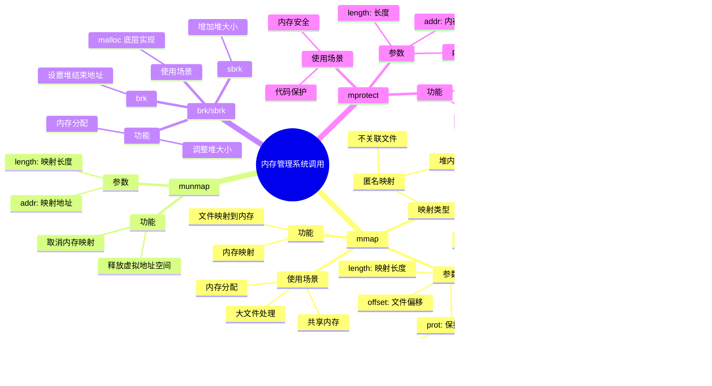

# 系统调用思维导图

## 📑 目录

- [系统调用思维导图](#系统调用思维导图)
  - [📑 目录](#-目录)
  - [1 系统调用全景](#1-系统调用全景)
  - [2 进程管理系统调用](#2-进程管理系统调用)
  - [3 内存管理系统调用](#3-内存管理系统调用)
  - [4 文件系统系统调用](#4-文件系统系统调用)
  - [5 网络系统调用](#5-网络系统调用)

---

## 1 系统调用全景

```mermaid
mindmap
  root((系统调用))
    系统调用基础
      系统调用接口
        系统调用编号
          __NR_read
          __NR_write
          __NR_open
        系统调用表
          sys_call_table
          函数指针数组
        参数传递
          x86_64
            rax: 系统调用编号
            rdi/rsi/rdx: 参数
          ARM64
            x8: 系统调用编号
            x0-x5: 参数
      系统调用流程
        用户空间调用
          C 库函数
          syscall() 函数
        进入内核
          syscall 指令
          软中断
        内核处理
          参数检查
          权限检查
          执行操作
        返回用户空间
          sysret/eret
          返回结果
      系统调用性能
        上下文切换开销
          ~100-200 纳秒
        优化技术
          vDSO
          io_uring
    进程管理系统调用
      fork
        创建子进程
        写时复制
        返回子进程 PID
      clone
        创建进程/线程
        Namespace 标志
        共享资源标志
      execve
        加载新程序
        替换地址空间
        参数和环境变量
      exit
        终止进程
        EXIT_ZOMBIE 状态
        通知父进程
      wait/waitpid
        等待子进程
        回收子进程资源
    内存管理系统调用
      mmap
        内存映射
        文件映射
        匿名映射
        共享/私有映射
      munmap
        取消内存映射
        释放虚拟地址空间
      brk/sbrk
        调整堆大小
        内存分配
      mprotect
        修改内存保护
        读/写/执行权限
    文件系统系统调用
      open
        打开文件
        创建文件
        文件标志
      read
        读取文件
        文件描述符
        缓冲区
      write
        写入文件
        文件描述符
        数据缓冲区
      close
        关闭文件
        释放文件描述符
      stat/fstat
        获取文件信息
        inode 信息
        文件大小
      mkdir/rmdir
        创建目录
        删除目录
    网络系统调用
      socket
        创建套接字
        协议族
        套接字类型
      bind
        绑定地址
        IP 地址
        端口号
      connect
        连接服务器
        远程地址
      listen
        监听连接
         backlog
      accept
        接受连接
        返回新套接字
      send/recv
        发送/接收数据
        套接字
        数据缓冲区
      sendto/recvfrom
        发送/接收数据
        UDP 套接字
        目标地址
```

---

## 2 进程管理系统调用


---

## 3 内存管理系统调用



---

## 4 文件系统系统调用


---

## 5 网络系统调用


---

**最后更新**：2025-11-07
**文档状态**：✅ 完整 | 📊 包含系统调用思维导图 | 🎯 生产就绪
**维护者**：项目团队
