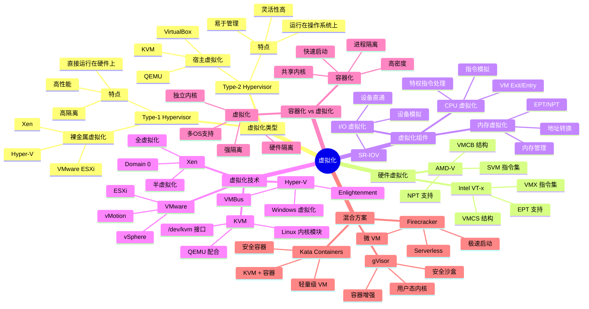
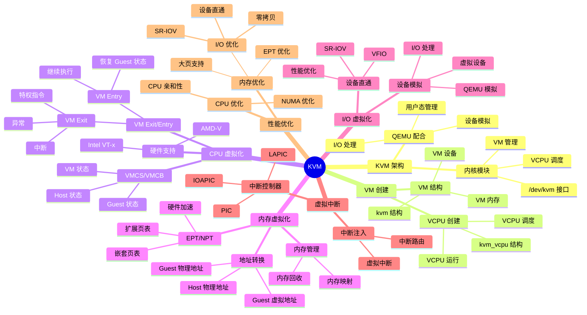
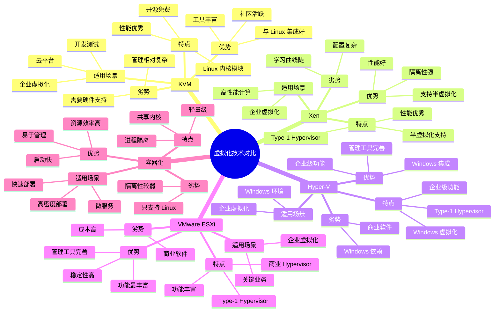

# 虚拟化机制思维导图

## 📑 目录

- [虚拟化机制思维导图](#虚拟化机制思维导图)
  - [📑 目录](#-目录)
  - [1 虚拟化全景](#1-虚拟化全景)
  - [2 KVM 思维导图](#2-kvm-思维导图)
  - [3 虚拟化技术对比](#3-虚拟化技术对比)

---

## 1 虚拟化全景

---

## 2 KVM 思维导图

---

## 3 虚拟化技术对比

---

**最后更新**：2025-11-07
**文档状态**：✅ 完整 | 📊 包含虚拟化机制思维导图 | 🎯 生产就绪
**维护者**：项目团队
