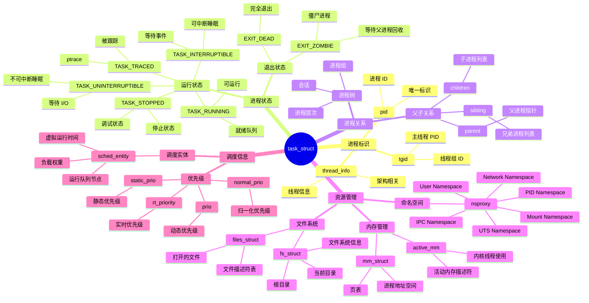

# 进程管理详细思维导图

## 📑 目录

- [进程管理详细思维导图](#进程管理详细思维导图)
  - [📑 目录](#-目录)
  - [1 进程管理全景](#1-进程管理全景)
  - [2 进程描述符详细思维导图](#2-进程描述符详细思维导图)
  - [3 进程调度详细思维导图](#3-进程调度详细思维导图)
  - [4 进程间通信详细思维导图](#4-进程间通信详细思维导图)

---

## 1 进程管理全景

```mermaid
mindmap
  root((进程管理))
    进程描述符
      task_struct
        进程标识
          pid
          tgid
          thread_info
        进程状态
          TASK_RUNNING
          TASK_INTERRUPTIBLE
          TASK_UNINTERRUPTIBLE
          TASK_STOPPED
          TASK_TRACED
          EXIT_ZOMBIE
          EXIT_DEAD
        进程关系
          parent
          children
          sibling
        资源管理
          mm_struct
          fs_struct
          files_struct
          nsproxy
        调度信息
          prio
          static_prio
          normal_prio
          rt_priority
          sched_entity
        信号处理
          signal_struct
          sighand_struct
    进程创建
      fork()
        写时复制
          共享物理页面
          写入时复制
          节省内存
        复制进程描述符
          copy_process()
          复制地址空间
          复制文件描述符
        唤醒新进程
          wake_up_new_task()
      clone()
        创建线程
          CLONE_VM
          CLONE_FILES
          CLONE_SIGHAND
        创建容器
          CLONE_NEWPID
          CLONE_NEWNS
          CLONE_NEWNET
      exec()
        加载新程序
          do_execve()
          解析可执行文件
          加载到内存
        替换地址空间
          释放旧地址空间
          创建新地址空间
    进程调度
      CFS 调度器
        虚拟运行时间
          vruntime
          公平分配
          红黑树排序
        调度实体
          sched_entity
          负载权重
          运行队列
        调度策略
          选择最小 vruntime
          公平分配 CPU
      实时调度
        SCHED_FIFO
          先进先出
          高优先级抢占
        SCHED_RR
          轮询调度
          时间片轮转
      调度策略
        SCHED_NORMAL
          普通进程
          优先级 100-139
        SCHED_FIFO
          实时 FIFO
          优先级 1-99
        SCHED_RR
          实时轮询
          优先级 1-99
        SCHED_IDLE
          空闲调度
    进程间通信
      管道
        pipe()
          匿名管道
          单向通信
        FIFO
          命名管道
          文件系统接口
      信号
        signal()
          信号注册
          信号处理
        kill()
          发送信号
          信号传递
      共享内存
        System V
          shmget()
          shmat()
        POSIX
          shm_open()
          mmap()
      消息队列
        System V
          msgget()
          msgsnd()
          msgrcv()
        POSIX
          mq_open()
          mq_send()
          mq_receive()
    容器化应用
      PID Namespace
        独立进程树
        init 进程
        进程可见性
      Cgroup CPU
        CPU 限制
        CPU 配额
        CPU 共享
      进程调度
        CFS 调度
        CPU 限制
        优先级控制
```

---

## 2 进程描述符详细思维导图



---

## 3 进程调度详细思维导图

```mermaid
mindmap
  root((进程调度))
    CFS 调度器
      核心思想
        公平分配
          虚拟运行时间
          公平性保证
        红黑树
          按 vruntime 排序
          快速查找
      虚拟运行时间
        vruntime
          累积虚拟时间
          权重调整
        计算公式
          vruntime += delta_exec * weight
      调度实体
        sched_entity
          负载权重
          load_weight
          运行队列节点
          rb_node
          虚拟运行时间
          vruntime
      运行队列
        cfs_rq
          红黑树根
          tasks_timeline
          当前运行进程
          curr
          运行进程数
          nr_running
      调度算法
        选择进程
          pick_next_task_fair()
          选择最小 vruntime
        调度决策
          时间片计算
          抢占判断
    实时调度
      SCHED_FIFO
        先进先出
          高优先级抢占
          无时间片
        优先级范围
          1-99
      SCHED_RR
        轮询调度
          时间片轮转
          相同优先级
        优先级范围
          1-99
      实时队列
        rt_rq
          优先级数组
          active
          运行队列
    调度策略
      SCHED_NORMAL
        普通进程
        CFS 调度器
        优先级 100-139
      SCHED_FIFO
        实时 FIFO
        优先级 1-99
      SCHED_RR
        实时轮询
        优先级 1-99
      SCHED_IDLE
        空闲调度
        最低优先级
    调度时机
      主动调度
        schedule()
          进程主动让出 CPU
      被动调度
        时钟中断
          tick_nohz
        唤醒进程
          wake_up()
      抢占调度
        内核抢占
          preempt_disable()
          preempt_enable()
        用户抢占
          返回用户空间
    容器化应用
      Cgroup CPU
        CPU 限制
          cpu.cfs_quota_us
          cpu.cfs_period_us
        CPU 共享
          cpu.shares
        CPU 统计
          cpu.stat
      进程调度
        CFS 调度
        CPU 限制
        优先级控制
```

---

## 4 进程间通信详细思维导图

```mermaid
mindmap
  root((进程间通信))
    管道
      匿名管道
        pipe()
          创建管道
          返回两个文件描述符
          单向通信
        数据流
          写入端
          读取端
          FIFO 队列
      命名管道
        FIFO
          mkfifo()
          文件系统接口
          多个进程访问
        使用场景
          进程间通信
          命令行工具
    信号
      信号类型
        SIGTERM
          终止信号
        SIGKILL
          强制终止
        SIGINT
          中断信号
        SIGCHLD
          子进程退出
      信号处理
        signal()
          注册信号处理函数
        sigaction()
          更详细的信号处理
      信号发送
        kill()
          发送信号给进程
        raise()
          发送信号给自己
    共享内存
      System V
        shmget()
          创建共享内存
          key_t key
          size_t size
        shmat()
          附加共享内存
          返回指针
        shmdt()
          分离共享内存
      POSIX
        shm_open()
          创建共享内存对象
          文件系统接口
        mmap()
          映射共享内存
          MAP_SHARED
        使用场景
          高性能通信
          大数据传输
    消息队列
      System V
        msgget()
          创建消息队列
        msgsnd()
          发送消息
        msgrcv()
          接收消息
      POSIX
        mq_open()
          创建消息队列
        mq_send()
          发送消息
        mq_receive()
          接收消息
    套接字
      Unix Domain Socket
        socket(AF_UNIX)
          本地通信
          高性能
      TCP/UDP Socket
        socket(AF_INET)
          网络通信
          跨主机
    容器化应用
      IPC Namespace
        IPC 隔离
          消息队列隔离
          共享内存隔离
          信号量隔离
        容器内 IPC
          独立 IPC 空间
```

---

**最后更新**：2025-11-07
**文档状态**：✅ 完整 | 📊 包含进程管理详细思维导图 | 🎯 生产就绪
**维护者**：项目团队
