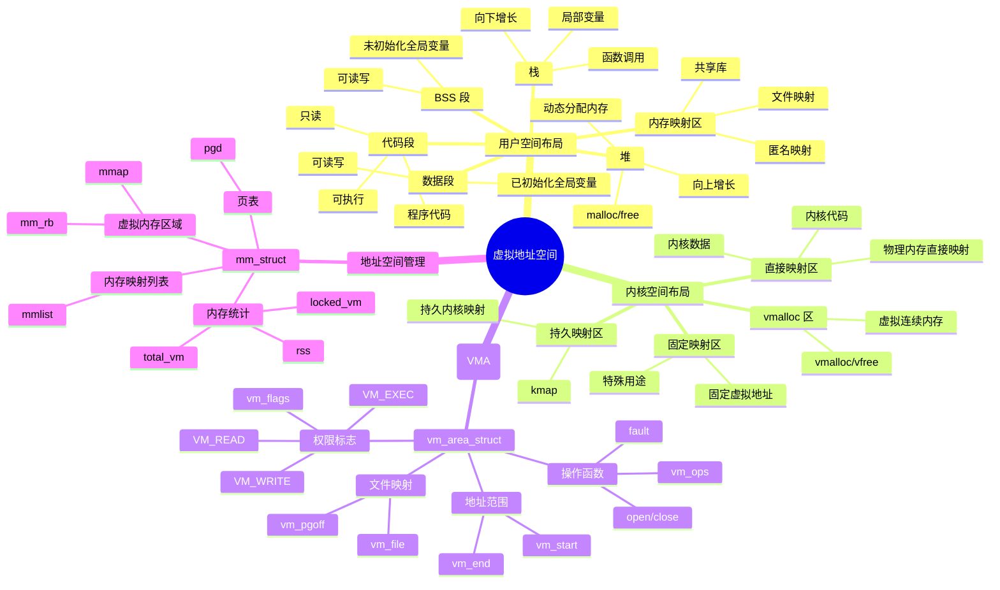

# 内存管理详细思维导图

## 📑 目录

- [内存管理详细思维导图](#内存管理详细思维导图)
  - [📑 目录](#-目录)
  - [1 内存管理全景](#1-内存管理全景)
  - [2 虚拟地址空间详细思维导图](#2-虚拟地址空间详细思维导图)
  - [3 页表管理详细思维导图](#3-页表管理详细思维导图)
  - [4 物理内存管理详细思维导图](#4-物理内存管理详细思维导图)

---

## 1 内存管理全景

```mermaid
mindmap
  root((内存管理))
    虚拟内存
      地址空间
        用户空间
          代码段
          数据段
          BSS 段
          堆
          栈
          内存映射区
        内核空间
          直接映射区
          vmalloc 区
          持久映射区
          固定映射区
      内存区域 (VMA)
        vm_area_struct
          vm_start
          vm_end
          vm_flags
          vm_ops
        类型
          代码段 VMA
          数据段 VMA
          堆 VMA
          栈 VMA
          文件映射 VMA
          匿名 VMA
      地址空间管理
        mm_struct
          mmap
          mm_rb
          pgd
          total_vm
    页表管理
      页表结构
        四级页表
          PML4
          PDPT
          PD
          PT
        页表项 (PTE)
          物理页帧号
          权限位
          访问位
          脏位
      TLB
        地址转换缓存
        TLB 刷新
        TLB 优化
      地址转换
        虚拟地址 → 物理地址
        页表遍历
        缺页异常
    物理内存
      页帧管理
        struct page
          页标志
          引用计数
          所属区域
        页标志
          PG_locked
          PG_dirty
          PG_uptodate
          PG_lru
      Buddy System
        内存分配
          __alloc_pages()
          伙伴算法
          2^order 页
        内存释放
          __free_pages()
          合并伙伴
      Slab Allocator
        小对象分配
          kmem_cache
          kmalloc()
          kzalloc()
        对象缓存
          slabs_full
          slabs_partial
          slabs_free
    内存映射
      mmap()
        文件映射
          MAP_SHARED
          MAP_PRIVATE
        匿名映射
          MAP_ANONYMOUS
          堆内存
          共享内存
      写时复制 (CoW)
        共享页面
        页面复制
        缺页异常处理
    内存回收
      LRU 算法
        活跃链表
          LRU_ACTIVE_ANON
          LRU_ACTIVE_FILE
        非活跃链表
          LRU_INACTIVE_ANON
          LRU_INACTIVE_FILE
      交换 (Swap)
        交换分区
        交换文件
        页面换出
        页面换入
      内存压缩
        KSM
          页面合并
          相同内容页面
        Zswap
          压缩交换
      OOM Killer
        内存不足处理
        进程选择
        评分机制
    容器化应用
      Cgroup Memory
        内存限制
          memory.limit_in_bytes
          memory.memsw.limit_in_bytes
        内存统计
          memory.usage_in_bytes
          memory.max_usage_in_bytes
          memory.stat
        内存回收
          内存压力
          页面回收
          OOM Killer
```

---

## 2 虚拟地址空间详细思维导图



---

## 3 页表管理详细思维导图

```mermaid
mindmap
  root((页表管理))
    页表结构
      四级页表 (x86_64)
        PML4
          Page Map Level 4
          47-39 位
        PDPT
          Page Directory Pointer Table
          38-30 位
        PD
          Page Directory
          29-21 位
        PT
          Page Table
          20-12 位
        页内偏移
          11-0 位
      页表项 (PTE)
        物理页帧号
          pfn:52
        权限位
          _PAGE_PRESENT
          _PAGE_RW
          _PAGE_USER
          _PAGE_ACCESSED
          _PAGE_DIRTY
    地址转换
      页表遍历
        获取 PML4
        获取 PDPT
        获取 PD
        获取 PT
        获取物理地址
      TLB
        地址转换缓存
        TLB 命中
          <1ns
        TLB 未命中
          10-100ns
        TLB 刷新
          flush_tlb()
          flush_tlb_range()
    大页支持
      2MB 大页
        减少页表项
        减少 TLB miss
      1GB 大页
        进一步优化
        大内存应用
    页表优化
      PCID (x86_64)
        进程上下文 ID
        减少 TLB 刷新
      ASID (ARM64)
        地址空间 ID
        减少 TLB 刷新
```

---

## 4 物理内存管理详细思维导图

```mermaid
mindmap
  root((物理内存管理))
    页帧管理
      struct page
        页标志
          PG_locked
          PG_error
          PG_referenced
          PG_uptodate
          PG_dirty
          PG_lru
          PG_active
        引用计数
          _refcount
        页帧号
          pfn
        所属区域
          zone
        链表
          lru
    内存分配
      Buddy System
        伙伴算法
          2^order 页
          合并伙伴
        分配函数
          __alloc_pages()
          alloc_pages()
        释放函数
          __free_pages()
          free_pages()
      Slab Allocator
        小对象分配
          kmem_cache
          kmalloc()
          kzalloc()
        Slab 状态
          slabs_full
          slabs_partial
          slabs_free
      vmalloc
        虚拟连续内存
        vmalloc()
        vfree()
        物理不连续
    内存区域 (Zone)
      ZONE_DMA
        DMA 内存
        低地址
      ZONE_NORMAL
        普通内存
        直接映射
      ZONE_HIGHMEM
        高端内存
        32 位系统
      ZONE_MOVABLE
        可移动内存
        内存热插拔
    内存回收
      LRU 算法
        活跃链表
          LRU_ACTIVE_ANON
          LRU_ACTIVE_FILE
        非活跃链表
          LRU_INACTIVE_ANON
          LRU_INACTIVE_FILE
      交换 (Swap)
        交换分区
        交换文件
        页面换出
          swap_writepage()
        页面换入
          swapin_readahead()
      内存压缩
        KSM
          页面合并
          相同内容
        Zswap
          压缩交换
      OOM Killer
        内存不足
        进程选择
        评分机制
    容器化应用
      Cgroup Memory
        内存限制
          memory.limit_in_bytes
        内存统计
          memory.usage_in_bytes
          memory.stat
        内存回收
          内存压力
          页面回收
```

---

**最后更新**：2025-11-07
**文档状态**：✅ 完整 | 📊 包含内存管理详细思维导图 | 🎯 生产就绪
**维护者**：项目团队
