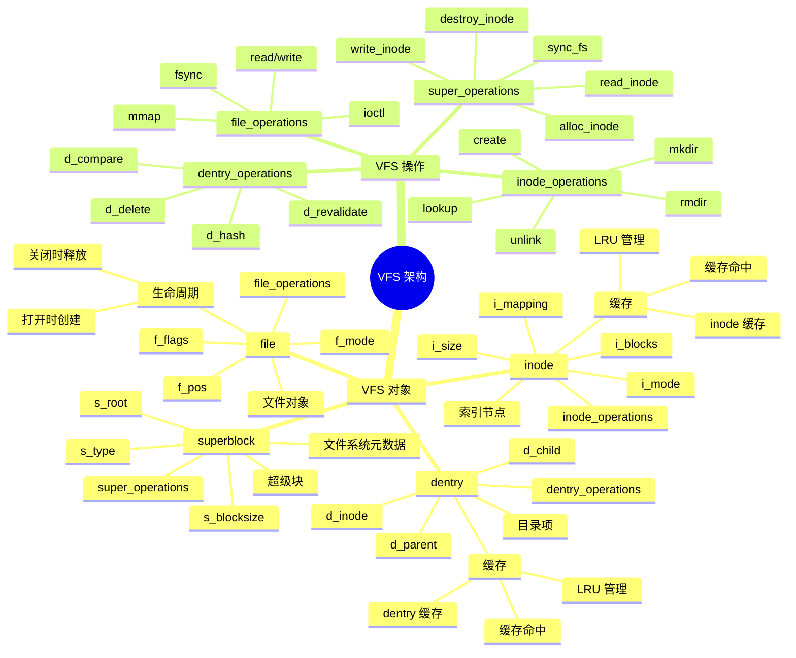
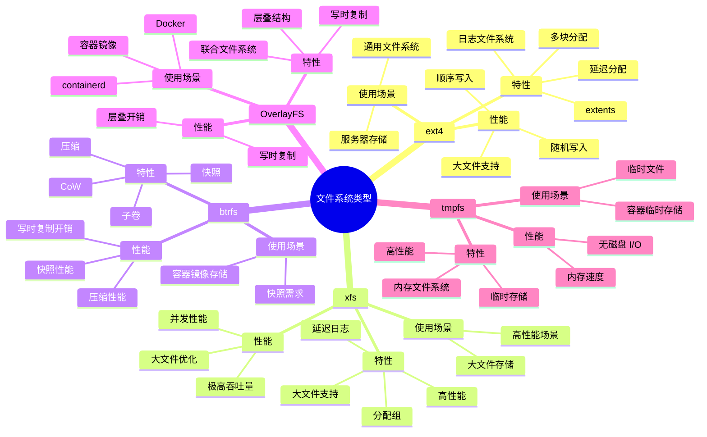

# 文件系统详细思维导图

## 📑 目录

- [文件系统详细思维导图](#文件系统详细思维导图)
  - [📑 目录](#-目录)
  - [1 文件系统全景](#1-文件系统全景)
  - [2 VFS 架构详细思维导图](#2-vfs-架构详细思维导图)
  - [3 文件操作详细思维导图](#3-文件操作详细思维导图)
  - [4 文件系统类型详细思维导图](#4-文件系统类型详细思维导图)

---

## 1 文件系统全景

```mermaid
mindmap
  root((文件系统))
    VFS 虚拟文件系统
      抽象层
        file
        dentry
        inode
        superblock
      统一接口
        open/read/write
        mount/unmount
        lookup/create
      文件系统注册
        register_filesystem()
        unregister_filesystem()
    文件系统类型
      ext4
        日志文件系统
        延迟分配
        扩展属性
      xfs
        高性能
        大文件支持
        分配组
      btrfs
        CoW
        快照
        压缩
      OverlayFS
        联合文件系统
        容器镜像
        层叠结构
      tmpfs
        内存文件系统
        临时文件
        高性能
    文件操作
      open()
        路径解析
        dentry 查找
        inode 获取
        文件对象创建
      read()
        页面缓存
        预读
        零拷贝
      write()
        延迟写入
        批量写入
        同步写入
      mmap()
        文件映射
        匿名映射
        共享内存
    目录操作
      mkdir()
        目录创建
        inode 分配
        dentry 创建
      rmdir()
        目录删除
        inode 释放
        dentry 删除
      readdir()
        目录遍历
        dentry 列表
    挂载管理
      mount()
        文件系统挂载
        挂载点
        挂载选项
      unmount()
        文件系统卸载
        清理资源
      挂载传播
        MS_SHARED
        MS_PRIVATE
        MS_SLAVE
    容器化应用
      Mount Namespace
        文件系统隔离
        独立挂载点
        挂载传播控制
      OverlayFS
        容器镜像层
        写时复制
        层叠结构
      Volume 挂载
        绑定挂载
        数据持久化
```

---

## 2 VFS 架构详细思维导图



---

## 3 文件操作详细思维导图

```mermaid
mindmap
  root((文件操作))
    open()
      路径解析
        路径分割
        dentry 查找
        inode 获取
      权限检查
        文件权限
        Capabilities
        LSM 检查
      文件对象创建
        file 分配
        file_operations 设置
        文件描述符分配
      缓存优化
        dentry 缓存
        inode 缓存
    read()
      页面缓存
        缓存查找
        缓存命中
        缓存未命中
      预读
        顺序预读
        随机预读
        预读窗口
      零拷贝
        sendfile
        splice
        MSG_ZEROCOPY
      数据拷贝
        用户空间
        内核空间
    write()
      延迟写入
        脏页标记
        后台刷新
        同步写入
      批量写入
        页面合并
        批量提交
      同步写入
        fsync
        fdatasync
        sync
      缓存管理
        页面缓存
        脏页管理
    mmap()
      文件映射
        MAP_SHARED
        MAP_PRIVATE
        文件关联
      匿名映射
        MAP_ANONYMOUS
        堆内存
        共享内存
      写时复制
        CoW
        页面复制
        缺页异常
      大页支持
        MAP_HUGETLB
        减少 TLB miss
```

---

## 4 文件系统类型详细思维导图



---

**最后更新**：2025-11-07
**文档状态**：✅ 完整 | 📊 包含文件系统详细思维导图 | 🎯 生产就绪
**维护者**：项目团队
