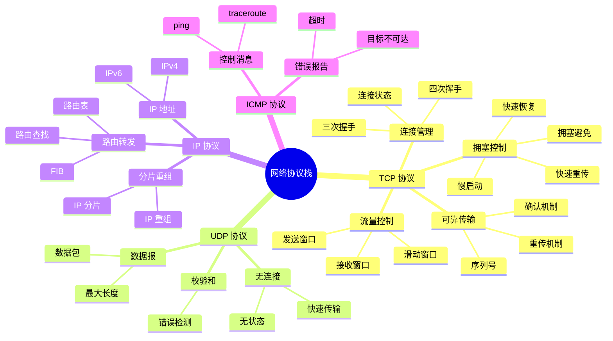

# 网络子系统详细思维导图

## 📑 目录

- [网络子系统详细思维导图](#网络子系统详细思维导图)
  - [📑 目录](#-目录)
  - [1 网络子系统全景](#1-网络子系统全景)
  - [2 Socket 层详细思维导图](#2-socket-层详细思维导图)
  - [3 网络协议栈详细思维导图](#3-网络协议栈详细思维导图)
  - [4 网络设备详细思维导图](#4-网络设备详细思维导图)

---

## 1 网络子系统全景

```mermaid
mindmap
  root((网络子系统))
    Socket 层
      Socket API
        socket()
        bind()
        listen()
        accept()
        connect()
        send/recv
      Socket 类型
        SOCK_STREAM
        SOCK_DGRAM
        SOCK_RAW
        Unix Domain Socket
      Socket 状态
        CLOSED
        LISTEN
        ESTABLISHED
        TIME_WAIT
    网络协议栈
      TCP/IP
        TCP
          可靠传输
          流量控制
          拥塞控制
        UDP
          快速传输
          无连接
        IP
          路由转发
          IP 地址
        ICMP
          控制消息
          ping
      HTTP/HTTPS
        应用层协议
        Web 服务
      gRPC
        RPC 服务
        微服务通信
    网络设备
      物理网卡
        网络接口
        硬件驱动
      虚拟设备
        veth
        bridge
        macvlan
        ipvlan
        vxlan
    网络性能
      零拷贝
        sendfile
        splice
        MSG_ZEROCOPY
      多队列
        RSS
        RPS
        XPS
      TCP 优化
        TCP_NODELAY
        TCP_CORK
        TCP_QUICKACK
    容器化应用
      Network Namespace
        网络隔离
        独立网络栈
        独立路由表
      容器网络
        Bridge 模式
        Host 模式
        Macvlan 模式
        Overlay 网络
```

---

## 2 Socket 层详细思维导图

```mermaid
mindmap
  root((Socket 层))
    Socket 创建
      socket()
        协议族
          AF_INET
          AF_INET6
          AF_UNIX
        Socket 类型
          SOCK_STREAM
          SOCK_DGRAM
          SOCK_RAW
        协议
          IPPROTO_TCP
          IPPROTO_UDP
    Socket 绑定
      bind()
        地址绑定
        IP 地址
        端口号
        权限检查
          CAP_NET_BIND_SERVICE
    Socket 监听
      listen()
        监听队列
        backlog
        SYN 队列
        ACCEPT 队列
    Socket 连接
      connect()
        TCP 三次握手
        连接建立
        超时处理
      accept()
        接受连接
        新 Socket 创建
    Socket 数据传输
      send()
        数据发送
        TCP 发送
        UDP 发送
        零拷贝
      recv()
        数据接收
        TCP 接收
        UDP 接收
        阻塞/非阻塞
    Socket 关闭
      close()
        连接关闭
        TCP 四次挥手
        资源释放
      shutdown()
        部分关闭
        发送关闭
        接收关闭
```

---

## 3 网络协议栈详细思维导图



---

## 4 网络设备详细思维导图


---

**最后更新**：2025-11-07
**文档状态**：✅ 完整 | 📊 包含网络子系统详细思维导图 | 🎯 生产就绪
**维护者**：项目团队
