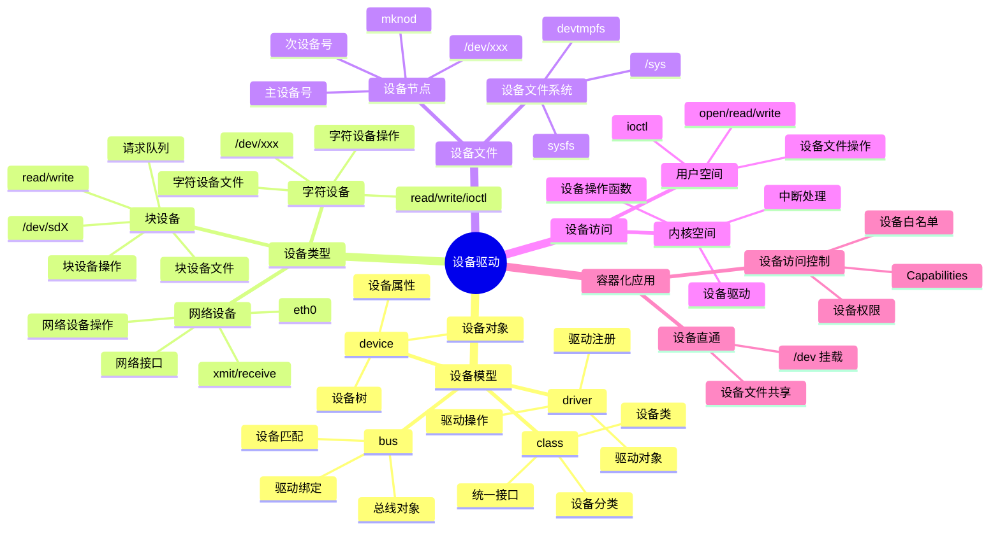

# 设备驱动详细思维导图

## 📑 目录

- [设备驱动详细思维导图](#设备驱动详细思维导图)
  - [📑 目录](#-目录)
  - [1 设备驱动全景](#1-设备驱动全景)
  - [2 设备模型详细思维导图](#2-设备模型详细思维导图)
  - [3 设备类型详细思维导图](#3-设备类型详细思维导图)
  - [4 设备驱动开发详细思维导图](#4-设备驱动开发详细思维导图)

---

## 1 设备驱动全景



---

## 2 设备模型详细思维导图

```mermaid
mindmap
  root((设备模型))
    device
      设备对象
        struct device
        设备属性
        设备状态
      设备树
        Device Tree
        设备描述
        硬件抽象
      设备注册
        device_register()
        device_unregister()
      sysfs
        /sys/devices
        设备属性
        设备信息
    driver
      驱动对象
        struct device_driver
        驱动操作
        驱动属性
      驱动注册
        driver_register()
        driver_unregister()
      驱动匹配
        设备匹配
        驱动绑定
        自动加载
    bus
      总线对象
        struct bus_type
        总线操作
        总线属性
      设备匹配
        match()
        驱动查找
        设备绑定
      总线类型
        platform_bus
        pci_bus
        usb_bus
    class
      设备类
        struct class
        设备分类
        统一接口
      设备类操作
        class_create()
        class_destroy()
      常见设备类
        block
        net
        tty
```

---

## 3 设备类型详细思维导图

```mermaid
mindmap
  root((设备类型))
    字符设备
      设备文件
        /dev/xxx
        主设备号
        次设备号
      设备操作
        file_operations
        read()
        write()
        ioctl()
        open()
        release()
      字符设备注册
        register_chrdev()
        cdev_init()
        cdev_add()
      使用场景
        串口
        键盘
        鼠标
        终端
    块设备
      设备文件
        /dev/sdX
        /dev/nvme0n1
        主设备号
        次设备号
      设备操作
        block_device_operations
        open()
        release()
        ioctl()
      请求队列
        request_queue
        请求处理
        I/O 调度
      使用场景
        硬盘
        SSD
        存储设备
    网络设备
      网络接口
        eth0
        wlan0
        网络接口名
      设备操作
        net_device_ops
        xmit()
        receive()
        ioctl()
      网络设备注册
        register_netdev()
        unregister_netdev()
      使用场景
        网卡
        虚拟网络设备
```

---

## 4 设备驱动开发详细思维导图

```mermaid
mindmap
  root((设备驱动开发))
    驱动开发流程
      驱动初始化
        module_init()
        设备注册
        驱动注册
      驱动清理
        module_exit()
        设备注销
        驱动注销
      驱动操作
        设备操作函数
        中断处理
        错误处理
    中断处理
      中断注册
        request_irq()
        free_irq()
      中断处理函数
        irq_handler_t
        中断上下文
        中断处理
      中断类型
        硬件中断
        软中断
        tasklet
    设备 I/O
      I/O 端口
        inb/outb
        inw/outw
        inl/outl
      I/O 内存
        ioremap()
        iounmap()
        readb/writeb
      DMA
        DMA 分配
        DMA 映射
        DMA 传输
    设备同步
      自旋锁
        spinlock_t
        自旋等待
        中断禁用
      信号量
        semaphore
        睡眠等待
        进程阻塞
      互斥锁
        mutex
        睡眠等待
        可重入
```

---

**最后更新**：2025-11-07
**文档状态**：✅ 完整 | 📊 包含设备驱动详细思维导图 | 🎯 生产就绪
**维护者**：项目团队
