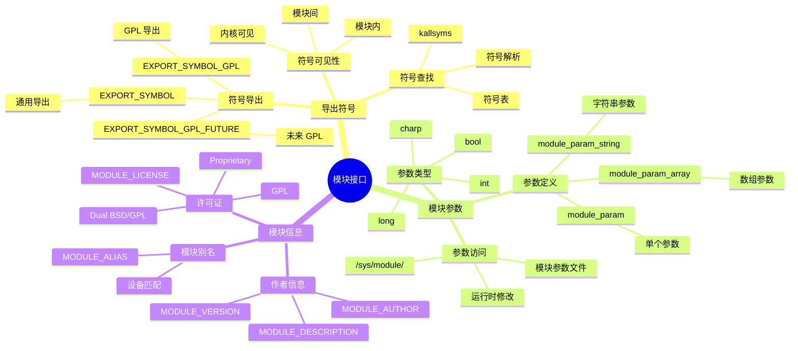

# 内核模块详细思维导图

## 📑 目录

- [内核模块详细思维导图](#内核模块详细思维导图)
  - [📑 目录](#-目录)
  - [1 内核模块全景](#1-内核模块全景)
  - [2 模块生命周期详细思维导图](#2-模块生命周期详细思维导图)
  - [3 模块接口详细思维导图](#3-模块接口详细思维导图)
  - [4 模块开发详细思维导图](#4-模块开发详细思维导图)

---

## 1 内核模块全景

```mermaid
mindmap
  root((内核模块))
    模块概念
      可加载模块
        动态加载
        动态卸载
        无需重启
      模块优势
        灵活性
        可维护性
        可扩展性
    模块生命周期
      模块加载
        insmod
        modprobe
        module_init()
      模块运行
        模块功能
        模块接口
      模块卸载
        rmmod
        modprobe -r
        module_exit()
    模块接口
      导出符号
        EXPORT_SYMBOL
        EXPORT_SYMBOL_GPL
        符号可见性
      模块参数
        module_param
        module_param_array
        参数传递
      模块信息
        MODULE_LICENSE
        MODULE_AUTHOR
        MODULE_DESCRIPTION
    模块开发
      模块初始化
        module_init()
        资源分配
        设备注册
      模块清理
        module_exit()
        资源释放
        设备注销
      错误处理
        错误码
        资源清理
    容器化应用
      模块加载
        容器内模块
        模块隔离
        模块权限
```

---

## 2 模块生命周期详细思维导图

```mermaid
mindmap
  root((模块生命周期))
    模块加载
      加载方式
        insmod
          直接加载
          指定路径
        modprobe
          自动依赖
          配置文件
        kmod
          自动加载
          模块请求
      加载流程
        sys_init_module
        模块验证
        符号解析
        模块初始化
        module_init()
      依赖处理
        依赖模块
        符号依赖
        自动加载
    模块运行
      模块功能
        设备驱动
        文件系统
        网络协议
      模块接口
        导出符号
        模块参数
        设备节点
    模块卸载
      卸载方式
        rmmod
          直接卸载
        modprobe -r
          自动依赖
      卸载流程
        sys_delete_module
        模块检查
        模块清理
        module_exit()
      依赖检查
        使用计数
        依赖模块
        卸载顺序
```

---

## 3 模块接口详细思维导图



---

## 4 模块开发详细思维导图

```mermaid
mindmap
  root((模块开发))
    模块结构
      模块头文件
        linux/module.h
        linux/init.h
        linux/kernel.h
      模块函数
        module_init()
        module_exit()
        MODULE_LICENSE
    模块初始化
      资源分配
        内存分配
        kmalloc()
        vmalloc()
      设备注册
        register_chrdev()
        register_blkdev()
        register_netdev()
      中断注册
        request_irq()
        中断处理
    模块清理
      资源释放
        内存释放
        kfree()
        vfree()
      设备注销
        unregister_chrdev()
        unregister_blkdev()
        unregister_netdev()
      中断注销
        free_irq()
    错误处理
      错误码
        -ENOMEM
        -EINVAL
        -EBUSY
      资源清理
        错误回滚
        资源释放
```

---

**最后更新**：2025-11-07
**文档状态**：✅ 完整 | 📊 包含内核模块详细思维导图 | 🎯 生产就绪
**维护者**：项目团队
