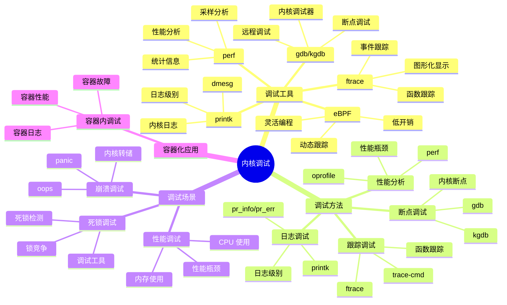
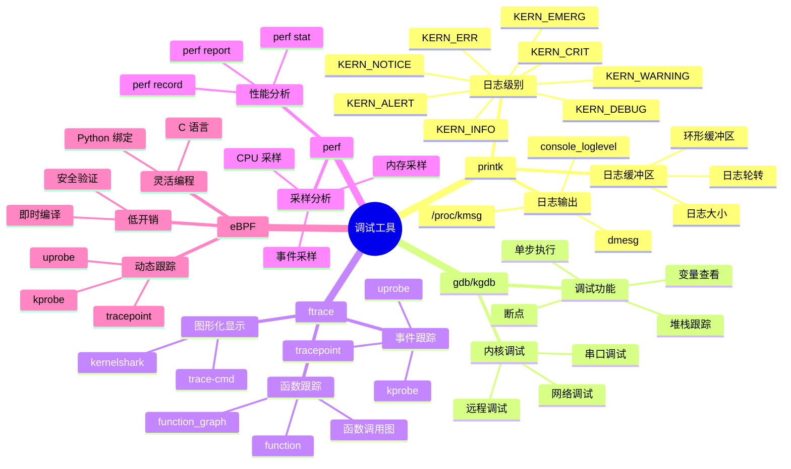
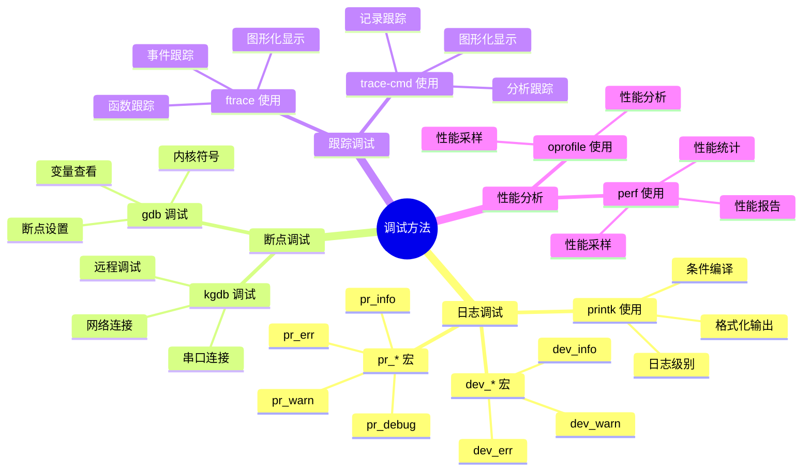
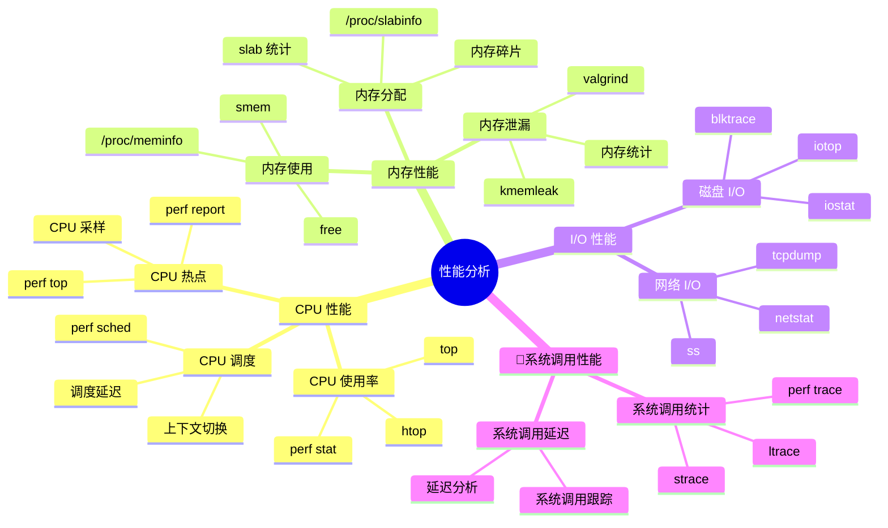

# 内核调试详细思维导图

## 📑 目录

- [内核调试详细思维导图](#内核调试详细思维导图)
  - [📑 目录](#-目录)
  - [1 内核调试全景](#1-内核调试全景)
  - [2 调试工具详细思维导图](#2-调试工具详细思维导图)
  - [3 调试方法详细思维导图](#3-调试方法详细思维导图)
  - [4 性能分析详细思维导图](#4-性能分析详细思维导图)

---

## 1 内核调试全景

---

## 2 调试工具详细思维导图

---

## 3 调试方法详细思维导图

---

## 4 性能分析详细思维导图

---

**最后更新**：2025-11-07
**文档状态**：✅ 完整 | 📊 包含内核调试详细思维导图 | 🎯 生产就绪
**维护者**：项目团队
