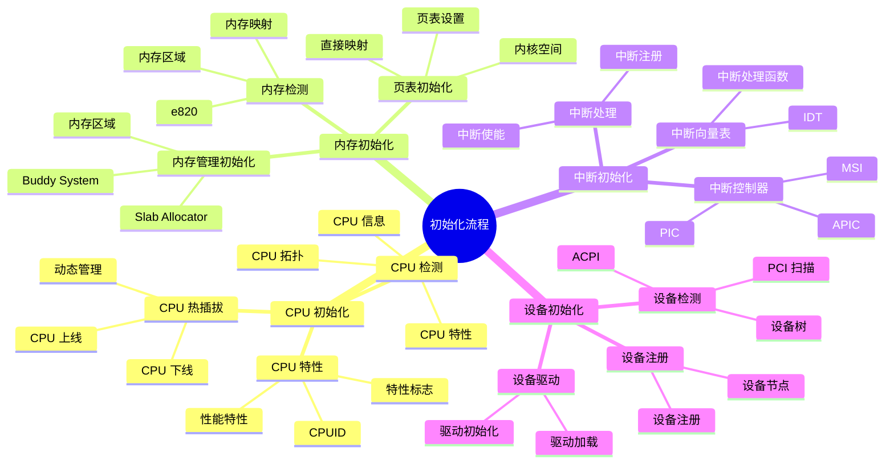
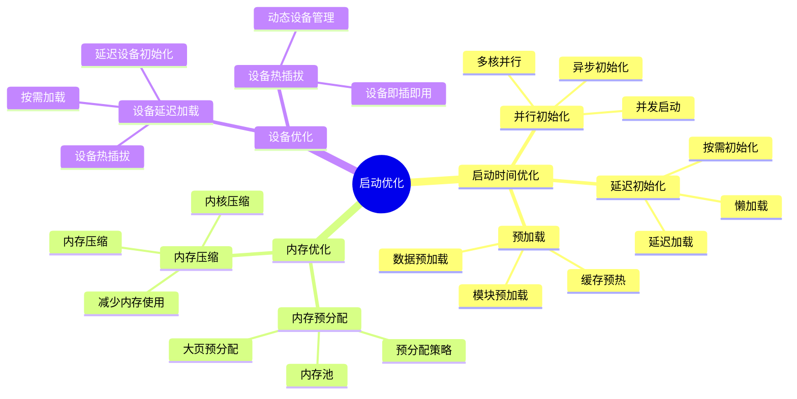

# 内核启动流程详细思维导图

## 📑 目录

- [内核启动流程详细思维导图](#内核启动流程详细思维导图)
  - [📑 目录](#-目录)
  - [1 内核启动全景](#1-内核启动全景)
  - [2 启动阶段详细思维导图](#2-启动阶段详细思维导图)
  - [3 初始化流程详细思维导图](#3-初始化流程详细思维导图)
  - [4 启动优化详细思维导图](#4-启动优化详细思维导图)

---

## 1 内核启动全景

```mermaid
mindmap
  root((内核启动))
    启动阶段
      BIOS/UEFI
        硬件初始化
        引导加载器
        GRUB
      Bootloader
        GRUB
        LILO
        SYSLINUX
        内核加载
      内核启动
        head.S
        汇编初始化
        内核解压
        start_kernel()
      系统初始化
        init 进程
        用户空间
        系统服务
    初始化流程
      CPU 初始化
        CPU 检测
        CPU 特性
        CPU 热插拔
      内存初始化
        内存检测
        页表初始化
        内存管理初始化
      中断初始化
        中断控制器
        中断向量表
        中断处理
      设备初始化
        设备检测
        设备驱动
        设备注册
    启动优化
      启动时间优化
        并行初始化
        延迟初始化
        预加载
      内存优化
        内存预分配
        内存压缩
      设备优化
        设备延迟加载
        设备热插拔
```

---

## 2 启动阶段详细思维导图

```mermaid
mindmap
  root((启动阶段))
    BIOS/UEFI
      硬件初始化
        CPU 初始化
        内存检测
        设备检测
      引导加载器
        MBR
        GPT
        EFI
      GRUB
        引导菜单
        内核选择
        内核参数
    Bootloader
      GRUB
        配置文件
        grub.cfg
        内核加载
        初始 RAM 磁盘
      LILO
        传统引导
        lilo.conf
      SYSLINUX
        轻量级引导
    内核启动
      head.S
        汇编代码
        CPU 初始化
        页表设置
      内核解压
        decompress_kernel
        解压算法
        gzip/lz4
      start_kernel()
        内核主函数
        子系统初始化
        进程初始化
    系统初始化
      init 进程
        PID 1
        系统服务
        systemd/sysvinit
      用户空间
        文件系统
        网络
        服务启动
```

---

## 3 初始化流程详细思维导图



---

## 4 启动优化详细思维导图



---

**最后更新**：2025-11-07
**文档状态**：✅ 完整 | 📊 包含内核启动流程详细思维导图 | 🎯 生产就绪
**维护者**：项目团队
