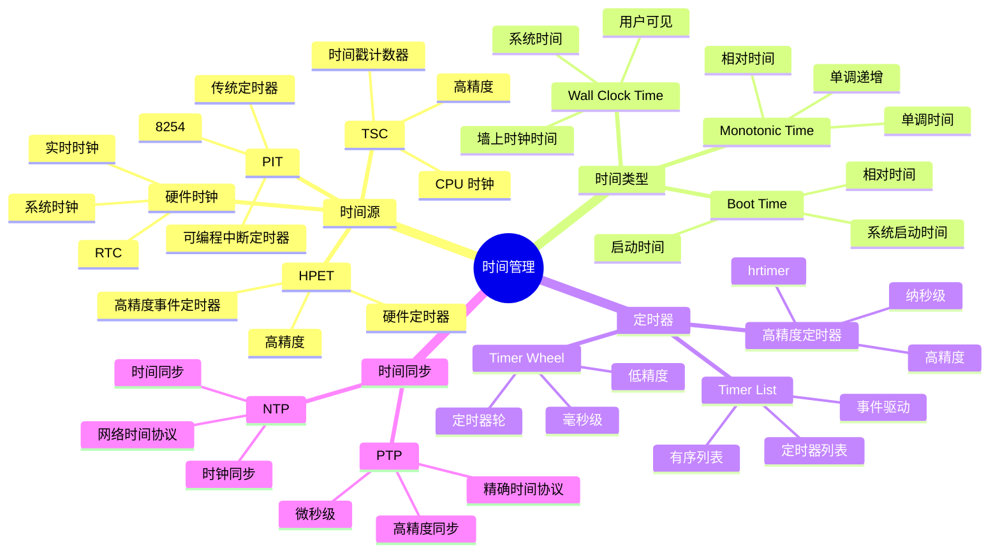
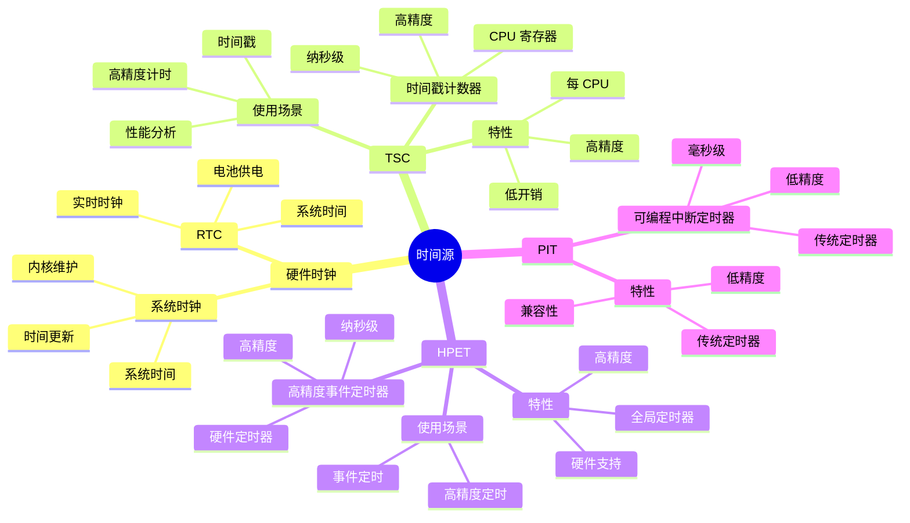
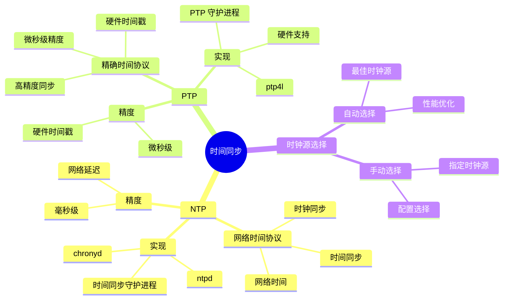

# 内核时间管理详细思维导图

## 📑 目录

- [内核时间管理详细思维导图](#内核时间管理详细思维导图)
  - [📑 目录](#-目录)
  - [1 时间管理全景](#1-时间管理全景)
  - [2 时间源详细思维导图](#2-时间源详细思维导图)
  - [3 定时器详细思维导图](#3-定时器详细思维导图)
  - [4 时间同步详细思维导图](#4-时间同步详细思维导图)

---

## 1 时间管理全景



---

## 2 时间源详细思维导图



---

## 3 定时器详细思维导图

```mermaid
mindmap
  root((定时器))
    高精度定时器
      hrtimer
        高精度定时器
        纳秒级精度
        事件驱动
      API
        hrtimer_init()
        hrtimer_start()
        hrtimer_cancel()
      使用场景
        高精度定时
        事件调度
        性能分析
    Timer Wheel
      定时器轮
        低精度定时器
        毫秒级精度
        轮转结构
      API
        init_timer()
        mod_timer()
        del_timer()
      使用场景
        低精度定时
        超时处理
        延迟执行
    Timer List
      定时器列表
        有序列表
        事件驱动
        高效管理
      API
        timer_setup()
        mod_timer()
        del_timer()
      使用场景
        定时任务
        超时处理
```

---

## 4 时间同步详细思维导图



---

**最后更新**：2025-11-07
**文档状态**：✅ 完整 | 📊 包含内核时间管理详细思维导图 | 🎯 生产就绪
**维护者**：项目团队
