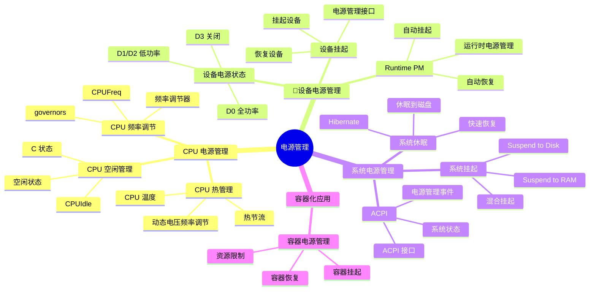
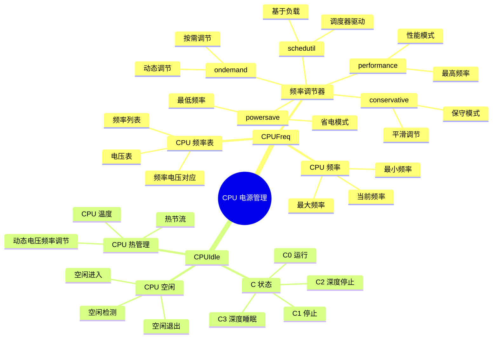
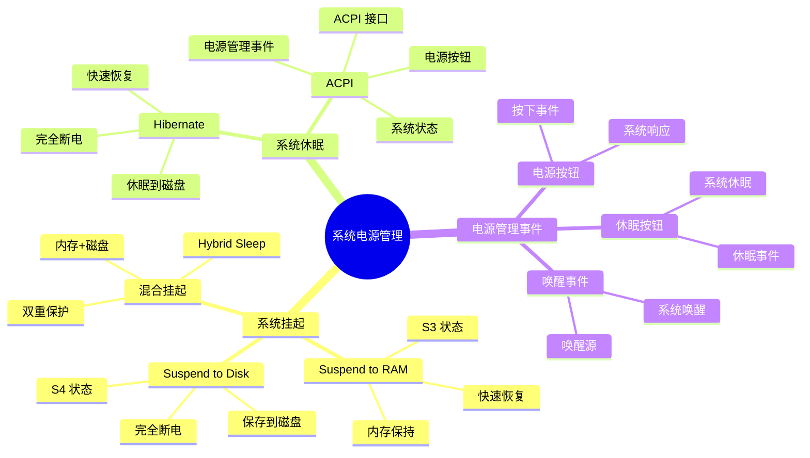

# 内核电源管理详细思维导图

## 📑 目录

- [内核电源管理详细思维导图](#内核电源管理详细思维导图)
  - [📑 目录](#-目录)
  - [1 电源管理全景](#1-电源管理全景)
  - [2 CPU 电源管理详细思维导图](#2-cpu-电源管理详细思维导图)
  - [3 设备电源管理详细思维导图](#3-设备电源管理详细思维导图)
  - [4 系统电源管理详细思维导图](#4-系统电源管理详细思维导图)

---

## 1 电源管理全景



---

## 2 CPU 电源管理详细思维导图



---

## 3 设备电源管理详细思维导图

```mermaid
mindmap
  root((设备电源管理))
    设备电源状态
      D0
        全功率状态
        设备运行
        最高性能
      D1/D2
        低功率状态
        部分功能
        低功耗
      D3
        关闭状态
        设备关闭
        无功耗
    设备挂起
      挂起设备
        suspend()
        保存状态
        降低功耗
      恢复设备
        resume()
        恢复状态
        恢复功能
      Runtime PM
        运行时电源管理
        自动挂起
        自动恢复
    电源管理接口
      PM 接口
        suspend/resume
        power_on/power_off
        runtime_suspend/runtime_resume
```

---

## 4 系统电源管理详细思维导图



---

**最后更新**：2025-11-07
**文档状态**：✅ 完整 | 📊 包含内核电源管理详细思维导图 | 🎯 生产就绪
**维护者**：项目团队
