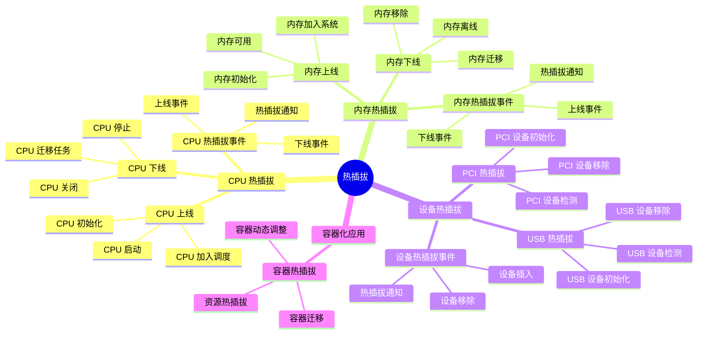
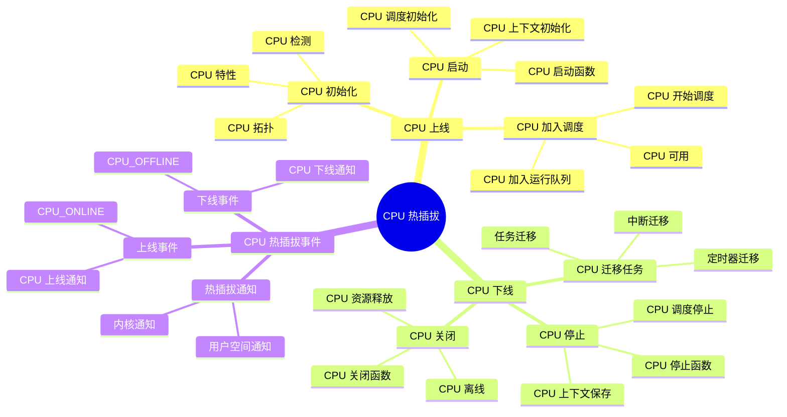
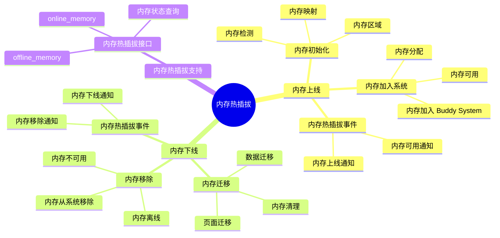
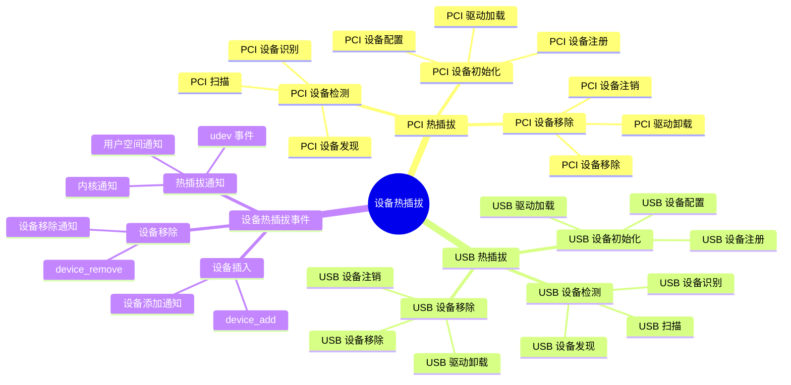

# 内核热插拔详细思维导图

## 📑 目录

- [内核热插拔详细思维导图](#内核热插拔详细思维导图)
  - [📑 目录](#-目录)
  - [1 热插拔全景](#1-热插拔全景)
  - [2 CPU 热插拔详细思维导图](#2-cpu-热插拔详细思维导图)
  - [3 内存热插拔详细思维导图](#3-内存热插拔详细思维导图)
  - [4 设备热插拔详细思维导图](#4-设备热插拔详细思维导图)

---

## 1 热插拔全景

---

## 2 CPU 热插拔详细思维导图

---

## 3 内存热插拔详细思维导图

---

## 4 设备热插拔详细思维导图

---

**最后更新**：2025-11-07
**文档状态**：✅ 完整 | 📊 包含内核热插拔详细思维导图 | 🎯 生产就绪
**维护者**：项目团队
