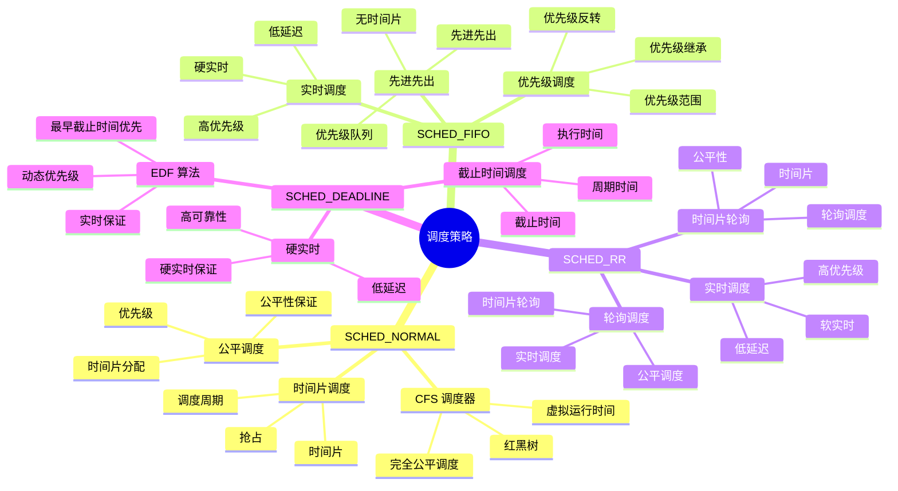
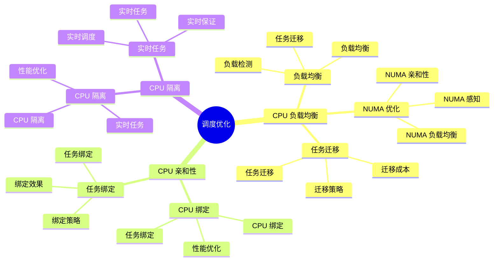

# 内核调度器详细思维导图

## 📑 目录

- [内核调度器详细思维导图](#内核调度器详细思维导图)
  - [📑 目录](#-目录)
  - [1 调度器全景](#1-调度器全景)
  - [2 调度策略详细思维导图](#2-调度策略详细思维导图)
  - [3 调度算法详细思维导图](#3-调度算法详细思维导图)
  - [4 调度优化详细思维导图](#4-调度优化详细思维导图)

---

## 1 调度器全景

```mermaid
mindmap
  root((调度器))
    调度策略
      SCHED_NORMAL
        CFS 调度器
        公平调度
        时间片调度
      SCHED_FIFO
        先进先出
        实时调度
        优先级调度
      SCHED_RR
        轮询调度
        实时调度
        时间片轮询
      SCHED_DEADLINE
        截止时间调度
        硬实时
        EDF 算法
    调度算法
      CFS
        完全公平调度
        虚拟运行时间
        红黑树
      O(1) 调度器
        传统调度器
        优先级队列
        时间片
      EDF
        最早截止时间优先
        硬实时
        截止时间
    调度优化
      CPU 负载均衡
        负载均衡
        任务迁移
        NUMA 优化
      CPU 亲和性
        CPU 绑定
        任务绑定
        性能优化
      CPU 隔离
        CPU 隔离
        实时任务
        性能优化
    容器化应用
      容器调度
        容器调度策略
        资源限制
        Cgroup 调度
```

---

## 2 调度策略详细思维导图



---

## 3 调度算法详细思维导图

```mermaid
mindmap
  root((调度算法))
    CFS
      完全公平调度
        虚拟运行时间
        公平性保证
        动态优先级
      红黑树
        红黑树结构
        快速查找
        快速插入
      调度周期
        调度周期
        时间片
        抢占
    O(1) 调度器
      传统调度器
        优先级队列
        时间片
        调度算法
      优先级队列
        优先级队列
        快速调度
        优先级管理
      时间片
        时间片分配
        时间片耗尽
        时间片补充
    EDF
      最早截止时间优先
        截止时间
        执行时间
        周期时间
      硬实时
        硬实时保证
        低延迟
        高可靠性
      动态优先级
        动态优先级
        优先级计算
        优先级更新
```

---

## 4 调度优化详细思维导图



---

**最后更新**：2025-11-07
**文档状态**：✅ 完整 | 📊 包含内核调度器详细思维导图 | 🎯 生产就绪
**维护者**：项目团队
