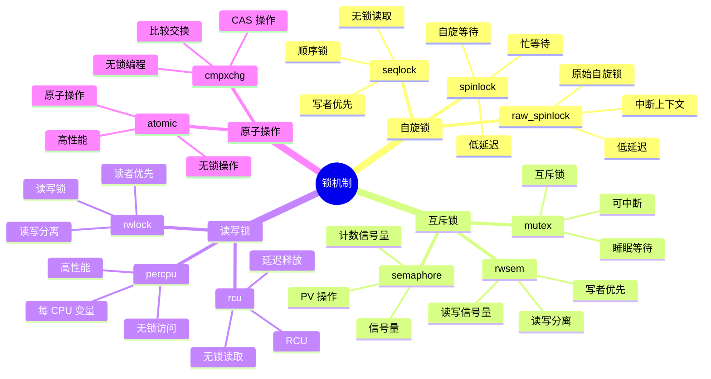

# 内核锁机制详细思维导图

## 📑 目录

- [内核锁机制详细思维导图](#内核锁机制详细思维导图)
  - [📑 目录](#-目录)
  - [1 锁机制全景](#1-锁机制全景)
  - [2 自旋锁详细思维导图](#2-自旋锁详细思维导图)
  - [3 互斥锁详细思维导图](#3-互斥锁详细思维导图)
  - [4 读写锁详细思维导图](#4-读写锁详细思维导图)

---

## 1 锁机制全景



---

## 2 自旋锁详细思维导图

```mermaid
mindmap
  root((自旋锁))
    spinlock
      自旋等待
        忙等待
        低延迟
        CPU 占用
      使用场景
        中断上下文
        短时间持有
        低延迟要求
      API
        spin_lock()
        spin_unlock()
        spin_trylock()
    raw_spinlock
      原始自旋锁
        中断上下文
        低延迟
        无抢占
      使用场景
        中断处理
        关键路径
        低延迟
      API
        raw_spin_lock()
        raw_spin_unlock()
        raw_spin_trylock()
    seqlock
      顺序锁
        无锁读取
        写者优先
        顺序号
      使用场景
        读多写少
        无锁读取
        写者优先
      API
        read_seqlock()
        read_sequnlock()
        write_seqlock()
```

---

## 3 互斥锁详细思维导图

```mermaid
mindmap
  root((互斥锁))
    mutex
      互斥锁
        睡眠等待
        可中断
        可重入
      使用场景
        进程上下文
        长时间持有
        可中断
      API
        mutex_lock()
        mutex_unlock()
        mutex_trylock()
    semaphore
      信号量
        计数信号量
        PV 操作
        同步原语
      使用场景
        资源计数
        同步操作
        多进程
      API
        down()
        up()
        down_interruptible()
    rwsem
      读写信号量
        读写分离
        写者优先
        可中断
      使用场景
        读多写少
        读写分离
        写者优先
      API
        down_read()
        up_read()
        down_write()
```

---

## 4 读写锁详细思维导图

```mermaid
mindmap
  root((读写锁))
    rwlock
      读写锁
        读写分离
        读者优先
        自旋锁
      使用场景
        读多写少
        读写分离
        读者优先
      API
        read_lock()
        read_unlock()
        write_lock()
    rcu
      RCU
        无锁读取
        延迟释放
        读多写少
      使用场景
        读多写少
        无锁读取
        高性能
      API
        rcu_read_lock()
        rcu_read_unlock()
        synchronize_rcu()
    percpu
      每 CPU 变量
        无锁访问
        高性能
        每 CPU 数据
      使用场景
        每 CPU 数据
        无锁访问
        高性能
      API
        get_cpu_var()
        put_cpu_var()
        per_cpu()
```

---

**最后更新**：2025-11-07
**文档状态**：✅ 完整 | 📊 包含内核锁机制详细思维导图 | 🎯 生产就绪
**维护者**：项目团队
