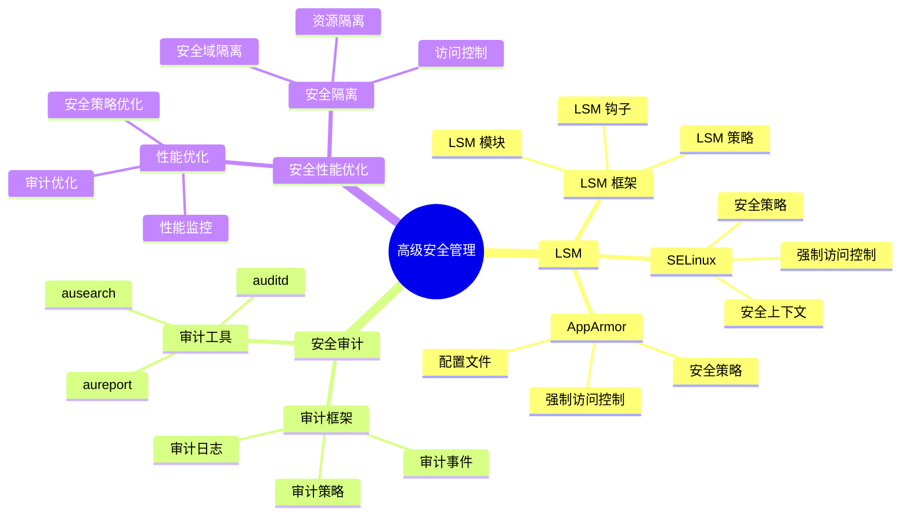
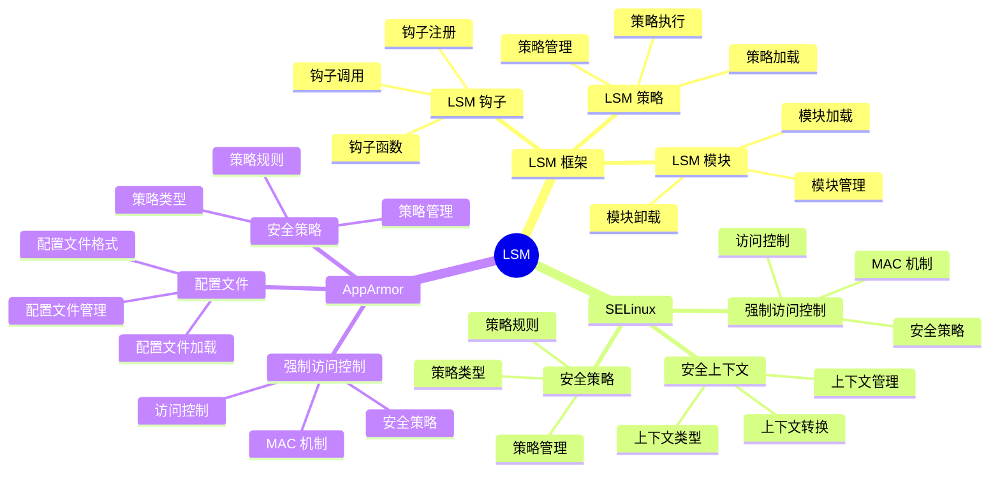
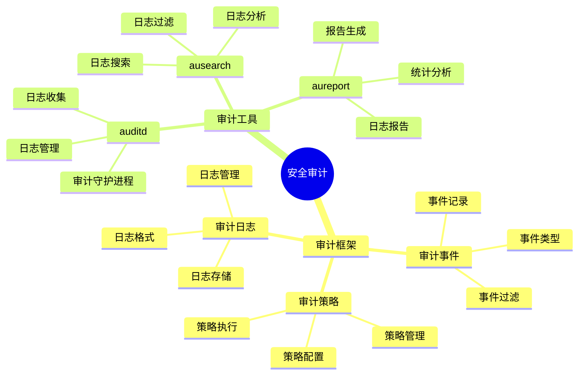
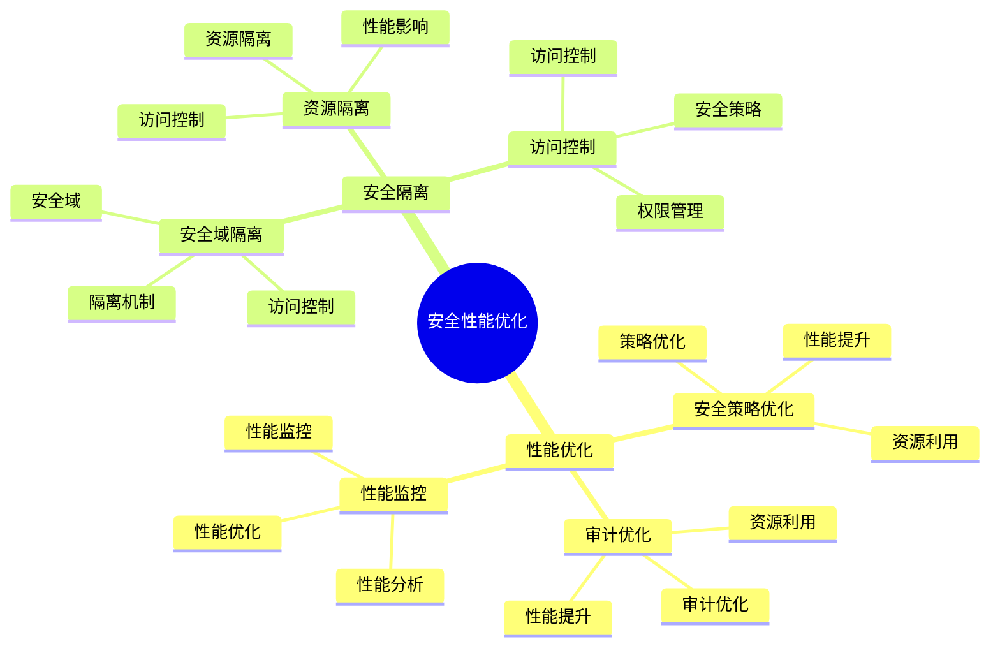

# 内核高级安全管理详细思维导图

## 📑 目录

- [内核高级安全管理详细思维导图](#内核高级安全管理详细思维导图)
  - [📑 目录](#-目录)
  - [1 高级安全管理全景](#1-高级安全管理全景)
  - [2 LSM 详细思维导图](#2-lsm-详细思维导图)
  - [3 安全审计详细思维导图](#3-安全审计详细思维导图)
  - [4 安全性能优化详细思维导图](#4-安全性能优化详细思维导图)

---

## 1 高级安全管理全景

---

## 2 LSM 详细思维导图

---

## 3 安全审计详细思维导图

---

## 4 安全性能优化详细思维导图

---

**最后更新**：2025-11-07
**文档状态**：✅ 完整 | 📊 包含内核高级安全管理详细思维导图 | 🎯 生产就绪
**维护者**：项目团队
