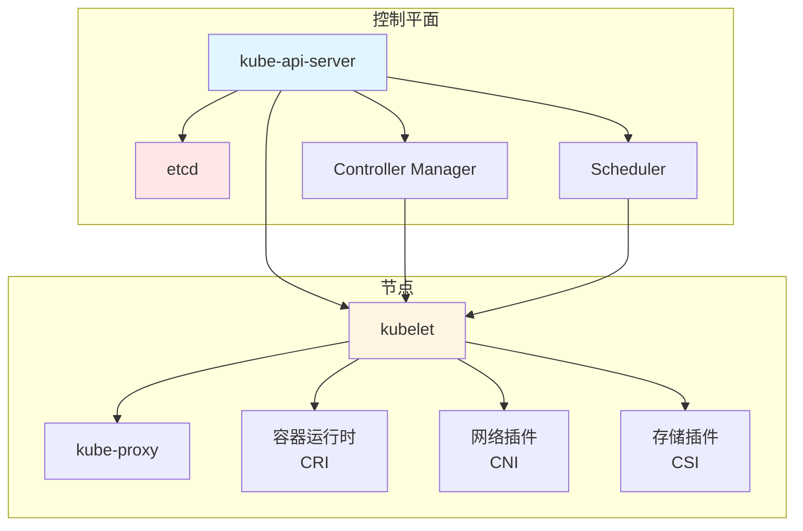
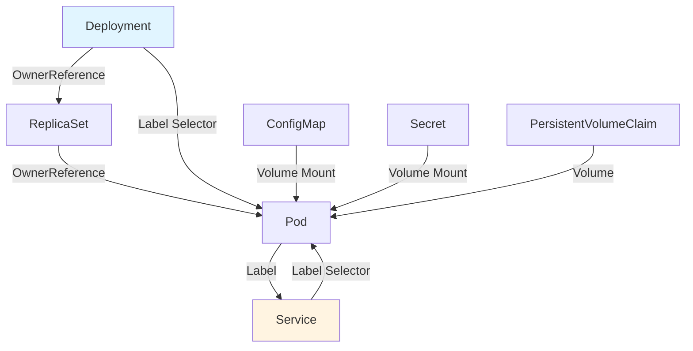
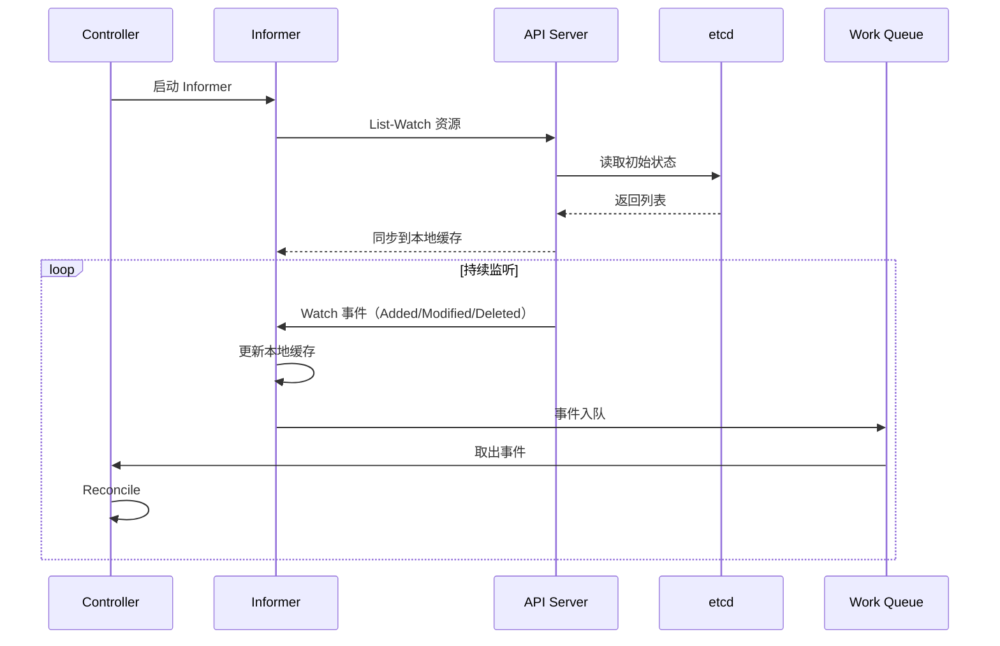
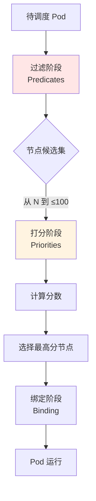
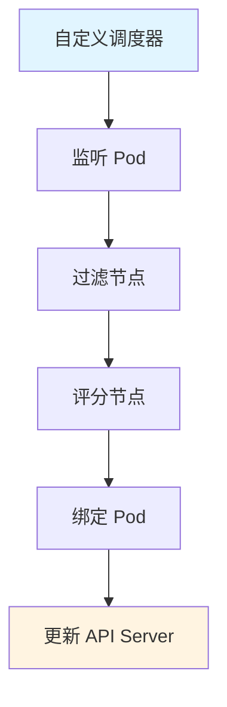

# 01. Kubernetes：集群编排架构与实践

## 📑 目录

- [📑 目录](#-目录)
- [01.1 文档定位](#011-文档定位)
- [01.2 Kubernetes 架构](#012-kubernetes-架构)
  - [01.2.1 系统架构全景](#0121-系统架构全景)
  - [01.2.2 控制平面组件](#0122-控制平面组件)
  - [01.2.3 节点组件](#0123-节点组件)
  - [01.2.4 架构设计论证](#0124-架构设计论证)
- [01.3 对象模型](#013-对象模型)
  - [01.3.1 GVR 模型](#0131-gvr-模型)
  - [01.3.2 对象结构](#0132-对象结构)
  - [01.3.3 对象关系模型](#0133-对象关系模型)
  - [01.3.4 标签与选择器](#0134-标签与选择器)
- [01.4 控制闭环机制](#014-控制闭环机制)
  - [01.4.1 Informer 模式](#0141-informer-模式)
  - [01.4.2 Controller 工作流程](#0142-controller-工作流程)
  - [01.4.3 控制循环收敛](#0143-控制循环收敛)
- [01.5 核心对象详解](#015-核心对象详解)
  - [01.5.1 Pod](#0151-pod)
  - [01.5.2 Deployment](#0152-deployment)
  - [01.5.3 Service](#0153-service)
  - [01.5.4 Ingress](#0154-ingress)
  - [01.5.5 ConfigMap 与 Secret](#0155-configmap-与-secret)
- [01.6 网络模型](#016-网络模型)
  - [01.6.1 网络原则](#0161-网络原则)
  - [01.6.2 CNI 插件](#0162-cni-插件)
  - [01.6.3 网络场景与决策](#0163-网络场景与决策)
- [01.7 存储模型](#017-存储模型)
  - [01.7.1 存储抽象](#0171-存储抽象)
  - [01.7.2 CSI 插件](#0172-csi-插件)
  - [01.7.3 存储场景与决策](#0173-存储场景与决策)
- [01.8 调度机制](#018-调度机制)
  - [01.8.1 调度流程](#0181-调度流程)
  - [01.8.2 调度策略](#0182-调度策略)
  - [01.8.3 调度场景与决策](#0183-调度场景与决策)
- [01.9 技术场景分析](#019-技术场景分析)
  - [01.9.1 大规模集群场景](#0191-大规模集群场景)
  - [01.9.2 多租户场景](#0192-多租户场景)
  - [01.9.3 混合云场景](#0193-混合云场景)
- [01.10 资源管理](#0110-资源管理)
  - [01.10.1 资源配额（ResourceQuota）](#01101-资源配额resourcequota)
  - [01.10.2 资源限制（LimitRange）](#01102-资源限制limitrange)
  - [01.10.3 多租户资源隔离](#01103-多租户资源隔离)
- [01.11 调度器扩展](#0111-调度器扩展)
  - [01.11.1 调度器插件机制](#01111-调度器插件机制)
  - [01.11.2 自定义调度器开发](#01112-自定义调度器开发)
  - [01.11.3 调度策略扩展](#01113-调度策略扩展)
  - [01.11.4 边缘场景调度优化](#01114-边缘场景调度优化)
- [01.12 决策依据与思路](#0112-决策依据与思路)
  - [01.12.1 何时选择 Kubernetes？](#01121-何时选择-kubernetes)
  - [01.12.2 网络插件选择](#01122-网络插件选择)
  - [01.12.3 存储方案选择](#01123-存储方案选择)
- [01.13 形式化总结](#0113-形式化总结)
  - [01.13.1 对象模型形式化](#01131-对象模型形式化)
  - [01.13.2 调度决策函数](#01132-调度决策函数)
  - [01.13.3 控制循环收敛定理](#01133-控制循环收敛定理)
- [01.14 实际部署案例](#0114-实际部署案例)
  - [01.14.1 案例 1：使用 kubeadm 部署 Kubernetes 集群](#01141-案例-1使用-kubeadm-部署-kubernetes-集群)
  - [01.14.2 案例 2：部署应用和服务](#01142-案例-2部署应用和服务)
  - [01.14.3 案例 3：配置 ConfigMap 和 Secret](#01143-案例-3配置-configmap-和-secret)
- [01.15 Kubernetes 故障排查](#0115-kubernetes-故障排查)
  - [01.15.1 常见问题](#01151-常见问题)
- [01.16 参考](#0116-参考)

---

## 01.1 文档定位

本文档深入解析 Kubernetes 的架构设计、对象模型、控制闭环机制，以及不同技术场景下
的决策依据和决策思路。

**文档结构**：

- **架构设计**：控制平面、节点组件、网络存储抽象
- **对象模型**：GVR、标签选择器、对象关系
- **控制闭环**：Informer、Controller、控制循环
- **技术场景**：大规模集群、多租户、混合云
- **决策分析**：架构选择、网络存储选择、调度策略选择

## 01.2 Kubernetes 架构

### 01.2.1 系统架构全景



**架构层次分析**：

1. **控制平面层**：API Server 为中心，etcd 存储状态，Controller 和 Scheduler 处
   理逻辑
2. **节点层**：kubelet 为核心，协调容器运行时、网络、存储
3. **通信层**：控制平面通过 API Server 与节点通信

### 01.2.2 控制平面组件

| 组件                        | 职责                     | 技术特点                |
| --------------------------- | ------------------------ | ----------------------- |
| **kube-api-server**         | API 网关，验证和存储对象 | RESTful API，支持 Watch |
| **etcd**                    | 分布式键值存储           | Raft 共识，强一致性     |
| **kube-controller-manager** | 运行控制器逻辑           | 控制循环，自动修复      |
| **kube-scheduler**          | Pod 调度决策             | 过滤+打分+绑定          |

**控制平面设计论证**：

- **API Server 中心化**：所有组件通过 API Server 交互，避免直接访问 etcd
- **etcd 状态存储**：使用 etcd 存储集群状态，保证一致性
- **控制器分离**：Controller 和 Scheduler 分离，职责清晰
- **Watch 机制**：通过 Watch 实现事件驱动，实时响应变化

### 01.2.3 节点组件

| 组件           | 职责               | 技术特点                |
| -------------- | ------------------ | ----------------------- |
| **kubelet**    | 节点代理，管理 Pod | CRI 接口，健康检查      |
| **kube-proxy** | 网络代理，服务发现 | iptables/ipvs，负载均衡 |
| **CRI 插件**   | 容器运行时接口     | containerd/CRI-O        |
| **CNI 插件**   | 网络接口           | Calico/Flannel/Cilium   |
| **CSI 插件**   | 存储接口           | 动态卷管理              |

**节点组件设计论证**：

- **kubelet 核心**：kubelet 作为节点核心，统一管理容器、网络、存储
- **插件化设计**：CRI/CNI/CSI 接口实现插件化，解耦核心和实现
- **网络代理分离**：kube-proxy 独立运行，实现服务发现和负载均衡

### 01.2.4 架构设计论证

**为什么采用中心化架构？**

**决策依据**：

- ✅ 状态一致性：中心化存储保证集群状态一致
- ✅ 控制简化：统一入口简化控制逻辑
- ✅ 可扩展性：插件化设计支持扩展

**决策思路**：

```yaml
架构选择:
  模式: 中心化架构
  原因:
    - 状态一致性需求
    - 控制简化需求
    - 可扩展性需求
  权衡:
    - API Server 成为单点（通过 HA 解决）
    - etcd 性能瓶颈（通过优化解决）
```

**为什么分离 Controller 和 Scheduler？**

**决策依据**：

- ✅ 职责分离：Controller 负责状态管理，Scheduler 负责调度决策
- ✅ 可扩展性：各自可以独立扩展和优化
- ✅ 解耦设计：降低组件间耦合

## 01.3 对象模型

### 01.3.1 GVR 模型

**定义**：每个 Kubernetes 资源遵循统一的 GVR（Group/Version/Resource）模式。

```text
资源类型 = Group/Version/Resource

示例：
- core/v1/Pod          # core 组，v1 版本，Pod 资源
- apps/v1/Deployment    # apps 组，v1 版本，Deployment 资源
- networking.k8s.io/v1/Ingress  # networking 组，v1 版本，Ingress 资源
```

**GVR 模型论证**：

- **Group**：资源分组，便于管理和扩展
- **Version**：版本管理，支持 API 演进
- **Resource**：资源类型，明确资源语义

### 01.3.2 对象结构

```yaml
apiVersion: apps/v1
kind: Deployment
metadata:
  name: nginx
  namespace: default
  labels:
    app: nginx
  uid: "abc-123"
  ownerReferences: [] # 依赖关系
spec:
  replicas: 3 # 期望状态
  selector:
    matchLabels:
      app: nginx
  template:
    metadata:
      labels:
        app: nginx
    spec:
      containers:
        - name: nginx
          image: nginx:latest
status:
  replicas: 3 # 实际状态
  readyReplicas: 3
  conditions: []
```

**对象结构分析**：

- **metadata**：元数据，包含名称、标签、UID、所有者引用
- **spec**：期望状态，定义资源的期望配置
- **status**：实际状态，记录资源的当前状态

### 01.3.3 对象关系模型



**对象关系论证**：

- **OwnerReference**：定义对象依赖关系，实现级联删除
- **Label Selector**：实现松耦合的服务发现和选择
- **Volume Mount**：实现配置和存储的挂载

### 01.3.4 标签与选择器

**核心机制**：所有对象通过 Label 做松散耦合，类比"数据库索引"。

```yaml
# Label 示例
metadata:
  labels:
    app: nginx
    version: v1
    tier: frontend
    env: production

# Selector 示例
spec:
  selector:
    matchLabels:
      app: nginx
    matchExpressions:
      - key: version
        operator: In
        values: [v1, v2]
```

**标签选择器论证**：

- **松耦合**：通过标签实现服务间松耦合
- **高效查询**：标签选择器支持高效的对象查询
- **灵活匹配**：支持精确匹配和表达式匹配

## 01.4 控制闭环机制

### 01.4.1 Informer 模式



**Informer 模式论证**：

- **本地缓存**：减少 API Server 压力，提高响应速度
- **Watch 机制**：实时监听变化，避免轮询开销
- **工作队列**：异步处理事件，避免阻塞

### 01.4.2 Controller 工作流程

1. **Informer List-Watch**：从 etcd 同步资源到本地缓存
2. **本地缓存**：减少 API Server 压力
3. **事件入队**：事件进入 Work Queue
4. **Reconcile**：计算期望状态与实际状态差异
5. **执行变更**：下发命令到 API Server
6. **持续巡检**：循环执行上述步骤

### 01.4.3 控制循环收敛

**收敛性定理**：在有限时间内，实际状态会收敛到期望状态。

$$\lim_{t \to \infty} |S_a(t) - S_e(t)| = 0$$

**证明思路**：

1. Controller 每次操作都会减小 $|S_a(t) - S_e(t)|$
2. 在资源可用的情况下，差异会单调递减
3. 当 $|S_a(t) - S_e(t)| < \epsilon$ 时，系统达到收敛状态

## 01.5 核心对象详解

### 01.5.1 Pod

**本质**：逻辑主机，共享网络、IPC、存储。

**场景 1：单容器 Pod**:

**决策依据**：

- ✅ 应用独立运行
- ✅ 无需进程间通信

**决策思路**：

```yaml
单容器 Pod:
  场景: Web 应用、API 服务
  配置: 1 个容器
  优势: 简单、易管理
```

**场景 2：多容器 Pod**:

**决策依据**：

- ✅ 紧耦合进程组
- ✅ 需要共享存储或网络

**决策思路**：

```yaml
多容器 Pod:
  场景: Sidecar 模式、日志收集
  配置: 多个容器共享网络
  优势: 资源共享、协同工作
```

### 01.5.2 Deployment

**本质**：期望副本集，管理 Pod 的生命周期。

**场景 1：无状态服务**:

**决策依据**：

- ✅ 应用无状态
- ✅ 需要滚动更新
- ✅ 需要自动扩容

**决策思路**：

```yaml
无状态服务:
  kind: Deployment
  策略:
    type: RollingUpdate
    maxSurge: 1
    maxUnavailable: 0
  HPA: 启用
```

**场景 2：有状态服务**:

**决策依据**：

- ✅ 应用有状态
- ✅ 需要有序部署
- ✅ 需要持久化存储

**决策思路**：

```yaml
有状态服务:
  kind: StatefulSet # 不使用 Deployment
  特点:
    - 有序部署
    - 稳定网络标识
    - 持久化存储
```

### 01.5.3 Service

**本质**：稳定网络标识，实现服务发现和负载均衡。

**场景 1：ClusterIP（默认）**:

**决策依据**：

- ✅ 集群内部访问
- ✅ 不需要外部访问

**决策思路**：

```yaml
ClusterIP Service:
  场景: 内部服务通信
  type: ClusterIP
  访问方式: 集群内通过 Service IP
```

**场景 2：NodePort**:

**决策依据**：

- ✅ 需要节点端口访问
- ✅ 简单的外部访问方式

**决策思路**：

```yaml
NodePort Service:
  场景: 开发测试、简单部署
  type: NodePort
  访问方式: NodeIP:NodePort
```

**场景 3：LoadBalancer**:

**决策依据**：

- ✅ 生产环境外部访问
- ✅ 云平台支持

**决策思路**：

```yaml
LoadBalancer Service:
  场景: 生产环境
  type: LoadBalancer
  访问方式: 云平台负载均衡器 IP
```

### 01.5.4 Ingress

**本质**：HTTP/HTTPS 路由和负载均衡。

**场景 1：单域名多路径**:

**决策依据**：

- ✅ 多个服务共享域名
- ✅ 路径区分服务

**决策思路**：

```yaml
Ingress 配置:
  host: api.example.com
  paths:
    - path: /api
      service: api-service
    - path: /admin
      service: admin-service
```

**场景 2：多域名**:

**决策依据**：

- ✅ 不同服务使用不同域名
- ✅ 需要 SSL 终止

**决策思路**：

```yaml
Ingress 配置:
  rules:
    - host: api.example.com
      tls:
        secretName: api-tls
    - host: www.example.com
      tls:
        secretName: www-tls
```

### 01.5.5 ConfigMap 与 Secret

**场景 1：配置文件管理**:

**决策依据**：

- ✅ 配置需要从镜像分离
- ✅ 配置需要热更新

**决策思路**：

```yaml
ConfigMap 使用:
  kind: ConfigMap
  数据: 配置文件内容
  挂载方式: Volume Mount
  更新方式: 重启 Pod
```

**场景 2：敏感信息管理**:

**决策依据**：

- ✅ 密码、密钥等敏感信息
- ✅ 需要加密存储

**决策思路**：

```yaml
Secret 使用:
  kind: Secret
  类型: Opaque/TLS/Docker-registry
  存储: base64 编码（非加密）
  建议: 使用外部 Secret 管理（Vault）
```

## 01.6 网络模型

### 01.6.1 网络原则

1. **任意 Pod 与 Pod 直连**，无需 NAT
2. **节点与 Pod 直连**，无需 NAT
3. **Pod 看到自己的 IP**，与外部看到的一致

### 01.6.2 CNI 插件

| 插件        | 实现方式      | 特点             | 适用场景   |
| ----------- | ------------- | ---------------- | ---------- |
| **Flannel** | VXLAN/host-gw | 简单易用         | 小规模集群 |
| **Calico**  | BGP/IPIP      | 高性能、网络策略 | 大规模集群 |
| **Cilium**  | eBPF          | 高性能、安全     | 现代集群   |

### 01.6.3 网络场景与决策

**场景 1：小规模集群（< 100 节点）**:

**决策依据**：

- ✅ 简单易用优先
- ✅ 性能要求不高

**决策思路**：

```yaml
网络方案选择:
  CNI: Flannel
  原因: 简单易用，配置简单
  权衡: 性能相对较低
```

**场景 2：大规模集群（> 500 节点）**:

**决策依据**：

- ✅ 性能要求高
- ✅ 网络策略需求

**决策思路**：

```yaml
网络方案选择:
  CNI: Calico 或 Cilium
  原因: 高性能、网络策略支持
  权衡: 配置相对复杂
```

**场景 3：安全要求高**:

**决策依据**：

- ✅ 需要细粒度网络策略
- ✅ 需要 L7 策略

**决策思路**：

```yaml
网络方案选择:
  CNI: Cilium
  原因: eBPF 实现 L7 策略
  权衡: 需要内核支持
```

## 01.7 存储模型

### 01.7.1 存储抽象

**抽象层次**：

- **PV（PersistentVolume）**：集群级别的存储资源
- **PVC（PersistentVolumeClaim）**：用户级别的存储请求
- **StorageClass**：动态供给策略

### 01.7.2 CSI 插件

**为什么需要 CSI？**

**决策依据**：

- ✅ in-tree 驱动版本耦合
- ✅ 升级困难
- ✅ 二进制体积大

**解决方案**：

- CSI 将驱动拆到外部 Pod
- 可独立升级
- 降低核心二进制体积

### 01.7.3 存储场景与决策

**场景 1：本地存储（Local）**:

**决策依据**：

- ✅ 单节点存储需求
- ✅ 性能要求高

**决策思路**：

```yaml
存储方案:
  type: Local PV
  特点: 本地磁盘，高性能
  限制: 节点绑定，无法迁移
```

**场景 2：网络存储（NFS/Ceph）**:

**决策依据**：

- ✅ 跨节点存储需求
- ✅ 需要共享存储

**决策思路**：

```yaml
存储方案:
  type: Network PV
  特点: 网络存储，可共享
  权衡: 性能相对较低
```

**场景 3：云存储（EBS/Azure Disk）**:

**决策依据**：

- ✅ 云平台部署
- ✅ 需要动态供给

**决策思路**：

```yaml
存储方案:
  type: Cloud PV
  特点: 动态供给，高可用
  优势: 自动管理，按需扩容
```

## 01.8 调度机制

### 01.8.1 调度流程



**调度流程论证**：

1. **过滤阶段**：从 N 个节点筛选到 ≤100 个候选节点
2. **打分阶段**：计算每个候选节点的分数
3. **绑定阶段**：选择最高分节点并绑定

### 01.8.2 调度策略

| 阶段     | 算法                           | 目标                              |
| -------- | ------------------------------ | --------------------------------- |
| **过滤** | 节点资源检查、亲和性检查       | 从 N 个节点筛选到 ≤100 个候选节点 |
| **打分** | 资源碎片化最小化、镜像本地存在 | 选出最优节点                      |
| **绑定** | 异步绑定到节点                 | 更新 Pod 状态                     |

### 01.8.3 调度场景与决策

**场景 1：资源优化**:

**决策依据**：

- ✅ 最大化资源利用率
- ✅ 减少资源碎片

**决策思路**：

```yaml
调度策略:
  priority: 资源碎片化最小
  场景: 资源紧张环境
  效果: 提高资源利用率
```

**场景 2：性能优化**:

**决策依据**：

- ✅ 镜像本地已存在
- ✅ 节点亲和性

**决策思路**：

```yaml
调度策略:
  priority: 镜像本地存在
  场景: 大规模部署
  效果: 减少镜像拉取时间
```

**场景 3：高可用**:

**决策依据**：

- ✅ Pod 反亲和性
- ✅ 区域分散

**决策思路**：

```yaml
调度策略:
  affinity: PodAntiAffinity
  场景: 高可用服务
  效果: Pod 分散到不同节点
```

## 01.9 技术场景分析

### 01.9.1 大规模集群场景

**场景描述**：> 1000 节点，> 10 万 Pod

**挑战分析**：

1. **API Server 压力**：大量 Watch 请求
2. **etcd 性能**：大量写入操作
3. **调度性能**：调度延迟增加

**解决方案**：

```yaml
大规模集群优化:
  API Server:
    - 启用 API Server 副本
    - 使用本地 Informer 缓存
  etcd:
    - 优化 etcd 配置
    - 使用 etcd 分片
  调度器:
    - 启用多个调度器
    - 使用节点亲和性预选
```

**决策依据**：

- ✅ 性能要求高
- ✅ 可用性要求高

### 01.9.2 多租户场景

**场景描述**：多个团队共享集群，需要隔离

**挑战分析**：

1. **资源隔离**：需要 ResourceQuota
2. **网络隔离**：需要 NetworkPolicy
3. **权限隔离**：需要 RBAC

**解决方案**：

```yaml
多租户配置:
  资源隔离:
    - ResourceQuota（资源配额）
    - LimitRange（资源限制）
  网络隔离:
    - NetworkPolicy（网络策略）
  权限隔离:
    - RBAC（角色访问控制）
    - Namespace（命名空间）
```

**决策依据**：

- ✅ 安全隔离需求
- ✅ 资源公平分配需求

### 01.9.3 混合云场景

**场景描述**：应用部署在多个云平台或本地

**挑战分析**：

1. **网络连通**：跨云网络通信
2. **存储管理**：不同云存储策略
3. **统一管理**：统一 API 入口

**解决方案**：

```yaml
混合云方案:
  网络:
    - 使用 VPN 或专线
    - 使用 Service Mesh
  存储:
    - 使用抽象存储层
    - 使用对象存储
  管理:
    - 使用 Kubernetes Federation
    - 使用统一 API Gateway
```

**决策依据**：

- ✅ 多云部署需求
- ✅ 统一管理需求

## 01.10 资源管理

### 01.10.1 资源配额（ResourceQuota）

**ResourceQuota 定义**：

ResourceQuota 用于限制命名空间中的资源使用，包括计算资源（CPU、内存）、存储资源
、对象数量等。

**ResourceQuota 技术规格**：

| 资源类型     | 说明                     | 示例                      |
| ------------ | ------------------------ | ------------------------- |
| **CPU**      | CPU 请求和限制           | `requests.cpu: "4"`       |
| **内存**     | 内存请求和限制           | `requests.memory: 8Gi`    |
| **存储**     | PVC 存储大小             | `requests.storage: 100Gi` |
| **对象数量** | 各类 Kubernetes 对象数量 | `pods: "10"`              |

**ResourceQuota 配置示例**：

```yaml
apiVersion: v1
kind: ResourceQuota
metadata:
  name: compute-resources
  namespace: production
spec:
  hard:
    requests.cpu: "4"
    requests.memory: 8Gi
    limits.cpu: "8"
    limits.memory: 16Gi
    persistentvolumeclaims: "10"
    pods: "20"
```

**ResourceQuota 场景分析**：

**场景 1：多租户资源隔离**:

- **需求**：为不同团队分配固定的资源配额
- **方案**：为每个命名空间创建 ResourceQuota
- **优点**：资源隔离、防止资源耗尽
- **缺点**：需要精细配置

**场景 2：开发环境资源限制**:

- **需求**：限制开发环境的资源使用
- **方案**：设置较小的 ResourceQuota
- **优点**：成本控制、资源公平分配
- **缺点**：可能影响开发体验

**场景 3：生产环境资源保障**:

- **需求**：保障关键应用有足够资源
- **方案**：结合 ResourceQuota 和 PriorityClass
- **优点**：资源保障、高可用
- **缺点**：配置复杂

**ResourceQuota 最佳实践**：

1. **合理设置配额**：根据实际需求设置，避免过紧或过松
2. **监控资源使用**：定期检查 ResourceQuota 使用情况
3. **分级管理**：为不同环境设置不同的配额策略
4. **结合 LimitRange**：与 LimitRange 配合使用，设置默认资源限制

### 01.10.2 资源限制（LimitRange）

**LimitRange 定义**：

LimitRange 用于设置命名空间中资源的默认请求和限制，以及对单个对象的资源限制。

**LimitRange 技术规格**：

| 限制类型                 | 说明               | 应用范围      |
| ------------------------ | ------------------ | ------------- |
| **Default**              | 默认资源请求和限制 | Pod           |
| **DefaultRequest**       | 默认资源请求       | Pod           |
| **Max**                  | 最大资源限制       | Pod/Container |
| **Min**                  | 最小资源请求       | Pod/Container |
| **MaxLimitRequestRatio** | 限制/请求比例上限  | Container     |

**LimitRange 配置示例**：

```yaml
apiVersion: v1
kind: LimitRange
metadata:
  name: compute-limits
  namespace: production
spec:
  limits:
    - default:
        cpu: "1"
        memory: 1Gi
      defaultRequest:
        cpu: "0.5"
        memory: 512Mi
      max:
        cpu: "2"
        memory: 2Gi
      min:
        cpu: "100m"
        memory: 128Mi
      type: Container
    - max:
        cpu: "4"
        memory: 4Gi
      min:
        cpu: "200m"
        memory: 256Mi
      type: Pod
```

**LimitRange 场景分析**：

**场景 1：设置默认资源限制**:

- **需求**：为未指定资源限制的容器设置默认值
- **方案**：配置 LimitRange 的 default 和 defaultRequest
- **优点**：资源规范、防止资源浪费
- **缺点**：可能不适用于所有应用

**场景 2：防止资源过度分配**:

- **需求**：防止单个容器或 Pod 使用过多资源
- **方案**：设置 max 限制
- **优点**：资源保护、集群稳定
- **缺点**：可能限制高性能应用

**场景 3：资源请求最小值保障**:

- **需求**：确保容器有最小资源请求
- **方案**：设置 min 限制
- **优点**：资源保障、性能基线
- **缺点**：可能增加资源占用

**LimitRange 最佳实践**：

1. **合理设置默认值**：根据应用类型设置合理的默认资源
2. **监控资源使用**：定期检查 LimitRange 的效果
3. **分层设置**：为不同命名空间设置不同的限制
4. **与 ResourceQuota 配合**：结合使用实现完整的资源管理

### 01.10.3 多租户资源隔离

**多租户资源隔离定义**：

通过 ResourceQuota、LimitRange、NetworkPolicy 等技术实现不同租户之间的资源隔离。

**多租户资源隔离层次**：

| 层次         | 技术              | 隔离范围     |
| ------------ | ----------------- | ------------ |
| **命名空间** | Namespace         | 逻辑隔离     |
| **资源配额** | ResourceQuota     | 计算资源隔离 |
| **资源限制** | LimitRange        | 容器资源限制 |
| **网络隔离** | NetworkPolicy     | 网络流量隔离 |
| **存储隔离** | StorageClass + PV | 存储资源隔离 |

**多租户资源隔离方案**：

**方案 1：命名空间隔离**:

- **配置**：每个租户一个命名空间
- **优点**：简单易用、逻辑清晰
- **缺点**：需要管理多个命名空间

**方案 2：ResourceQuota + LimitRange**:

- **配置**：为每个命名空间设置 ResourceQuota 和 LimitRange
- **优点**：资源保障、成本控制
- **缺点**：配置复杂

**方案 3：多层级资源隔离**:

- **配置**：结合 Namespace、ResourceQuota、NetworkPolicy
- **优点**：全面隔离、安全性高
- **缺点**：管理复杂

**多租户资源隔离决策树**：

```yaml
多租户隔离决策:
  if 需要完全隔离:
    使用: Namespace + ResourceQuota + NetworkPolicy
  elif 仅需资源隔离:
    使用: Namespace + ResourceQuota
  elif 仅需网络隔离:
    使用: Namespace + NetworkPolicy
  else:
    使用: 仅 Namespace
```

## 01.11 调度器扩展

### 01.11.1 调度器插件机制

**调度器插件定义**：

Kubernetes 调度器采用插件化架构，通过调度器插件（Scheduler Plugins）扩展调度功能
。

**调度器插件类型**：

| 插件类型      | 说明       | 示例                            |
| ------------- | ---------- | ------------------------------- |
| **QueueSort** | 排序插件   | PrioritySort、NodeAffinitySort  |
| **PreFilter** | 预过滤插件 | NodeResourcesFit                |
| **Filter**    | 过滤插件   | NodePorts、NodeAffinity         |
| **PreScore**  | 预评分插件 | NodeAffinity                    |
| **Score**     | 评分插件   | NodeResourcesBalancedAllocation |
| **Bind**      | 绑定插件   | DefaultBinder                   |
| **Reserve**   | 预留插件   | VolumeBinding                   |
| **Permit**    | 允许插件   | -                               |
| **PreBind**   | 预绑定插件 | VolumeBinding                   |
| **PostBind**  | 后绑定插件 | -                               |

**调度器插件配置示例**：

```yaml
apiVersion: kubescheduler.config.k8s.io/v1
kind: KubeSchedulerConfiguration
profiles:
  - schedulerName: default-scheduler
    plugins:
      queueSort:
        enabled:
          - name: PrioritySort
      preFilter:
        enabled:
          - name: NodeResourcesFit
          - name: NodeAffinity
      filter:
        enabled:
          - name: NodeResourcesFit
          - name: NodeAffinity
      preScore:
        enabled:
          - name: NodeAffinity
      score:
        enabled:
          - name: NodeResourcesBalancedAllocation
            weight: 1
          - name: NodeAffinity
            weight: 10
```

**调度器插件场景分析**：

**场景 1：自定义资源调度**:

- **需求**：根据自定义资源（如 GPU）进行调度
- **方案**：开发自定义 Filter 和 Score 插件
- **优点**：灵活、可扩展
- **缺点**：需要开发维护

**场景 2：负载均衡调度**:

- **需求**：优化资源分配，实现负载均衡
- **方案**：配置 NodeResourcesBalancedAllocation 插件
- **优点**：资源利用优化
- **缺点**：可能影响调度性能

**场景 3：多调度器并存**:

- **需求**：不同应用使用不同的调度策略
- **方案**：配置多个调度器 Profile
- **优点**：灵活、精细化控制
- **缺点**：管理复杂

### 01.11.2 自定义调度器开发

**自定义调度器定义**：

开发独立的调度器程序，实现特定的调度逻辑。

**自定义调度器架构**：



**自定义调度器开发步骤**：

1. **创建调度器程序**：实现调度逻辑
2. **配置 RBAC**：授予调度器权限
3. **部署调度器**：在集群中运行
4. **使用调度器**：在 Pod 中指定 schedulerName

**自定义调度器示例**：

```go
package main

import (
    "context"
    "k8s.io/client-go/kubernetes"
    "k8s.io/client-go/tools/clientcmd"
)

func main() {
    // 1. 创建 Kubernetes 客户端
    config, _ := clientcmd.BuildConfigFromFlags("", "")
    clientset, _ := kubernetes.NewForConfig(config)

    // 2. 监听待调度的 Pod
    // 3. 实现调度逻辑
    // 4. 绑定 Pod 到节点
}
```

**自定义调度器场景分析**：

**场景 1：GPU 调度器**:

- **需求**：根据 GPU 资源进行调度
- **方案**：开发 GPU 感知的调度器
- **优点**：GPU 资源高效利用
- **缺点**：需要维护调度器

**场景 2：边缘调度器**:

- **需求**：考虑地理位置和延迟的调度
- **方案**：开发边缘感知的调度器
- **优点**：低延迟、边缘优化
- **缺点**：调度逻辑复杂

**场景 3：成本优化调度器**:

- **需求**：优先调度到成本低的节点
- **方案**：开发成本感知的调度器
- **优点**：成本优化
- **缺点**：可能影响性能

### 01.11.3 调度策略扩展

**调度策略扩展方式**：

1. **调度器插件**：通过配置调度器插件扩展功能
2. **自定义调度器**：开发独立的调度器程序
3. **调度器扩展器**：使用调度器扩展器（Scheduler Extender）

**调度器扩展器（Scheduler Extender）**：

调度器扩展器通过 HTTP 接口扩展调度功能，无需修改调度器代码。

**调度器扩展器配置示例**：

```yaml
apiVersion: kubescheduler.config.k8s.io/v1
kind: KubeSchedulerConfiguration
extenders:
  - urlPrefix: "http://scheduler-extender:80"
    filterVerb: "filter"
    prioritizeVerb: "prioritize"
    weight: 1
    enableHttps: false
    managedResources:
      - name: "example.com/foo"
        ignoredByScheduler: false
```

**调度策略扩展场景分析**：

**场景 1：混合云调度**:

- **需求**：在混合云环境中进行调度
- **方案**：使用调度器扩展器实现跨云调度
- **优点**：灵活、可扩展
- **缺点**：需要维护扩展器

**场景 2：智能调度**:

- **需求**：基于历史数据和机器学习进行调度
- **方案**：开发智能调度器
- **优点**：调度优化、自适应
- **缺点**：复杂度高

### 01.11.4 边缘场景调度优化

**边缘场景调度特点**：

- **地理位置分散**：节点分布在不同地理位置
- **网络延迟差异**：不同节点间网络延迟不同
- **资源异构**：节点资源类型不同
- **离线能力**：部分节点可能离线

**边缘场景调度策略**：

| 策略         | 说明                 | 适用场景     |
| ------------ | -------------------- | ------------ |
| **拓扑感知** | 考虑节点拓扑结构     | 地理位置分散 |
| **延迟优化** | 优先调度到低延迟节点 | 实时应用     |
| **资源感知** | 考虑节点资源类型     | 异构资源     |
| **容错调度** | 考虑节点可用性       | 离线场景     |

**边缘场景调度优化方案**：

**方案 1：TopologySpreadConstraints**:

- **配置**：使用 Pod 的 topologySpreadConstraints
- **优点**：Kubernetes 原生支持
- **缺点**：配置可能复杂

**方案 2：自定义调度器**:

- **配置**：开发边缘感知的调度器
- **优点**：灵活、可定制
- **缺点**：需要开发维护

**方案 3：调度器插件 + 扩展器**:

- **配置**：结合调度器插件和扩展器
- **优点**：平衡灵活性和复杂度
- **缺点**：配置较复杂

## 01.12 决策依据与思路

### 01.12.1 何时选择 Kubernetes？

**决策依据**：

- ✅ 节点数 > 1000
- ✅ 需要多租户
- ✅ 需要 Alpha API
- ✅ 需要完整 Kubernetes 生态

**决策思路**：

```yaml
选择 Kubernetes 的条件:
  if 节点数 > 1000: 选择 Kubernetes
  elif 需要多租户: 选择 Kubernetes
  elif 需要 Alpha API: 选择 Kubernetes
  else: 考虑 K3s 或其他轻量方案
```

### 01.12.2 网络插件选择

**决策依据**：

- ✅ 集群规模
- ✅ 性能要求
- ✅ 网络策略需求

**决策思路**：

```yaml
网络插件选择:
  if 集群规模 < 100: 选择 Flannel
  elif 需要网络策略: 选择 Calico 或 Cilium
  elif 性能要求高: 选择 Cilium
  else: 选择 Flannel
```

### 01.12.3 存储方案选择

**决策依据**：

- ✅ 部署环境（云/本地）
- ✅ 性能要求
- ✅ 高可用要求

**决策思路**：

```yaml
存储方案选择:
  if 云平台部署: 使用云存储（EBS/Azure Disk）
  elif 高性能需求: 使用本地存储 + 副本
  elif 共享存储需求: 使用 NFS/Ceph
  else: 使用本地存储
```

## 01.13 形式化总结

### 01.13.1 对象模型形式化

设对象为 $O = \{M, S, T\}$，其中：

- $M$ = Metadata（元数据）
- $S$ = Spec（期望状态）
- $T$ = Status（实际状态）

**对象状态转换**： $$O_{t+1} = \text{Reconcile}(S, T_t)$$

其中 Reconcile 函数根据期望状态 $S$ 和当前实际状态 $T_t$ 计算下一状态
$T_{t+1}$。

### 01.13.2 调度决策函数

**调度函数**： $$S(P, N) = \arg\max_{n \in N'} \text{Score}(P, n)$$

其中：

- $P$ = Pod
- $N$ = 节点集合
- $N' = \text{Predicate}(P, N)$ = 过滤后的候选节点
- $\text{Score}(P, n)$ = 节点 $n$ 对 Pod $P$ 的分数

### 01.13.3 控制循环收敛定理

**定理 5.1**（控制循环收敛）：在有限时间内，实际状态会收敛到期望状态。

$$\lim_{t \to \infty} |T_t - S| = 0$$

**证明**：参考
[2.5.2 控制循环收敛定理](../COGNITIVE/02-principles/principles.md#252-控制循环收敛定理)

## 01.14 实际部署案例

### 01.14.1 案例 1：使用 kubeadm 部署 Kubernetes 集群

**场景**：使用 kubeadm 部署生产级 Kubernetes 集群

**部署步骤**：

```bash
# 1. 初始化主节点
kubeadm init \
  --pod-network-cidr=10.244.0.0/16 \
  --apiserver-advertise-address=192.168.1.100

# 2. 配置 kubectl
mkdir -p $HOME/.kube
cp -i /etc/kubernetes/admin.conf $HOME/.kube/config
chown $(id -u):$(id -g) $HOME/.kube/config

# 3. 安装网络插件（Flannel）
kubectl apply -f https://github.com/flannel-io/flannel/releases/latest/download/kube-flannel.yml

# 4. 加入工作节点
kubeadm join 192.168.1.100:6443 \
  --token <token> \
  --discovery-token-ca-cert-hash sha256:<hash>
```

### 01.14.2 案例 2：部署应用和服务

**场景**：部署完整的应用栈（Deployment + Service + Ingress）

**部署配置**：

```yaml
# deployment.yaml
apiVersion: apps/v1
kind: Deployment
metadata:
  name: myapp
spec:
  replicas: 3
  selector:
    matchLabels:
      app: myapp
  template:
    metadata:
      labels:
        app: myapp
    spec:
      containers:
        - name: app
          image: nginx:alpine
          ports:
            - containerPort: 80
          resources:
            requests:
              memory: "64Mi"
              cpu: "100m"
            limits:
              memory: "128Mi"
              cpu: "200m"
---
# service.yaml
apiVersion: v1
kind: Service
metadata:
  name: myapp
spec:
  selector:
    app: myapp
  ports:
    - port: 80
      targetPort: 80
  type: ClusterIP
---
# ingress.yaml
apiVersion: networking.k8s.io/v1
kind: Ingress
metadata:
  name: myapp-ingress
spec:
  ingressClassName: nginx
  rules:
    - host: myapp.example.com
      http:
        paths:
          - path: /
            pathType: Prefix
            backend:
              service:
                name: myapp
                port:
                  number: 80
```

### 01.14.3 案例 3：配置 ConfigMap 和 Secret

**场景**：使用 ConfigMap 和 Secret 管理配置和敏感信息

**配置示例**：

```yaml
# configmap.yaml
apiVersion: v1
kind: ConfigMap
metadata:
  name: app-config
data:
  app.properties: |
    server.port=8080
    app.name=myapp
    app.env=production
---
# secret.yaml
apiVersion: v1
kind: Secret
metadata:
  name: app-secret
type: Opaque
data:
  username: YWRtaW4= # base64 encoded
  password: cGFzc3dvcmQ= # base64 encoded
---
# pod-with-config.yaml
apiVersion: v1
kind: Pod
metadata:
  name: app-pod
spec:
  containers:
    - name: app
      image: myapp:latest
      env:
        - name: DB_USERNAME
          valueFrom:
            secretKeyRef:
              name: app-secret
              key: username
        - name: DB_PASSWORD
          valueFrom:
            secretKeyRef:
              name: app-secret
              key: password
      volumeMounts:
        - name: config
          mountPath: /etc/config
  volumes:
    - name: config
      configMap:
        name: app-config
```

## 01.15 Kubernetes 故障排查

### 01.15.1 常见问题

**问题 1：Pod 处于 Pending 状态**:

```bash
# 检查 Pod 状态
kubectl get pods
kubectl describe pod <pod-name>

# 检查节点资源
kubectl describe nodes
kubectl top nodes

# 检查调度器日志
kubectl logs -n kube-system -l component=kube-scheduler
```

**问题 2：Pod 无法访问 Service**:

```bash
# 检查 Service 和 Endpoints
kubectl get svc <service-name>
kubectl get endpoints <service-name>

# 检查 Pod 标签
kubectl get pods --show-labels

# 检查 DNS 解析
kubectl run test-pod --image=busybox --rm -it -- nslookup <service-name>
```

**问题 3：节点 NotReady**:

```bash
# 检查节点状态
kubectl get nodes
kubectl describe node <node-name>

# 检查 kubelet 状态
systemctl status kubelet
journalctl -u kubelet -f

# 检查容器运行时
systemctl status containerd
# 或
systemctl status docker
```

## 01.16 参考

**关联文档**：

- **[10. 技术决策模型](../../COGNITIVE/10-decision-models/decision-models.md)** -
  技术选型决策框架
- **[10. 快速参考指南](../../COGNITIVE/10-decision-models/QUICK-REFERENCE.md)** -
  设备访问（USB/PCI/GPU）和内核特性决策快速参考
- **[10. 一致性检查报告](../../COGNITIVE/10-decision-models/CONSISTENCY-REPORT.md)** -
  文档一致性检查与 Wikipedia 标准对齐
- **[28. 架构框架](../28-architecture-framework/architecture-framework.md)** -
  多维度架构体系与技术规范（技术架构、软件架构、应用架构等）
- **[03. 架构与对象模型](../../COGNITIVE/03-architecture/architecture.md)** -
  Kubernetes 对象模型和控制闭环
- **[03. 执行流与调度视角](../../COGNITIVE/03-architecture/execution-flow-scheduling.md)** -
  执行流与调度视角分析
- **[09. 矩阵视角](../../COGNITIVE/09-matrix-perspective/README.md)** -
  Kubernetes 技术链矩阵分析
- **[00. Docker](../00-docker/docker.md)** - Docker 技术规范
- **[02. K3s](../02-k3s/k3s.md)** - K3s 轻量级架构

**外部参考**：

[k8s-architecture]:
[Kubernetes 架构](https://kubernetes.io/docs/concepts/architecture/)

[k8s-objects]:
[Kubernetes 对象](https://kubernetes.io/docs/concepts/overview/working-with-objects/)

[k8s-network]:
[Kubernetes 网络](https://kubernetes.io/docs/concepts/cluster-administration/networking/)

[k8s-storage]: [Kubernetes 存储](https://kubernetes.io/docs/concepts/storage/)
[k8s-scheduling]:
[Kubernetes 调度](https://kubernetes.io/docs/concepts/scheduling-eviction/)

> 完整参考列表见 [REFERENCES.md](../REFERENCES.md)

---

**最后更新**：2025-11-06 **维护者**：项目团队
