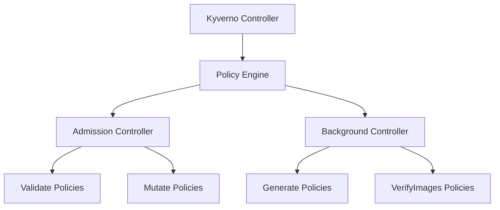

# Kyverno v2

> **创建日期**：2025-11-15
> **最后更新**：2025-11-15
> **状态**：已建立
> **维护者**：技术团队

---

## 📋 概述

Kyverno 是 Kubernetes 原生的策略引擎，使用 YAML 编写策略，无需学习新的语言。

### 核心特性

- ✅ **Kubernetes 原生**：使用 Kubernetes 资源定义策略
- ✅ **YAML 编写**：无需学习 Rego 语言
- ✅ **声明式策略**：策略即代码
- ✅ **多种策略类型**：Validate、Mutate、Generate、VerifyImages
- ✅ **Wasm 支持**：v2 版本支持 Wasm 策略执行

---

## 🏗️ 架构设计

### 架构组件



### 核心组件

1. **Kyverno Controller**
   - 管理策略生命周期
   - 处理策略变更
   - 协调策略执行

2. **Admission Controller**
   - 验证资源创建/更新
   - 变更资源配置
   - 实时策略执行

3. **Background Controller**
   - 生成资源
   - 验证镜像
   - 持续策略检查

---

## 🚀 安装和配置

### 前置要求

- Kubernetes 1.14+
- 启用 MutatingAdmissionWebhook 和 ValidatingAdmissionWebhook

### 安装步骤

```bash
# 1. 安装 Kyverno
kubectl create -f https://github.com/kyverno/kyverno/releases/latest/download/install.yaml

# 2. 验证安装
kubectl get pods -n kyverno

# 3. 检查 Kyverno 状态
kubectl get validatingadmissionwebhook
kubectl get mutatingadmissionwebhook
```

### 验证安装

```bash
# 检查 Kyverno Pod 状态
kubectl get pods -n kyverno

# 检查策略状态
kubectl get clusterpolicies
kubectl get policies
```

---

## 📊 策略类型

### 1. Validate 策略

验证资源是否符合策略要求。

```yaml
apiVersion: kyverno.io/v1
kind: ClusterPolicy
metadata:
  name: require-labels
spec:
  validationFailureAction: enforce
  rules:
    - name: check-labels
      match:
        resources:
          kinds:
            - Pod
      validate:
        message: "All pods must have 'app' and 'version' labels"
        pattern:
          metadata:
            labels:
              app: "?*"
              version: "?*"
```

### 2. Mutate 策略

自动修改资源配置。

```yaml
apiVersion: kyverno.io/v1
kind: ClusterPolicy
metadata:
  name: add-default-resources
spec:
  rules:
    - name: add-resources
      match:
        resources:
          kinds:
            - Pod
      mutate:
        patchStrategicMerge:
          spec:
            containers:
              - (name): "*"
                resources:
                  requests:
                    memory: "128Mi"
                    cpu: "100m"
                  limits:
                    memory: "256Mi"
                    cpu: "200m"
```

### 3. Generate 策略

自动生成资源。

```yaml
apiVersion: kyverno.io/v1
kind: ClusterPolicy
metadata:
  name: generate-networkpolicy
spec:
  rules:
    - name: generate-np
      match:
        resources:
          kinds:
            - Namespace
      generate:
        kind: NetworkPolicy
        apiVersion: networking.k8s.io/v1
        name: default-deny
        namespace: "{{request.object.metadata.name}}"
        data:
          spec:
            podSelector: {}
            policyTypes:
              - Ingress
              - Egress
```

### 4. VerifyImages 策略

验证容器镜像签名和漏洞。

```yaml
apiVersion: kyverno.io/v1
kind: ClusterPolicy
metadata:
  name: verify-images
spec:
  validationFailureAction: enforce
  rules:
    - name: verify-signature
      match:
        resources:
          kinds:
            - Pod
      verifyImages:
        - imageReferences:
            - "*"
          attestors:
            - count: 1
              entries:
                - keys:
                    publicKeys: |-
                      -----BEGIN PUBLIC KEY-----
                      ...
                      -----END PUBLIC KEY-----
```

---

## 🔄 与 Gatekeeper 对比

### Gatekeeper vs Kyverno

| 特性 | Gatekeeper | Kyverno |
|------|------------|---------|
| **策略语言** | Rego | YAML |
| **学习曲线** | 陡峭 | 平缓 |
| **Kubernetes 集成** | 好 | 最好 |
| **策略类型** | Validate | Validate/Mutate/Generate/VerifyImages |
| **性能** | 中等 | 高 |
| **Wasm 支持** | 无 | v2 支持 |
| **社区活跃度** | 高 | 高 |

### 选型建议

- **简单易用**：选择 Kyverno
- **复杂策略**：选择 Gatekeeper
- **Kubernetes 原生**：选择 Kyverno

---

## 🆕 v2 新特性

### 1. Wasm 策略支持

```yaml
apiVersion: kyverno.io/v2alpha1
kind: ClusterPolicy
metadata:
  name: wasm-policy
spec:
  rules:
    - name: wasm-validate
      match:
        resources:
          kinds:
            - Pod
      validate:
        wasm:
          module: |
            (module
              (func $validate (param $input i32) (result i32)
                ...
              )
            )
```

### 2. 性能优化

- 策略缓存
- 并行执行
- 资源优化

### 3. 增强的可观测性

- 策略执行指标
- 审计日志
- 策略报告

---

## 💡 最佳实践

### 1. 策略组织

- 使用命名空间策略
- 合理使用 ClusterPolicy
- 策略版本管理

### 2. 性能优化

- 避免复杂策略
- 使用策略缓存
- 合理设置资源限制

### 3. 安全配置

- 启用镜像验证
- 配置资源限制
- 定期审查策略

---

## 🔗 相关文档

- [OPA 策略引擎](policy-opa.md)
- [Gatekeeper 集成](gatekeeper.md)
- [策略即代码最佳实践](../07-security-compliance/security-compliance/security-compliance.md)

---

**最后更新**：2025-11-15
**维护者**：技术团队
