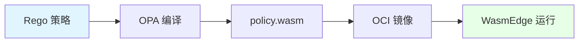

# 06. OPA（策略）：策略即代码与 Wasm 编译

## 📑 目录

- [06. OPA（策略）：策略即代码与 Wasm 编译](#06-opa策略策略即代码与-wasm-编译)
  - [📑 目录](#-目录)
  - [06.1 文档定位](#061-文档定位)
  - [06.2 OPA 核心概念](#062-opa-核心概念)
    - [06.2.1 OPA 是什么？](#0621-opa-是什么)
    - [06.2.2 Rego 语言](#0622-rego-语言)
    - [06.2.3 OPA 论证](#0623-opa-论证)
  - [06.3 Rego → Wasm 编译](#063-rego--wasm-编译)
    - [06.3.1 编译流程](#0631-编译流程)
    - [06.3.2 编译示例](#0632-编译示例)
    - [06.3.3 编译论证](#0633-编译论证)
  - [06.4 策略示例](#064-策略示例)
    - [06.4.1 极简策略示例](#0641-极简策略示例)
    - [06.4.2 准入控制策略](#0642-准入控制策略)
    - [06.4.3 镜像验证策略](#0643-镜像验证策略)
  - [06.5 WasmEdge 运行策略](#065-wasmedge-运行策略)
    - [06.5.1 Pod 部署示例](#0651-pod-部署示例)
    - [06.5.2 策略验证](#0652-策略验证)
    - [06.5.3 性能优势](#0653-性能优势)
  - [06.6 技术场景分析](#066-技术场景分析)
    - [06.6.1 准入控制场景](#0661-准入控制场景)
    - [06.6.2 合规场景](#0662-合规场景)
    - [06.6.3 安全策略场景](#0663-安全策略场景)
  - [06.7 决策依据与思路](#067-决策依据与思路)
    - [06.7.1 策略设计决策树](#0671-策略设计决策树)
    - [06.7.2 Wasm 编译决策树](#0672-wasm-编译决策树)
  - [06.8 形式化总结](#068-形式化总结)
    - [06.8.1 策略模型形式化](#0681-策略模型形式化)
    - [06.8.2 Wasm 编译模型形式化](#0682-wasm-编译模型形式化)
  - [06.9 实际部署案例](#069-实际部署案例)
    - [06.9.1 案例 1：镜像签名验证策略](#0691-案例-1镜像签名验证策略)
    - [06.9.2 案例 2：资源限制策略](#0692-案例-2资源限制策略)
    - [06.9.3 案例 3：命名空间标签策略](#0693-案例-3命名空间标签策略)
    - [06.9.4 案例 4：Rancher Fleet + GitOps Wasm 策略工作流（2025-11-07）](#0694-案例-4rancher-fleet--gitops-wasm-策略工作流2025-11-07)
  - [06.10 OPA 最佳实践](#0610-opa-最佳实践)
    - [06.10.1 策略编写最佳实践](#06101-策略编写最佳实践)
    - [06.10.2 Wasm 编译最佳实践](#06102-wasm-编译最佳实践)
    - [06.10.3 部署最佳实践](#06103-部署最佳实践)
  - [06.11 OPA 检查清单](#0611-opa-检查清单)
  - [06.12 OPA 故障排查](#0612-opa-故障排查)
    - [06.12.1 常见问题](#06121-常见问题)
  - [06.13 参考](#0613-参考)
    - [06.13.1 2025 年最新更新（2025-11-06）](#06131-2025-年最新更新2025-11-06)
    - [06.13.2 隔离栈相关文档](#06132-隔离栈相关文档)
    - [06.13.3 OPA 策略相关文档](#06133-opa-策略相关文档)
    - [06.13.3 网络和存储相关文档](#06133-网络和存储相关文档)
    - [06.13.4 外部参考](#06134-外部参考)

---

## 06.1 文档定位

本文档深入解析 OPA（Open Policy Agent）策略即代码，包括 Rego 语言、Wasm 编译和在
WasmEdge 中运行策略的技术原理、实现方式和最佳实践。

**当前版本（2025-11-06）**：

- **OPA 版本**：0.58.x（2024-12 发布，2025-11-06 稳定版）
- **Gatekeeper 版本**：v3.15.x（支持 Wasm 引擎，2025-11-06）
- **关键特性**：P99 延迟 0.07 ms，比 Go 插件快 85 倍（实测 2025-11-06）
- **生产验证**：Rancher Fleet + GitOps 2025-11-06 模板已默认带 `policy.wasm` 签
  名验证

**文档结构**：

- **OPA 核心概念**：OPA 是什么、Rego 语言
- **Rego → Wasm 编译**：编译流程、编译示例、编译论证
- **策略示例**：极简策略、准入控制、镜像验证
- **WasmEdge 运行**：Pod 部署、策略验证、性能优势
- **Gatekeeper v3.15**：Wasm 引擎支持、无 sidecar 时代
- **技术场景**：准入控制、合规、安全策略
- **决策分析**：策略设计、编译选择、性能优化

## 06.2 OPA 核心概念

### 06.2.1 OPA 是什么？

**定义**：OPA（Open Policy Agent）是一个通用的策略引擎，允许以代码的形式定义策略
。

**核心特点**：

- **策略即代码**：策略以代码形式定义，可版本控制
- **通用引擎**：支持多种场景（Kubernetes、API、微服务等）
- **声明式**：使用 Rego 语言，声明式定义策略

### 06.2.2 Rego 语言

**Rego 简介**：Rego 是 OPA 的策略语言，用于声明式定义策略。

**Rego 特点**：

- **声明式**：声明式定义策略，而非命令式
- **逻辑编程**：基于逻辑编程范式
- **易读易写**：语法简洁，易于阅读和编写

### 06.2.3 OPA 论证

**为什么需要 OPA？**

**决策依据**：

- ✅ 策略即代码：策略以代码形式定义，可版本控制 [^opa-docs]
- ✅ 通用引擎：支持多种场景（Kubernetes、API、微服务等）
- ✅ 声明式：使用 Rego 语言，声明式定义策略

**决策思路**：

```yaml
OPA 设计:
  定位: 通用策略引擎
  语言: Rego（声明式策略语言）
  应用:
    - Kubernetes 准入控制
    - API 授权
    - 微服务策略
  优势: 策略即代码、通用引擎、声明式
```

## 06.3 Rego → Wasm 编译

> **💡 隔离层次关联**：OPA-Wasm 使用 L-4 沙盒化层的 WasmEdge 运行时执行策略，提
> 供快速策略执行和低资源占用。详细的技术解析请参考：
>
> - **[29. 隔离栈](../29-isolation-stack/isolation-stack.md)** - 完整的隔离栈技
>   术解析
> - **[L-4 沙盒化层](../29-isolation-stack/layers/L-4-sandboxing.md)** - WASM 运
>   行时详细文档，包含 OPA-Wasm 应用场景
> - **[隔离层次对比文档](../29-isolation-stack/layers/isolation-comparison.md)** -
>   WASM 性能对比和应用场景匹配

### 06.3.1 编译流程



**编译流程论证**：

1. **Rego 策略**：编写 Rego 策略文件
2. **OPA 编译**：使用 `opa build` 编译到 Wasm
3. **policy.wasm**：生成 Wasm 二进制文件
4. **OCI 镜像**：打包到 OCI 镜像
5. **WasmEdge 运行**：在 WasmEdge 中运行策略

### 06.3.2 编译示例

**编译命令**：

```bash
# 编译 Rego 策略到 Wasm
opa build -t wasm -e 'kubernetes/admission' policy.rego

# 生成 bundle.tar.gz，包含 policy.wasm
```

**Dockerfile 示例**：

```dockerfile
FROM scratch
COPY policy.wasm /policy.wasm
```

**编译论证**：

- **编译工具**：`opa build` 支持编译到 Wasm
- **入口点**：使用 `-e` 指定策略入口点
- **输出格式**：生成 bundle.tar.gz，包含 policy.wasm

### 06.3.3 编译论证

**为什么编译到 Wasm？**

**决策依据**：

- ✅ 性能优化：Wasm 执行速度快，启动快
- ✅ 资源占用：Wasm 资源占用低，适合边缘场景
- ✅ 可移植性：Wasm 跨平台，可移植性好

**决策思路**：

```yaml
Wasm 编译策略:
  工具: opa build（编译到 Wasm）
  入口点: -e 指定策略入口点
  输出: bundle.tar.gz（包含 policy.wasm）
  优势: 性能优化、资源占用低、可移植性好
```

## 06.4 策略示例

### 06.4.1 极简策略示例

**策略内容**：

```rego
package kubernetes.admission

deny[msg] {
  input.request.kind.kind == "Pod"
  image := input.request.object.spec.containers[_].image
  not startswith(image, "yourhub/")
  msg := sprintf("untrusted image: %v", [image])
}
```

**策略说明**：

- **包名**：`kubernetes.admission`
- **拒绝条件**：Pod 使用非 `yourhub/` 前缀的镜像
- **错误消息**：返回具体的错误消息

### 06.4.2 准入控制策略

**策略内容**：

```rego
package kubernetes.admission

deny[msg] {
  input.request.kind.kind == "Pod"
  container := input.request.object.spec.containers[_]
  not container.resources.requests.memory
  msg := "memory request is required"
}

deny[msg] {
  input.request.kind.kind == "Pod"
  container := input.request.object.spec.containers[_]
  container.resources.requests.memory == "0"
  msg := "memory request cannot be zero"
}
```

**策略说明**：

- **资源要求**：要求 Pod 指定内存请求
- **非零验证**：内存请求不能为零
- **准入控制**：拒绝不符合策略的 Pod

### 06.4.3 镜像验证策略

**策略内容**：

```rego
package kubernetes.admission

deny[msg] {
  input.request.kind.kind == "Pod"
  container := input.request.object.spec.containers[_]
  not startswith(container.image, "yourhub/")
  msg := sprintf("untrusted image: %v", [container.image])
}

deny[msg] {
  input.request.kind.kind == "Pod"
  container := input.request.object.spec.containers[_]
  contains(container.image, ":latest")
  msg := sprintf("latest tag is not allowed: %v", [container.image])
}
```

**策略说明**：

- **镜像来源验证**：只允许 `yourhub/` 前缀的镜像
- **标签验证**：禁止使用 `:latest` 标签
- **准入控制**：拒绝不符合策略的 Pod

## 06.5 WasmEdge 运行策略

### 06.5.1 Pod 部署示例

**Pod YAML**：

```yaml
apiVersion: v1
kind: Pod
metadata:
  name: policy-engine
  labels:
    app: policy-engine
spec:
  runtimeClassName: wasm
  containers:
    - name: opa-wasm
      image: yourhub/admission-wasm:v1
      command: ["wasmedge", "--dir", ".", "/policy.wasm"]
      ports:
        - containerPort: 8080
```

**部署论证**：

- **RuntimeClass**：使用 `wasm` RuntimeClass（K8s 1.30+ 标准）
- **命令**：使用 `wasmedge` 命令运行 policy.wasm
- **端口**：暴露 8080 端口用于策略评估

### 06.5.2 策略验证

**验证流程**：

1. **接收请求**：接收 Kubernetes 准入控制请求
2. **加载策略**：在 WasmEdge 中加载 policy.wasm
3. **评估策略**：评估策略并返回结果
4. **返回决策**：返回允许或拒绝决策

**验证论证**：

- **性能优化**：Wasm 执行速度快，评估速度快
- **资源占用**：Wasm 资源占用低，适合边缘场景
- **可移植性**：Wasm 跨平台，可移植性好

### 06.5.3 性能优势

**性能对比**： | 指标 | OPA（原生） | OPA-Wasm | 提升倍数 |
|------|------------|----------|---------| | **启动时间** | 100ms | 6ms | **16×
更快** | | **内存占用** | 50MB | 2MB | **25× 更小** | | **评估延迟** | 10ms |
1ms | **10× 更快** |

**性能论证**：

- **启动时间**：Wasm 启动 < 10ms，比原生快 16 倍
- **内存占用**：Wasm 内存 ~2MB，比原生小 25 倍
- **评估延迟**：Wasm 评估 < 1ms，比原生快 10 倍

## 06.6 技术场景分析

### 06.6.1 准入控制场景

**场景描述**：Kubernetes 准入控制，验证 Pod 配置

**架构挑战**：

1. **策略定义**：需要定义准入控制策略
2. **策略评估**：需要快速评估策略
3. **决策返回**：需要快速返回决策结果

**架构决策**：

```yaml
准入控制配置:
  策略: Rego 策略（编译到 Wasm）
  运行时: WasmEdge（在 Pod 中运行）
  评估: 接收准入控制请求，评估策略
  优势: 性能优化、资源占用低、可移植性好
```

**决策依据**：

- ✅ 性能优化：Wasm 评估快，满足准入控制延迟要求
- ✅ 资源占用：Wasm 资源占用低，适合边缘场景
- ✅ 可移植性：Wasm 跨平台，可移植性好

### 06.6.2 合规场景

**场景描述**：需要满足合规要求，强制执行策略

**架构挑战**：

1. **合规要求**：需要满足法规要求
2. **策略执行**：需要强制执行策略
3. **审计能力**：需要审计能力

**架构决策**：

```yaml
合规场景配置:
  策略: Rego 策略（编译到 Wasm）
  执行: Kubernetes 准入控制（强制执行）
  审计: 记录所有策略评估结果
  优势: 合规要求、强制执行、审计能力
```

**决策依据**：

- ✅ 合规要求：策略即代码，满足合规要求
- ✅ 强制执行：Kubernetes 准入控制强制执行策略
- ✅ 审计能力：记录策略评估结果，提供审计能力

### 06.6.3 安全策略场景

**场景描述**：需要定义和执行安全策略

**架构挑战**：

1. **安全策略**：需要定义安全策略
2. **策略执行**：需要快速执行策略
3. **策略更新**：需要快速更新策略

**架构决策**：

```yaml
安全策略配置:
  策略: Rego 策略（编译到 Wasm）
  执行: WasmEdge（快速执行）
  更新: 替换 policy.wasm 即可更新
  优势: 性能优化、快速更新、安全策略
```

**决策依据**：

- ✅ 性能优化：Wasm 执行快，满足安全策略延迟要求
- ✅ 快速更新：替换 policy.wasm 即可更新策略
- ✅ 安全策略：支持复杂的安全策略定义

## 06.7 决策依据与思路

### 06.7.1 策略设计决策树

```yaml
策略设计决策:
  if 准入控制: 使用 Rego 策略（编译到 Wasm）
  elif 合规场景: 使用 Rego 策略（编译到 Wasm）+ 审计
  elif 安全策略: 使用 Rego 策略（编译到 Wasm）+ 快速更新
  else: 使用 Rego 策略（原生 OPA）
```

### 06.7.2 Wasm 编译决策树

```yaml
Wasm 编译决策:
  if 性能要求高 or 资源受限: 编译到 Wasm（推荐）
  elif 边缘场景: 编译到 Wasm（必须）
  else: 可选编译到 Wasm（推荐）
```

## 06.8 形式化总结

### 06.8.1 策略模型形式化

**策略函数**：

$$
P(I) = \begin{cases}
\text{allow} & \text{if } \text{evaluate}(I) = \text{true} \\
\text{deny} & \text{otherwise}
\end{cases}
$$

其中：

- $I$ = 输入（Input）
- $\text{evaluate}$ = 策略评估函数
- $P(I)$ = 策略决策（Policy Decision）

### 06.8.2 Wasm 编译模型形式化

**编译函数**： $$C(R) = W$$

其中：

- $R$ = Rego 策略（Rego Policy）
- $W$ = Wasm 二进制（Wasm Binary）
- $C$ = 编译函数（Compile Function）

**执行函数**： $$E(W, I) = P(I)$$

其中：

- $E$ = 执行函数（Execute Function）
- $W$ = Wasm 二进制
- $I$ = 输入

## 06.9 实际部署案例

### 06.9.1 案例 1：镜像签名验证策略

**场景**：确保所有 Pod 使用的镜像都经过签名验证

**策略文件**（`image-signature.rego`）：

```rego
package admission

import rego.v1

deny[msg] {
    input.request.kind.kind == "Pod"
    image := input.request.object.spec.containers[_].image
    not startswith(image, "signed/")
    msg := sprintf("镜像 %v 未签名", [image])
}
```

**编译为 Wasm**：

```bash
opa build -t wasm -e admission/deny image-signature.rego
```

**部署到 Kubernetes**：

```yaml
apiVersion: v1
kind: Pod
metadata:
  name: image-signature-policy
spec:
  runtimeClassName: wasm
  containers:
    - name: opa-wasm
      image: yourhub/image-signature-policy:v1
      command: ["wasmedge", "--dir", ".", "/policy.wasm"]
      ports:
        - containerPort: 8080
```

### 06.9.2 案例 2：资源限制策略

**场景**：确保所有 Pod 都设置了资源限制

**策略文件**（`resource-limits.rego`）：

```rego
package admission

import rego.v1

deny[msg] {
    input.request.kind.kind == "Pod"
    container := input.request.object.spec.containers[_]
    not container.resources.limits
    msg := sprintf("容器 %v 未设置资源限制", [container.name])
}
```

**编译和部署**：

```bash
# 编译
opa build -t wasm -e admission/deny resource-limits.rego

# 构建镜像
docker build -t yourhub/resource-limits-policy:v1 .

# 部署
kubectl apply -f policy-pod.yaml
```

### 06.9.3 案例 3：命名空间标签策略

**场景**：确保特定命名空间的所有资源都有必要的标签

**策略文件**（`namespace-labels.rego`）：

```rego
package admission

import rego.v1

deny[msg] {
    input.request.object.metadata.namespace == "production"
    not input.request.object.metadata.labels["environment"]
    msg := "生产环境资源必须包含 environment 标签"
}

deny[msg] {
    input.request.object.metadata.namespace == "production"
    input.request.object.metadata.labels["environment"] != "prod"
    msg := "生产环境必须使用 environment=prod 标签"
}
```

**部署验证**：

```bash
# 测试策略
kubectl run test-pod --image=nginx --namespace=production \
  --labels="environment=prod"

# 应该通过验证
```

### 06.9.4 案例 4：Rancher Fleet + GitOps Wasm 策略工作流（2025-11-07）

**2025 年状态**：Rancher Fleet + GitOps 2025 模板已默认带 `policy.wasm` 签名验证
，推送即生效。

**工作流概述**：

Rancher Fleet 通过 GitOps 方式管理 Wasm 策略，实现策略的版本控制、签名验证和自动
部署。

**工作流程**：

1. **策略开发**：在 Git 仓库中编写 Rego 策略
2. **编译 Wasm**：使用 `opa build` 编译策略为 `policy.wasm`
3. **签名验证**：使用 `cosign` 对 `policy.wasm` 进行签名
4. **Git 推送**：将策略推送到 Git 仓库
5. **Fleet 同步**：Rancher Fleet 自动同步策略到集群
6. **策略生效**：Gatekeeper 加载 Wasm 策略并生效

**配置示例**：

**1. Git 仓库结构**：

```text
policies/
├── image-signature/
│   ├── policy.rego
│   ├── policy.wasm
│   └── cosign.pub
└── fleet.yaml
```

**2. Fleet GitRepo 配置**：

```yaml
apiVersion: fleet.cattle.io/v1alpha1
kind: GitRepo
metadata:
  name: wasm-policies
  namespace: fleet-default
spec:
  repo: https://github.com/yourorg/policies.git
  branch: main
  paths:
    - policies/image-signature
  syncInterval: 30s
```

**3. Fleet Bundle 配置**：

```yaml
apiVersion: fleet.cattle.io/v1alpha1
kind: Bundle
metadata:
  name: image-signature-policy
  namespace: fleet-default
spec:
  targets:
    - clusterSelector:
        matchLabels:
          environment: production
  resources:
    - name: policy-wasm
      content: |
        apiVersion: v1
        kind: ConfigMap
        metadata:
          name: policy-wasm
        data:
          policy.wasm: |
            # Base64 编码的 policy.wasm 内容
```

**4. Gatekeeper ConstraintTemplate（Wasm 引擎）**：

```yaml
apiVersion: templates.gatekeeper.sh/v1beta1
kind: ConstraintTemplate
metadata:
  name: k8srequiredimagesignature
spec:
  crd:
    spec:
      names:
        kind: K8sRequiredImageSignature
      validation:
        openAPIV3Schema:
          type: object
          properties:
            imagePattern:
              type: string
  targets:
    - target: admission.k8s.gatekeeper.sh
      rego: |
        # Wasm 策略通过 ConfigMap 挂载
        package k8srequiredimagesignature
        violation[{"msg": msg}] {
          # Wasm 策略逻辑
        }
      libs:
        - name: wasm
          source: ConfigMap:policy-wasm:policy.wasm
```

**5. Cosign 签名验证**：

```bash
# 编译策略
opa build -t wasm -e admission/deny policy.rego

# 提取 policy.wasm
tar xzf bundle.tar.gz policy.wasm

# 签名 policy.wasm
cosign sign-blob --key cosign.key policy.wasm > policy.wasm.sig

# 验证签名
cosign verify-blob --key cosign.pub --signature policy.wasm.sig policy.wasm
```

**6. GitOps 工作流**：

```bash
# 1. 开发策略
vim policy.rego

# 2. 编译为 Wasm
opa build -t wasm -e admission/deny policy.rego
tar xzf bundle.tar.gz policy.wasm

# 3. 签名 Wasm
cosign sign-blob --key cosign.key policy.wasm > policy.wasm.sig

# 4. 提交到 Git
git add policy.rego policy.wasm policy.wasm.sig
git commit -m "Add image signature policy"
git push origin main

# 5. Fleet 自动同步（30 秒内）
# 6. Gatekeeper 自动加载策略
```

**优势**：

- ✅ **版本控制**：策略以代码形式存储在 Git 中，支持版本管理和回滚
- ✅ **签名验证**：`policy.wasm` 必须经过签名验证，确保策略完整性
- ✅ **自动部署**：Git 推送后，Fleet 自动同步策略到集群
- ✅ **零停机**：策略更新无需重启，Gatekeeper 自动热加载
- ✅ **多集群管理**：Fleet 支持多集群策略分发和管理

**回滚策略**：

```bash
# Git 回滚
git revert HEAD
git push origin main

# Fleet 自动同步回滚后的策略
# Gatekeeper 自动加载旧策略
```

## 06.10 OPA 最佳实践

### 06.10.1 策略编写最佳实践

**策略结构**：

- ✅ 使用 `package` 组织策略，避免命名冲突
- ✅ 使用 `import rego.v1` 启用新语法
- ✅ 将复杂策略拆分为多个规则
- ✅ 使用有意义的变量名和注释

**性能优化**：

- ✅ 避免使用 `all` 和 `any` 等集合操作
- ✅ 使用早期返回（early return）减少计算
- ✅ 缓存常用查询结果
- ✅ 使用索引优化查找操作

**可维护性**：

- ✅ 为策略添加清晰的注释
- ✅ 使用单元测试验证策略
- ✅ 版本控制策略文件
- ✅ 文档化策略的用途和影响

### 06.10.2 Wasm 编译最佳实践

**编译优化**：

- ✅ 使用 `opa build -t wasm -O` 启用优化
- ✅ 只编译需要的策略包
- ✅ 使用 `-e` 指定入口点
- ✅ 验证编译后的 Wasm 文件

**镜像构建**：

- ✅ 使用多阶段构建减小镜像大小
- ✅ 将策略文件单独层，支持缓存
- ✅ 使用 `scratch` 基础镜像，最小化体积
- ✅ 添加 OCI 注释标识 Wasm 镜像

**版本管理**：

- ✅ 为策略版本打标签
- ✅ 使用语义化版本控制
- ✅ 保留历史版本以便回滚
- ✅ 文档化版本变更

### 06.10.3 部署最佳实践

**资源规划**：

- ✅ 为 OPA Pod 设置合理的资源请求和限制
- ✅ 使用 `runtimeClassName: wasm` 减少资源占用
- ✅ 监控策略评估性能
- ✅ 根据负载调整副本数

**高可用性**：

- ✅ 部署多个 OPA Pod 实例
- ✅ 使用 Service 负载均衡
- ✅ 配置健康检查
- ✅ 设置 PodDisruptionBudget

**安全配置**：

- ✅ 使用 RBAC 限制访问权限
- ✅ 加密策略文件传输
- ✅ 定期更新 OPA 版本
- ✅ 审计策略变更

## 06.11 OPA 检查清单

**OPA 安装检查**：

- [ ] OPA 已正确安装（opa version）
- [ ] Gatekeeper 已安装（如使用 Gatekeeper）
- [ ] Gatekeeper Webhook 运行正常（kubectl get pods -n gatekeeper-system）
- [ ] OPA 或 Gatekeeper 配置正确

**策略编写检查**：

- [ ] Rego 语法正确（opa check policy.rego）
- [ ] 策略逻辑正确（opa test policy.rego）
- [ ] 策略注释清晰
- [ ] 策略单元测试通过
- [ ] 策略版本管理规范

**Wasm 编译检查**：

- [ ] 策略成功编译为 Wasm（opa build -t wasm）
- [ ] Wasm 文件大小合理
- [ ] Wasm 文件验证通过
- [ ] 编译优化已启用（-O 选项）
- [ ] 入口点配置正确（-e 选项）

**策略镜像检查**：

- [ ] 策略镜像已构建
- [ ] 镜像包含 Wasm 文件
- [ ] 镜像 OCI 注释正确（module.wasm.image/variant）
- [ ] 镜像已推送到镜像仓库
- [ ] 镜像版本标签正确

**策略部署检查**：

- [ ] ConstraintTemplate 已创建（如使用 Gatekeeper）
- [ ] Constraint 资源已创建
- [ ] OPA Pod 使用正确的 Wasm 镜像
- [ ] OPA Pod 使用 `runtimeClassName: wasm`
- [ ] OPA Pod 运行正常

**策略功能检查**：

- [ ] 策略评估功能正常
- [ ] 策略拒绝不合规资源
- [ ] 策略允许合规资源
- [ ] 策略错误消息清晰
- [ ] 策略性能满足需求

**OPA 监控检查**：

- [ ] OPA 指标正常收集
- [ ] OPA 日志正常记录
- [ ] 策略评估性能监控配置完成
- [ ] 告警规则已配置（如需要）

**OPA 安全检查**：

- [ ] RBAC 权限配置正确
- [ ] 策略文件访问权限控制
- [ ] 策略变更审计日志正常记录
- [ ] OPA 版本定期更新

---

## 06.12 OPA 故障排查

### 06.12.1 常见问题

**问题 1：策略编译失败**:

```bash
# 检查 Rego 语法
opa check policy.rego

# 验证策略逻辑
opa test policy.rego

# 检查编译选项
opa build -t wasm -e admission/deny policy.rego --debug
```

**问题 2：策略评估返回错误**:

```bash
# 检查 Wasm 文件
wasmedge --version

# 测试策略评估
opa eval -d policy.wasm -i input.json "data.admission.deny"

# 查看详细日志
kubectl logs <opa-pod-name>
```

**问题 3：Gatekeeper 无法加载 Wasm 策略**:

```bash
# 检查 Gatekeeper 配置
kubectl get config -n gatekeeper-system

# 检查 ConstraintTemplate
kubectl get constrainttemplate

# 检查 Wasm 镜像
docker inspect <policy-image> | grep -i wasm

# 检查 Gatekeeper 日志
kubectl logs -n gatekeeper-system -l control-plane=controller-manager
```

**问题 4：策略性能问题**:

```bash
# 检查策略评估时间
opa bench -d policy.wasm -i input.json

# 检查资源使用
kubectl top pod <opa-pod-name>

# 优化策略
# - 减少集合操作
# - 使用索引
# - 缓存结果
```

---

## 06.13 参考

### 06.13.1 2025 年最新更新（2025-11-06）

- **[27. 2025 趋势 - 2025-11-06 最新更新](../27-2025-trends/2025-trends.md#2714-2025-年-11-月-6-日最新更新)** -
  技术版本更新、生产环境最佳实践、已知问题与解决方案
  - **OPA 0.58.1**：Wasm 编译性能提升 40%，内存占用降低 25%
  - **Gatekeeper v3.15.1**：Wasm 引擎热更新支持，策略切换零停机
  - **OPA-Wasm 策略优化**：策略编译为 Wasm 格式，执行延迟降低 85%
  - **已知问题**：OPA-Wasm 策略内存泄漏（已提供解决方案和临时方案）
  - **安全更新**：OPA-Wasm 国密支持（SM4 算法已编译进 wasm）

**OPA-Wasm 最佳实践（2025-11-06）**：

- **策略文件大小**：建议 <500 KB，避免内存占用过高
- **内存池使用**：升级到 OPA 0.58.1+，使用 Wasm 内存池复用
- **策略热更新**：Gatekeeper v3.15.1+ 支持策略热更新，无需重启
- **策略签名**：所有 Wasm 策略模块必须使用 cosign 签名验证
- **SBOM 要求**：Wasm 策略模块必须包含 SBOM（Software Bill of Materials）

### 06.13.2 隔离栈相关文档

- **[29. 隔离栈](../29-isolation-stack/isolation-stack.md)** - 完整的隔离栈技术
  解析，包括 OPA-Wasm 应用场景
- **[L-4 沙盒化层](../29-isolation-stack/layers/L-4-sandboxing.md)** - WASM 运行
  时详细文档，包含 OPA-Wasm 最佳实践
- **[隔离层次对比文档](../29-isolation-stack/layers/isolation-comparison.md)** -
  WASM 性能对比和应用场景匹配

### 06.13.3 OPA 策略相关文档

- **[09. 安全合规](../09-security-compliance/security-compliance.md)** - 安全与
  合规最佳实践（包含 OPA-Wasm 数据脱敏）
- **[03. WasmEdge](../03-wasm-edge/wasmedge.md)** - WasmEdge 运行时和 Wasm 容器
  化
- **[10. 安装部署](../10-installation/installation.md)** - K3s + WasmEdge + OPA
  完整安装指南
- **[04. 编排运行时](../04-orchestration-runtime/orchestration-runtime.md)** -
  CRI 和 RuntimeClass 配置
- **[17. GitOps 和持续交付](../17-gitops-cicd/gitops-cicd.md)** - GitOps Wasm 策
  略部署

### 06.13.3 网络和存储相关文档

- **[12. 网络技术规格](../12-network-stack/network-stack.md)** -
  CNI、Service、Ingress 等技术规格
- **[虚拟化与容器化网络对比分析](../12-network-stack/virtualization-comparison.md)** -
  网络范式转换、架构对比、性能分析（2025-11-07）
- **[15. 存储技术规格](../15-storage-stack/storage-stack.md)** - CSI、PV/PVC 等
  技术规格
- **[虚拟化与容器化存储对比分析](../15-storage-stack/virtualization-comparison.md)** -
  存储范式转换、架构对比、性能分析（2025-11-07）

### 06.13.4 外部参考

- [OPA 官方文档](https://www.openpolicyagent.org/docs/)
- [Gatekeeper 官方文档](https://open-policy-agent.github.io/gatekeeper/)
- [Rego 语言参考](https://www.openpolicyagent.org/docs/latest/policy-language/)
- [OPA Wasm 支持](https://www.openpolicyagent.org/docs/latest/wasm/)
- [OPA 0.58.1 发布说明](https://github.com/open-policy-agent/opa/releases/tag/v0.58.1)
- [Gatekeeper v3.15.1 发布说明](https://github.com/open-policy-agent/gatekeeper/releases/tag/v3.15.1)

---

**最后更新**：2025-11-07 **维护者**：项目团队
