# 03. WasmEdge：WebAssembly 运行时集成指南

## 📑 目录

- [📑 目录](#-目录)
- [03.1 文档定位](#031-文档定位)
- [03.2 核心定位](#032-核心定位)
  - [03.2.1 WasmEdge 是什么？](#0321-wasmedge-是什么)
  - [03.2.2 定位论证](#0322-定位论证)
- [03.3 三种集成路线](#033-三种集成路线)
  - [03.3.1 路线对比](#0331-路线对比)
  - [03.3.2 路线选择论证](#0332-路线选择论证)
- [03.4 路线 1：Docker + WasmEdge（快速验证）](#034-路线-1docker--wasmedge快速验证)
  - [03.4.1 架构](#0341-架构)
  - [03.4.2 实现示例](#0342-实现示例)
  - [03.4.3 优缺点](#0343-优缺点)
  - [03.4.4 技术场景与决策](#0344-技术场景与决策)
- [03.5 路线 2：crun 自动识别（生产推荐）](#035-路线-2crun-自动识别生产推荐)
  - [03.5.1 架构](#0351-架构)
  - [03.5.2 OCI 注释](#0352-oci-注释)
  - [03.5.3 crun 配置](#0353-crun-配置)
  - [03.5.4 镜像构建](#0354-镜像构建)
  - [03.5.5 优缺点](#0355-优缺点)
  - [03.5.6 技术场景与决策](#0356-技术场景与决策)
- [03.6 路线 3：containerd-shim-runwasi（最新）](#036-路线-3containerd-shim-runwasi最新)
  - [03.6.1 架构](#0361-架构)
  - [03.6.2 安装配置](#0362-安装配置)
  - [03.6.3 RuntimeClass 配置](#0363-runtimeclass-配置)
  - [03.6.4 优缺点](#0364-优缺点)
  - [03.6.5 技术场景与决策](#0365-技术场景与决策)
- [03.7 CRI 集成原理](#037-cri-集成原理)
  - [03.7.1 运行时识别流程](#0371-运行时识别流程)
  - [03.7.2 CRI 插件架构](#0372-cri-插件架构)
  - [03.7.3 集成论证](#0373-集成论证)
- [03.8 性能优势](#038-性能优势)
  - [03.8.1 对比数据](#0381-对比数据)
  - [03.8.2 性能优势原理](#0382-性能优势原理)
  - [03.8.3 性能论证](#0383-性能论证)
  - [03.8.4 性能模型形式化](#0384-性能模型形式化)
- [03.9 实战示例](#039-实战示例)
  - [03.9.1 准备 Wasm 字节码（Rust）](#0391-准备-wasm-字节码rust)
  - [03.9.2 打包 OCI 镜像](#0392-打包-oci-镜像)
  - [03.9.3 部署到 K3s](#0393-部署到-k3s)
- [03.10 常见问题](#0310-常见问题)
  - [03.10.1 故障排查](#03101-故障排查)
  - [03.10.2 故障场景与决策](#03102-故障场景与决策)
- [03.11 最佳实践](#0311-最佳实践)
  - [03.11.1 镜像构建](#03111-镜像构建)
  - [03.11.2 网络配置](#03112-网络配置)
  - [03.11.3 资源限制](#03113-资源限制)
- [03.12 技术场景分析](#0312-技术场景分析)
  - [03.12.1 开发环境场景](#03121-开发环境场景)
  - [03.12.2 生产环境场景](#03122-生产环境场景)
  - [03.12.3 CI/CD 场景](#03123-cicd-场景)
  - [03.12.4 边缘场景](#03124-边缘场景)
  - [03.12.5 Serverless 场景](#03125-serverless-场景)
- [03.13 决策依据与思路](#0313-决策依据与思路)
  - [03.13.1 路线选择决策树](#03131-路线选择决策树)
  - [03.13.2 技术场景选择决策树](#03132-技术场景选择决策树)
  - [03.13.3 性能优化决策树](#03133-性能优化决策树)
- [03.14 形式化总结](#0314-形式化总结)
  - [03.14.1 路线模型形式化](#03141-路线模型形式化)
  - [03.14.2 性能模型形式化](#03142-性能模型形式化)
  - [03.14.3 路线性能对比模型](#03143-路线性能对比模型)
- [03.15 实际部署案例](#0315-实际部署案例)
  - [03.15.1 案例 1：使用 crun 部署 Wasm 应用（生产推荐）](#03151-案例-1使用-crun-部署-wasm-应用生产推荐)
  - [03.15.2 案例 2：使用 runwasi 部署 Wasm 应用（K8s 1.30+）](#03152-案例-2使用-runwasi-部署-wasm-应用k8s-130)
  - [03.15.3 案例 3：Rust 应用编译为 Wasm 并部署](#03153-案例-3rust-应用编译为-wasm-并部署)
- [03.16 WasmEdge 故障排查](#0316-wasmedge-故障排查)
  - [03.16.1 常见问题](#03161-常见问题)
- [03.17 参考](#0317-参考)

---

## 03.1 文档定位

本文档深入解析 WasmEdge 与 Docker/K8s/K3s 的集成方式、技术原理和最佳实践，以及不
同技术场景下的决策依据和决策思路。

**当前版本（2025-11-06）**：

- **WasmEdge 版本**：0.14.0（2024-12 发布，2025-11-06 稳定版）
- **关键特性**：内置 Llama2/7B 插件，GPU 加速推理，推理延迟比 PyTorch 容器 ↓60%
- **集成支持**：K8s 1.30 RuntimeClass=wasm 原生支持，K3s 1.30 --wasm flag
- **生产验证**：浪潮云 10 万台边缘节点，冷启动 ≤6 ms（2025-11-06）

**文档结构**：

- **集成路线**：三种集成路线（Docker/crun/runwasi）的技术原理和实现
- **性能优势**：WasmEdge 的性能优势和原理
- **AI 推理**：WasmEdge 0.14 + Llama2 插件、模型 Wasm-化方案
- **技术场景**：开发、生产、CI/CD、边缘、Serverless
- **决策分析**：路线选择、场景适配、性能优化

## 03.2 核心定位

### 03.2.1 WasmEdge 是什么？

**不是**：在 Linux 容器内运行 WasmEdge **而是**：让 Wasm 字节码成为"一等公民"，
镜像里只有 `.wasm` 文件，运行时直接调用 WasmEdge 引擎。

```mermaid
graph TD
    A[传统容器] --> B[rootfs + 应用]
    B --> C[runc]
    C --> D[Linux 进程]

    E[Wasm 容器] --> F[.wasm 文件]
    F --> G[WasmEdge 引擎]
    G --> H[字节码执行]

    style A fill:#ffe6e6
    style E fill:#e6ffe6
```



**核心定位论证**：

- **传统容器**：需要 rootfs + 应用，通过 runc 创建 Linux 进程
- **Wasm 容器**：只有 `.wasm` 文件，直接通过 WasmEdge 引擎执行
- **优势**：无需 rootfs，启动快，体积小

### 03.2.2 定位论证

**为什么让 Wasm 成为一等公民？**

**决策依据**：

- ✅ 启动速度：Wasm 启动时间 < 10ms，容器启动时间 > 1s [^wasmedge-performance]
- ✅ 镜像体积：Wasm 镜像 < 1MB，容器镜像 > 10MB
- ✅ 资源占用：Wasm 内存占用 ~2MB，容器内存占用 > 18MB

**决策思路**：

```yaml
Wasm 一等公民设计:
  优势:
    - 启动速度快（< 10ms）
    - 镜像体积小（< 1MB）
    - 资源占用低（~2MB）
  权衡:
    - 不支持所有系统调用
    - 需要 WASI 支持
```

## 03.3 三种集成路线

### 03.3.1 路线对比

```mermaid
graph TB
    A[WasmEdge 集成] --> B[路线 1<br/>Docker + 入口脚本]
    A --> C[路线 2<br/>crun 自动识别]
    A --> D[路线 3<br/>containerd-shim-runwasi]

    B --> E[本地验证/CI]
    C --> F[生产 K8s/K3s]
    D --> G[最新 K8s/边缘]

    style B fill:#ffe6e6
    style C fill:#fff4e1
    style D fill:#e6ffe6
```



| 路线                          | 启动方式                              | 是否需 rootfs                 | YAML 改造 | 适用场景       | 成熟度     |
| ----------------------------- | ------------------------------------- | ----------------------------- | --------- | -------------- | ---------- |
| **① Docker + WasmEdge**       | 入口脚本 `wasmedge app.wasm`          | ✅ 需要（含 WasmEdge 二进制） | ❌ 不需要 | 快速验证、CI   | ⭐⭐⭐     |
| **② crun 自动识别**           | crun 根据 OCI 注释 `module.wasm` 调用 | ❌ 不需要                     | ❌ 不需要 | 生产 K8s/K3s   | ⭐⭐⭐⭐⭐ |
| **③ containerd-shim-runwasi** | shim 直接启动 WasmEdge                | ❌ 不需要                     | ❌ 不需要 | 最新 K8s、边缘 | ⭐⭐⭐⭐   |

> **推荐顺序**：本地路线 ① → 测试路线 ② → 边缘/Serverless 路线 ③

### 03.3.2 路线选择论证

**为什么需要三种路线？**

**决策依据**：

- ✅ 不同场景需求：开发、生产、边缘各有不同需求
- ✅ 成熟度不同：路线成熟度不同，需要渐进式采用
- ✅ 技术复杂度：路线复杂度不同，需要平衡

**决策思路**：

```yaml
路线选择策略:
  开发阶段: 路线 1（简单、快速验证）
  生产阶段: 路线 2（成熟、推荐）
  边缘阶段: 路线 3（最新、适合边缘）
```

## 03.4 路线 1：Docker + WasmEdge（快速验证）

### 03.4.1 架构

```mermaid
graph LR
    A[Dockerfile] --> B[镜像包含<br/>WasmEdge 二进制]
    B --> C[入口脚本]
    C --> D[wasmedge app.wasm]

    style B fill:#ffe6e6
```



**架构分析**：

- **镜像包含 WasmEdge**：镜像需要包含 WasmEdge 二进制，体积大
- **入口脚本**：通过入口脚本调用 WasmEdge
- **需要 rootfs**：需要完整的文件系统，体积大

### 03.4.2 实现示例

```dockerfile
FROM ubuntu:22.04

# 安装 WasmEdge
RUN curl -sSf https://raw.githubusercontent.com/WasmEdge/WasmEdge/master/utils/install.sh | bash

# 复制 wasm 文件
COPY app.wasm /app.wasm

# 入口脚本
COPY entrypoint.sh /entrypoint.sh
RUN chmod +x /entrypoint.sh

ENTRYPOINT ["/entrypoint.sh"]
```

```bash
#!/bin/bash
# entrypoint.sh
wasmedge /app.wasm
```

### 03.4.3 优缺点

| 优点            | 缺点                           |
| --------------- | ------------------------------ |
| ✅ 实现简单     | ❌ 镜像体积大（包含 WasmEdge） |
| ✅ 无需修改 K8s | ❌ 需要 rootfs                 |
| ✅ 兼容性好     | ❌ 启动时间相对慢              |

**优缺点论证**：

- **优点**：实现简单，无需修改 K8s，兼容性好
- **缺点**：镜像体积大（包含 WasmEdge），需要 rootfs，启动时间相对慢

### 03.4.4 技术场景与决策

**场景 1：本地开发验证**:

**决策依据**：

- ✅ 需要快速验证
- ✅ 不需要生产级性能
- ✅ 简单实现优先

**决策思路**：

```yaml
本地开发验证:
  路线: 路线 1（Docker + WasmEdge）
  原因: 简单、快速、无需配置
  权衡: 镜像体积大、启动慢
```

**场景 2：CI/CD 测试**:

**决策依据**：

- ✅ 需要快速验证
- ✅ 不需要生产级性能
- ✅ 兼容性好

**决策思路**：

```yaml
CI/CD 测试:
  路线: 路线 1（Docker + WasmEdge）
  原因: 简单、兼容性好
  权衡: 镜像体积大、启动慢
```

## 03.5 路线 2：crun 自动识别（生产推荐）

### 03.5.1 架构

```mermaid
graph LR
    A[OCI 镜像] --> B[镜像注释<br/>module.wasm.image/variant]
    B --> C[crun 识别]
    C --> D[调用 WasmEdge]
    D --> E[执行 .wasm]

    style C fill:#fff4e1
    style E fill:#e6ffe6
```



**架构分析**：

- **OCI 镜像**：标准 OCI 镜像格式
- **镜像注释**：通过 OCI 注释标识 wasm 模块
- **crun 识别**：crun 根据注释自动识别并调用 WasmEdge

### 03.5.2 OCI 注释

```yaml
apiVersion: v1
kind: Pod
metadata:
  name: wasm-app
  annotations:
    module.wasm.image/variant: compat-smart # 关键注释
spec:
  runtimeClassName: crun-wasm
  containers:
    - name: app
      image: yourhub/app-wasm:v1
      command: ["app.wasm"] # 可选，crun 会自动提取
```

**OCI 注释论证**：

- **module.wasm.image/variant**：标识镜像包含 wasm 模块
- **crun 自动识别**：crun ≥ 1.8.5 支持自动识别 wasm 模块
- **零 YAML 改造**：只需添加注释，无需修改 YAML 结构

### 03.5.3 crun 配置

```yaml
apiVersion: node.k8s.io/v1
kind: RuntimeClass
metadata:
  name: crun-wasm
handler: crun
```

**RuntimeClass 论证**：

- **handler: crun**：指定使用 crun 运行时
- **自动识别**：crun 根据 OCI 注释自动识别 wasm 模块
- **零改造**：无需修改 Pod YAML 结构

### 03.5.4 镜像构建

```bash
# 方法 1：使用 wasm-to-oci
wasm-to-oci push app.wasm docker.io/yourhub/app-wasm:v1

# 方法 2：手动构建
cat > Dockerfile <<EOF
FROM scratch
COPY app.wasm /app.wasm
EOF
docker build -t yourhub/app-wasm:v1 .
```

**镜像构建论证**：

- **wasm-to-oci**：专门用于推送 wasm 模块到 OCI 仓库
- **FROM scratch**：最小化镜像，无需 rootfs
- **体积优化**：最终镜像体积 < 1MB

### 03.5.5 优缺点

| 优点                    | 缺点                     |
| ----------------------- | ------------------------ |
| ✅ 零 rootfs            | ⚠️ 需要 crun ≥ 1.8.5     |
| ✅ 镜像体积小（< 1MB）  | ⚠️ 需要 RuntimeClass     |
| ✅ 启动速度快（< 10ms） | ⚠️ 需要节点安装 WasmEdge |
| ✅ 零 YAML 改造         |                          |

**优缺点论证**：

- **优点**：零 rootfs、镜像体积小、启动速度快、零 YAML 改造
- **缺点**：需要 crun ≥ 1.8.5、需要 RuntimeClass、需要节点安装 WasmEdge

### 03.5.6 技术场景与决策

**场景 1：生产环境（K8s/K3s）**:

**决策依据**：

- ✅ 需要生产级性能
- ✅ 需要最小镜像体积
- ✅ 需要快速启动

**决策思路**：

```yaml
生产环境:
  路线: 路线 2（crun 自动识别）
  原因: 零 rootfs、体积小、启动快
  权衡: 需要 crun ≥ 1.8.5
```

**场景 2：大规模部署**:

**决策依据**：

- ✅ 需要高密度部署
- ✅ 需要快速启动
- ✅ 需要资源优化

**决策思路**：

```yaml
大规模部署:
  路线: 路线 2（crun 自动识别）
  原因: 镜像体积小、启动快、资源占用低
  优势: 单节点可部署 3000 Pod
```

## 03.6 路线 3：containerd-shim-runwasi（最新）

### 03.6.1 架构


**架构分析**：

- **containerd**：容器运行时接口
- **containerd-shim-runwasi**：专门的 wasm shim
- **WasmEdge 引擎**：直接调用 WasmEdge 引擎

### 03.6.2 安装配置

```bash
# 安装 runwasi shim
containerd config default | sudo tee /etc/containerd/config.toml

# 配置 wasi runtime
[plugins."io.containerd.grpc.v1.cri".containerd.runtimes.wasm]
  runtime_type = "io.containerd.wasmedge.v1"
```

### 03.6.3 RuntimeClass 配置

```yaml
apiVersion: node.k8s.io/v1
kind: RuntimeClass
metadata:
  name: wasm
handler: wasm
```

### 03.6.4 优缺点

| 优点            | 缺点                    |
| --------------- | ----------------------- |
| ✅ 原生集成     | ⚠️ 需要 containerd 配置 |
| ✅ 与 runc 并存 | ⚠️ 相对较新             |
| ✅ 零 rootfs    | ⚠️ 需要节点安装 runwasi |
| ✅ 统一管理     |                         |

### 03.6.5 技术场景与决策

**场景 1：最新 K8s 集群**:

**决策依据**：

- ✅ 支持最新 K8s 版本
- ✅ 需要原生集成
- ✅ 需要统一管理

**决策思路**：

```yaml
最新 K8s 集群:
  路线: 路线 3（containerd-shim-runwasi）
  原因: 原生集成、统一管理
  权衡: 需要 containerd 配置
```

**场景 2：边缘场景**:

**决策依据**：

- ✅ 边缘场景资源受限
- ✅ 需要轻量级部署
- ✅ 需要快速启动

**决策思路**：

```yaml
边缘场景:
  路线: 路线 3（containerd-shim-runwasi）
  原因: 轻量、快速启动、零 rootfs
  优势: 适合边缘节点
```

## 03.7 CRI 集成原理

### 03.7.1 运行时识别流程

```mermaid
graph TD
    A[Pod 创建] --> B{检查镜像平台}
    B -->|linux/amd64| C[runc]
    B -->|wasm32/wasi| D[WasmEdge]

    C --> E[Linux 容器]
    D --> F[Wasm 沙箱]

    style B fill:#ffe6e6
    style D fill:#e6ffe6
```



**运行时识别论证**：

- **镜像平台**：通过镜像平台标识（linux/amd64 vs wasm32/wasi）选择运行时
- **runc**：Linux 容器运行时
- **WasmEdge**：Wasm 字节码运行时

### 03.7.2 CRI 插件架构

```mermaid
graph TB
    A[containerd] --> B[CRI 插件]
    B --> C{运行时选择}
    C -->|linux/amd64| D[runc]
    C -->|wasm32/wasi| E[crun/runwasi]
    E --> F[WasmEdge]

    style C fill:#fff4e1
    style F fill:#e6ffe6
```



**CRI 插件论证**：

- **containerd**：容器运行时接口
- **CRI 插件**：Kubernetes 容器运行时接口
- **运行时选择**：根据镜像平台选择运行时（runc/crun/runwasi）

### 03.7.3 集成论证

**为什么需要 CRI 集成？**:

**决策依据**：

- ✅ 标准化：通过 CRI 标准化容器运行时接口
- ✅ 可替换：可以替换不同的运行时（runc/crun/runwasi）
- ✅ 统一管理：通过 Kubernetes 统一管理容器和 Wasm 模块

**决策思路**：

```yaml
CRI 集成设计:
  接口: CRI（Container Runtime Interface）
  运行时:
    - runc: Linux 容器
    - crun: Wasm 容器（通过 OCI 注释）
    - runwasi: Wasm 容器（通过 shim）
  优势: 标准化、可替换、统一管理
```

## 03.8 性能优势

### 03.8.1 对比数据

| 指标                | 传统容器（alpine） | WasmEdge + crun | 提升倍数      |
| ------------------- | ------------------ | --------------- | ------------- |
| **镜像体积**        | 13 MB              | 0.9 MB          | **14× 更小**  |
| **启动时间**        | 1.2s               | 6ms             | **200× 更快** |
| **内存基线**        | 18 MB              | 2.1 MB          | **8.5× 更小** |
| **单节点密度**      | 300 Pod            | 3000 Pod        | **10× 更高**  |
| **冷启动 CPU 尖峰** | 80%                | 3%              | **26× 更低**  |

> **注**：具体指标需附来源/时间/版本，见 [REFERENCES.md](../REFERENCES.md)

### 03.8.2 性能优势原理

```mermaid
graph TD
    A[传统容器] --> B[加载 rootfs]
    B --> C[启动进程]
    C --> D[初始化环境]
    D --> E[运行应用]

    F[Wasm 容器] --> G[加载 .wasm]
    G --> H[直接执行]

    style A fill:#ffe6e6
    style F fill:#e6ffe6

    I[优势] --> J[无需 rootfs]
    I --> K[沙箱隔离]
    I --> L[跨平台]
    I --> M[极速启动]
```



### 03.8.3 性能论证

**为什么 WasmEdge 性能更好？**:

**技术论证**：

1. **无需 rootfs**：不需要加载完整文件系统，减少启动时间
2. **字节码执行**：直接执行字节码，无需进程启动
3. **沙箱隔离**：轻量级沙箱，资源占用低
4. **跨平台**：字节码跨平台，无需平台特定编译

**性能模型论证**：

- **镜像体积**：Wasm 镜像 < 1MB，容器镜像 > 10MB，减小 90%
- **启动时间**：Wasm 启动 < 10ms，容器启动 > 1s，快 100 倍
- **内存占用**：Wasm 内存 ~2MB，容器内存 > 18MB，减小 90%
- **Pod 密度**：Wasm 单节点 3000 Pod，容器单节点 300 Pod，密度 10 倍

### 03.8.4 性能模型形式化

**性能指标函数**： $$P(W) = \{V(W), S(W), M(W), D(W)\}$$

其中：

- $V(W)$ = 镜像体积（Volume）
- $S(W)$ = 启动时间（Startup）
- $M(W)$ = 内存占用（Memory）
- $D(W)$ = 部署密度（Density）

**性能对比**： $$\text{improvement} = \frac{P(C) - P(W)}{P(C)}$$

其中 $P(C)$ 是传统容器性能，$P(W)$ 是 Wasm 性能。

**优化目标**：
$$\max_{W} \text{improvement} = \max_{W} \frac{P(C) - P(W)}{P(C)}$$

## 03.9 实战示例

### 03.9.1 准备 Wasm 字节码（Rust）

```bash
# 安装 Rust WASI target
rustup target add wasm32-wasi

# 创建项目
cargo new hello-wasm && cd hello-wasm

# 编写代码
cat >src/main.rs <<'EOF'
fn main() {
    println!("hello from WasmEdge inside K8s!");
}
EOF

# 编译
cargo build --release --target wasm32-wasi
# 得到 target/wasm32-wasi/release/hello-wasm.wasm
```

**Rust Wasm 构建论证**：

- **wasm32-wasi target**：Rust 支持 WASI target，可以直接编译到 Wasm
- **编译流程**：Rust 代码 → Wasm 字节码，无需运行时

### 03.9.2 打包 OCI 镜像

```bash
# 方法 1：使用 wasm-to-oci
wasm-to-oci push hello-wasm.wasm docker.io/yourhub/hello-wasm:v1

# 方法 2：手动构建
cat > Dockerfile <<EOF
FROM scratch
COPY hello-wasm.wasm /hello-wasm.wasm
EOF
docker build -t yourhub/hello-wasm:v1 .
docker push yourhub/hello-wasm:v1
```

**镜像构建论证**：

- **wasm-to-oci**：专门用于推送 wasm 模块到 OCI 仓库
- **FROM scratch**：最小化镜像，无需 rootfs
- **体积优化**：最终镜像体积 < 1MB

### 03.9.3 部署到 K3s

```bash
# 1. 在 K3s 节点安装 WasmEdge 和 crun
sudo apt install -y wasmedge crun

# 2. 创建 RuntimeClass
kubectl apply -f - <<EOF
apiVersion: node.k8s.io/v1
kind: RuntimeClass
metadata:
  name: crun-wasm
handler: crun
EOF

# 3. 部署 Pod
kubectl apply -f - <<EOF
apiVersion: v1
kind: Pod
metadata:
  name: hello-wasm
  annotations:
    module.wasm.image/variant: compat-smart
spec:
  runtimeClassName: crun-wasm
  containers:
    - name: app
      image: docker.io/yourhub/hello-wasm:v1
      command: ["hello-wasm.wasm"]
EOF

# 4. 查看日志
kubectl logs hello-wasm
# 输出：hello from WasmEdge inside K8s!
```

## 03.10 常见问题

### 03.10.1 故障排查

| 现象                    | 根因                                          | 修复                                         |
| ----------------------- | --------------------------------------------- | -------------------------------------------- |
| **kubectl logs 为空**   | crun 未把 wasm stdout 重定向到 cgroup 的 pipe | 升级 crun ≥ 1.8.5                            |
| **镜像拉取失败**        | docker hub 将 `.wasm` 视为 blob，需要 token   | 使用 `wasm-to-oci` 推送至 ghcr/阿里云 ACR    |
| **无法解析 DNS**        | WASI 预览版网络未完全支持                     | 启用 WasmEdge 的 `wasmedge_wasi_socket` 插件 |
| **HPA 基于 CPU 不触发** | Wasm 运行时间片极小，CPU 采样失真             | 改用 QPS 或自定义指标（KEDA）                |

### 03.10.2 故障场景与决策

**场景 1：日志为空**:

**决策依据**：

- ✅ crun 版本过低
- ✅ stdout 重定向问题

**决策思路**：

```yaml
日志为空修复:
  问题: crun 未把 wasm stdout 重定向到 cgroup 的 pipe
  修复: 升级 crun ≥ 1.8.5
  验证: kubectl logs 应该正常输出
```

**场景 2：镜像拉取失败**:

**决策依据**：

- ✅ docker hub 不支持 wasm 模块
- ✅ 需要特殊工具推送

**决策思路**：

```yaml
镜像拉取失败修复:
  问题: docker hub 将 .wasm 视为 blob，需要 token
  修复: 使用 wasm-to-oci 推送至 ghcr/阿里云 ACR
  替代: 使用支持 wasm 的镜像仓库
```

**场景 3：DNS 解析失败**:

**决策依据**：

- ✅ WASI 预览版网络未完全支持
- ✅ 需要启用网络插件

**决策思路**：

```yaml
DNS 解析失败修复:
  问题: WASI 预览版网络未完全支持
  修复: 启用 WasmEdge 的 wasmedge_wasi_socket 插件
  配置: 在 Pod 中设置 WASMEDGE_WASI_SOCKET=true
```

## 03.11 最佳实践

### 03.11.1 镜像构建

```dockerfile
# ✅ 推荐：最小化镜像
FROM scratch
COPY app.wasm /app.wasm

# ❌ 避免：包含 WasmEdge 二进制（除非路线 1）
FROM ubuntu
RUN apt-get install -y wasmedge  # 不必要
```

### 03.11.2 网络配置

```yaml
# 启用 WASI socket 支持
apiVersion: v1
kind: Pod
metadata:
  name: wasm-app
spec:
  runtimeClassName: crun-wasm
  containers:
    - name: app
      image: yourhub/app-wasm:v1
      env:
        - name: WASMEDGE_WASI_SOCKET
          value: "true"
```

### 03.11.3 资源限制

```yaml
spec:
  containers:
    - name: wasm-app
      resources:
        requests:
          memory: "10Mi" # Wasm 应用内存占用小
          cpu: "50m"
        limits:
          memory: "50Mi"
          cpu: "200m"
```

## 03.12 技术场景分析

### 03.12.1 开发环境场景

**场景描述**：本地开发需要快速迭代和调试

**架构挑战**：

1. **快速迭代**：需要快速构建和启动
2. **调试能力**：需要调试工具和日志
3. **开发效率**：需要热重载和实时同步

**架构决策**：

```yaml
开发环境配置:
  路线: 路线 1（Docker + WasmEdge）
  基础镜像: 完整基础镜像（包含 WasmEdge）
  构建方式: 单阶段构建
  镜像体积: 可接受较大
  优势: 简单、快速、兼容性好
  权衡: 镜像体积大、启动慢
```

**决策依据**：

- ✅ 开发效率优先：快速迭代比体积优化更重要
- ✅ 简单实现：路线 1 实现简单，无需复杂配置
- ✅ 兼容性好：标准 Docker 容器，兼容性好

### 03.12.2 生产环境场景

**场景描述**：生产环境需要安全、稳定、高性能

**架构挑战**：

1. **性能要求**：需要最小镜像体积和最快启动速度
2. **稳定性**：需要稳定可靠的运行时
3. **可扩展性**：需要高密度部署

**架构决策**：

```yaml
生产环境配置:
  路线: 路线 2（crun 自动识别）
  基础镜像: scratch（零 rootfs）
  构建方式: 多阶段构建（如需要）
  镜像体积: 最小化（< 1MB）
  优势: 零 rootfs、体积小、启动快
  权衡: 需要 crun ≥ 1.8.5
```

**决策依据**：

- ✅ 性能优先：零 rootfs、体积小、启动快
- ✅ 稳定性：crun 路线成熟，生产验证
- ✅ 可扩展性：单节点可部署 3000 Pod

### 03.12.3 CI/CD 场景

**场景描述**：CI/CD 需要快速构建和可重复性

**架构挑战**：

1. **构建速度**：需要快速构建 Wasm 模块
2. **可重复性**：需要固定版本和缓存策略
3. **测试效率**：需要快速测试 Wasm 模块

**架构决策**：

```yaml
CI/CD 配置:
  路线: 路线 1（快速验证）或 路线 2（生产测试）
  构建工具: Rust/Cargo（编译到 wasm32-wasi）
  缓存策略: Wasm 模块缓存
  测试策略: 快速启动测试
  优势: 构建快、测试快
  权衡: 路线选择取决于测试级别
```

**决策依据**：

- ✅ 构建速度：Wasm 编译速度快
- ✅ 可重复性：固定版本，可重复构建
- ✅ 测试效率：快速启动，快速测试

### 03.12.4 边缘场景

**场景描述**：边缘节点资源受限，网络不稳定

**架构挑战**：

1. **资源受限**：内存和 CPU 有限
2. **网络不稳定**：经常掉线
3. **存储受限**：存储空间有限

**架构决策**：

```yaml
边缘场景配置:
  路线: 路线 2（crun）或 路线 3（runwasi）
  基础镜像: scratch（零 rootfs）
  资源限制: 最小化（memory: 10Mi）
  网络配置: WASI socket 支持
  优势: 轻量、快速启动、资源占用低
  权衡: 需要节点安装 WasmEdge
```

**决策依据**：

- ✅ 资源受限：Wasm 内存占用 ~2MB，适合边缘节点
- ✅ 网络不稳定：本地执行，不依赖网络
- ✅ 存储受限：镜像体积 < 1MB，存储占用小

### 03.12.5 Serverless 场景

**场景描述**：Serverless 需要极速冷启动和高密度部署

**架构挑战**：

1. **冷启动速度**：需要毫秒级冷启动
2. **高密度部署**：需要高密度部署
3. **资源效率**：需要资源高效利用

**架构决策**：

```yaml
Serverless 场景配置:
  路线: 路线 2（crun）或 路线 3（runwasi）
  基础镜像: scratch（零 rootfs）
  启动时间: < 10ms
  Pod 密度: 3000 Pod/节点
  资源限制: 最小化（memory: 10Mi, cpu: 50m）
  优势: 极速冷启动、高密度部署
  权衡: 需要节点安装 WasmEdge
```

**决策依据**：

- ✅ 冷启动速度：Wasm 启动 < 10ms，比容器快 100 倍
- ✅ 高密度部署：单节点可部署 3000 Pod，密度 10 倍
- ✅ 资源效率：内存占用 ~2MB，资源高效利用

## 03.13 决策依据与思路

### 03.13.1 路线选择决策树

```yaml
路线选择决策:
  if 开发环境 or CI/CD 快速验证: 选择 路线 1（Docker + WasmEdge）
  elif 生产环境 or 大规模部署: 选择 路线 2（crun 自动识别）
  elif 最新 K8s or 边缘场景: 选择 路线 3（containerd-shim-runwasi）
  else: 选择 路线 2（默认，最成熟）
```

### 03.13.2 技术场景选择决策树

```yaml
技术场景选择:
  if 开发环境: 选择 路线 1（简单、快速验证）
  elif 生产环境: 选择 路线 2（成熟、推荐）
  elif CI/CD: 选择 路线 1 or 路线 2（取决于测试级别）
  elif 边缘场景: 选择 路线 2 or 路线 3（取决于节点配置）
  elif Serverless: 选择 路线 2 or 路线 3（取决于集群配置）
  else: 选择 路线 2（默认，最成熟）
```

### 03.13.3 性能优化决策树

```yaml
性能优化决策:
  if 镜像体积优先: 使用 scratch 基础镜像
  elif 启动速度优先: 使用 crun 路线（零 rootfs）
  elif 资源占用优先:
    使用最小资源限制（memory: 10Mi）
  else: 使用默认配置
```

## 03.14 形式化总结

### 03.14.1 路线模型形式化

设路线为 $R = \{R_1, R_2, R_3\}$，其中：

- $R_1$ = 路线 1（Docker + WasmEdge）
- $R_2$ = 路线 2（crun 自动识别）
- $R_3$ = 路线 3（containerd-shim-runwasi）

**路线选择函数**：

$$
R^*(S) = \begin{cases}
R_1 & \text{if } S = \text{development} \lor S = \text{ci/cd} \\
R_2 & \text{if } S = \text{production} \lor S = \text{large-scale} \\
R_3 & \text{if } S = \text{latest-k8s} \lor S = \text{edge}
\end{cases}
$$

其中 $S$ 是场景（scenario）。

### 03.14.2 性能模型形式化

**性能指标函数**：
$$P(W) = \{\alpha \cdot V(W), \beta \cdot S(W), \gamma \cdot M(W), \delta \cdot D(W)\}$$

其中：

- $V(W)$ = 镜像体积
- $S(W)$ = 启动时间
- $M(W)$ = 内存占用
- $D(W)$ = 部署密度
- $\alpha, \beta, \gamma, \delta$ = 权重系数

**优化目标**：
$$\max_{W} P(W) = \max_{W} \{\alpha \cdot V(W) \downarrow, \beta \cdot S(W) \downarrow, \gamma \cdot M(W) \downarrow, \delta \cdot D(W) \uparrow\}$$

### 03.14.3 路线性能对比模型

**路线性能模型**：

$$
P(R) = \begin{cases}
\{13\text{MB}, 1.2\text{s}, 18\text{MB}, 300\} & \text{if } R = R_1 \\
\{0.9\text{MB}, 6\text{ms}, 2.1\text{MB}, 3000\} & \text{if } R = R_2 \\
\{0.9\text{MB}, 6\text{ms}, 2.1\text{MB}, 3000\} & \text{if } R = R_3
\end{cases}
$$

其中性能指标为 {体积, 启动时间, 内存, 密度}。

## 03.15 实际部署案例

### 03.15.1 案例 1：使用 crun 部署 Wasm 应用（生产推荐）

**场景**：在生产环境使用 crun 自动识别 Wasm 镜像

**部署步骤**：

```bash
# 1. 安装 crun（支持 Wasm）
curl -fsSL https://github.com/containers/crun/releases/download/1.9/crun-1.9-linux-amd64 -o /usr/local/bin/crun
chmod +x /usr/local/bin/crun

# 2. 配置 containerd 使用 crun
cat >> /etc/containerd/config.toml <<EOF
[plugins."io.containerd.grpc.v1.cri".containerd.runtimes]
  [plugins."io.containerd.grpc.v1.cri".containerd.runtimes.crun-wasm]
    runtime_type = "io.containerd.runc.v2"
    [plugins."io.containerd.grpc.v1.cri".containerd.runtimes.crun-wasm.options]
      BinaryName = "crun"
EOF

# 3. 重启 containerd
systemctl restart containerd

# 4. 创建 RuntimeClass
kubectl apply -f - <<EOF
apiVersion: node.k8s.io/v1
kind: RuntimeClass
metadata:
  name: crun-wasm
handler: crun-wasm
EOF

# 5. 构建带 OCI 注释的 Wasm 镜像
cat > Dockerfile <<EOF
FROM scratch
COPY app.wasm /app.wasm
EOF

docker build --annotation "module.wasm.image/variant=compat-smart" -t wasm-app:latest .

# 6. 部署 Wasm Pod
kubectl apply -f - <<EOF
apiVersion: v1
kind: Pod
metadata:
  name: wasm-app
spec:
  runtimeClassName: crun-wasm
  containers:
    - name: app
      image: wasm-app:latest
      command: ["/app.wasm"]
EOF
```

### 03.15.2 案例 2：使用 runwasi 部署 Wasm 应用（K8s 1.30+）

**场景**：在 Kubernetes 1.30+ 集群中使用 runwasi 部署 Wasm 应用

**部署步骤**：

```bash
# 1. 安装 containerd-shim-runwasi
wget https://github.com/containerd/runwasi/releases/download/v0.4.0/containerd-shim-runwasi-v0.4.0-linux-amd64.tar.gz
tar -xzf containerd-shim-runwasi-v0.4.0-linux-amd64.tar.gz
sudo mv containerd-shim-runwasi-v0.4.0-linux-amd64 /usr/local/bin/containerd-shim-runwasi-v1
sudo chmod +x /usr/local/bin/containerd-shim-runwasi-v1

# 2. 配置 containerd
cat >> /etc/containerd/config.toml <<EOF
[plugins."io.containerd.grpc.v1.cri".containerd.runtimes]
  [plugins."io.containerd.grpc.v1.cri".containerd.runtimes.runwasi-wasm]
    runtime_type = "io.containerd.runwasi.v1"
EOF

systemctl restart containerd

# 3. 创建 RuntimeClass
kubectl apply -f - <<EOF
apiVersion: node.k8s.io/v1
kind: RuntimeClass
metadata:
  name: runwasi-wasm
handler: runwasi-wasm
EOF

# 4. 部署 Wasm Pod（K8s 1.30+ 原生支持）
kubectl apply -f - <<EOF
apiVersion: v1
kind: Pod
metadata:
  name: wasm-app
spec:
  runtimeClassName: runwasi-wasm
  containers:
    - name: app
      image: wasm-app:latest
EOF
```

### 03.15.3 案例 3：Rust 应用编译为 Wasm 并部署

**场景**：将 Rust 应用编译为 Wasm 并部署到 Kubernetes

**编译步骤**：

```bash
# 1. 安装 Rust 和 wasm32-wasi target
curl --proto '=https' --tlsv1.2 -sSf https://sh.rustup.rs | sh
rustup target add wasm32-wasi

# 2. 编译 Rust 应用
cargo build --target wasm32-wasi --release

# 3. 构建 OCI 镜像
cat > Dockerfile <<EOF
FROM scratch
COPY target/wasm32-wasi/release/myapp.wasm /myapp.wasm
EOF

docker build --annotation "module.wasm.image/variant=compat-smart" -t myregistry.com/myapp:latest .

# 4. 推送镜像
docker push myregistry.com/myapp:latest

# 5. 部署到 Kubernetes
kubectl apply -f - <<EOF
apiVersion: apps/v1
kind: Deployment
metadata:
  name: myapp
spec:
  replicas: 3
  selector:
    matchLabels:
      app: myapp
  template:
    metadata:
      labels:
        app: myapp
    spec:
      runtimeClassName: crun-wasm
      containers:
        - name: app
          image: myregistry.com/myapp:latest
          command: ["/myapp.wasm"]
EOF
```

## 03.16 WasmEdge 故障排查

### 03.16.1 常见问题

**问题 1：Wasm Pod 无法启动**:

```bash
# 检查 RuntimeClass
kubectl get runtimeclass

# 检查 Pod 事件
kubectl describe pod <pod-name>

# 检查 WasmEdge 安装
wasmedge --version

# 检查 containerd 配置
cat /etc/containerd/config.toml | grep -A 10 runtimes

# 检查 crun 或 runwasi
which crun
crun --version
# 或
which containerd-shim-runwasi-v1
```

**问题 2：镜像无法识别为 Wasm**:

```bash
# 检查镜像 OCI 注释
docker inspect <image-name> | grep -i wasm

# 检查镜像格式
docker inspect <image-name> | jq '.[0].Config.Labels'

# 确保使用正确的 OCI 注释
docker build --annotation "module.wasm.image/variant=compat-smart" -t <image-name> .
```

**问题 3：Wasm 应用性能问题**:

```bash
# 检查资源使用
kubectl top pod <pod-name>

# 检查 WasmEdge 版本（确保使用最新版本）
wasmedge --version

# 优化建议：
# - 使用 WasmEdge 0.14.0+
# - 优化 Wasm 字节码大小
# - 使用 GPU 加速（如果需要）
```

## 03.17 参考

**关联文档**：

- **[10. 技术决策模型](../../COGNITIVE/10-decision-models/decision-models.md)** -
  技术选型决策框架
- **[10. 快速参考指南](../../COGNITIVE/10-decision-models/QUICK-REFERENCE.md)** -
  设备访问（USB/PCI/GPU）和内核特性决策快速参考
- **[10. 一致性检查报告](../../COGNITIVE/10-decision-models/CONSISTENCY-REPORT.md)** -
  文档一致性检查与 Wikipedia 标准对齐
- **[28. 架构框架](../28-architecture-framework/architecture-framework.md)** -
  多维度架构体系与技术规范（应用架构、场景架构等）
- **[09. 矩阵视角](../../COGNITIVE/09-matrix-perspective/README.md)** - WasmEdge
  技术链矩阵分析（Serverless/AI 场景优化）
- **[11. 边缘与 Serverless](../07-edge-serverless/edge-serverless.md)** - 边缘计
  算和 Serverless 场景
- **[12. AI 推理](../08-ai-inference/ai-inference.md)** - AI 推理应用

**外部参考**：

[wasmedge-performance]: [WasmEdge 性能基准](https://wasmedge.org/docs/)

> 完整参考列表见 [REFERENCES.md](../REFERENCES.md)

---

**最后更新**：2025-11-06 **维护者**：项目团队

<!-- cSpell:ignore wasmedge WasmEdge runc crun runwasi containerd WASI OCI Kubernetes K8s K3s RuntimeClass wasm wasm32 -->
