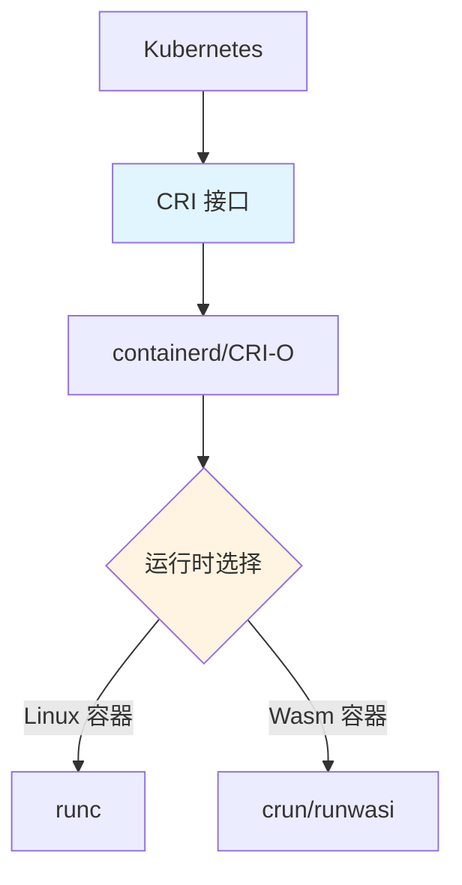

# 04. 编排与运行时集成：CRI 与 RuntimeClass

## 📑 目录

- [📑 目录](#-目录)
- [04.1 文档定位](#041-文档定位)
- [04.2 CRI：容器运行时接口](#042-cri容器运行时接口)
  - [04.2.1 CRI 架构](#0421-cri-架构)
  - [04.2.2 CRI 接口设计](#0422-cri-接口设计)
  - [04.2.3 CRI 论证](#0423-cri-论证)
- [04.3 RuntimeClass：运行时选择](#043-runtimeclass运行时选择)
  - [04.3.1 RuntimeClass 概念](#0431-runtimeclass-概念)
  - [04.3.2 RuntimeClass 示例](#0432-runtimeclass-示例)
  - [04.3.3 RuntimeClass 论证](#0433-runtimeclass-论证)
- [04.4 运行时类型](#044-运行时类型)
  - [04.4.1 runc（Linux 容器）](#0441-runclinux-容器)
  - [04.4.2 crun（Wasm 容器）](#0442-crunwasm-容器)
  - [04.4.3 runwasi（Wasm Shim）](#0443-runwasiwasm-shim)
  - [04.4.4 运行时对比](#0444-运行时对比)
- [04.5 Pod 使用示例](#045-pod-使用示例)
  - [04.5.1 基本使用](#0451-基本使用)
  - [04.5.2 高级配置](#0452-高级配置)
- [04.6 技术场景分析](#046-技术场景分析)
  - [04.6.1 混合工作负载场景](#0461-混合工作负载场景)
  - [04.6.2 Wasm 优先场景](#0462-wasm-优先场景)
  - [04.6.3 边缘场景](#0463-边缘场景)
- [04.7 决策依据与思路](#047-决策依据与思路)
  - [04.7.1 运行时选择决策树](#0471-运行时选择决策树)
  - [04.7.2 场景适配决策树](#0472-场景适配决策树)
- [04.8 形式化总结](#048-形式化总结)
  - [04.8.1 CRI 模型形式化](#0481-cri-模型形式化)
  - [04.8.2 RuntimeClass 模型形式化](#0482-runtimeclass-模型形式化)
- [04.9 实际部署案例](#049-实际部署案例)
  - [04.9.1 案例 1：混合工作负载配置（Linux + Wasm）](#0491-案例-1混合工作负载配置linux--wasm)
  - [04.9.2 案例 2：K3s 配置 WasmEdge 运行时](#0492-案例-2k3s-配置-wasmedge-运行时)
  - [04.9.3 案例 3：节点标签和 RuntimeClass 调度](#0493-案例-3节点标签和-runtimeclass-调度)
- [04.10 故障排查](#0410-故障排查)
  - [04.10.1 常见问题](#04101-常见问题)
- [04.11 最佳实践](#0411-最佳实践)
  - [04.11.1 RuntimeClass 配置最佳实践](#04111-runtimeclass-配置最佳实践)
  - [04.11.2 多运行时管理最佳实践](#04112-多运行时管理最佳实践)
- [04.12 参考](#0412-参考)

---

## 04.1 文档定位

本文档深入解析 Kubernetes 编排与运行时集成，包括 CRI（Container Runtime
Interface）和 RuntimeClass 的技术原理、实现方式和最佳实践。

**文档结构**：

- **CRI**：容器运行时接口，连接 Kubernetes 和容器运行时
- **RuntimeClass**：运行时选择机制，按工作负载切换运行时
- **运行时类型**：runc、crun、runwasi 的技术原理和对比
- **技术场景**：混合工作负载、Wasm 优先、边缘场景
- **决策分析**：运行时选择、场景适配、性能优化

## 04.2 CRI：容器运行时接口

### 04.2.1 CRI 架构



**CRI 架构分析**：

1. **Kubernetes**：通过 CRI 接口与容器运行时交互
2. **containerd/CRI-O**：CRI 实现，管理容器生命周期
3. **运行时选择**：根据 Pod 配置选择运行时（runc/crun/runwasi）

### 04.2.2 CRI 接口设计

**核心接口**：

- **ImageService**：镜像管理（PullImage、ListImages、RemoveImage）
- **RuntimeService**：容器管理（CreateContainer、StartContainer、StopContainer）
- **Streaming**：日志和 exec 流（GetLogs、ExecSync）

**CRI 接口论证**：

- **标准化**：统一的接口规范，支持多种运行时
- **解耦**：Kubernetes 与具体运行时解耦
- **可扩展**：可以添加新的运行时支持

### 04.2.3 CRI 论证

**为什么需要 CRI？**

**决策依据**：

- ✅ 标准化：统一的接口规范，支持多种运行时 [^cri-spec]
- ✅ 解耦：Kubernetes 与具体运行时解耦
- ✅ 可扩展：可以添加新的运行时支持（如 runc/crun/runwasi）

**决策思路**：

```yaml
CRI 设计:
  接口: CRI（Container Runtime Interface）
  实现: containerd/CRI-O
  运行时:
    - runc: Linux 容器
    - crun: Wasm 容器（通过 OCI 注释）
    - runwasi: Wasm 容器（通过 shim）
  优势: 标准化、解耦、可扩展
```

## 04.3 RuntimeClass：运行时选择

### 04.3.1 RuntimeClass 概念

**定义**：RuntimeClass 是 Kubernetes 的运行时选择机制，允许按工作负载切换不同的
容器运行时。

**核心机制**：

- **handler**：指定运行时处理器（runc/crun/runwasi）
- **Pod 选择**：通过 `runtimeClassName` 指定运行时类
- **调度策略**：可以配置调度约束和容忍度

### 04.3.2 RuntimeClass 示例

**crun-wasm RuntimeClass**：

```yaml
apiVersion: node.k8s.io/v1
kind: RuntimeClass
metadata:
  name: crun-wasm
handler: crun
scheduling:
  nodeSelector:
    wasm-runtime: enabled
  tolerations:
    - key: wasm-workload
      operator: Equal
      value: "true"
      effect: NoSchedule
```

**runwasi RuntimeClass**：

```yaml
apiVersion: node.k8s.io/v1
kind: RuntimeClass
metadata:
  name: runwasi-wasm
handler: wasm
scheduling:
  nodeSelector:
    wasm-runtime: enabled
```

### 04.3.3 RuntimeClass 论证

**为什么需要 RuntimeClass？**

**决策依据**：

- ✅ 运行时选择：按工作负载切换运行时
- ✅ 调度策略：配置调度约束和容忍度
- ✅ 资源优化：针对不同运行时优化资源使用

**决策思路**：

```yaml
RuntimeClass 设计:
  机制: runtimeClassName 选择运行时类
  优势:
    - 按工作负载切换运行时
    - 配置调度策略
    - 优化资源使用
  应用:
    - Linux 容器: 默认 runc
    - Wasm 容器: crun-wasm or runwasi-wasm
```

## 04.4 运行时类型

### 04.4.1 runc（Linux 容器）

**定位**：标准 Linux 容器运行时，实现 OCI Runtime Spec。

**技术特点**：

- **OCI 标准**：完全实现 OCI Runtime Spec
- **Linux 原生**：基于 Linux namespaces 和 cgroups
- **成熟稳定**：生产环境广泛使用

**runc 论证**：

- **OCI 标准**：完全实现 OCI Runtime Spec，兼容性好
- **Linux 原生**：基于 Linux namespaces 和 cgroups，性能好
- **成熟稳定**：生产环境广泛使用，稳定性高

### 04.4.2 crun（Wasm 容器）

**定位**：支持 Wasm 的容器运行时，通过 OCI 注释识别 Wasm 模块。

**技术特点**：

- **Wasm 支持**：通过 OCI 注释 `module.wasm.image/variant` 识别 Wasm 模块
- **自动识别**：crun ≥ 1.8.5 支持自动识别 Wasm 模块
- **零改造**：无需修改 Pod YAML 结构

**crun 论证**：

- **Wasm 支持**：通过 OCI 注释识别 Wasm 模块，无需 rootfs
- **自动识别**：crun ≥ 1.8.5 支持自动识别，零配置
- **零改造**：无需修改 Pod YAML，兼容性好

### 04.4.3 runwasi（Wasm Shim）

**定位**：containerd shim for Wasm，专门为 Wasm 设计的 shim。

**技术特点**：

- **原生集成**：直接集成到 containerd
- **统一管理**：与 runc 并存，统一管理
- **边缘支持**：适合边缘场景部署

**runwasi 论证**：

- **原生集成**：直接集成到 containerd，无需额外配置
- **统一管理**：与 runc 并存，统一管理容器和 Wasm
- **边缘支持**：适合边缘场景，资源占用低

### 04.4.4 运行时对比

| 运行时      | 定位       | 技术特点             | 适用场景        |
| ----------- | ---------- | -------------------- | --------------- |
| **runc**    | Linux 容器 | OCI 标准、Linux 原生 | 传统 Linux 容器 |
| **crun**    | Wasm 容器  | OCI 注释、自动识别   | 生产 K8s/K3s    |
| **runwasi** | Wasm Shim  | 原生集成、统一管理   | 最新 K8s、边缘  |

**运行时对比论证**：

- **runc**：传统 Linux 容器，成熟稳定，适合传统工作负载
- **crun**：Wasm 容器，自动识别，适合生产环境
- **runwasi**：Wasm Shim，原生集成，适合最新 K8s 和边缘场景

## 04.5 Pod 使用示例

### 04.5.1 基本使用

**Linux 容器 Pod**：

```yaml
apiVersion: v1
kind: Pod
metadata:
  name: linux-app
spec:
  containers:
    - name: app
      image: nginx:latest
  # 默认使用 runc
```

**Wasm 容器 Pod（crun）**：

```yaml
apiVersion: v1
kind: Pod
metadata:
  name: wasm-app
  annotations:
    module.wasm.image/variant: compat-smart
spec:
  runtimeClassName: crun-wasm
  containers:
    - name: app
      image: yourhub/app-wasm:v1
      command: ["app.wasm"]
```

**Wasm 容器 Pod（runwasi）**：

```yaml
apiVersion: v1
kind: Pod
metadata:
  name: wasm-app
spec:
  runtimeClassName: runwasi-wasm
  containers:
    - name: app
      image: yourhub/app-wasm:v1
      command: ["app.wasm"]
```

### 04.5.2 高级配置

**调度约束**：

```yaml
apiVersion: v1
kind: Pod
metadata:
  name: wasm-app
spec:
  runtimeClassName: crun-wasm
  nodeSelector:
    wasm-runtime: enabled
  tolerations:
    - key: wasm-workload
      operator: Equal
      value: "true"
      effect: NoSchedule
  containers:
    - name: app
      image: yourhub/app-wasm:v1
```

## 04.6 技术场景分析

### 04.6.1 混合工作负载场景

**场景描述**：集群同时运行 Linux 容器和 Wasm 容器

**架构挑战**：

1. **运行时选择**：需要按工作负载选择运行时
2. **节点标签**：需要为节点打标签，区分运行时支持
3. **调度策略**：需要配置调度约束和容忍度

**架构决策**：

```yaml
混合工作负载配置:
  RuntimeClass:
    - runc: Linux 容器（默认）
    - crun-wasm: Wasm 容器
  Node Label:
    - wasm-runtime: enabled（Wasm 节点）
    - linux-runtime: enabled（Linux 节点）
  调度策略:
    - Wasm Pod → wasm-runtime 节点
    - Linux Pod → linux-runtime 节点
```

**决策依据**：

- ✅ 运行时隔离：Linux 容器和 Wasm 容器使用不同运行时
- ✅ 节点标签：通过节点标签区分运行时支持
- ✅ 调度策略：通过调度约束确保 Pod 调度到正确节点

### 04.6.2 Wasm 优先场景

**场景描述**：集群优先使用 Wasm 容器，仅必要时使用 Linux 容器

**架构挑战**：

1. **默认运行时**：需要将 Wasm 设为默认运行时
2. **兼容性**：需要确保 Linux 容器仍然可以运行
3. **性能优化**：需要优化 Wasm 容器性能

**架构决策**：

```yaml
Wasm 优先配置:
  默认 RuntimeClass: crun-wasm
  Linux 容器: 显式指定 runtimeClassName: runc
  节点配置:
    - 所有节点安装 WasmEdge 和 crun
    - 节点标签: wasm-runtime: enabled
  调度策略:
    - 默认调度到 Wasm 节点
    - Linux Pod 显式指定节点
```

**决策依据**：

- ✅ 性能优先：Wasm 容器启动快、体积小、资源占用低
- ✅ 兼容性：Linux 容器仍然可以运行
- ✅ 灵活性：可以按工作负载选择运行时

### 04.6.3 边缘场景

**场景描述**：边缘节点资源受限，优先使用 Wasm 容器

**架构挑战**：

1. **资源受限**：边缘节点内存和 CPU 有限
2. **网络不稳定**：边缘节点经常掉线
3. **存储受限**：边缘节点存储空间有限

**架构决策**：

```yaml
边缘场景配置:
  默认 RuntimeClass: crun-wasm 或 runwasi-wasm
  节点配置:
    - 所有节点安装 WasmEdge 和 crun/runwasi
    - 节点标签: edge: enabled, wasm-runtime: enabled
  资源限制:
    - Wasm Pod: memory: 10Mi, cpu: 50m
    - Linux Pod: memory: 100Mi, cpu: 200m
```

**决策依据**：

- ✅ 资源优化：Wasm 容器资源占用低，适合边缘节点
- ✅ 启动速度：Wasm 容器启动快，适合边缘场景
- ✅ 存储优化：Wasm 镜像体积小，适合存储受限环境

## 04.7 决策依据与思路

### 04.7.1 运行时选择决策树

```yaml
运行时选择决策:
  if 传统 Linux 容器: 选择 runc（默认）
  elif Wasm 容器 and 生产环境: 选择 crun（成熟、推荐）
  elif Wasm 容器 and 最新 K8s or 边缘: 选择 runwasi（原生集成）
  else: 选择 runc（默认）
```

### 04.7.2 场景适配决策树

```yaml
场景适配决策:
  if 混合工作负载: 配置多个 RuntimeClass，通过节点标签区分
  elif Wasm 优先: 设置 Wasm 为默认 RuntimeClass
  elif 边缘场景: 优先使用 Wasm RuntimeClass
  else: 使用默认 runc RuntimeClass
```

## 04.8 形式化总结

### 04.8.1 CRI 模型形式化

设 CRI 为 $C = \{I, R, S\}$，其中：

- $I$ = ImageService（镜像服务）
- $R$ = RuntimeService（运行时服务）
- $S$ = Streaming（流服务）

**CRI 接口**：
$$C = \{\text{ImageService}, \text{RuntimeService}, \text{Streaming}\}$$

### 04.8.2 RuntimeClass 模型形式化

**RuntimeClass 选择函数**：

$$
RC(P, N) = \begin{cases}
\text{runc} & \text{if } P.\text{runtimeClassName} = \text{null} \lor P.\text{runtimeClassName} = \text{runc} \\
\text{crun} & \text{if } P.\text{runtimeClassName} = \text{crun-wasm} \\
\text{runwasi} & \text{if } P.\text{runtimeClassName} = \text{runwasi-wasm}
\end{cases}
$$

其中 $P$ 是 Pod，$N$ 是节点。

## 04.9 实际部署案例

### 04.9.1 案例 1：混合工作负载配置（Linux + Wasm）

**场景**：集群中同时运行传统 Linux 容器和 Wasm 容器

**配置步骤**：

```bash
# 1. 配置 containerd 支持多个运行时
cat > /etc/containerd/config.toml <<EOF
[plugins."io.containerd.grpc.v1.cri".containerd.runtimes]
  [plugins."io.containerd.grpc.v1.cri".containerd.runtimes.runc]
    runtime_type = "io.containerd.runc.v2"
  [plugins."io.containerd.grpc.v1.cri".containerd.runtimes.crun-wasm]
    runtime_type = "io.containerd.runc.v2"
    [plugins."io.containerd.grpc.v1.cri".containerd.runtimes.crun-wasm.options]
      BinaryName = "crun"
      Root = "/run/containerd/crun-wasm"
EOF

# 2. 创建 RuntimeClass
kubectl apply -f - <<EOF
apiVersion: node.k8s.io/v1
kind: RuntimeClass
metadata:
  name: crun-wasm
handler: crun-wasm
EOF

# 3. 重启 containerd
systemctl restart containerd
```

**使用示例**：

```yaml
# Linux 容器 Pod（默认）
apiVersion: v1
kind: Pod
metadata:
  name: linux-pod
spec:
  containers:
    - name: app
      image: nginx:latest

---
# Wasm 容器 Pod（指定 RuntimeClass）
apiVersion: v1
kind: Pod
metadata:
  name: wasm-pod
spec:
  runtimeClassName: crun-wasm
  containers:
    - name: app
      image: wasm-app:latest
```

### 04.9.2 案例 2：K3s 配置 WasmEdge 运行时

**场景**：在 K3s 集群中配置 WasmEdge 运行时

**配置步骤**：

```bash
# 1. 安装 crun（支持 Wasm）
curl -fsSL https://github.com/containers/crun/releases/download/1.9/crun-1.9-linux-amd64 -o /usr/local/bin/crun
chmod +x /usr/local/bin/crun

# 2. 安装 WasmEdge
curl -sSf https://raw.githubusercontent.com/WasmEdge/WasmEdge/master/utils/install.sh | bash

# 3. 配置 K3s 使用 crun（支持 Wasm）
cat > /etc/systemd/system/k3s.service.d/override.conf <<EOF
[Service]
ExecStart=
ExecStart=/usr/local/bin/k3s \
  server \
  --container-runtime-endpoint=unix:///run/containerd/containerd.sock \
  --runtime-class=crun-wasm
EOF

# 4. 重启 K3s
systemctl daemon-reload
systemctl restart k3s
```

**创建 RuntimeClass**：

```yaml
apiVersion: node.k8s.io/v1
kind: RuntimeClass
metadata:
  name: crun-wasm
handler: crun-wasm
scheduling:
  nodeSelector:
    kubernetes.io/arch: amd64
```

### 04.9.3 案例 3：节点标签和 RuntimeClass 调度

**场景**：根据节点标签选择不同的运行时

**配置步骤**：

```bash
# 1. 给节点打标签
kubectl label node node1 runtime=wasm
kubectl label node node2 runtime=linux

# 2. 创建 Wasm RuntimeClass（只调度到 wasm 节点）
kubectl apply -f - <<EOF
apiVersion: node.k8s.io/v1
kind: RuntimeClass
metadata:
  name: crun-wasm
handler: crun-wasm
scheduling:
  nodeSelector:
    runtime: wasm
EOF

# 3. 创建 Linux RuntimeClass（只调度到 linux 节点）
kubectl apply -f - <<EOF
apiVersion: node.k8s.io/v1
kind: RuntimeClass
metadata:
  name: runc-linux
handler: runc
scheduling:
  nodeSelector:
    runtime: linux
EOF
```

## 04.10 故障排查

### 04.10.1 常见问题

**问题 1：RuntimeClass 未找到**:

```bash
# 检查 RuntimeClass 是否存在
kubectl get runtimeclass

# 检查节点是否支持该运行时
kubectl describe node <node-name> | grep runtime

# 检查 containerd 配置
cat /etc/containerd/config.toml | grep -A 10 runtimes
```

**问题 2：Wasm Pod 启动失败**:

```bash
# 检查 crun 是否安装
which crun
crun --version

# 检查 WasmEdge 是否安装
which wasmedge
wasmedge --version

# 检查 Pod 事件
kubectl describe pod <pod-name> | grep -A 10 Events

# 检查 containerd 日志
journalctl -u containerd -f
```

**问题 3：运行时切换失败**:

```bash
# 检查 containerd 配置
cat /etc/containerd/config.toml

# 检查 RuntimeClass 配置
kubectl get runtimeclass -o yaml

# 重启 containerd
systemctl restart containerd

# 验证运行时
crictl info | grep runtime
```

## 04.11 最佳实践

### 04.11.1 RuntimeClass 配置最佳实践

**配置建议**：

- ✅ 生产环境使用明确的 RuntimeClass 名称
- ✅ 为不同运行时设置节点选择器
- ✅ 定期检查运行时配置
- ✅ 文档化运行时选择策略

**性能优化**：

- ✅ Wasm 容器使用 crun 运行时（性能更好）
- ✅ 传统容器使用 runc 运行时（兼容性好）
- ✅ 根据工作负载选择合适的运行时

### 04.11.2 多运行时管理最佳实践

**管理策略**：

- ✅ 使用节点标签区分运行时
- ✅ 使用 RuntimeClass 明确指定运行时
- ✅ 监控不同运行时的资源使用
- ✅ 定期评估运行时的性能

## 04.12 参考

**关联文档**：

- **[28. 架构框架](../28-architecture-framework/architecture-framework.md)** -
  多维度架构体系与技术规范（技术架构、概念架构、数据架构、业务架构、软件架构、应
  用架构、场景架构）
- **[05. 全局架构设计](../../COGNITIVE/05-architecture-design/architecture-design.md)** -
  技术组合和架构决策
- [09. 矩阵视角](../../COGNITIVE/09-matrix-perspective/README.md) - 运行时切换
  （R）概念矩阵分析

**外部参考**：

[^cri-spec]:
    [Container Runtime Interface](https://github.com/kubernetes/cri-api)

> 完整参考列表见 [REFERENCES.md](../REFERENCES.md)

---

**最后更新**：2025-11-06 **维护者**：项目团队
