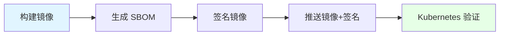
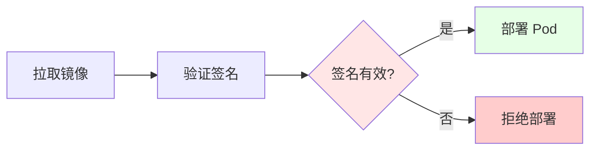

# 05. OCI 与供应链安全：镜像签名与 SBOM

## 目录

- [目录](#目录)
- [05.1 文档定位](#051-文档定位)
- [05.2 OCI Artifact](#052-oci-artifact)
  - [05.2.1 OCI Artifact 概念](#0521-oci-artifact-概念)
  - [05.2.2 OCI Artifact 类型](#0522-oci-artifact-类型)
  - [05.2.3 OCI Artifact 论证](#0523-oci-artifact-论证)
- [05.3 镜像签名](#053-镜像签名)
  - [05.3.1 签名概念](#0531-签名概念)
  - [05.3.2 Cosign 签名](#0532-cosign-签名)
  - [05.3.3 签名验证](#0533-签名验证)
  - [05.3.4 签名论证](#0534-签名论证)
- [05.4 SBOM（软件物料清单）](#054-sbom软件物料清单)
  - [05.4.1 SBOM 概念](#0541-sbom-概念)
  - [05.4.2 SBOM 格式](#0542-sbom-格式)
  - [05.4.3 SBOM 生成](#0543-sbom-生成)
  - [05.4.4 SBOM 论证](#0544-sbom-论证)
- [05.5 构建安全](#055-构建安全)
  - [05.5.1 BuildKit](#0551-buildkit)
  - [05.5.2 多阶段构建](#0552-多阶段构建)
  - [05.5.3 Wasm-native 构建](#0553-wasm-native-构建)
  - [05.5.4 构建论证](#0554-构建论证)
- [05.6 安全流程](#056-安全流程)
  - [05.6.1 签名流程](#0561-签名流程)
  - [05.6.2 验证流程](#0562-验证流程)
  - [05.6.3 安全场景与决策](#0563-安全场景与决策)
- [05.7 技术场景分析](#057-技术场景分析)
  - [05.7.1 生产环境场景](#0571-生产环境场景)
  - [05.7.2 合规场景](#0572-合规场景)
  - [05.7.3 供应链场景](#0573-供应链场景)
- [05.8 决策依据与思路](#058-决策依据与思路)
  - [05.8.1 签名策略决策树](#0581-签名策略决策树)
  - [05.8.2 SBOM 策略决策树](#0582-sbom-策略决策树)
- [05.9 形式化总结](#059-形式化总结)
  - [05.9.1 签名模型形式化](#0591-签名模型形式化)
  - [05.9.2 SBOM 模型形式化](#0592-sbom-模型形式化)
- [05.10 参考](#0510-参考)

---

## 05.1 文档定位

本文档深入解析 OCI 与供应链安全，包括镜像签名、SBOM（Software Bill of
Materials）和构建安全的技术原理、实现方式和最佳实践。

**文档结构**：

- **OCI Artifact**：OCI 标准化存储，支持镜像、Wasm 模块等
- **镜像签名**：使用 Cosign 进行镜像签名和验证
- **SBOM**：软件物料清单，记录软件组件和依赖
- **构建安全**：BuildKit、多阶段构建、Wasm-native 构建
- **技术场景**：生产环境、合规、供应链
- **决策分析**：签名策略、验证策略、构建策略

## 05.2 OCI Artifact

### 05.2.1 OCI Artifact 概念

**定义**：OCI Artifact 是基于 OCI Image Spec 的标准化存储格式，支持镜像、Wasm 模
块、Helm Chart 等。

**核心特点**：

- **标准化**：基于 OCI Image Spec，统一存储格式
- **可扩展**：支持多种 Artifact 类型（镜像、Wasm、Helm 等）
- **可发现**：支持 Artifact 发现和查询

### 05.2.2 OCI Artifact 类型

| Artifact 类型  | 说明             | 使用场景            |
| -------------- | ---------------- | ------------------- |
| **镜像**       | Docker/OCI 镜像  | 容器镜像存储        |
| **Wasm 模块**  | WebAssembly 模块 | Wasm 应用存储       |
| **Helm Chart** | Helm 包          | Kubernetes 应用部署 |
| **SBOM**       | 软件物料清单     | 供应链安全          |
| **签名**       | 镜像签名         | 镜像验证            |

**OCI Artifact 论证**：

- **标准化**：统一存储格式，支持多种 Artifact 类型
- **可扩展**：可以扩展新的 Artifact 类型
- **可发现**：支持 Artifact 发现和查询

### 05.2.3 OCI Artifact 论证

**为什么需要 OCI Artifact？**

**决策依据**：

- ✅ 标准化：统一的存储格式，支持多种 Artifact 类型 [oci-artifact]
- ✅ 可扩展：可以扩展新的 Artifact 类型（如 Wasm 模块）
- ✅ 可发现：支持 Artifact 发现和查询

**决策思路**：

```yaml
OCI Artifact 设计:
  格式: 基于 OCI Image Spec
  类型:
    - 镜像: Docker/OCI 镜像
    - Wasm 模块: WebAssembly 模块
    - Helm Chart: Helm 包
    - SBOM: 软件物料清单
    - 签名: 镜像签名
  优势: 标准化、可扩展、可发现
```

## 05.3 镜像签名

### 05.3.1 签名概念

**定义**：镜像签名是对镜像进行数字签名，用于验证镜像的完整性和来源。

**核心机制**：

- **私钥签名**：使用私钥对镜像进行签名
- **公钥验证**：使用公钥验证镜像签名
- **密钥管理**：使用 Sigstore 等密钥管理服务

### 05.3.2 Cosign 签名

**Cosign 简介**：Cosign 是 Sigstore 项目的镜像签名工具，支持 OCI 镜像签名。

**签名示例**：

```bash
# 生成密钥对
cosign generate-key-pair

# 签名镜像
cosign sign --key cosign.key yourhub/app:v1

# 推送签名到 OCI 仓库
cosign sign --key cosign.key yourhub/app:v1 --registry yourhub
```

**Cosign 论证**：

- **标准化**：基于 OCI Artifact，标准签名格式
- **密钥管理**：支持 Sigstore 密钥管理
- **易用性**：命令行工具，易于使用

### 05.3.3 签名验证

**验证示例**：

```bash
# 验证镜像签名
cosign verify --key cosign.pub yourhub/app:v1

# Kubernetes 准入控制验证
# 使用 Kyverno/Gatekeeper 策略验证镜像签名
```

**验证流程**：

1. **拉取镜像**：从镜像仓库拉取镜像
2. **验证签名**：使用公钥验证镜像签名
3. **准入控制**：通过 Kubernetes 准入控制验证签名

### 05.3.4 签名论证

**为什么需要镜像签名？**

**决策依据**：

- ✅ 完整性验证：验证镜像未被篡改
- ✅ 来源验证：验证镜像来源可信
- ✅ 合规要求：满足合规和安全要求

**决策思路**：

```yaml
镜像签名策略:
  工具: Cosign（Sigstore 项目）
  签名: 使用私钥签名镜像
  验证: 使用公钥验证签名
  集成: Kubernetes 准入控制（Kyverno/Gatekeeper）
  优势: 完整性验证、来源验证、合规要求
```

## 05.4 SBOM（软件物料清单）

### 05.4.1 SBOM 概念

**定义**：SBOM（Software Bill of Materials）是软件物料清单，记录软件组件和依赖关
系。

**核心内容**：

- **组件清单**：软件组件的完整清单
- **依赖关系**：组件之间的依赖关系
- **版本信息**：组件的版本信息
- **许可证信息**：组件的许可证信息

### 05.4.2 SBOM 格式

**常见格式**：

- **SPDX**：Software Package Data Exchange，标准化格式
- **CycloneDX**：OWASP 项目，轻量级格式
- **SWID**：Software Identification Tagging，ISO 标准

**格式对比**： | 格式 | 定位 | 特点 | |------|------|------| | **SPDX** | 标准化
格式 | 功能完整，格式复杂 | | **CycloneDX** | 轻量级格式 | 简单易用，格式简洁 |
| **SWID** | ISO 标准 | 官方标准，使用较少 |

### 05.4.3 SBOM 生成

**生成工具**：

- **Syft**：Anchore 项目，支持多种格式
- **Trivy**：Aqua Security 项目，支持漏洞扫描和 SBOM 生成
- **Docker Scout**：Docker 官方工具

**生成示例**：

```bash
# 使用 Syft 生成 SBOM
syft yourhub/app:v1 -o spdx-json > sbom.json

# 使用 Trivy 生成 SBOM
trivy image --format cyclonedx yourhub/app:v1 > sbom.json
```

### 05.4.4 SBOM 论证

**为什么需要 SBOM？**

**决策依据**：

- ✅ 供应链安全：记录软件组件和依赖，便于漏洞追踪
- ✅ 合规要求：满足合规和安全要求（如 EO 14028）
- ✅ 风险管理：识别和管理软件风险

**决策思路**：

```yaml
SBOM 策略:
  格式: SPDX 或 CycloneDX
  工具: Syft 或 Trivy
  生成: 构建时自动生成
  存储: OCI Artifact 或独立存储
  优势: 供应链安全、合规要求、风险管理
```

## 05.5 构建安全

### 05.5.1 BuildKit

**BuildKit 简介**：BuildKit 是 Docker 的下一代构建引擎，支持并行构建、缓存优化等
功能。

**BuildKit 特点**：

- **并行构建**：支持多阶段并行构建
- **缓存优化**：智能缓存策略，加速构建
- **安全特性**：支持密钥管理、构建时安全扫描

**BuildKit 论证**：

- **性能优化**：并行构建和缓存优化，构建速度快
- **安全特性**：支持密钥管理和安全扫描
- **可扩展性**：支持自定义构建器和扩展

### 05.5.2 多阶段构建

**多阶段构建**：在 Dockerfile 中使用多个 FROM 指令，分离构建和运行环境。

**多阶段构建示例**：

```dockerfile
# 构建阶段
FROM golang:1.21-alpine AS builder
WORKDIR /build
COPY . .
RUN go build -o app .

# 运行阶段
FROM alpine:latest
RUN apk --no-cache add ca-certificates
WORKDIR /app
COPY --from=builder /build/app .
CMD ["./app"]
```

**多阶段构建论证**：

- **体积优化**：只复制必要文件，减小最终镜像体积
- **安全优化**：运行阶段不包含构建工具，减小攻击面
- **构建效率**：分离构建和运行环境，提高构建效率

### 05.5.3 Wasm-native 构建

**Wasm-native 构建**：直接编译到 Wasm 目标，无需容器运行时。

**Wasm-native 构建示例**：

```bash
# Rust Wasm 构建
rustup target add wasm32-wasi
cargo build --release --target wasm32-wasi

# Go Wasm 构建（使用 TinyGo）
tinygo build -target wasi -o app.wasm main.go
```

**Wasm-native 构建论证**：

- **性能优化**：直接编译到 Wasm，无需容器运行时
- **体积优化**：Wasm 模块体积小，< 1MB
- **跨平台**：Wasm 跨平台，无需平台特定编译

### 05.5.4 构建论证

**为什么需要构建安全？**

**决策依据**：

- ✅ 供应链安全：确保构建过程安全
- ✅ 镜像安全：确保构建的镜像安全
- ✅ 合规要求：满足合规和安全要求

**决策思路**：

```yaml
构建安全策略:
  工具: BuildKit（并行构建、缓存优化）
  构建: 多阶段构建（分离构建和运行环境）
  Wasm: Wasm-native 构建（直接编译到 Wasm）
  扫描: 构建时安全扫描（Trivy/Docker Scout）
  签名: 构建后自动签名（Cosign）
  优势: 供应链安全、镜像安全、合规要求
```

## 05.6 安全流程

### 05.6.1 签名流程



**签名流程论证**：

1. **构建镜像**：使用 BuildKit 或多阶段构建
2. **生成 SBOM**：使用 Syft 或 Trivy 生成 SBOM
3. **签名镜像**：使用 Cosign 签名镜像和 SBOM
4. **推送镜像**：推送镜像和签名到 OCI 仓库
5. **Kubernetes 验证**：通过准入控制验证签名

### 05.6.2 验证流程



**验证流程论证**：

1. **拉取镜像**：从镜像仓库拉取镜像
2. **验证签名**：使用公钥验证镜像签名
3. **准入控制**：通过 Kubernetes 准入控制验证签名
4. **部署决策**：签名有效则部署，无效则拒绝

### 05.6.3 安全场景与决策

**场景 1：生产环境**:

**决策依据**：

- ✅ 必须签名所有镜像
- ✅ 必须生成 SBOM
- ✅ 必须验证签名

**决策思路**：

```yaml
生产环境安全策略:
  签名: 必须签名所有镜像（Cosign）
  SBOM: 必须生成 SBOM（Syft/Trivy）
  验证: 必须验证签名（Kubernetes 准入控制）
  优势: 完整性验证、来源验证、合规要求
```

**场景 2：合规场景**:

**决策依据**：

- ✅ 满足合规要求（如 EO 14028）
- ✅ 完整的供应链追踪
- ✅ 安全审计能力

**决策思路**：

```yaml
合规场景安全策略:
  签名: 必须签名所有镜像（Cosign）
  SBOM: 必须生成 SBOM（SPDX 格式）
  验证: 必须验证签名（Kubernetes 准入控制）
  审计: 完整的签名和 SBOM 记录
  优势: 合规要求、供应链追踪、安全审计
```

## 05.7 技术场景分析

### 05.7.1 生产环境场景

**场景描述**：生产环境需要安全、稳定、可追溯

**架构挑战**：

1. **镜像安全**：确保镜像未被篡改
2. **来源验证**：验证镜像来源可信
3. **供应链追踪**：追踪软件组件和依赖

**架构决策**：

```yaml
生产环境安全配置:
  构建: BuildKit + 多阶段构建
  签名: Cosign（Sigstore）
  SBOM: Syft/Trivy（SPDX 格式）
  验证: Kubernetes 准入控制（Kyverno/Gatekeeper）
  优势: 完整性验证、来源验证、供应链追踪
```

**决策依据**：

- ✅ 完整性验证：签名确保镜像未被篡改
- ✅ 来源验证：签名验证镜像来源可信
- ✅ 供应链追踪：SBOM 记录组件和依赖

### 05.7.2 合规场景

**场景描述**：需要满足合规要求（如 EO 14028）

**架构挑战**：

1. **合规要求**：满足法规要求
2. **供应链追踪**：完整的供应链追踪
3. **安全审计**：安全审计能力

**架构决策**：

```yaml
合规场景安全配置:
  签名: Cosign（Sigstore）
  SBOM: Syft/Trivy（SPDX 格式，标准化）
  验证: Kubernetes 准入控制（强制验证）
  审计: 完整的签名和 SBOM 记录
  优势: 合规要求、供应链追踪、安全审计
```

**决策依据**：

- ✅ 合规要求：满足法规要求（如 EO 14028）
- ✅ 供应链追踪：SBOM 提供完整的供应链追踪
- ✅ 安全审计：签名和 SBOM 记录提供审计能力

### 05.7.3 供应链场景

**场景描述**：需要管理和追踪软件供应链

**架构挑战**：

1. **组件追踪**：追踪软件组件和依赖
2. **漏洞管理**：识别和管理软件漏洞
3. **风险分析**：分析和管理软件风险

**架构决策**：

```yaml
供应链场景安全配置:
  SBOM: Syft/Trivy（生成组件清单）
  扫描: Trivy/Docker Scout（漏洞扫描）
  分析: 基于 SBOM 进行风险分析
  优势: 组件追踪、漏洞管理、风险分析
```

**决策依据**：

- ✅ 组件追踪：SBOM 记录组件和依赖
- ✅ 漏洞管理：结合 SBOM 和漏洞扫描
- ✅ 风险分析：基于 SBOM 进行风险分析

## 05.8 决策依据与思路

### 05.8.1 签名策略决策树

```yaml
签名策略决策:
  if 生产环境: 必须签名所有镜像（Cosign）
  elif 合规场景: 必须签名所有镜像 + SBOM（Cosign）
  elif 开发环境: 可选签名（可选）
  else: 不签名（不推荐）
```

### 05.8.2 SBOM 策略决策树

```yaml
SBOM 策略决策:
  if 生产环境 or 合规场景: 必须生成 SBOM（SPDX 格式）
  elif 供应链场景: 必须生成 SBOM（Syft/Trivy）
  else: 可选生成 SBOM（推荐）
```

## 05.9 形式化总结

### 05.9.1 签名模型形式化

**签名函数**： $$S(M, K_p) = \text{sign}(M, K_p)$$

其中：

- $M$ = 镜像（Image）
- $K_p$ = 私钥（Private Key）
- $\text{sign}$ = 签名函数

**验证函数**：

$$
V(M, S, K_u) = \begin{cases}
\text{true} & \text{if } \text{verify}(M, S, K_u) = \text{success} \\
\text{false} & \text{otherwise}
\end{cases}
$$

其中：

- $S$ = 签名（Signature）
- $K_u$ = 公钥（Public Key）
- $\text{verify}$ = 验证函数

### 05.9.2 SBOM 模型形式化

**SBOM 生成函数**： $$SBOM(I) = \{C_1, C_2, ..., C_n, D_1, D_2, ..., D_m\}$$

其中：

- $I$ = 镜像（Image）
- $C_i$ = 组件（Component）
- $D_j$ = 依赖（Dependency）

## 05.10 参考

- [OCI Artifact](https://github.com/opencontainers/artifacts)

> 完整参考列表见 [REFERENCES.md](../REFERENCES.md)
