# 05. OCI 与供应链安全：镜像签名与 SBOM

## 📑 目录

- [📑 目录](#-目录)
- [05.1 文档定位](#051-文档定位)
- [05.2 OCI Artifact](#052-oci-artifact)
  - [05.2.1 OCI Artifact 概念](#0521-oci-artifact-概念)
  - [05.2.2 OCI Artifact 类型](#0522-oci-artifact-类型)
  - [05.2.3 OCI Artifact 论证](#0523-oci-artifact-论证)
- [05.3 镜像签名](#053-镜像签名)
  - [05.3.1 签名概念](#0531-签名概念)
  - [05.3.2 Cosign 签名](#0532-cosign-签名)
  - [05.3.3 签名验证](#0533-签名验证)
  - [05.3.4 签名论证](#0534-签名论证)
- [05.4 SBOM（软件物料清单）](#054-sbom软件物料清单)
  - [05.4.1 SBOM 概念](#0541-sbom-概念)
  - [05.4.2 SBOM 格式](#0542-sbom-格式)
  - [05.4.3 SBOM 生成](#0543-sbom-生成)
  - [05.4.4 SBOM 论证](#0544-sbom-论证)
- [05.5 构建安全](#055-构建安全)
  - [05.5.1 BuildKit](#0551-buildkit)
  - [05.5.2 多阶段构建](#0552-多阶段构建)
  - [05.5.3 Wasm-native 构建](#0553-wasm-native-构建)
  - [05.5.4 构建论证](#0554-构建论证)
- [05.6 安全流程](#056-安全流程)
  - [05.6.1 签名流程](#0561-签名流程)
  - [05.6.2 验证流程](#0562-验证流程)
  - [05.6.3 安全场景与决策](#0563-安全场景与决策)
- [05.7 技术场景分析](#057-技术场景分析)
  - [05.7.1 生产环境场景](#0571-生产环境场景)
  - [05.7.2 合规场景](#0572-合规场景)
  - [05.7.3 供应链场景](#0573-供应链场景)
- [05.8 决策依据与思路](#058-决策依据与思路)
  - [05.8.1 签名策略决策树](#0581-签名策略决策树)
  - [05.8.2 SBOM 策略决策树](#0582-sbom-策略决策树)
- [05.9 形式化总结](#059-形式化总结)
  - [05.9.1 签名模型形式化](#0591-签名模型形式化)
  - [05.9.2 SBOM 模型形式化](#0592-sbom-模型形式化)
- [05.10 实际部署案例](#0510-实际部署案例)
  - [05.10.1 案例 1：CI/CD 流程中集成镜像签名和 SBOM](#05101-案例-1cicd-流程中集成镜像签名和-sbom)
  - [05.10.2 案例 2：Kubernetes 准入控制验证镜像签名](#05102-案例-2kubernetes-准入控制验证镜像签名)
  - [05.10.3 案例 3：SBOM 漏洞扫描和报告](#05103-案例-3sbom-漏洞扫描和报告)
- [05.11 最佳实践](#0511-最佳实践)
  - [05.11.1 镜像签名最佳实践](#05111-镜像签名最佳实践)
  - [05.11.2 SBOM 生成最佳实践](#05112-sbom-生成最佳实践)
  - [05.11.3 供应链安全最佳实践](#05113-供应链安全最佳实践)
- [05.12 参考](#0512-参考)
  - [05.12.1 2025 年最新更新（2025-11-06）](#05121-2025-年最新更新2025-11-06)
  - [05.12.2 隔离栈相关文档](#05122-隔离栈相关文档)
  - [05.12.3 OCI 和供应链相关文档](#05123-oci-和供应链相关文档)
  - [05.12.3 网络和存储相关文档](#05123-网络和存储相关文档)
  - [05.12.4 外部参考](#05124-外部参考)

---

## 05.1 文档定位

本文档深入解析 OCI 与供应链安全，包括镜像签名、SBOM（Software Bill of
Materials）和构建安全的技术原理、实现方式和最佳实践。

**文档结构**：

- **OCI Artifact**：OCI 标准化存储，支持镜像、Wasm 模块等
- **镜像签名**：使用 Cosign 进行镜像签名和验证
- **SBOM**：软件物料清单，记录软件组件和依赖
- **构建安全**：BuildKit、多阶段构建、Wasm-native 构建
- **技术场景**：生产环境、合规、供应链
- **决策分析**：签名策略、验证策略、构建策略

## 05.2 OCI Artifact

### 05.2.1 OCI Artifact 概念

**定义**：OCI Artifact 是基于 OCI Image Spec 的标准化存储格式，支持镜像、Wasm 模
块、Helm Chart 等。

**核心特点**：

- **标准化**：基于 OCI Image Spec，统一存储格式
- **可扩展**：支持多种 Artifact 类型（镜像、Wasm、Helm 等）
- **可发现**：支持 Artifact 发现和查询

### 05.2.2 OCI Artifact 类型

| Artifact 类型  | 说明             | 使用场景            |
| -------------- | ---------------- | ------------------- |
| **镜像**       | Docker/OCI 镜像  | 容器镜像存储        |
| **Wasm 模块**  | WebAssembly 模块 | Wasm 应用存储       |
| **Helm Chart** | Helm 包          | Kubernetes 应用部署 |
| **SBOM**       | 软件物料清单     | 供应链安全          |
| **签名**       | 镜像签名         | 镜像验证            |

**OCI Artifact 论证**：

- **标准化**：统一存储格式，支持多种 Artifact 类型
- **可扩展**：可以扩展新的 Artifact 类型
- **可发现**：支持 Artifact 发现和查询

### 05.2.3 OCI Artifact 论证

**为什么需要 OCI Artifact？**

**决策依据**：

- ✅ 标准化：统一的存储格式，支持多种 Artifact 类型 [oci-artifact]
- ✅ 可扩展：可以扩展新的 Artifact 类型（如 Wasm 模块）
- ✅ 可发现：支持 Artifact 发现和查询

**决策思路**：

```yaml
OCI Artifact 设计:
  格式: 基于 OCI Image Spec
  类型:
    - 镜像: Docker/OCI 镜像
    - Wasm 模块: WebAssembly 模块
    - Helm Chart: Helm 包
    - SBOM: 软件物料清单
    - 签名: 镜像签名
  优势: 标准化、可扩展、可发现
```

## 05.3 镜像签名

### 05.3.1 签名概念

**定义**：镜像签名是对镜像进行数字签名，用于验证镜像的完整性和来源。

**核心机制**：

- **私钥签名**：使用私钥对镜像进行签名
- **公钥验证**：使用公钥验证镜像签名
- **密钥管理**：使用 Sigstore 等密钥管理服务

### 05.3.2 Cosign 签名

**Cosign 简介**：Cosign 是 Sigstore 项目的镜像签名工具，支持 OCI 镜像签名。

**签名示例**：

```bash
# 生成密钥对
cosign generate-key-pair

# 签名镜像
cosign sign --key cosign.key yourhub/app:v1

# 推送签名到 OCI 仓库
cosign sign --key cosign.key yourhub/app:v1 --registry yourhub
```

**Cosign 论证**：

- **标准化**：基于 OCI Artifact，标准签名格式
- **密钥管理**：支持 Sigstore 密钥管理
- **易用性**：命令行工具，易于使用

### 05.3.3 签名验证

**验证示例**：

```bash
# 验证镜像签名
cosign verify --key cosign.pub yourhub/app:v1

# Kubernetes 准入控制验证
# 使用 Kyverno/Gatekeeper 策略验证镜像签名
```

**验证流程**：

1. **拉取镜像**：从镜像仓库拉取镜像
2. **验证签名**：使用公钥验证镜像签名
3. **准入控制**：通过 Kubernetes 准入控制验证签名

### 05.3.4 签名论证

**为什么需要镜像签名？**

**决策依据**：

- ✅ 完整性验证：验证镜像未被篡改
- ✅ 来源验证：验证镜像来源可信
- ✅ 合规要求：满足合规和安全要求

**决策思路**：

```yaml
镜像签名策略:
  工具: Cosign（Sigstore 项目）
  签名: 使用私钥签名镜像
  验证: 使用公钥验证签名
  集成: Kubernetes 准入控制（Kyverno/Gatekeeper）
  优势: 完整性验证、来源验证、合规要求
```

## 05.4 SBOM（软件物料清单）

### 05.4.1 SBOM 概念

**定义**：SBOM（Software Bill of Materials）是软件物料清单，记录软件组件和依赖关
系。

**核心内容**：

- **组件清单**：软件组件的完整清单
- **依赖关系**：组件之间的依赖关系
- **版本信息**：组件的版本信息
- **许可证信息**：组件的许可证信息

### 05.4.2 SBOM 格式

**常见格式**：

- **SPDX**：Software Package Data Exchange，标准化格式
- **CycloneDX**：OWASP 项目，轻量级格式
- **SWID**：Software Identification Tagging，ISO 标准

**格式对比**： | 格式 | 定位 | 特点 | |------|------|------| | **SPDX** | 标准化
格式 | 功能完整，格式复杂 | | **CycloneDX** | 轻量级格式 | 简单易用，格式简洁 |
| **SWID** | ISO 标准 | 官方标准，使用较少 |

### 05.4.3 SBOM 生成

**生成工具**：

- **Syft**：Anchore 项目，支持多种格式
- **Trivy**：Aqua Security 项目，支持漏洞扫描和 SBOM 生成
- **Docker Scout**：Docker 官方工具

**生成示例**：

```bash
# 使用 Syft 生成 SBOM
syft yourhub/app:v1 -o spdx-json > sbom.json

# 使用 Trivy 生成 SBOM
trivy image --format cyclonedx yourhub/app:v1 > sbom.json
```

### 05.4.4 SBOM 论证

**为什么需要 SBOM？**

**决策依据**：

- ✅ 供应链安全：记录软件组件和依赖，便于漏洞追踪
- ✅ 合规要求：满足合规和安全要求（如 EO 14028）
- ✅ 风险管理：识别和管理软件风险

**决策思路**：

```yaml
SBOM 策略:
  格式: SPDX 或 CycloneDX
  工具: Syft 或 Trivy
  生成: 构建时自动生成
  存储: OCI Artifact 或独立存储
  优势: 供应链安全、合规要求、风险管理
```

## 05.5 构建安全

### 05.5.1 BuildKit

**BuildKit 简介**：BuildKit 是 Docker 的下一代构建引擎，支持并行构建、缓存优化等
功能。

**BuildKit 特点**：

- **并行构建**：支持多阶段并行构建
- **缓存优化**：智能缓存策略，加速构建
- **安全特性**：支持密钥管理、构建时安全扫描

**BuildKit 论证**：

- **性能优化**：并行构建和缓存优化，构建速度快
- **安全特性**：支持密钥管理和安全扫描
- **可扩展性**：支持自定义构建器和扩展

### 05.5.2 多阶段构建

**多阶段构建**：在 Dockerfile 中使用多个 FROM 指令，分离构建和运行环境。

**多阶段构建示例**：

```dockerfile
# 构建阶段
FROM golang:1.21-alpine AS builder
WORKDIR /build
COPY . .
RUN go build -o app .

# 运行阶段
FROM alpine:latest
RUN apk --no-cache add ca-certificates
WORKDIR /app
COPY --from=builder /build/app .
CMD ["./app"]
```

**多阶段构建论证**：

- **体积优化**：只复制必要文件，减小最终镜像体积
- **安全优化**：运行阶段不包含构建工具，减小攻击面
- **构建效率**：分离构建和运行环境，提高构建效率

### 05.5.3 Wasm-native 构建

> **💡 隔离层次关联**：Wasm-native 构建直接编译到 L-4 沙盒化层的 WASM 格式，无需
> L-3 容器化层的容器运行时。详细的技术解析请参考：
>
> - **[29. 隔离栈](../29-isolation-stack/isolation-stack.md)** - 完整的隔离栈技
>   术解析
> - **[L-4 沙盒化层](../29-isolation-stack/layers/L-4-sandboxing.md)** - WASM 运
>   行时详细文档
> - **[隔离层次对比文档](../29-isolation-stack/layers/isolation-comparison.md)** -
>   WASM 构建和部署对比

**Wasm-native 构建**：直接编译到 Wasm 目标，无需容器运行时。

**Wasm-native 构建示例**：

```bash
# Rust Wasm 构建
rustup target add wasm32-wasi
cargo build --release --target wasm32-wasi

# Go Wasm 构建（使用 TinyGo）
tinygo build -target wasi -o app.wasm main.go
```

**Wasm-native 构建论证**：

- **性能优化**：直接编译到 Wasm，无需容器运行时
- **体积优化**：Wasm 模块体积小，< 1MB
- **跨平台**：Wasm 跨平台，无需平台特定编译

### 05.5.4 构建论证

**为什么需要构建安全？**

**决策依据**：

- ✅ 供应链安全：确保构建过程安全
- ✅ 镜像安全：确保构建的镜像安全
- ✅ 合规要求：满足合规和安全要求

**决策思路**：

```yaml
构建安全策略:
  工具: BuildKit（并行构建、缓存优化）
  构建: 多阶段构建（分离构建和运行环境）
  Wasm: Wasm-native 构建（直接编译到 Wasm）
  扫描: 构建时安全扫描（Trivy/Docker Scout）
  签名: 构建后自动签名（Cosign）
  优势: 供应链安全、镜像安全、合规要求
```

## 05.6 安全流程

### 05.6.1 签名流程

```mermaid
graph LR
    A[构建镜像] --> B[生成 SBOM]
    B --> C[签名镜像]
    C --> D[推送镜像+签名]
    D --> E[Kubernetes 验证]

    style A fill:#e1f5ff
    style E fill:#e6ffe6
```



**签名流程论证**：

1. **构建镜像**：使用 BuildKit 或多阶段构建
2. **生成 SBOM**：使用 Syft 或 Trivy 生成 SBOM
3. **签名镜像**：使用 Cosign 签名镜像和 SBOM
4. **推送镜像**：推送镜像和签名到 OCI 仓库
5. **Kubernetes 验证**：通过准入控制验证签名

### 05.6.2 验证流程

```mermaid
graph LR
    A[拉取镜像] --> B[验证签名]
    B --> C{签名有效?}
    C -->|是| D[部署 Pod]
    C -->|否| E[拒绝部署]

    style C fill:#ffe6e6
    style D fill:#e6ffe6
    style E fill:#ffcccc
```



**验证流程论证**：

1. **拉取镜像**：从镜像仓库拉取镜像
2. **验证签名**：使用公钥验证镜像签名
3. **准入控制**：通过 Kubernetes 准入控制验证签名
4. **部署决策**：签名有效则部署，无效则拒绝

### 05.6.3 安全场景与决策

**场景 1：生产环境**:

**决策依据**：

- ✅ 必须签名所有镜像
- ✅ 必须生成 SBOM
- ✅ 必须验证签名

**决策思路**：

```yaml
生产环境安全策略:
  签名: 必须签名所有镜像（Cosign）
  SBOM: 必须生成 SBOM（Syft/Trivy）
  验证: 必须验证签名（Kubernetes 准入控制）
  优势: 完整性验证、来源验证、合规要求
```

**场景 2：合规场景**:

**决策依据**：

- ✅ 满足合规要求（如 EO 14028）
- ✅ 完整的供应链追踪
- ✅ 安全审计能力

**决策思路**：

```yaml
合规场景安全策略:
  签名: 必须签名所有镜像（Cosign）
  SBOM: 必须生成 SBOM（SPDX 格式）
  验证: 必须验证签名（Kubernetes 准入控制）
  审计: 完整的签名和 SBOM 记录
  优势: 合规要求、供应链追踪、安全审计
```

## 05.7 技术场景分析

### 05.7.1 生产环境场景

**场景描述**：生产环境需要安全、稳定、可追溯

**架构挑战**：

1. **镜像安全**：确保镜像未被篡改
2. **来源验证**：验证镜像来源可信
3. **供应链追踪**：追踪软件组件和依赖

**架构决策**：

```yaml
生产环境安全配置:
  构建: BuildKit + 多阶段构建
  签名: Cosign（Sigstore）
  SBOM: Syft/Trivy（SPDX 格式）
  验证: Kubernetes 准入控制（Kyverno/Gatekeeper）
  优势: 完整性验证、来源验证、供应链追踪
```

**决策依据**：

- ✅ 完整性验证：签名确保镜像未被篡改
- ✅ 来源验证：签名验证镜像来源可信
- ✅ 供应链追踪：SBOM 记录组件和依赖

### 05.7.2 合规场景

**场景描述**：需要满足合规要求（如 EO 14028）

**架构挑战**：

1. **合规要求**：满足法规要求
2. **供应链追踪**：完整的供应链追踪
3. **安全审计**：安全审计能力

**架构决策**：

```yaml
合规场景安全配置:
  签名: Cosign（Sigstore）
  SBOM: Syft/Trivy（SPDX 格式，标准化）
  验证: Kubernetes 准入控制（强制验证）
  审计: 完整的签名和 SBOM 记录
  优势: 合规要求、供应链追踪、安全审计
```

**决策依据**：

- ✅ 合规要求：满足法规要求（如 EO 14028）
- ✅ 供应链追踪：SBOM 提供完整的供应链追踪
- ✅ 安全审计：签名和 SBOM 记录提供审计能力

### 05.7.3 供应链场景

**场景描述**：需要管理和追踪软件供应链

**架构挑战**：

1. **组件追踪**：追踪软件组件和依赖
2. **漏洞管理**：识别和管理软件漏洞
3. **风险分析**：分析和管理软件风险

**架构决策**：

```yaml
供应链场景安全配置:
  SBOM: Syft/Trivy（生成组件清单）
  扫描: Trivy/Docker Scout（漏洞扫描）
  分析: 基于 SBOM 进行风险分析
  优势: 组件追踪、漏洞管理、风险分析
```

**决策依据**：

- ✅ 组件追踪：SBOM 记录组件和依赖
- ✅ 漏洞管理：结合 SBOM 和漏洞扫描
- ✅ 风险分析：基于 SBOM 进行风险分析

## 05.8 决策依据与思路

### 05.8.1 签名策略决策树

```yaml
签名策略决策:
  if 生产环境: 必须签名所有镜像（Cosign）
  elif 合规场景: 必须签名所有镜像 + SBOM（Cosign）
  elif 开发环境: 可选签名（可选）
  else: 不签名（不推荐）
```

### 05.8.2 SBOM 策略决策树

```yaml
SBOM 策略决策:
  if 生产环境 or 合规场景: 必须生成 SBOM（SPDX 格式）
  elif 供应链场景: 必须生成 SBOM（Syft/Trivy）
  else: 可选生成 SBOM（推荐）
```

## 05.9 形式化总结

### 05.9.1 签名模型形式化

**签名函数**： $$S(M, K_p) = \text{sign}(M, K_p)$$

其中：

- $M$ = 镜像（Image）
- $K_p$ = 私钥（Private Key）
- $\text{sign}$ = 签名函数

**验证函数**：

$$
V(M, S, K_u) = \begin{cases}
\text{true} & \text{if } \text{verify}(M, S, K_u) = \text{success} \\
\text{false} & \text{otherwise}
\end{cases}
$$

其中：

- $S$ = 签名（Signature）
- $K_u$ = 公钥（Public Key）
- $\text{verify}$ = 验证函数

### 05.9.2 SBOM 模型形式化

**SBOM 生成函数**： $$SBOM(I) = \{C_1, C_2, ..., C_n, D_1, D_2, ..., D_m\}$$

其中：

- $I$ = 镜像（Image）
- $C_i$ = 组件（Component）
- $D_j$ = 依赖（Dependency）

## 05.10 实际部署案例

### 05.10.1 案例 1：CI/CD 流程中集成镜像签名和 SBOM

**场景**：在 CI/CD 流水线中自动签名镜像和生成 SBOM

**CI/CD 集成脚本**：

```bash
#!/bin/bash
# build-sign-sbom.sh

set -e

IMAGE="myapp"
VERSION="${1:-latest}"
REGISTRY="registry.example.com"

# 1. 构建镜像
docker build -t ${IMAGE}:${VERSION} .

# 2. 生成 SBOM
echo "Generating SBOM..."
syft ${IMAGE}:${VERSION} -o spdx-json > sbom.json

# 3. 扫描漏洞
echo "Scanning vulnerabilities..."
trivy image --exit-code 1 --severity HIGH,CRITICAL ${IMAGE}:${VERSION}

# 4. 签名镜像
echo "Signing image..."
cosign sign --key cosign.key ${IMAGE}:${VERSION}

# 5. 签名 SBOM
echo "Signing SBOM..."
cosign attest --key cosign.key \
  --predicate sbom.json \
  --type spdx \
  ${IMAGE}:${VERSION}

# 6. 推送镜像和签名
docker tag ${IMAGE}:${VERSION} ${REGISTRY}/${IMAGE}:${VERSION}
docker push ${REGISTRY}/${IMAGE}:${VERSION}
cosign copy ${IMAGE}:${VERSION} ${REGISTRY}/${IMAGE}:${VERSION}
```

**GitHub Actions 工作流**：

```yaml
name: Build, Sign, and Push

on:
  push:
    branches: [main]

jobs:
  build:
    runs-on: ubuntu-latest
    steps:
      - uses: actions/checkout@v3

      - name: Build image
        run: |
          docker build -t myapp:${{ github.sha }} .

      - name: Generate SBOM
        run: |
          syft myapp:${{ github.sha }} -o spdx-json > sbom.json

      - name: Scan vulnerabilities
        run: |
          trivy image --exit-code 1 --severity HIGH,CRITICAL myapp:${{ github.sha }}

      - name: Sign image
        run: |
          cosign sign --key cosign.key myapp:${{ github.sha }}
        env:
          COSIGN_PASSWORD: ${{ secrets.COSIGN_PASSWORD }}

      - name: Sign SBOM
        run: |
          cosign attest --key cosign.key \
            --predicate sbom.json \
            --type spdx \
            myapp:${{ github.sha }}
```

### 05.10.2 案例 2：Kubernetes 准入控制验证镜像签名

**场景**：使用 Kyverno 验证镜像签名

**Kyverno Policy**：

```yaml
apiVersion: kyverno.io/v1
kind: ClusterPolicy
metadata:
  name: verify-image-signature
spec:
  validationFailureAction: enforce
  rules:
    - name: verify-image
      match:
        resources:
          kinds:
            - Pod
      verifyImages:
        - imageReferences:
            - "registry.example.com/*"
          attestors:
            - count: 1
              entries:
                - keys:
                    publicKeys: |
                      -----BEGIN PUBLIC KEY-----
                      ...
                      -----END PUBLIC KEY-----
```

**Gatekeeper ConstraintTemplate**：

```yaml
apiVersion: templates.gatekeeper.sh/v1beta1
kind: ConstraintTemplate
metadata:
  name: k8sverifyimagesignature
spec:
  crd:
    spec:
      names:
        kind: K8sVerifyImageSignature
      validation:
        openAPIV3Schema:
          type: object
          properties:
            requiredSignatures:
              type: array
              items:
                type: string
  targets:
    - target: admission.k8s.gatekeeper.sh
      rego: |
        package k8sverifyimagesignature
        violation[{"msg": msg}] {
          container := input.review.object.spec.containers[_]
          not verify_signature(container.image)
          msg := sprintf("Image %v signature verification failed", [container.image])
        }
        verify_signature(image) {
          # 验证镜像签名逻辑
        }
```

### 05.10.3 案例 3：SBOM 漏洞扫描和报告

**场景**：基于 SBOM 进行漏洞扫描和生成报告

**扫描脚本**：

```bash
#!/bin/bash
# scan-sbom-vulnerabilities.sh

set -e

IMAGE="myapp:latest"
SBOM_FILE="sbom.json"

# 1. 生成 SBOM
echo "Generating SBOM..."
syft ${IMAGE} -o spdx-json > ${SBOM_FILE}

# 2. 扫描 SBOM 中的组件漏洞
echo "Scanning vulnerabilities..."
trivy sbom ${SBOM_FILE} --format json > vulnerabilities.json

# 3. 生成报告
echo "Generating report..."
jq -r '.Results[] | "\(.Target) - \(.Vulnerabilities[]?.Severity) - \(.Vulnerabilities[]?.Title)"' \
  vulnerabilities.json > report.txt

# 4. 发送告警（如果有关键漏洞）
CRITICAL_COUNT=$(jq '[.Results[].Vulnerabilities[]? | select(.Severity == "CRITICAL")] | length' vulnerabilities.json)
if [ "$CRITICAL_COUNT" -gt 0 ]; then
  echo "Found $CRITICAL_COUNT critical vulnerabilities!"
  # 发送告警邮件或 Slack 通知
fi
```

## 05.11 最佳实践

### 05.11.1 镜像签名最佳实践

**签名密钥管理**：

- ✅ 使用 Sigstore 密钥轮换
- ✅ 密钥存储在安全位置（如 Kubernetes Secrets、HashiCorp Vault）
- ✅ 定期轮换密钥
- ✅ 使用密钥版本管理

**签名策略**：

- ✅ 生产环境必须签名所有镜像
- ✅ 开发环境建议签名镜像
- ✅ 使用统一的签名密钥管理
- ✅ 记录所有签名操作

### 05.11.2 SBOM 生成最佳实践

**SBOM 格式选择**：

- ✅ 生产环境使用 SPDX 格式（标准化）
- ✅ 开发环境可以使用 CycloneDX 格式
- ✅ 确保 SBOM 包含完整的依赖信息

**SBOM 存储**：

- ✅ 将 SBOM 存储为 OCI Artifact
- ✅ 使用 SBOM 签名验证
- ✅ 定期更新 SBOM

### 05.11.3 供应链安全最佳实践

**完整流程**：

1. **构建阶段**：生成 SBOM，扫描漏洞
2. **签名阶段**：签名镜像和 SBOM
3. **验证阶段**：Kubernetes 准入控制验证签名
4. **监控阶段**：持续监控漏洞，更新 SBOM

**安全检查清单**：

- ✅ 镜像必须签名
- ✅ SBOM 必须生成
- ✅ 漏洞必须扫描
- ✅ 签名必须验证
- ✅ 审计日志必须记录

## 05.12 参考

### 05.12.1 2025 年最新更新（2025-11-06）

- **[27. 2025 趋势 - 2025-11-06 最新更新](../27-2025-trends/2025-trends.md#2714-2025-年-11-月-6-日最新更新)** -
  技术版本更新、生产环境最佳实践、已知问题与解决方案
  - **OCI Artifact v1.1**：Wasm 模块签名、SBOM 支持
  - **Sigstore + Cosign CNCF 毕业**：2025 年 7 月成为 CNCF 毕业项目
  - **强制签名**：wasm 模块强制签名写入 Kubernetes 1.30 安全基线
  - **SBOM 要求**：所有镜像必须包含 SBOM（Software Bill of Materials）

**OCI 供应链安全最佳实践（2025-11-06）**：

- **镜像签名**：所有镜像必须使用 cosign 签名验证（Sigstore CNCF 毕业）
- **Wasm 模块签名**：wasm 模块强制签名写入 Kubernetes 1.30 安全基线
- **SBOM 要求**：所有镜像必须包含 SBOM，支持漏洞扫描和依赖追踪
- **OCI Artifact v1.1**：支持 Wasm 模块签名和 SBOM 存储

### 05.12.2 隔离栈相关文档

- **[29. 隔离栈](../29-isolation-stack/isolation-stack.md)** - 完整的隔离栈技术
  解析，包括容器镜像和 WASM 构建
- **[L-3 容器化层](../29-isolation-stack/layers/L-3-containerization.md)** - 容
  器镜像和运行时详细文档
- **[L-4 沙盒化层](../29-isolation-stack/layers/L-4-sandboxing.md)** - WASM 构建
  和部署详细文档
- **[隔离层次对比文档](../29-isolation-stack/layers/isolation-comparison.md)** -
  镜像构建和部署对比

### 05.12.3 OCI 和供应链相关文档

- **[09. 安全合规](../09-security-compliance/security-compliance.md)** - 镜像签
  名和供应链安全最佳实践
- **[06. OPA 策略](../06-policy-opa/policy-opa.md)** - OPA 策略详细文档（包含镜
  像验证策略）
- **[21. 镜像仓库和镜像管理](../21-image-registry/image-registry.md)** - 镜像仓
  库和镜像管理

### 05.12.3 网络和存储相关文档

- **[12. 网络技术规格](../12-network-stack/network-stack.md)** -
  CNI、Service、Ingress 等技术规格
- **[虚拟化与容器化网络对比分析](../12-network-stack/virtualization-comparison.md)** -
  网络范式转换、架构对比、性能分析（2025-11-07）
- **[15. 存储技术规格](../15-storage-stack/storage-stack.md)** - CSI、PV/PVC 等
  技术规格
- **[虚拟化与容器化存储对比分析](../15-storage-stack/virtualization-comparison.md)** -
  存储范式转换、架构对比、性能分析（2025-11-07）

### 05.12.4 外部参考

- [OCI Artifact](https://github.com/opencontainers/artifacts)
- [Sigstore 官方文档](https://www.sigstore.dev/) - 镜像签名和验证
- [Cosign 官方文档](https://docs.sigstore.dev/cosign/overview/) - 镜像签名工具

> 完整参考列表见 [REFERENCES.md](../REFERENCES.md)
