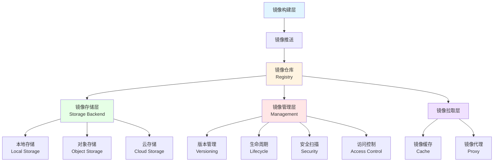

# 21. 镜像仓库和镜像管理：全面梳理

## 📑 目录

- [21. 镜像仓库和镜像管理：全面梳理](#21-镜像仓库和镜像管理全面梳理)
  - [📑 目录](#-目录)
  - [21.1 文档定位](#211-文档定位)
  - [21.2 镜像仓库技术栈全景](#212-镜像仓库技术栈全景)
    - [21.2.1 镜像仓库层次结构](#2121-镜像仓库层次结构)
    - [21.2.2 技术组件矩阵](#2122-技术组件矩阵)
    - [21.2.3 技术栈组合](#2123-技术栈组合)
  - [21.3 镜像仓库技术规格](#213-镜像仓库技术规格)
    - [21.3.1 Docker Registry 规格](#2131-docker-registry-规格)
    - [21.3.2 Harbor 规格](#2132-harbor-规格)
    - [21.3.3 Nexus Repository 规格](#2133-nexus-repository-规格)
    - [21.3.4 Quay 规格](#2134-quay-规格)
    - [21.3.5 云镜像仓库规格](#2135-云镜像仓库规格)
    - [21.3.6 镜像仓库对比](#2136-镜像仓库对比)
  - [21.4 镜像管理技术规格](#214-镜像管理技术规格)
    - [21.4.1 镜像版本管理](#2141-镜像版本管理)
    - [21.4.2 镜像标签策略](#2142-镜像标签策略)
    - [21.4.3 镜像生命周期管理](#2143-镜像生命周期管理)
    - [21.4.4 镜像清理策略](#2144-镜像清理策略)
    - [21.4.5 镜像垃圾回收](#2145-镜像垃圾回收)
  - [21.5 镜像安全技术规格](#215-镜像安全技术规格)
    - [21.5.1 镜像扫描](#2151-镜像扫描)
    - [21.5.2 镜像签名](#2152-镜像签名)
    - [21.5.3 镜像验证](#2153-镜像验证)
    - [21.5.4 访问控制](#2154-访问控制)
  - [21.6 镜像分发技术规格](#216-镜像分发技术规格)
    - [21.6.1 镜像拉取策略](#2161-镜像拉取策略)
    - [21.6.2 镜像缓存](#2162-镜像缓存)
    - [21.6.3 镜像同步](#2163-镜像同步)
    - [21.6.4 镜像代理](#2164-镜像代理)
  - [21.7 镜像仓库技术栈组合方案](#217-镜像仓库技术栈组合方案)
    - [21.7.1 小规模集群组合](#2171-小规模集群组合)
    - [21.7.2 大规模集群组合](#2172-大规模集群组合)
    - [21.7.3 多集群组合](#2173-多集群组合)
    - [21.7.4 边缘计算组合](#2174-边缘计算组合)
  - [21.8 镜像管理最佳实践](#218-镜像管理最佳实践)
    - [21.8.1 镜像命名规范](#2181-镜像命名规范)
    - [21.8.2 镜像版本策略](#2182-镜像版本策略)
    - [21.8.3 镜像安全策略](#2183-镜像安全策略)
    - [21.8.4 镜像优化策略](#2184-镜像优化策略)
  - [21.9 实际部署案例](#219-实际部署案例)
    - [21.9.1 案例 1：Harbor 高可用部署](#2191-案例-1harbor-高可用部署)
    - [21.9.2 案例 2：镜像清理自动化脚本](#2192-案例-2镜像清理自动化脚本)
    - [21.9.3 案例 3：镜像同步到边缘节点](#2193-案例-3镜像同步到边缘节点)
    - [21.9.4 案例 4：镜像扫描和签名集成](#2194-案例-4镜像扫描和签名集成)
  - [21.10 镜像仓库检查清单](#2110-镜像仓库检查清单)
  - [21.11 镜像仓库故障排查](#2111-镜像仓库故障排查)
    - [21.11.1 常见问题](#21111-常见问题)
  - [21.12 参考](#2112-参考)
    - [21.12.1 2025 年最新更新（2025-11-06）](#21121-2025-年最新更新2025-11-06)
    - [21.12.2 隔离栈相关文档](#21122-隔离栈相关文档)
    - [21.12.3 镜像仓库相关文档](#21123-镜像仓库相关文档)
    - [21.12.3 网络和存储相关文档](#21123-网络和存储相关文档)
    - [21.12.4 外部参考](#21124-外部参考)

---

## 21.1 文档定位

本文档全面梳理云原生容器技术栈中的镜像仓库和镜像管理技术、规格和最佳实践，包括镜
像仓库（Docker Registry、Harbor、Nexus、Quay、云镜像仓库）、镜像版本管理、镜像生
命周期管理、镜像安全、镜像分发等技术。

**文档结构**：

- **镜像仓库技术栈全景**：镜像仓库层次结构、技术组件矩阵、技术栈组合
- **镜像仓库技术规格**：Docker Registry、Harbor、Nexus、Quay、云镜像仓库详细规格
- **镜像管理技术规格**：镜像版本管理、标签策略、生命周期管理、清理策略、垃圾回收
- **镜像安全技术规格**：镜像扫描、镜像签名、镜像验证、访问控制
- **镜像分发技术规格**：镜像拉取策略、镜像缓存、镜像同步、镜像代理
- **镜像仓库技术栈组合方案**：不同场景的镜像仓库技术栈组合
- **镜像管理最佳实践**：镜像命名规范、版本策略、安全策略、优化策略

## 21.2 镜像仓库技术栈全景

### 21.2.1 镜像仓库层次结构

**镜像仓库层次结构**：



**镜像仓库层次定义**：

| 层次       | 定义     | 技术                       | 功能               |
| ---------- | -------- | -------------------------- | ------------------ |
| **构建层** | 镜像构建 | Dockerfile、BuildKit       | 镜像构建和推送     |
| **仓库层** | 镜像仓库 | Docker Registry、Harbor    | 镜像存储和管理     |
| **存储层** | 存储后端 | 本地存储、对象存储、云存储 | 实际镜像存储       |
| **管理层** | 镜像管理 | 版本管理、生命周期管理     | 镜像版本和生命周期 |
| **拉取层** | 镜像拉取 | 镜像缓存、镜像代理         | 镜像分发和优化     |

### 21.2.2 技术组件矩阵

**镜像仓库技术组件矩阵**：

| 组件类别     | 技术                  | 定位                 | 成熟度     | 生产验证   |
| ------------ | --------------------- | -------------------- | ---------- | ---------- |
| **镜像仓库** | Docker Registry       | 基础镜像仓库         | ⭐⭐⭐⭐⭐ | ⭐⭐⭐⭐⭐ |
|              | Harbor                | 企业级镜像仓库       | ⭐⭐⭐⭐⭐ | ⭐⭐⭐⭐⭐ |
|              | Nexus Repository      | 多格式仓库（含容器） | ⭐⭐⭐⭐⭐ | ⭐⭐⭐⭐⭐ |
|              | Quay                  | Red Hat 镜像仓库     | ⭐⭐⭐⭐⭐ | ⭐⭐⭐⭐⭐ |
|              | AWS ECR               | AWS 容器镜像仓库     | ⭐⭐⭐⭐⭐ | ⭐⭐⭐⭐⭐ |
|              | Azure ACR             | Azure 容器镜像仓库   | ⭐⭐⭐⭐⭐ | ⭐⭐⭐⭐⭐ |
|              | GCP Artifact Registry | GCP 镜像仓库         | ⭐⭐⭐⭐⭐ | ⭐⭐⭐⭐⭐ |
|              | Alibaba ACR           | 阿里云容器镜像仓库   | ⭐⭐⭐⭐⭐ | ⭐⭐⭐⭐⭐ |
| **镜像扫描** | Trivy                 | 开源镜像扫描工具     | ⭐⭐⭐⭐⭐ | ⭐⭐⭐⭐⭐ |
|              | Clair                 | CoreOS 镜像扫描      | ⭐⭐⭐⭐   | ⭐⭐⭐⭐   |
|              | Aqua                  | 商业镜像扫描         | ⭐⭐⭐⭐⭐ | ⭐⭐⭐⭐⭐ |
|              | Snyk                  | 开源安全扫描         | ⭐⭐⭐⭐⭐ | ⭐⭐⭐⭐⭐ |
| **镜像签名** | Cosign                | CNCF 镜像签名工具    | ⭐⭐⭐⭐⭐ | ⭐⭐⭐⭐⭐ |
|              | Notary                | Docker 镜像签名      | ⭐⭐⭐⭐   | ⭐⭐⭐⭐   |
| **镜像管理** | Skopeo                | 镜像复制和管理工具   | ⭐⭐⭐⭐⭐ | ⭐⭐⭐⭐⭐ |
|              | Crane                 | Google 镜像管理工具  | ⭐⭐⭐⭐   | ⭐⭐⭐⭐   |

### 21.2.3 技术栈组合

**镜像仓库技术栈组合方案**：

| 场景           | 镜像仓库               | 镜像扫描    | 镜像签名 | 特点               |
| -------------- | ---------------------- | ----------- | -------- | ------------------ |
| **小规模集群** | Docker Registry        | Trivy       | Cosign   | 简单易用、成本低   |
| **企业环境**   | Harbor                 | Trivy/Clair | Cosign   | 功能丰富、安全可靠 |
| **多云环境**   | Harbor + 云仓库        | Trivy       | Cosign   | 混合云支持、安全   |
| **云原生环境** | 云镜像仓库             | 云扫描      | 云签名   | 与云平台深度集成   |
| **边缘计算**   | Docker Registry + 同步 | Trivy       | Cosign   | 轻量级、离线支持   |

## 21.3 镜像仓库技术规格

### 21.3.1 Docker Registry 规格

**Docker Registry 规格**：

**定义**：Docker Registry 是开源的镜像仓库实现，符合 OCI Distribution 规范。

**技术特点**：

- ✅ 符合 OCI Distribution 规范
- ✅ 简单易部署
- ✅ 支持多种存储后端
- ✅ 轻量级
- ⚠️ 功能相对基础

**版本信息**：

- **最新版本**：v2.8.3+（2024）
- **GitHub Stars**：7K+
- **生产验证**：✅ 广泛使用

**存储后端支持**：

- **文件系统**：本地文件系统
- **S3**：AWS S3、MinIO
- **Azure**：Azure Blob Storage
- **GCS**：Google Cloud Storage
- **Swift**：OpenStack Swift

**配置示例**：

```yaml
version: 0.1
storage:
  filesystem:
    rootdirectory: /var/lib/registry
  s3:
    accesskey: YOUR_ACCESS_KEY
    secretkey: YOUR_SECRET_KEY
    region: us-east-1
    bucket: my-registry
http:
  addr: :5000
  headers:
    X-Content-Type-Options: [nosniff]
```

### 21.3.2 Harbor 规格

**Harbor 规格**：

**定义**：Harbor 是 CNCF 的企业级镜像仓库，提供完整的镜像管理功能。

**技术特点**：

- ✅ 企业级功能
- ✅ 安全扫描集成
- ✅ RBAC 权限管理
- ✅ 镜像复制（多仓库同步）
- ✅ 镜像生命周期管理
- ✅ 与 Kubernetes 集成
- ✅ CNCF 项目

**版本信息**：

- **最新版本**：v2.11.0+（2024）
- **GitHub Stars**：22K+
- **生产验证**：✅ 大规模生产使用
- **CNCF 项目**：✅ 毕业项目

**核心组件**：

1. **Registry**：镜像仓库（Docker Registry）
2. **Core**：核心服务（API、UI）
3. **Job Service**：任务服务（扫描、复制）
4. **Trivy/Clair**：安全扫描
5. **Chart Museum**：Helm Chart 仓库（可选）
6. **Notary**：镜像签名（可选）

**功能特性**：

- ✅ 镜像管理（版本、标签、删除）
- ✅ 安全扫描（CVE 漏洞扫描）
- ✅ 镜像签名（Notary 集成）
- ✅ 镜像复制（多仓库同步）
- ✅ 访问控制（RBAC）
- ✅ 项目管理（多租户）
- ✅ 生命周期管理（自动清理）
- ✅ Webhook 通知

### 21.3.3 Nexus Repository 规格

**Nexus Repository 规格**：

**定义**：Nexus Repository 是 Sonatype 的仓库管理器，支持多种格式
（Maven、Docker、npm 等）。

**技术特点**：

- ✅ 多格式支持（Maven、Docker、npm、PyPI 等）
- ✅ 代理仓库（Proxy Repository）
- ✅ 私有仓库（Hosted Repository）
- ✅ 仓库组（Repository Group）
- ✅ 存储管理
- ⚠️ 商业版功能更丰富

**版本信息**：

- **最新版本**：Nexus 3.65.0+（2024）
- **GitHub Stars**：1K+
- **生产验证**：✅ 企业环境广泛使用

**Docker 仓库类型**：

- **Hosted Repository**：私有仓库
- **Proxy Repository**：代理仓库
- **Repository Group**：仓库组

### 21.3.4 Quay 规格

**Quay 规格**：

**定义**：Quay 是 Red Hat 的企业级镜像仓库。

**技术特点**：

- ✅ 企业级功能
- ✅ 安全扫描（Clair）
- ✅ 镜像签名
- ✅ 镜像复制
- ✅ 访问控制
- ✅ 与 OpenShift 集成
- ⚠️ 商业产品（有开源版本）

**版本信息**：

- **最新版本**：v3.12.0+（2024）
- **GitHub Stars**：2K+
- **生产验证**：✅ Red Hat 环境广泛使用

### 21.3.5 云镜像仓库规格

**云镜像仓库规格**：

**AWS ECR（Elastic Container Registry）**：

**技术特点**：

- ✅ 与 AWS 深度集成
- ✅ 自动镜像扫描
- ✅ IAM 权限控制
- ✅ 生命周期管理
- ✅ 加密存储

**版本信息**：

- **最新版本**：持续更新（2024）
- **生产验证**：✅ AWS 环境广泛使用

**Azure ACR（Azure Container Registry）**：

**技术特点**：

- ✅ 与 Azure 深度集成
- ✅ 自动镜像扫描
- ✅ Azure AD 权限控制
- ✅ 生命周期管理
- ✅ 加密存储

**版本信息**：

- **最新版本**：持续更新（2024）
- **生产验证**：✅ Azure 环境广泛使用

**GCP Artifact Registry**：

**技术特点**：

- ✅ 与 GCP 深度集成
- ✅ 自动镜像扫描
- ✅ IAM 权限控制
- ✅ 生命周期管理
- ✅ 加密存储

**版本信息**：

- **最新版本**：持续更新（2024）
- **生产验证**：✅ GCP 环境广泛使用

**Alibaba ACR**：

**技术特点**：

- ✅ 与阿里云深度集成
- ✅ 自动镜像扫描
- ✅ RAM 权限控制
- ✅ 生命周期管理
- ✅ 加密存储

**版本信息**：

- **最新版本**：持续更新（2024）
- **生产验证**：✅ 阿里云环境广泛使用

### 21.3.6 镜像仓库对比

**镜像仓库对比矩阵**：

| 镜像仓库                  | 定位             | 功能丰富度 | 易用性     | 安全性     | 成熟度     | 推荐场景       |
| ------------------------- | ---------------- | ---------- | ---------- | ---------- | ---------- | -------------- |
| **Docker Registry**       | 基础镜像仓库     | ⭐⭐⭐     | ⭐⭐⭐⭐⭐ | ⭐⭐⭐     | ⭐⭐⭐⭐⭐ | 简单场景、开发 |
| **Harbor**                | 企业级镜像仓库   | ⭐⭐⭐⭐⭐ | ⭐⭐⭐⭐   | ⭐⭐⭐⭐⭐ | ⭐⭐⭐⭐⭐ | 企业环境、生产 |
| **Nexus Repository**      | 多格式仓库       | ⭐⭐⭐⭐   | ⭐⭐⭐⭐   | ⭐⭐⭐⭐   | ⭐⭐⭐⭐⭐ | 多格式需求     |
| **Quay**                  | Red Hat 镜像仓库 | ⭐⭐⭐⭐⭐ | ⭐⭐⭐⭐   | ⭐⭐⭐⭐⭐ | ⭐⭐⭐⭐⭐ | Red Hat 环境   |
| **AWS ECR**               | AWS 镜像仓库     | ⭐⭐⭐⭐⭐ | ⭐⭐⭐⭐⭐ | ⭐⭐⭐⭐⭐ | ⭐⭐⭐⭐⭐ | AWS 云原生     |
| **Azure ACR**             | Azure 镜像仓库   | ⭐⭐⭐⭐⭐ | ⭐⭐⭐⭐⭐ | ⭐⭐⭐⭐⭐ | ⭐⭐⭐⭐⭐ | Azure 云原生   |
| **GCP Artifact Registry** | GCP 镜像仓库     | ⭐⭐⭐⭐⭐ | ⭐⭐⭐⭐⭐ | ⭐⭐⭐⭐⭐ | ⭐⭐⭐⭐⭐ | GCP 云原生     |
| **Alibaba ACR**           | 阿里云镜像仓库   | ⭐⭐⭐⭐⭐ | ⭐⭐⭐⭐⭐ | ⭐⭐⭐⭐⭐ | ⭐⭐⭐⭐⭐ | 阿里云环境     |

## 21.4 镜像管理技术规格

> **💡 隔离层次关联**：镜像管理涉及 L-3 容器化层（Docker/OCI 镜像）和 L-4 沙盒化
> 层（Wasm 镜像），不同隔离层次的镜像格式和特性不同。详细的技术解析请参考：
>
> - **[29. 隔离栈](../29-isolation-stack/isolation-stack.md)** - 完整的隔离栈技
>   术解析
> - **[L-3 容器化层](../29-isolation-stack/layers/L-3-containerization.md)** -
>   容器镜像详细文档
> - **[L-4 沙盒化层](../29-isolation-stack/layers/L-4-sandboxing.md)** - WASM 镜
>   像详细文档
> - **[隔离层次对比文档](../29-isolation-stack/layers/isolation-comparison.md)** -
>   镜像格式对比和技术选型

### 21.4.1 镜像版本管理

**镜像版本管理规格**：

**版本策略**：

| 策略           | 说明                | 示例             | 适用场景 |
| -------------- | ------------------- | ---------------- | -------- |
| **语义化版本** | 使用语义化版本号    | `myapp:1.0.0`    | 生产环境 |
| **Git SHA**    | 使用 Git Commit SHA | `myapp:abc123`   | 开发环境 |
| **分支名**     | 使用分支名称        | `myapp:main`     | 持续集成 |
| **日期时间戳** | 使用日期时间戳      | `myapp:20240101` | 临时版本 |

**最佳实践**：

- ✅ 生产环境使用语义化版本
- ✅ 开发环境使用 Git SHA
- ✅ 避免使用 `latest` 标签
- ✅ 支持多版本并存

### 21.4.2 镜像标签策略

**镜像标签策略规格**：

**标签策略**：

- **固定标签**：`v1.0.0`、`v1.1.0`
- **浮动标签**：`latest`、`stable`、`dev`
- **多标签**：同一镜像多个标签（`v1.0.0`、`v1.0`、`v1`、`latest`）

**标签示例**：

```bash
# 构建镜像
docker build -t myapp:v1.0.0 -t myapp:v1.0 -t myapp:v1 -t myapp:latest .

# 推送多标签
docker push myapp:v1.0.0
docker push myapp:v1.0
docker push myapp:v1
docker push myapp:latest
```

### 21.4.3 镜像生命周期管理

**镜像生命周期管理规格**：

**生命周期阶段**：

1. **开发阶段**：频繁构建和推送
2. **测试阶段**：测试和验证
3. **发布阶段**：正式发布版本
4. **归档阶段**：旧版本归档
5. **清理阶段**：删除不再使用的镜像

**生命周期策略**：

- ✅ 保留最近 N 个版本
- ✅ 保留最近 N 天版本
- ✅ 自动删除未使用的镜像
- ✅ 手动归档重要版本

### 21.4.4 镜像清理策略

**镜像清理策略规格**：

**清理规则**：

- **按时间清理**：删除超过 N 天的镜像
- **按数量清理**：只保留最近 N 个版本
- **按使用情况清理**：删除未使用的镜像
- **按标签清理**：删除特定标签的镜像

**Harbor 清理策略示例**：

```yaml
apiVersion: v1
kind: CronJob
metadata:
  name: harbor-cleanup
spec:
  schedule: "0 2 * * *" # 每天凌晨 2 点
  jobTemplate:
    spec:
      template:
        spec:
          containers:
            - name: cleanup
              image: goharbor/harbor-jobservice
              command:
                - /harbor/cleanup.sh
              args:
                - --dry-run=false
                - --keep-days=30
                - --keep-tags=10
```

### 21.4.5 镜像垃圾回收

**镜像垃圾回收规格**：

**垃圾回收策略**：

- ✅ 删除未引用的 Blob
- ✅ 删除未使用的 Manifest
- ✅ 压缩存储空间
- ✅ 定期执行垃圾回收

**Docker Registry 垃圾回收**：

```bash
# 垃圾回收
docker exec registry registry garbage-collect /etc/docker/registry/config.yml

# 预览垃圾回收
docker exec registry registry garbage-collect --dry-run /etc/docker/registry/config.yml
```

**Harbor 垃圾回收**：

- ✅ 通过 Web UI 触发
- ✅ 通过 API 触发
- ✅ 定时任务执行

## 21.5 镜像安全技术规格

### 21.5.1 镜像扫描

**镜像扫描规格**：

**扫描工具**：

| 工具      | 定位         | CVE 数据库 | 性能       | 成熟度     | 推荐场景     |
| --------- | ------------ | ---------- | ---------- | ---------- | ------------ |
| **Trivy** | 开源扫描工具 | ✅         | ⭐⭐⭐⭐⭐ | ⭐⭐⭐⭐⭐ | 大多数场景   |
| **Clair** | CoreOS 扫描  | ✅         | ⭐⭐⭐⭐   | ⭐⭐⭐⭐   | Harbor 集成  |
| **Aqua**  | 商业扫描     | ✅         | ⭐⭐⭐⭐⭐ | ⭐⭐⭐⭐⭐ | 企业安全需求 |
| **Snyk**  | 开源扫描     | ✅         | ⭐⭐⭐⭐   | ⭐⭐⭐⭐⭐ | 开发环境     |

**Trivy 规格**：

**技术特点**：

- ✅ 快速扫描（< 10s）
- ✅ 支持多种镜像格式（Docker、OCI）
- ✅ 丰富的漏洞数据库
- ✅ CI/CD 集成
- ✅ Kubernetes 集成

**版本信息**：

- **最新版本**：v0.51.0+（2024）
- **GitHub Stars**：20K+
- **生产验证**：✅ 广泛使用

**使用示例**：

```bash
# 扫描镜像
trivy image myapp:v1.0.0

# CI/CD 集成
trivy image --exit-code 1 --severity CRITICAL,HIGH myapp:v1.0.0

# Kubernetes 集成
trivy k8s cluster --report summary
```

### 21.5.2 镜像签名

**镜像签名规格**：

**签名工具**：

| 工具       | 定位            | 标准支持 | 成熟度     | 推荐场景    |
| ---------- | --------------- | -------- | ---------- | ----------- |
| **Cosign** | CNCF 镜像签名   | ✅ OCI   | ⭐⭐⭐⭐⭐ | 云原生环境  |
| **Notary** | Docker 镜像签名 | ⚠️ 旧版  | ⭐⭐⭐⭐   | Docker 环境 |

**Cosign 规格**：

**技术特点**：

- ✅ CNCF 项目
- ✅ OCI 标准支持
- ✅ 与供应链工具集成
- ✅ 多种密钥类型支持

**版本信息**：

- **最新版本**：v2.2.0+（2024）
- **GitHub Stars**：4K+
- **生产验证**：✅ 广泛使用

**使用示例**：

```bash
# 签名镜像
cosign sign --key cosign.key myapp:v1.0.0

# 验证签名
cosign verify --key cosign.pub myapp:v1.0.0

# 密钥对生成
cosign generate-key-pair
```

### 21.5.3 镜像验证

**镜像验证规格**：

**验证策略**：

- ✅ 签名验证（Cosign）
- ✅ 扫描验证（Trivy）
- ✅ 策略验证（OPA、Kyverno）
- ✅ 准入控制（Admission Webhook）

**准入控制示例**：

```yaml
apiVersion: admissionregistration.k8s.io/v1
kind: ValidatingWebhookConfiguration
metadata:
  name: image-validation
webhooks:
  - name: image-validation.example.com
    rules:
      - operations: ["CREATE", "UPDATE"]
        apiGroups: [""]
        apiVersions: ["v1"]
        resources: ["pods"]
    clientConfig:
      service:
        name: image-validator
        namespace: default
        path: /validate
```

### 21.5.4 访问控制

**访问控制规格**：

**访问控制策略**：

- ✅ 基于角色的访问控制（RBAC）
- ✅ 项目级别的访问控制
- ✅ 仓库级别的访问控制
- ✅ 标签级别的访问控制

**Harbor RBAC 示例**：

- **项目管理员**：完全控制项目
- **开发者**：推送和拉取镜像
- **访客**：只读访问

## 21.6 镜像分发技术规格

### 21.6.1 镜像拉取策略

**镜像拉取策略规格**：

**拉取策略**：

| 策略             | 说明             | 适用场景         |
| ---------------- | ---------------- | ---------------- |
| **Always**       | 总是拉取最新镜像 | 开发环境         |
| **IfNotPresent** | 本地不存在时拉取 | 生产环境（推荐） |
| **Never**        | 只使用本地镜像   | 离线环境         |

**配置示例**：

```yaml
apiVersion: v1
kind: Pod
metadata:
  name: myapp
spec:
  containers:
    - name: app
      image: myapp:v1.0.0
      imagePullPolicy: IfNotPresent
```

### 21.6.2 镜像缓存

**镜像缓存规格**：

**缓存策略**：

- ✅ 节点级别缓存
- ✅ 集群级别缓存
- ✅ 代理缓存

**缓存工具**：

- **Docker Layer Caching**：Docker 本地缓存
- **Registry Mirror**：镜像仓库镜像
- **Harbor Proxy Cache**：Harbor 代理缓存

### 21.6.3 镜像同步

**镜像同步规格**：

**同步策略**：

- ✅ 多仓库同步
- ✅ 跨集群同步
- ✅ 边缘节点同步

**Harbor 镜像复制**：

- ✅ 推送模式（Push）
- ✅ 拉取模式（Pull）
- ✅ 定时同步
- ✅ 事件触发同步

### 21.6.4 镜像代理

**镜像代理规格**：

**代理策略**：

- ✅ 代理公共仓库（Docker Hub、gcr.io）
- ✅ 缓存代理
- ✅ 访问控制

**Docker Registry 代理配置**：

```yaml
version: 0.1
proxy:
  remoteurl: https://registry-1.docker.io
  username: YOUR_USERNAME
  password: YOUR_PASSWORD
```

## 21.7 镜像仓库技术栈组合方案

### 21.7.1 小规模集群组合

**小规模集群镜像仓库组合**：

**技术栈**：

- **镜像仓库**：Docker Registry
- **镜像扫描**：Trivy（CI/CD 集成）
- **镜像签名**：Cosign（可选）
- **访问控制**：基础认证

**特点**：

- ✅ 简单易用
- ✅ 资源占用低
- ✅ 成本低

### 21.7.2 大规模集群组合

**大规模集群镜像仓库组合**：

**技术栈**：

- **镜像仓库**：Harbor
- **镜像扫描**：Trivy/Clair（Harbor 集成）
- **镜像签名**：Cosign（Harbor 集成）
- **访问控制**：Harbor RBAC
- **镜像复制**：Harbor 镜像复制

**特点**：

- ✅ 功能丰富
- ✅ 安全可靠
- ✅ 企业级功能

### 21.7.3 多集群组合

**多集群镜像仓库组合**：

**技术栈**：

- **中心仓库**：Harbor
- **边缘仓库**：Docker Registry + Harbor 同步
- **镜像同步**：Harbor 镜像复制
- **镜像扫描**：Trivy
- **镜像签名**：Cosign

**特点**：

- ✅ 多集群管理
- ✅ 镜像同步
- ✅ 边缘支持

### 21.7.4 边缘计算组合

**边缘计算镜像仓库组合**：

**技术栈**：

- **中心仓库**：Harbor
- **边缘仓库**：Docker Registry（轻量级）
- **镜像同步**：Harbor 镜像复制 + 离线同步
- **镜像缓存**：边缘节点缓存
- **镜像扫描**：Trivy（中心）

**特点**：

- ✅ 轻量级部署
- ✅ 离线支持
- ✅ 边缘缓存

## 21.8 镜像管理最佳实践

### 21.8.1 镜像命名规范

**镜像命名规范**：

**命名格式**：

```text
<registry>/<namespace>/<image>:<tag>
```

**命名规则**：

- ✅ 使用小写字母和数字
- ✅ 使用连字符分隔（不使用下划线）
- ✅ 清晰的命名空间
- ✅ 语义化标签

**命名示例**：

```text
registry.example.com/myteam/myapp:v1.0.0
registry.example.com/myteam/myapp:v1.0.0-alpha.1
registry.example.com/myteam/myapp:abc123
```

### 21.8.2 镜像版本策略

**镜像版本策略**：

**版本策略**：

- ✅ 生产环境使用语义化版本（`v1.0.0`）
- ✅ 开发环境使用 Git SHA（`abc123`）
- ✅ 避免使用 `latest` 标签
- ✅ 支持多标签（`v1.0.0`、`v1.0`、`v1`）

### 21.8.3 镜像安全策略

**镜像安全策略**：

**安全策略**：

- ✅ 强制镜像扫描（CI/CD）
- ✅ 强制镜像签名（生产环境）
- ✅ 准入控制（Kubernetes）
- ✅ 定期更新基础镜像
- ✅ 最小权限原则

### 21.8.4 镜像优化策略

**镜像优化策略**：

**优化策略**：

- ✅ 多阶段构建（Multi-stage Build）
- ✅ 使用 .dockerignore
- ✅ 层缓存优化
- ✅ 基础镜像优化（Alpine、Distroless）
- ✅ 镜像压缩

## 21.9 实际部署案例

### 21.9.1 案例 1：Harbor 高可用部署

**场景**：生产环境部署高可用 Harbor 镜像仓库

**部署步骤**：

```bash
# 1. 准备 PostgreSQL 数据库（外部）
# 使用云数据库或自建数据库

# 2. 准备 Redis（外部）
# 使用云 Redis 或自建 Redis

# 3. 部署 Harbor（Helm Chart）
helm repo add harbor https://helm.goharbor.io
helm repo update

helm install harbor harbor/harbor \
  --namespace harbor-system \
  --create-namespace \
  --set externalURL=https://harbor.example.com \
  --set persistence.enabled=true \
  --set persistence.size=500Gi \
  --set database.type=external \
  --set database.external.host=postgres.example.com \
  --set database.external.port=5432 \
  --set database.external.username=harbor \
  --set database.external.password=yourpassword \
  --set redis.type=external \
  --set redis.external.host=redis.example.com \
  --set redis.external.port=6379 \
  --set trivy.enabled=true \
  --set notary.enabled=true
```

**Harbor 配置示例**：

```yaml
# values.yaml
exposure:
  type: ingress
  tls:
    enabled: true
    certSource: secret
    secret:
      secretName: harbor-tls

persistence:
  enabled: true
  resourcePolicy: "keep"
  persistentVolumeClaim:
    registry:
      size: 500Gi
      storageClass: "fast-ssd"

trivy:
  enabled: true
  image:
    repository: aquasec/trivy
    tag: "0.42.0"

notary:
  enabled: true
```

### 21.9.2 案例 2：镜像清理自动化脚本

**场景**：定期清理旧镜像和未使用的镜像

**清理脚本**：

```bash
#!/bin/bash
# cleanup-images.sh

set -e

REGISTRY="harbor.example.com"
PROJECT="myproject"
KEEP_DAYS=30
DRY_RUN=${DRY_RUN:-false}

# 获取所有标签
TAGS=$(curl -s -u "${REGISTRY_USER}:${REGISTRY_PASSWORD}" \
  "https://${REGISTRY}/api/v2.0/projects/${PROJECT}/repositories/myapp/artifacts" \
  | jq -r '.[].tags[].name')

# 计算截止日期
CUTOFF_DATE=$(date -d "${KEEP_DAYS} days ago" +%s)

for TAG in $TAGS; do
  # 获取镜像创建时间
  CREATED=$(curl -s -u "${REGISTRY_USER}:${REGISTRY_PASSWORD}" \
    "https://${REGISTRY}/api/v2.0/projects/${PROJECT}/repositories/myapp/artifacts/${TAG}" \
    | jq -r '.push_time')

  CREATED_TIMESTAMP=$(date -d "$CREATED" +%s)

  if [ "$CREATED_TIMESTAMP" -lt "$CUTOFF_DATE" ]; then
    echo "Deleting tag: ${TAG} (created: ${CREATED})"

    if [ "$DRY_RUN" = "false" ]; then
      DIGEST=$(curl -s -u "${REGISTRY_USER}:${REGISTRY_PASSWORD}" \
        "https://${REGISTRY}/api/v2.0/projects/${PROJECT}/repositories/myapp/artifacts/${TAG}" \
        | jq -r '.digest')

      curl -X DELETE -u "${REGISTRY_USER}:${REGISTRY_PASSWORD}" \
        "https://${REGISTRY}/api/v2.0/projects/${PROJECT}/repositories/myapp/artifacts/${DIGEST}"
    fi
  fi
done
```

**定时任务配置**：

```yaml
# CronJob for image cleanup
apiVersion: batch/v1
kind: CronJob
metadata:
  name: image-cleanup
spec:
  schedule: "0 2 * * *" # 每天凌晨 2 点
  jobTemplate:
    spec:
      template:
        spec:
          containers:
            - name: cleanup
              image: curlimages/curl:latest
              command:
                - /bin/sh
                - -c
                - |
                  DRY_RUN=false \
                  REGISTRY_USER=${REGISTRY_USER} \
                  REGISTRY_PASSWORD=${REGISTRY_PASSWORD} \
                  /scripts/cleanup-images.sh
              env:
                - name: REGISTRY_USER
                  valueFrom:
                    secretKeyRef:
                      name: registry-credentials
                      key: username
                - name: REGISTRY_PASSWORD
                  valueFrom:
                    secretKeyRef:
                      name: registry-credentials
                      key: password
          restartPolicy: OnFailure
```

### 21.9.3 案例 3：镜像同步到边缘节点

**场景**：将中心 Harbor 的镜像同步到边缘 Docker Registry

**同步脚本**：

```bash
#!/bin/bash
# sync-images-to-edge.sh

set -e

CENTER_REGISTRY="harbor.example.com"
EDGE_REGISTRY="edge-registry.example.com"
IMAGES=(
  "myapp:v1.0.0"
  "myapp:v1.1.0"
  "sidecar:v2.0.0"
)

for IMAGE in "${IMAGES[@]}"; do
  echo "Syncing ${IMAGE}..."

  # 从中心仓库拉取
  docker pull ${CENTER_REGISTRY}/${IMAGE}

  # 标记为边缘仓库
  docker tag ${CENTER_REGISTRY}/${IMAGE} ${EDGE_REGISTRY}/${IMAGE}

  # 推送到边缘仓库
  docker push ${EDGE_REGISTRY}/${IMAGE}

  # 清理本地镜像
  docker rmi ${CENTER_REGISTRY}/${IMAGE} ${EDGE_REGISTRY}/${IMAGE}

  echo "Synced ${IMAGE}"
done
```

**使用 Harbor 镜像复制**：

```yaml
# Harbor 镜像复制规则
apiVersion: v1
kind: ConfigMap
metadata:
  name: harbor-replication-policy
data:
  policy.yaml: |
    replication:
      - name: sync-to-edge
        source:
          registry: harbor.example.com
          project: myproject
        destination:
          registry: edge-registry.example.com
          project: myproject
        filters:
          - tag: "v*"
        trigger:
          type: manual
```

### 21.9.4 案例 4：镜像扫描和签名集成

**场景**：CI/CD 流程中集成镜像扫描和签名

**CI/CD 集成脚本**：

```bash
#!/bin/bash
# build-scan-sign-push.sh

set -e

IMAGE="myapp"
VERSION="${1:-latest}"
REGISTRY="harbor.example.com"
PROJECT="myproject"

# 1. 构建镜像
docker build -t ${IMAGE}:${VERSION} .

# 2. 扫描镜像
echo "Scanning image..."
trivy image --exit-code 1 --severity HIGH,CRITICAL ${IMAGE}:${VERSION}

# 3. 签名镜像
echo "Signing image..."
cosign sign --key cosign.key ${IMAGE}:${VERSION}

# 4. 推送镜像和签名
echo "Pushing image..."
docker tag ${IMAGE}:${VERSION} ${REGISTRY}/${PROJECT}/${IMAGE}:${VERSION}
docker push ${REGISTRY}/${PROJECT}/${IMAGE}:${VERSION}

cosign copy ${IMAGE}:${VERSION} ${REGISTRY}/${PROJECT}/${IMAGE}:${VERSION}
```

## 21.10 镜像仓库检查清单

**镜像仓库部署检查**：

- [ ] 镜像仓库已正确安装和配置
- [ ] 镜像仓库服务正常运行（kubectl get pods -n registry）
- [ ] 镜像仓库存储后端配置正确
- [ ] 镜像仓库高可用配置完成（如需要）
- [ ] 镜像仓库备份策略已制定

**镜像仓库访问检查**：

- [ ] 镜像仓库访问认证配置正确
- [ ] Docker/containerd 可以正常拉取镜像
- [ ] Kubernetes 可以正常拉取镜像（ImagePullSecrets）
- [ ] 镜像仓库访问权限配置正确
- [ ] 镜像仓库网络连通性正常

**镜像管理检查**：

- [ ] 镜像命名规范已制定和执行
- [ ] 镜像版本策略已实施
- [ ] 镜像清理策略已配置
- [ ] 镜像生命周期管理自动化
- [ ] 镜像垃圾回收定期执行

**镜像安全检查**：

- [ ] 镜像扫描已配置（Trivy/Grype/Snyk）
- [ ] 镜像签名已配置（Cosign/Notary）
- [ ] 镜像验证策略已实施
- [ ] 镜像漏洞告警已配置
- [ ] 镜像访问控制策略已实施

**镜像分发检查**：

- [ ] 镜像拉取策略配置合理（Always/IfNotPresent/Never）
- [ ] 镜像缓存配置完成（如需要）
- [ ] 镜像同步策略已配置（边缘节点）
- [ ] 镜像代理配置完成（如需要）
- [ ] 镜像分发性能满足需求

**镜像仓库监控检查**：

- [ ] 镜像仓库指标正常收集
- [ ] 镜像仓库日志正常记录
- [ ] 镜像仓库告警规则已配置
- [ ] 镜像仓库性能监控配置完成
- [ ] 镜像仓库存储使用率监控完成

---

## 21.11 镜像仓库故障排查

### 21.11.1 常见问题

**问题 1：镜像拉取失败 - "unauthorized"**:

```bash
# 检查认证配置
kubectl get secret -n default | grep docker-registry

# 检查镜像仓库访问
curl -u username:password https://registry.example.com/v2/

# 更新认证信息
kubectl create secret docker-registry regcred \
  --docker-server=registry.example.com \
  --docker-username=username \
  --docker-password=password \
  --docker-email=email@example.com \
  --dry-run=client -o yaml | kubectl apply -f -
```

**问题 2：镜像仓库存储空间不足**:

```bash
# 检查 Harbor 存储使用
kubectl exec -n harbor-system deployment/harbor-core -- \
  df -h /storage

# 清理未使用的镜像
# 使用 Harbor UI 或 API 清理

# 检查 Docker Registry 存储
docker exec registry du -sh /var/lib/registry/docker/registry/v2/

# 执行垃圾回收
docker exec registry registry garbage-collect /etc/docker/registry/config.yml
```

**问题 3：镜像扫描失败**:

```bash
# 检查 Trivy 扫描器状态
kubectl get pods -n harbor-system | grep trivy

# 检查扫描日志
kubectl logs -n harbor-system deployment/harbor-trivy -f

# 手动触发扫描
curl -X POST -u admin:password \
  "https://harbor.example.com/api/v2.0/projects/myproject/repositories/myapp/artifacts/v1.0.0/scan" \
  -H "Content-Type: application/json"
```

## 21.12 参考

### 21.12.1 2025 年最新更新（2025-11-06）

- **[27. 2025 趋势 - 2025-11-06 最新更新](../27-2025-trends/2025-trends.md#2714-2025-年-11-月-6-日最新更新)** -
  技术版本更新、生产环境最佳实践、已知问题与解决方案
  - **OCI Artifact v1.1**：Wasm 模块签名、SBOM 支持
  - **Sigstore + Cosign CNCF 毕业**：2025 年 7 月成为 CNCF 毕业项目
  - **强制签名**：wasm 模块强制签名写入 Kubernetes 1.30 安全基线
  - **SBOM 要求**：所有镜像必须包含 SBOM（Software Bill of Materials）

> 📋 **详细文档**：OCI Artifact v1.1 的完整新特性说明、代码示例、性能提升数据和
> 迁移指南，请参考：
>
> - **[05.2.3 OCI Artifact v1.1 新特性（2025-11-07）](../05-oci-supply-chain/oci-supply-chain.md#0523-oci-artifact-v11-新特性2025-11-07)** -
>   Wasm 模块签名、SBOM 关联、增强发现机制、批量操作、元数据扩展、性能提升（批量
>   签名 ↑3×，发现查询 ↑5×）和兼容性说明

**镜像管理最佳实践（2025-11-06）**：

- **镜像签名**：所有镜像必须使用 cosign 签名验证（Sigstore CNCF 毕业）
- **Wasm 模块签名**：wasm 模块强制签名写入 Kubernetes 1.30 安全基线
- **SBOM 要求**：所有镜像必须包含 SBOM，支持漏洞扫描和依赖追踪
- **镜像扫描**：集成 Trivy 等工具进行镜像漏洞扫描

### 21.12.2 隔离栈相关文档

- **[29. 隔离栈](../29-isolation-stack/isolation-stack.md)** - 完整的隔离栈技术
  解析，包括镜像格式和运行时
- **[L-3 容器化层](../29-isolation-stack/layers/L-3-containerization.md)** - 容
  器镜像详细文档
- **[L-4 沙盒化层](../29-isolation-stack/layers/L-4-sandboxing.md)** - WASM 镜像
  详细文档
- **[隔离层次对比文档](../29-isolation-stack/layers/isolation-comparison.md)** -
  镜像格式对比和技术选型

### 21.12.3 镜像仓库相关文档

- **[00. Docker](../00-docker/docker.md)** - Docker 技术规范
- **[05. OCI 供应链](../05-oci-supply-chain/oci-supply-chain.md)** - OCI 标准和
  供应链安全
- **[09. 安全合规](../09-security-compliance/security-compliance.md)** - 镜像签
  名和供应链安全最佳实践
- **[10. 安装部署](../10-installation/installation.md)** - 镜像签名和推送指南

### 21.12.3 网络和存储相关文档

- **[12. 网络技术规格](../12-network-stack/network-stack.md)** -
  CNI、Service、Ingress 等技术规格
- **[虚拟化与容器化网络对比分析](../12-network-stack/virtualization-comparison.md)** -
  网络范式转换、架构对比、性能分析（2025-11-07）
- **[15. 存储技术规格](../15-storage-stack/storage-stack.md)** - CSI、PV/PVC 等
  技术规格
- **[虚拟化与容器化存储对比分析](../15-storage-stack/virtualization-comparison.md)** -
  存储范式转换、架构对比、性能分析（2025-11-07）

### 21.12.4 外部参考

- [Docker Registry 文档](https://docs.docker.com/registry/)
- [Harbor 官方文档](https://goharbor.io/docs/)
- [Trivy 官方文档](https://aquasecurity.github.io/trivy/)
- [Cosign 官方文档](https://docs.sigstore.dev/cosign/)
- [Sigstore 官方文档](https://www.sigstore.dev/) - 镜像签名和验证
- [OCI Distribution 规范](https://github.com/opencontainers/distribution-spec)
- [AWS ECR 文档](https://docs.aws.amazon.com/ecr/)
- [Azure ACR 文档](https://docs.microsoft.com/azure/container-registry/)
- [GCP Artifact Registry 文档](https://cloud.google.com/artifact-registry/docs)
