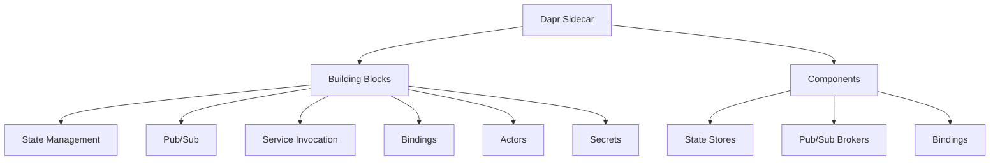

# Dapr 2.0

> **创建日期**：2025-11-15
> **最后更新**：2025-11-15
> **状态**：已建立
> **维护者**：技术团队

---

## 📋 概述

Dapr (Distributed Application Runtime) 是一个可移植的、事件驱动的运行时，用于构建微服务应用。

### 核心特性

- ✅ **可移植性**：支持多种语言和框架
- ✅ **事件驱动**：内置发布/订阅机制
- ✅ **状态管理**：分布式状态存储
- ✅ **服务调用**：服务间通信抽象
- ✅ **可观测性**：内置指标和追踪
- ✅ **Wasm 支持**：v2.0 支持 Wasm 组件

---

## 🏗️ 架构设计

### 架构组件



### 核心组件

1. **Dapr Sidecar**
   - 运行在每个应用 Pod 中
   - 提供 API 和 SDK
   - 管理组件生命周期

2. **Building Blocks**
   - 状态管理
   - 发布/订阅
   - 服务调用
   - 绑定
   - Actor 模型
   - 密钥管理

3. **Components**
   - 可插拔组件
   - 支持多种后端
   - 配置驱动

---

## 🚀 安装和配置

### 前置要求

- Kubernetes 1.20+
- Helm 3.0+

### 安装步骤

```bash
# 1. 添加 Dapr Helm 仓库
helm repo add dapr https://dapr.github.io/helm-charts/
helm repo update

# 2. 安装 Dapr
helm install dapr dapr/dapr \
  --namespace dapr-system \
  --create-namespace \
  --wait

# 3. 验证安装
kubectl get pods -n dapr-system
```

### 验证安装

```bash
# 检查 Dapr 组件状态
kubectl get components -n dapr-system

# 检查 Dapr 配置
kubectl get configurations -n dapr-system
```

---

## 📊 核心功能

### 1. 状态管理

#### 状态存储配置

```yaml
apiVersion: dapr.io/v1alpha1
kind: Component
metadata:
  name: statestore
spec:
  type: state.redis
  version: v1
  metadata:
    - name: redisHost
      value: redis:6379
    - name: redisPassword
      secretKeyRef:
        name: redis-secret
        key: password
```

#### 状态操作

```bash
# 保存状态
curl -X POST http://localhost:3500/v1.0/state/statestore \
  -H "Content-Type: application/json" \
  -d '[{
    "key": "key1",
    "value": "value1"
  }]'

# 获取状态
curl http://localhost:3500/v1.0/state/statestore/key1
```

### 2. 发布/订阅

#### 发布/订阅配置

```yaml
apiVersion: dapr.io/v1alpha1
kind: Component
metadata:
  name: pubsub
spec:
  type: pubsub.redis
  version: v1
  metadata:
    - name: redisHost
      value: redis:6379
```

#### 发布消息

```bash
curl -X POST http://localhost:3500/v1.0/publish/pubsub/orders \
  -H "Content-Type: application/json" \
  -d '{
    "orderId": "123",
    "amount": 100
  }'
```

### 3. 服务调用

#### 服务调用配置

```yaml
apiVersion: dapr.io/v1alpha1
kind: Configuration
metadata:
  name: appconfig
spec:
  tracing:
    samplingRate: "1"
  httpPipeline:
    handlers:
      - name: oauth2
        type: middleware.http.oauth2
```

#### 服务调用

```bash
curl http://localhost:3500/v1.0/invoke/backend/method/api/orders
```

---

## 🔄 微服务运行时对比

### Dapr vs Service Mesh vs API Gateway

| 特性 | Dapr | Service Mesh | API Gateway |
|------|------|--------------|-------------|
| **定位** | 应用运行时 | 网络层 | 入口网关 |
| **语言支持** | 多语言 | 语言无关 | 语言无关 |
| **状态管理** | ✅ | ❌ | ❌ |
| **发布/订阅** | ✅ | ❌ | ❌ |
| **服务调用** | ✅ | ✅ | ✅ |
| **流量管理** | ❌ | ✅ | ✅ |
| **安全** | 部分 | ✅ | ✅ |

### 选型建议

- **应用运行时**：选择 Dapr
- **网络层管理**：选择 Service Mesh
- **入口网关**：选择 API Gateway

---

## 🆕 v2.0 新特性

### 1. Wasm 组件支持

```yaml
apiVersion: dapr.io/v1alpha1
kind: Component
metadata:
  name: wasm-component
spec:
  type: middleware.http.wasm
  version: v1
  metadata:
    - name: wasmPath
      value: /path/to/middleware.wasm
```

### 2. 性能优化

- 更快的启动时间
- 更低的内存占用
- 优化的网络性能

### 3. 增强的可观测性

- OpenTelemetry 集成
- 分布式追踪
- 性能指标

---

## 💡 最佳实践

### 1. 组件配置

- 使用 Secret 管理敏感信息
- 合理选择组件类型
- 配置资源限制

### 2. 性能优化

- 使用本地状态存储
- 优化发布/订阅配置
- 合理设置超时时间

### 3. 安全配置

- 启用 mTLS
- 配置访问控制
- 定期更新组件

---

## 🔗 相关文档

- [服务网格技术规范](../service-mesh/service-mesh.md)
- [微服务架构最佳实践](../microservices/microservices.md)
- [可观测性技术栈](../04-infrastructure-stack/observability/observability.md)

---

**最后更新**：2025-11-15
**维护者**：技术团队
