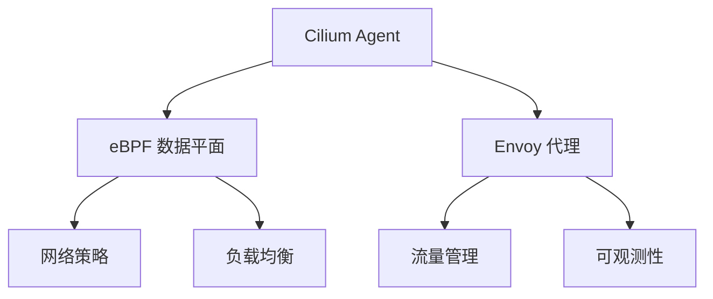

# Cilium Service Mesh

> **创建日期**：2025-11-15
> **最后更新**：2025-11-15
> **状态**：已建立
> **维护者**：技术团队

---

## 📋 概述

Cilium Service Mesh 是基于 eBPF 的高性能服务网格实现，提供零信任网络、可观测性和流量管理能力。

### 核心特性

- ✅ **eBPF 驱动**：基于 eBPF 的高性能数据平面
- ✅ **零信任网络**：内置安全策略和加密
- ✅ **可观测性**：深度集成 Prometheus、Grafana
- ✅ **Kubernetes 原生**：与 Kubernetes 深度集成
- ✅ **低延迟**：相比传统服务网格延迟降低 50%+

---

## 🏗️ 架构设计

### 架构组件



### 核心组件

1. **Cilium Agent**
   - 运行在每个节点上
   - 管理 eBPF 程序和策略
   - 与 Kubernetes API 交互

2. **eBPF 数据平面**
   - 高性能网络转发
   - 策略执行
   - 负载均衡

3. **Envoy 代理**
   - 流量管理
   - 可观测性
   - 高级路由功能

---

## 🚀 安装和配置

### 前置要求

- Kubernetes 1.19+
- Linux 内核 4.19+（支持 eBPF）
- 禁用其他 CNI 插件

### 安装步骤

```bash
# 1. 安装 Cilium CLI
curl -L --remote-name-all https://github.com/cilium/cilium-cli/releases/latest/download/cilium-linux-amd64.tar.gz
tar xzvfC cilium-linux-amd64.tar.gz /usr/local/bin
rm cilium-linux-amd64.tar.gz

# 2. 安装 Cilium
cilium install

# 3. 启用 Service Mesh
cilium clustermesh enable
```

### 验证安装

```bash
# 检查 Cilium 状态
cilium status

# 检查 Service Mesh 状态
cilium clustermesh status
```

---

## 📊 功能特性

### 1. 流量管理

#### 流量路由

```yaml
apiVersion: networking.cilium.io/v1
kind: CiliumNetworkPolicy
metadata:
  name: service-mesh-routing
spec:
  endpointSelector:
    matchLabels:
      app: frontend
  egress:
    - toEndpoints:
      - matchLabels:
          app: backend
      toPorts:
        - ports:
          - port: "8080"
            protocol: TCP
```

#### 负载均衡

- 支持多种负载均衡算法
- 健康检查
- 故障转移

### 2. 安全策略

#### 网络策略

```yaml
apiVersion: networking.cilium.io/v1
kind: CiliumNetworkPolicy
metadata:
  name: zero-trust-policy
spec:
  endpointSelector:
    matchLabels:
      app: api
  ingress:
    - fromEndpoints:
      - matchLabels:
          app: frontend
      toPorts:
        - ports:
          - port: "443"
            protocol: TCP
```

#### mTLS 加密

- 自动 mTLS 加密
- 证书管理
- 零信任网络

### 3. 可观测性

#### Metrics

- Prometheus 集成
- 自定义指标
- 性能监控

#### Tracing

- OpenTelemetry 集成
- 分布式追踪
- 请求链路分析

---

## 🔄 与其他服务网格对比

### Istio vs Linkerd vs Cilium

| 特性 | Istio | Linkerd | Cilium |
|------|-------|---------|--------|
| **数据平面** | Envoy | Linkerd-proxy | eBPF + Envoy |
| **性能** | 中等 | 高 | 最高 |
| **延迟** | 中等 | 低 | 最低 |
| **资源占用** | 高 | 低 | 最低 |
| **eBPF 支持** | 部分 | 无 | 完整 |
| **Kubernetes 集成** | 好 | 好 | 最好 |
| **学习曲线** | 陡峭 | 平缓 | 中等 |

### 选型建议

- **高性能场景**：选择 Cilium
- **简单易用**：选择 Linkerd
- **功能丰富**：选择 Istio

---

## 💡 最佳实践

### 1. 性能优化

- 使用 eBPF 数据平面
- 优化 Envoy 配置
- 合理设置资源限制

### 2. 安全配置

- 启用 mTLS
- 配置网络策略
- 定期更新证书

### 3. 可观测性

- 配置 Prometheus 监控
- 启用分布式追踪
- 设置告警规则

---

## 🔗 相关文档

- [服务网格技术规范](service-mesh.md)
- [eBPF 技术栈](../04-infrastructure-stack/ebpf-stack/ebpf-stack.md)
- [网络技术栈](../04-infrastructure-stack/network-stack/network-stack.md)

---

**最后更新**：2025-11-15
**维护者**：技术团队
