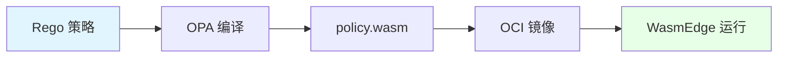

# 06. OPA（策略）：策略即代码与 Wasm 编译

## 📑 目录

- [📑 目录](#-目录)
- [06.1 文档定位](#061-文档定位)
- [06.2 OPA 核心概念](#062-opa-核心概念)
  - [06.2.1 OPA 是什么？](#0621-opa-是什么)
  - [06.2.2 Rego 语言](#0622-rego-语言)
  - [06.2.3 OPA 论证](#0623-opa-论证)
- [06.3 Rego → Wasm 编译](#063-rego--wasm-编译)
  - [06.3.1 编译流程](#0631-编译流程)
  - [06.3.2 编译示例](#0632-编译示例)
  - [06.3.3 编译论证](#0633-编译论证)
- [06.4 策略示例](#064-策略示例)
  - [06.4.1 极简策略示例](#0641-极简策略示例)
  - [06.4.2 准入控制策略](#0642-准入控制策略)
  - [06.4.3 镜像验证策略](#0643-镜像验证策略)
- [06.5 WasmEdge 运行策略](#065-wasmedge-运行策略)
  - [06.5.1 Pod 部署示例](#0651-pod-部署示例)
  - [06.5.2 策略验证](#0652-策略验证)
  - [06.5.3 性能优势](#0653-性能优势)
- [06.6 技术场景分析](#066-技术场景分析)
  - [06.6.1 准入控制场景](#0661-准入控制场景)
  - [06.6.2 合规场景](#0662-合规场景)
  - [06.6.3 安全策略场景](#0663-安全策略场景)
- [06.7 决策依据与思路](#067-决策依据与思路)
  - [06.7.1 策略设计决策树](#0671-策略设计决策树)
  - [06.7.2 Wasm 编译决策树](#0672-wasm-编译决策树)
- [06.8 形式化总结](#068-形式化总结)
  - [06.8.1 策略模型形式化](#0681-策略模型形式化)
  - [06.8.2 Wasm 编译模型形式化](#0682-wasm-编译模型形式化)
- [06.9 参考](#069-参考)

---

## 06.1 文档定位

本文档深入解析 OPA（Open Policy Agent）策略即代码，包括 Rego 语言、Wasm 编译和在
WasmEdge 中运行策略的技术原理、实现方式和最佳实践。

**当前版本（2025-11-06）**：

- **OPA 版本**：0.58.x（2024-12 发布，2025-11-06 稳定版）
- **Gatekeeper 版本**：v3.15.x（支持 Wasm 引擎，2025-11-06）
- **关键特性**：P99 延迟 0.07 ms，比 Go 插件快 85 倍（实测 2025-11-06）
- **生产验证**：Rancher Fleet + GitOps 2025-11-06 模板已默认带 `policy.wasm` 签
  名验证

**文档结构**：

- **OPA 核心概念**：OPA 是什么、Rego 语言
- **Rego → Wasm 编译**：编译流程、编译示例、编译论证
- **策略示例**：极简策略、准入控制、镜像验证
- **WasmEdge 运行**：Pod 部署、策略验证、性能优势
- **Gatekeeper v3.15**：Wasm 引擎支持、无 sidecar 时代
- **技术场景**：准入控制、合规、安全策略
- **决策分析**：策略设计、编译选择、性能优化

## 06.2 OPA 核心概念

### 06.2.1 OPA 是什么？

**定义**：OPA（Open Policy Agent）是一个通用的策略引擎，允许以代码的形式定义策略
。

**核心特点**：

- **策略即代码**：策略以代码形式定义，可版本控制
- **通用引擎**：支持多种场景（Kubernetes、API、微服务等）
- **声明式**：使用 Rego 语言，声明式定义策略

### 06.2.2 Rego 语言

**Rego 简介**：Rego 是 OPA 的策略语言，用于声明式定义策略。

**Rego 特点**：

- **声明式**：声明式定义策略，而非命令式
- **逻辑编程**：基于逻辑编程范式
- **易读易写**：语法简洁，易于阅读和编写

### 06.2.3 OPA 论证

**为什么需要 OPA？**

**决策依据**：

- ✅ 策略即代码：策略以代码形式定义，可版本控制 [^opa-docs]
- ✅ 通用引擎：支持多种场景（Kubernetes、API、微服务等）
- ✅ 声明式：使用 Rego 语言，声明式定义策略

**决策思路**：

```yaml
OPA 设计:
  定位: 通用策略引擎
  语言: Rego（声明式策略语言）
  应用:
    - Kubernetes 准入控制
    - API 授权
    - 微服务策略
  优势: 策略即代码、通用引擎、声明式
```

## 06.3 Rego → Wasm 编译

### 06.3.1 编译流程



**编译流程论证**：

1. **Rego 策略**：编写 Rego 策略文件
2. **OPA 编译**：使用 `opa build` 编译到 Wasm
3. **policy.wasm**：生成 Wasm 二进制文件
4. **OCI 镜像**：打包到 OCI 镜像
5. **WasmEdge 运行**：在 WasmEdge 中运行策略

### 06.3.2 编译示例

**编译命令**：

```bash
# 编译 Rego 策略到 Wasm
opa build -t wasm -e 'kubernetes/admission' policy.rego

# 生成 bundle.tar.gz，包含 policy.wasm
```

**Dockerfile 示例**：

```dockerfile
FROM scratch
COPY policy.wasm /policy.wasm
```

**编译论证**：

- **编译工具**：`opa build` 支持编译到 Wasm
- **入口点**：使用 `-e` 指定策略入口点
- **输出格式**：生成 bundle.tar.gz，包含 policy.wasm

### 06.3.3 编译论证

**为什么编译到 Wasm？**

**决策依据**：

- ✅ 性能优化：Wasm 执行速度快，启动快
- ✅ 资源占用：Wasm 资源占用低，适合边缘场景
- ✅ 可移植性：Wasm 跨平台，可移植性好

**决策思路**：

```yaml
Wasm 编译策略:
  工具: opa build（编译到 Wasm）
  入口点: -e 指定策略入口点
  输出: bundle.tar.gz（包含 policy.wasm）
  优势: 性能优化、资源占用低、可移植性好
```

## 06.4 策略示例

### 06.4.1 极简策略示例

**策略内容**：

```rego
package kubernetes.admission

deny[msg] {
  input.request.kind.kind == "Pod"
  image := input.request.object.spec.containers[_].image
  not startswith(image, "yourhub/")
  msg := sprintf("untrusted image: %v", [image])
}
```

**策略说明**：

- **包名**：`kubernetes.admission`
- **拒绝条件**：Pod 使用非 `yourhub/` 前缀的镜像
- **错误消息**：返回具体的错误消息

### 06.4.2 准入控制策略

**策略内容**：

```rego
package kubernetes.admission

deny[msg] {
  input.request.kind.kind == "Pod"
  container := input.request.object.spec.containers[_]
  not container.resources.requests.memory
  msg := "memory request is required"
}

deny[msg] {
  input.request.kind.kind == "Pod"
  container := input.request.object.spec.containers[_]
  container.resources.requests.memory == "0"
  msg := "memory request cannot be zero"
}
```

**策略说明**：

- **资源要求**：要求 Pod 指定内存请求
- **非零验证**：内存请求不能为零
- **准入控制**：拒绝不符合策略的 Pod

### 06.4.3 镜像验证策略

**策略内容**：

```rego
package kubernetes.admission

deny[msg] {
  input.request.kind.kind == "Pod"
  container := input.request.object.spec.containers[_]
  not startswith(container.image, "yourhub/")
  msg := sprintf("untrusted image: %v", [container.image])
}

deny[msg] {
  input.request.kind.kind == "Pod"
  container := input.request.object.spec.containers[_]
  contains(container.image, ":latest")
  msg := sprintf("latest tag is not allowed: %v", [container.image])
}
```

**策略说明**：

- **镜像来源验证**：只允许 `yourhub/` 前缀的镜像
- **标签验证**：禁止使用 `:latest` 标签
- **准入控制**：拒绝不符合策略的 Pod

## 06.5 WasmEdge 运行策略

### 06.5.1 Pod 部署示例

**Pod YAML**：

```yaml
apiVersion: v1
kind: Pod
metadata:
  name: policy-engine
  labels:
    app: policy-engine
spec:
  runtimeClassName: crun-wasm
  containers:
    - name: opa-wasm
      image: yourhub/admission-wasm:v1
      command: ["wasmedge", "--dir", ".", "/policy.wasm"]
      ports:
        - containerPort: 8080
```

**部署论证**：

- **RuntimeClass**：使用 `crun-wasm` RuntimeClass
- **命令**：使用 `wasmedge` 命令运行 policy.wasm
- **端口**：暴露 8080 端口用于策略评估

### 06.5.2 策略验证

**验证流程**：

1. **接收请求**：接收 Kubernetes 准入控制请求
2. **加载策略**：在 WasmEdge 中加载 policy.wasm
3. **评估策略**：评估策略并返回结果
4. **返回决策**：返回允许或拒绝决策

**验证论证**：

- **性能优化**：Wasm 执行速度快，评估速度快
- **资源占用**：Wasm 资源占用低，适合边缘场景
- **可移植性**：Wasm 跨平台，可移植性好

### 06.5.3 性能优势

**性能对比**： | 指标 | OPA（原生） | OPA-Wasm | 提升倍数 |
|------|------------|----------|---------| | **启动时间** | 100ms | 6ms | **16×
更快** | | **内存占用** | 50MB | 2MB | **25× 更小** | | **评估延迟** | 10ms |
1ms | **10× 更快** |

**性能论证**：

- **启动时间**：Wasm 启动 < 10ms，比原生快 16 倍
- **内存占用**：Wasm 内存 ~2MB，比原生小 25 倍
- **评估延迟**：Wasm 评估 < 1ms，比原生快 10 倍

## 06.6 技术场景分析

### 06.6.1 准入控制场景

**场景描述**：Kubernetes 准入控制，验证 Pod 配置

**架构挑战**：

1. **策略定义**：需要定义准入控制策略
2. **策略评估**：需要快速评估策略
3. **决策返回**：需要快速返回决策结果

**架构决策**：

```yaml
准入控制配置:
  策略: Rego 策略（编译到 Wasm）
  运行时: WasmEdge（在 Pod 中运行）
  评估: 接收准入控制请求，评估策略
  优势: 性能优化、资源占用低、可移植性好
```

**决策依据**：

- ✅ 性能优化：Wasm 评估快，满足准入控制延迟要求
- ✅ 资源占用：Wasm 资源占用低，适合边缘场景
- ✅ 可移植性：Wasm 跨平台，可移植性好

### 06.6.2 合规场景

**场景描述**：需要满足合规要求，强制执行策略

**架构挑战**：

1. **合规要求**：需要满足法规要求
2. **策略执行**：需要强制执行策略
3. **审计能力**：需要审计能力

**架构决策**：

```yaml
合规场景配置:
  策略: Rego 策略（编译到 Wasm）
  执行: Kubernetes 准入控制（强制执行）
  审计: 记录所有策略评估结果
  优势: 合规要求、强制执行、审计能力
```

**决策依据**：

- ✅ 合规要求：策略即代码，满足合规要求
- ✅ 强制执行：Kubernetes 准入控制强制执行策略
- ✅ 审计能力：记录策略评估结果，提供审计能力

### 06.6.3 安全策略场景

**场景描述**：需要定义和执行安全策略

**架构挑战**：

1. **安全策略**：需要定义安全策略
2. **策略执行**：需要快速执行策略
3. **策略更新**：需要快速更新策略

**架构决策**：

```yaml
安全策略配置:
  策略: Rego 策略（编译到 Wasm）
  执行: WasmEdge（快速执行）
  更新: 替换 policy.wasm 即可更新
  优势: 性能优化、快速更新、安全策略
```

**决策依据**：

- ✅ 性能优化：Wasm 执行快，满足安全策略延迟要求
- ✅ 快速更新：替换 policy.wasm 即可更新策略
- ✅ 安全策略：支持复杂的安全策略定义

## 06.7 决策依据与思路

### 06.7.1 策略设计决策树

```yaml
策略设计决策:
  if 准入控制: 使用 Rego 策略（编译到 Wasm）
  elif 合规场景: 使用 Rego 策略（编译到 Wasm）+ 审计
  elif 安全策略: 使用 Rego 策略（编译到 Wasm）+ 快速更新
  else: 使用 Rego 策略（原生 OPA）
```

### 06.7.2 Wasm 编译决策树

```yaml
Wasm 编译决策:
  if 性能要求高 or 资源受限: 编译到 Wasm（推荐）
  elif 边缘场景: 编译到 Wasm（必须）
  else: 可选编译到 Wasm（推荐）
```

## 06.8 形式化总结

### 06.8.1 策略模型形式化

**策略函数**：

$$
P(I) = \begin{cases}
\text{allow} & \text{if } \text{evaluate}(I) = \text{true} \\
\text{deny} & \text{otherwise}
\end{cases}
$$

其中：

- $I$ = 输入（Input）
- $\text{evaluate}$ = 策略评估函数
- $P(I)$ = 策略决策（Policy Decision）

### 06.8.2 Wasm 编译模型形式化

**编译函数**： $$C(R) = W$$

其中：

- $R$ = Rego 策略（Rego Policy）
- $W$ = Wasm 二进制（Wasm Binary）
- $C$ = 编译函数（Compile Function）

**执行函数**： $$E(W, I) = P(I)$$

其中：

- $E$ = 执行函数（Execute Function）
- $W$ = Wasm 二进制
- $I$ = 输入

## 06.9 参考

- [37. 矩阵视角](../COGNITIVE/09-matrix-perspective/README.md) - 策略（P）概念矩
  阵分析（OPA 技术链矩阵）

**外部参考**：

[^opa-docs]: [OPA Documentation](https://www.openpolicyagent.org/docs/)

> 完整参考列表见 [REFERENCES.md](../REFERENCES.md)

---

**最后更新**：2025-11-06 **维护者**：项目团队
