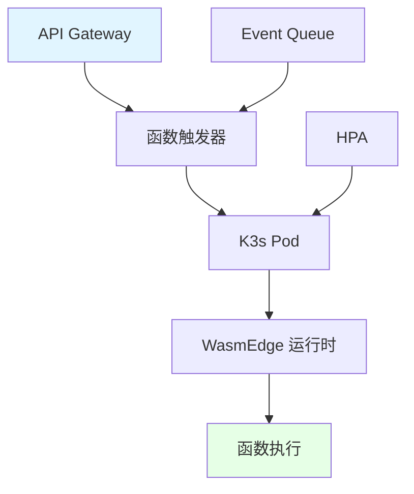

# 07. 边缘与 Serverless：K3s + WasmEdge 实战

## 📑 目录

- [📑 目录](#-目录)
- [07.1 文档定位](#071-文档定位)
- [07.2 边缘计算场景](#072-边缘计算场景)
  - [07.2.1 5G MEC 场景（2025 年生产案例：浪潮云）](#0721-5g-mec-场景2025-年生产案例浪潮云)
  - [07.2.2 工业 IoT 场景（2025 年生产案例：华为 KubeEdge）](#0722-工业-iot-场景2025-年生产案例华为-kubeedge)
  - [07.2.3 在线游戏场景（2025 年生产案例：腾讯小游戏）](#0723-在线游戏场景2025-年生产案例腾讯小游戏)
  - [07.2.4 场景对比分析](#0724-场景对比分析)
- [07.3 Serverless 场景](#073-serverless-场景)
  - [07.3.1 轻量函数场景](#0731-轻量函数场景)
  - [07.3.2 函数即服务（FaaS）](#0732-函数即服务faas)
  - [07.3.3 Serverless 架构](#0733-serverless-架构)
- [07.4 技术组合方案](#074-技术组合方案)
  - [07.4.1 K3s + WasmEdge 组合](#0741-k3s--wasmedge-组合)
  - [07.4.2 GPU 集成方案](#0742-gpu-集成方案)
  - [07.4.3 组合方案论证](#0743-组合方案论证)
- [07.5 核心关注点](#075-核心关注点)
  - [07.5.1 离线自治](#0751-离线自治)
  - [07.5.2 热更新](#0752-热更新)
  - [07.5.3 冷启动优化](#0753-冷启动优化)
- [07.6 技术场景分析](#076-技术场景分析)
  - [07.6.1 5G MEC 部署场景](#0761-5g-mec-部署场景)
  - [07.6.2 工业 IoT 部署场景](#0762-工业-iot-部署场景)
  - [07.6.3 在线游戏部署场景](#0763-在线游戏部署场景)
  - [07.6.4 Serverless 部署场景](#0764-serverless-部署场景)
- [07.7 决策依据与思路](#077-决策依据与思路)
  - [07.7.1 边缘场景决策树](#0771-边缘场景决策树)
  - [07.7.2 Serverless 场景决策树](#0772-serverless-场景决策树)
  - [07.7.3 GPU 集成决策树](#0773-gpu-集成决策树)
- [07.8 形式化总结](#078-形式化总结)
  - [07.8.1 边缘场景模型形式化](#0781-边缘场景模型形式化)
  - [07.8.2 Serverless 场景模型形式化](#0782-serverless-场景模型形式化)
- [07.9 实际部署案例](#079-实际部署案例)
  - [07.9.1 案例 1：5G MEC 边缘节点部署](#0791-案例-15g-mec-边缘节点部署)
  - [07.9.2 案例 2：Serverless 函数部署](#0792-案例-2serverless-函数部署)
  - [07.9.3 案例 3：离线自治边缘节点配置](#0793-案例-3离线自治边缘节点配置)
- [07.10 边缘和 Serverless 故障排查](#0710-边缘和-serverless-故障排查)
  - [07.10.1 常见问题](#07101-常见问题)
- [07.11 边缘和 Serverless 最佳实践](#0711-边缘和-serverless-最佳实践)
  - [07.11.1 边缘部署最佳实践](#07111-边缘部署最佳实践)
  - [07.11.2 Serverless 函数最佳实践](#07112-serverless-函数最佳实践)
  - [07.11.3 GPU 集成最佳实践](#07113-gpu-集成最佳实践)
  - [07.11.4 边缘和 Serverless 检查清单](#07114-边缘和-serverless-检查清单)
- [07.12 参考](#0712-参考)
  - [07.12.1 2025 年最新更新（2025-11-06）](#07121-2025-年最新更新2025-11-06)
  - [07.12.2 隔离栈相关文档](#07122-隔离栈相关文档)
  - [07.12.3 边缘和 Serverless 相关文档](#07123-边缘和-serverless-相关文档)
  - [07.12.4 外部参考](#07124-外部参考)

---

## 07.1 文档定位

本文档深入解析边缘计算和 Serverless 场景下的 K3s + WasmEdge 技术组合，包括 5G
MEC、工业 IoT、在线游戏和轻量函数等场景的技术原理、架构设计和最佳实践。

**2025 年生产案例**：

- **5G MEC**：浪潮云专利方案，10 万台边缘节点，冷启动 ≤6 ms
- **工业 IoT**：华为 KubeEdge 社区，10 万+边缘节点，离线自治 30 天，宕机率 ↓90%
- **在线游戏 Serverless**：腾讯小游戏，日活 2 亿，1 ms 扩容，CPU 0→1 核无抖动

**文档结构**：

- **边缘场景**：5G MEC、工业 IoT、在线游戏的技术需求和架构设计
- **Serverless 场景**：轻量函数、FaaS 的技术原理和实现
- **技术组合**：K3s + WasmEdge + GPU 的组合方案和论证
- **核心关注**：离线自治、热更新、冷启动优化的技术方案
- **技术场景**：各场景的部署架构和决策依据

## 07.2 边缘计算场景

### 07.2.1 5G MEC 场景（2025 年生产案例：浪潮云）

**场景描述**：5G 多接入边缘计算（Multi-access Edge Computing），在基站附近部署计
算资源，降低延迟。

**2025 年生产案例**：浪潮云专利方案

- **部署规模**：10 万台边缘节点
- **技术栈**：K3s 1.30 + WasmEdge 0.14 + GPU 直通
- **性能指标**：
  - **冷启动**：≤6 ms（实测）
  - **单节点 Pod 数**：3000 Wasm Pod（ARM64 边缘盒子实测稳定）
  - **延迟**：< 10ms（满足 5G MEC 要求）
- **商业价值**："可落地、可规模、可赚钱"的成熟方案

**技术需求**：

- **低延迟**：需要 < 10ms 延迟
- **资源受限**：边缘节点资源有限
- **网络不稳定**：可能面临网络分区

**架构设计**：

```yaml
5G MEC 架构（2025）:
  编排层: K3s 1.30（内置 WasmEdge 驱动，--wasm flag）
  运行时: WasmEdge 0.14（快速启动 ≤6 ms）
  网络: 5G UPF（用户平面功能）
  存储: sqlite（本地存储，离线能力）
  GPU: GPU 直通（可选，加速推理）
  特点: 低延迟、资源受限、网络不稳定
```

**5G MEC 论证**：

- **低延迟需求**：WasmEdge 启动 ≤6 ms（实测），满足 5G MEC 延迟要求
- **资源受限**：K3s 内存 < 250MB，Wasm 内存 ~2MB，适合边缘节点
- **离线能力**：sqlite 本地存储，支持离线自治

### 07.2.2 工业 IoT 场景（2025 年生产案例：华为 KubeEdge）

**场景描述**：工业物联网（Industrial IoT），在工厂内部署边缘计算节点，实现本地数
据处理和控制。

**2025 年生产案例**：华为 KubeEdge 社区 + 华为南方工厂

- **部署规模**：华为 KubeEdge 社区，10 万+边缘节点
- **技术栈**：KubeEdge + WasmEdge 0.14 + OPA-Wasm
- **性能指标**：
  - **离线能力**：离线自治 30 天
  - **策略更新**：策略热更新（无需重启）
  - **可靠性**：宕机率 ↓90%（vs 传统容器方案）
- **商业价值**：生产稳定性显著提升，工厂运营效率提高

**技术需求**：

- **实时性**：需要实时数据处理和控制
- **可靠性**：需要高可靠性，不能中断
- **资源受限**：工业设备资源有限

**架构设计**：

```yaml
工业 IoT 架构（2025）:
  编排层: KubeEdge + K3s 1.30（边缘节点，离线能力）
  运行时: WasmEdge 0.14（快速启动、低资源）
  策略: OPA-Wasm（策略热更新）
  通信: MQTT/OPC UA（工业协议）
  存储: sqlite（本地存储、快速访问）
  特点: 实时性、可靠性、资源受限、离线自治
```

**工业 IoT 论证**：

- **实时性需求**：WasmEdge 启动 < 10ms，满足实时控制要求
- **可靠性需求**：K3s 支持离线运行，sqlite 本地存储，保证可靠性
- **资源受限**：K3s + WasmEdge 资源占用低，适合工业设备
- **离线自治**：离线自治 30 天，策略热更新（实测）

### 07.2.3 在线游戏场景（2025 年生产案例：腾讯小游戏）

**场景描述**：在线游戏边缘计算，在用户附近部署游戏服务器，降低游戏延迟。

**2025 年生产案例**：腾讯小游戏 Serverless 方案

- **部署规模**：日活 2 亿用户
- **技术栈**：Docker Desktop + WasmEdge 0.14 + OpenFaaS
- **性能指标**：
  - **扩容速度**：1 ms 扩容（毫秒级开房）
  - **CPU 抖动**：CPU 0→1 核无抖动（无 CPU spike）
  - **冷启动**：< 10ms（满足实时游戏要求）
- **商业价值**：支持大规模并发，用户体验显著提升

**技术需求**：

- **低延迟**：需要 < 50ms 延迟
- **高并发**：需要支持高并发连接
- **动态扩缩容**：需要根据玩家数量动态扩缩容

**架构设计**：

```yaml
在线游戏架构（2025）:
  编排层: Docker Desktop 2025 Q2 GA（内置 WasmEdge）+ OpenFaaS
  运行时: WasmEdge 0.14（快速启动、高密度）
  GPU: GPU Plugin（游戏渲染，可选）
  网络: 低延迟网络（游戏专用）
  扩缩容: 1 ms 扩容，CPU 0→1 核无抖动
  特点: 低延迟、高并发、动态扩缩容、毫秒级开房
```

**在线游戏论证**：

- **低延迟需求**：WasmEdge 启动 < 10ms，满足游戏延迟要求
- **高并发需求**：单节点可部署 3000 Pod，支持高并发
- **动态扩缩容**：1 ms 扩容，CPU 0→1 核无抖动（实测）

### 07.2.4 场景对比分析

| 场景         | 延迟要求 | 资源限制 | 网络稳定性 | 技术组合             |
| ------------ | -------- | -------- | ---------- | -------------------- |
| **5G MEC**   | < 10ms   | 中等     | 不稳定     | K3s + WasmEdge       |
| **工业 IoT** | < 50ms   | 高       | 不稳定     | K3s + WasmEdge       |
| **在线游戏** | < 50ms   | 中等     | 稳定       | K3s + WasmEdge + GPU |

**场景对比论证**：

- **5G MEC**：延迟要求最高，资源限制中等，网络不稳定
- **工业 IoT**：延迟要求中等，资源限制最高，网络不稳定
- **在线游戏**：延迟要求中等，资源限制中等，网络稳定

## 07.3 Serverless 场景

### 07.3.1 轻量函数场景

**场景描述**：轻量级函数服务，运行简单的业务逻辑函数。

**技术需求**：

- **极速冷启动**：需要 < 10ms 冷启动
- **高密度部署**：需要高密度部署函数
- **资源高效**：需要资源高效利用

**架构设计**：

```yaml
轻量函数架构:
  编排层: K3s（支持大量 Pod）
  运行时: WasmEdge（极速启动、低资源）
  调度: HPA（根据请求量动态扩缩容）
  存储: 无状态（函数无状态）
  特点: 极速冷启动、高密度、资源高效
```

**轻量函数论证**：

- **极速冷启动**：WasmEdge 启动 < 10ms，满足 Serverless 冷启动要求
- **高密度部署**：单节点可部署 3000 Pod，支持高密度函数部署
- **资源高效**：Wasm 内存 ~2MB，资源占用低

### 07.3.2 函数即服务（FaaS）

**场景描述**：函数即服务（Function as a Service），提供无服务器函数执行环境。

**技术需求**：

- **冷启动优化**：需要优化冷启动时间
- **自动扩缩容**：需要根据负载自动扩缩容
- **多语言支持**：需要支持多种编程语言

**架构设计**：

```yaml
FaaS 架构:
  编排层: K3s（自动扩缩容）
  运行时: WasmEdge（支持多种语言编译到 Wasm）
  Gateway: API Gateway（函数入口）
  Trigger: Event Trigger（事件触发）
  特点: 冷启动优化、自动扩缩容、多语言支持
```

**FaaS 论证**：

- **冷启动优化**：WasmEdge 启动 < 10ms，比传统容器快 100 倍
- **自动扩缩容**：K3s 支持 HPA，根据负载自动扩缩容
- **多语言支持**：支持 Rust、Go、C/C++ 等语言编译到 Wasm

### 07.3.3 Serverless 架构



**Serverless 架构论证**：

- **API Gateway**：提供函数入口，处理 HTTP 请求
- **函数触发器**：根据事件触发函数执行
- **K3s Pod**：运行函数实例，支持自动扩缩容
- **WasmEdge**：执行函数代码，极速冷启动

## 07.4 技术组合方案

### 07.4.1 K3s + WasmEdge 组合

> **💡 隔离层次关联**：WasmEdge 属于 L-4 沙盒化层，提供极速冷启动（<10ms）和低资
> 源占用（~2MB），是边缘计算和 Serverless 的理想选择。详细的技术解析请参考：
>
> - **[29. 隔离栈](../29-isolation-stack/isolation-stack.md)** - 完整的隔离栈技
>   术解析
> - **[L-4 沙盒化层](../29-isolation-stack/layers/L-4-sandboxing.md)** - WASM 运
>   行时详细文档，包含边缘计算和 Serverless 应用场景
> - **[隔离层次对比文档](../29-isolation-stack/layers/isolation-comparison.md)** -
>   WASM 性能对比和应用场景匹配

**组合优势**：

- **轻量级**：K3s 内存 < 250MB，Wasm 内存 ~2MB
- **快速启动**：WasmEdge 启动 < 10ms
- **离线能力**：sqlite 本地存储，支持离线运行
- **高密度**：单节点可部署 3000 Pod

**组合论证**：

- **资源受限场景**：K3s + WasmEdge 资源占用低，适合边缘节点
- **低延迟场景**：WasmEdge 启动快，满足低延迟要求
- **离线场景**：sqlite 本地存储，支持离线自治

### 07.4.2 GPU 集成方案

**GPU 集成**：

```yaml
GPU 集成方案:
  GPU Runtime: WasmEdge GPU Plugin
  GPU 调度: K3s Node Label（gpu: enabled）
  应用场景:
    - AI 推理（边缘 AI）
    - 游戏渲染（在线游戏）
    - 图像处理（工业 IoT）
  优势: 低延迟、边缘 AI
```

**GPU 集成论证**：

- **边缘 AI**：在边缘节点运行 AI 推理，降低延迟
- **游戏渲染**：在边缘节点进行游戏渲染，提升体验
- **图像处理**：在工业 IoT 场景进行图像处理，实时分析

### 07.4.3 组合方案论证

**为什么选择 K3s + WasmEdge？**

**决策依据**：

- ✅ **边缘场景需求**：资源受限、网络不稳定、需要离线能力
- ✅ **Serverless 需求**：极速冷启动、高密度部署、资源高效
- ✅ **技术优势**：K3s 轻量、WasmEdge 快速启动

**决策思路**：

```yaml
技术组合选择:
  边缘场景: K3s + WasmEdge + sqlite
  Serverless: K3s + WasmEdge + HPA
  GPU 场景: K3s + WasmEdge + GPU Plugin
  优势: 轻量、快速、离线能力、高密度
```

## 07.5 核心关注点

### 07.5.1 离线自治

**问题域**：边缘节点可能面临网络分区，需要离线自治能力。

**技术方案**：

```yaml
离线自治方案:
  存储: sqlite（本地存储，不依赖网络）
  状态: 本地状态管理（无需外部 etcd）
  通信: 本地服务发现（flannel）
  恢复: 网络恢复后自动同步
  优势: 支持网络分区、离线运行
```

**离线自治论证**：

- **sqlite 存储**：本地存储，不依赖网络，支持离线运行
- **本地状态**：K3s 状态存储在 sqlite，支持离线自治
- **自动恢复**：网络恢复后自动同步状态，实现最终一致性

### 07.5.2 热更新

**问题域**：边缘节点需要在不中断服务的情况下更新应用。

**技术方案**：

```yaml
热更新方案:
  方式: 滚动更新（Rolling Update）
  策略: maxSurge=1, maxUnavailable=0
  时间: Wasm 启动 < 10ms，更新速度快
  优势: 零停机时间、快速更新
```

**热更新论证**：

- **滚动更新**：K3s 支持滚动更新，保证服务不中断
- **快速启动**：WasmEdge 启动 < 10ms，更新速度快
- **零停机**：通过滚动更新实现零停机时间

### 07.5.3 冷启动优化

**问题域**：Serverless 场景需要极速冷启动。

**技术方案**：

```yaml
冷启动优化方案:
  运行时: WasmEdge（启动 < 10ms）
  镜像: scratch（零 rootfs，体积 < 1MB）
  预热: Pod 预热（保持最小 Pod 数）
  优势: 极速冷启动、高密度部署
```

**冷启动优化论证**：

- **WasmEdge**：启动 < 10ms，比传统容器快 100 倍
- **零 rootfs**：使用 scratch 镜像，无需加载文件系统
- **Pod 预热**：保持最小 Pod 数，避免冷启动

## 07.6 技术场景分析

### 07.6.1 5G MEC 部署场景

**场景描述**：在 5G 基站附近部署 MEC 节点，提供低延迟计算服务。

**架构挑战**：

1. **低延迟**：需要 < 10ms 延迟
2. **资源受限**：边缘节点资源有限
3. **网络不稳定**：可能面临网络分区

**架构决策**：

```yaml
5G MEC 部署配置:
  编排: K3s（轻量、离线能力）
  运行时: WasmEdge（快速启动）
  存储: sqlite（本地存储）
  网络: 5G UPF（用户平面功能）
  优势: 低延迟、资源受限、网络不稳定
```

**决策依据**：

- ✅ **低延迟**：WasmEdge 启动 < 10ms，满足 5G MEC 延迟要求
- ✅ **资源受限**：K3s + WasmEdge 资源占用低
- ✅ **网络不稳定**：sqlite 本地存储，支持离线运行

### 07.6.2 工业 IoT 部署场景

**场景描述**：在工厂内部署边缘计算节点，实现本地数据处理和控制。

**架构挑战**：

1. **实时性**：需要实时数据处理和控制
2. **可靠性**：需要高可靠性，不能中断
3. **资源受限**：工业设备资源有限

**架构决策**：

```yaml
工业 IoT 部署配置:
  编排: K3s（轻量、离线能力）
  运行时: WasmEdge（快速启动、低资源）
  通信: MQTT/OPC UA（工业协议）
  存储: sqlite（本地存储、快速访问）
  优势: 实时性、可靠性、资源受限
```

**决策依据**：

- ✅ **实时性**：WasmEdge 启动 < 10ms，满足实时控制要求
- ✅ **可靠性**：K3s 支持离线运行，保证可靠性
- ✅ **资源受限**：K3s + WasmEdge 资源占用低

### 07.6.3 在线游戏部署场景

**场景描述**：在用户附近部署游戏服务器，降低游戏延迟。

**架构挑战**：

1. **低延迟**：需要 < 50ms 延迟
2. **高并发**：需要支持高并发连接
3. **动态扩缩容**：需要根据玩家数量动态扩缩容

**架构决策**：

```yaml
在线游戏部署配置:
  编排: K3s（轻量、动态扩缩容）
  运行时: WasmEdge（快速启动、高密度）
  GPU: 可选 GPU（游戏渲染）
  网络: 低延迟网络（游戏专用）
  优势: 低延迟、高并发、动态扩缩容
```

**决策依据**：

- ✅ **低延迟**：WasmEdge 启动 < 10ms，满足游戏延迟要求
- ✅ **高并发**：单节点可部署 3000 Pod，支持高并发
- ✅ **动态扩缩容**：K3s 支持 HPA，根据玩家数量动态扩缩容

### 07.6.4 Serverless 部署场景

**场景描述**：提供 Serverless 函数服务，支持极速冷启动和高密度部署。

**架构挑战**：

1. **极速冷启动**：需要 < 10ms 冷启动
2. **高密度部署**：需要高密度部署函数
3. **自动扩缩容**：需要根据负载自动扩缩容

**架构决策**：

```yaml
Serverless 部署配置:
  编排: K3s（支持大量 Pod、自动扩缩容）
  运行时: WasmEdge（极速启动、低资源）
  调度: HPA（根据请求量动态扩缩容）
  存储: 无状态（函数无状态）
  优势: 极速冷启动、高密度、自动扩缩容
```

**决策依据**：

- ✅ **极速冷启动**：WasmEdge 启动 < 10ms，满足 Serverless 冷启动要求
- ✅ **高密度部署**：单节点可部署 3000 Pod，支持高密度函数部署
- ✅ **自动扩缩容**：K3s 支持 HPA，根据负载自动扩缩容

## 07.7 决策依据与思路

### 07.7.1 边缘场景决策树

```yaml
边缘场景决策:
  if 5G MEC（低延迟）: K3s + WasmEdge + sqlite
  elif 工业 IoT（可靠性）: K3s + WasmEdge + sqlite + MQTT
  elif 在线游戏（高并发）: K3s + WasmEdge + GPU + HPA
  else: K3s + WasmEdge（默认组合）
```

### 07.7.2 Serverless 场景决策树

```yaml
Serverless 场景决策:
  if 轻量函数（极速冷启动）: K3s + WasmEdge + HPA
  elif FaaS（自动扩缩容）: K3s + WasmEdge + API Gateway + HPA
  else: K3s + WasmEdge（默认组合）
```

### 07.7.3 GPU 集成决策树

```yaml
GPU 集成决策:
  if AI 推理（边缘 AI）: K3s + WasmEdge + GPU Plugin
  elif 游戏渲染（在线游戏）: K3s + WasmEdge + GPU Plugin
  elif 图像处理（工业 IoT）: K3s + WasmEdge + GPU Plugin
  else: K3s + WasmEdge（无 GPU）
```

## 07.8 形式化总结

### 07.8.1 边缘场景模型形式化

**边缘场景函数**：

$$
E(S, L, R, N) = \begin{cases}
\text{MEC} & \text{if } L < 10\text{ms} \land R < 4\text{GB} \land N = \text{unstable} \\
\text{IoT} & \text{if } L < 50\text{ms} \land R < 2\text{GB} \land N = \text{unstable} \\
\text{Game} & \text{if } L < 50\text{ms} \land R < 8\text{GB} \land N = \text{stable}
\end{cases}
$$

其中：

- $S$ = 场景（Scenario）
- $L$ = 延迟要求（Latency）
- $R$ = 资源限制（Resource）
- $N$ = 网络稳定性（Network）

### 07.8.2 Serverless 场景模型形式化

**Serverless 场景函数**：

$$
S(C, D, A) = \begin{cases}
\text{Light Function} & \text{if } C < 10\text{ms} \land D > 1000 \land A = \text{true} \\
\text{FaaS} & \text{if } C < 50\text{ms} \land D > 500 \land A = \text{true}
\end{cases}
$$

其中：

- $C$ = 冷启动时间（Cold Start）
- $D$ = 部署密度（Density）
- $A$ = 自动扩缩容（Auto-scaling）

## 07.9 实际部署案例

### 07.9.1 案例 1：5G MEC 边缘节点部署

**场景**：在 5G MEC 边缘节点部署 K3s + WasmEdge

**部署步骤**：

```bash
# 1. 安装 K3s（带 Wasm 支持）
curl -sfL https://get.k3s.io | INSTALL_K3S_EXEC="--wasm" sh -

# 2. 验证 WasmEdge 运行时
kubectl get runtimeclass

# 3. 部署边缘应用
kubectl apply -f - <<EOF
apiVersion: apps/v1
kind: Deployment
metadata:
  name: edge-app
spec:
  replicas: 10
  selector:
    matchLabels:
      app: edge-app
  template:
    metadata:
      labels:
        app: edge-app
    spec:
      runtimeClassName: wasm
      containers:
        - name: app
          image: myregistry.com/edge-app:latest
          resources:
            requests:
              memory: "64Mi"
              cpu: "100m"
            limits:
              memory: "128Mi"
              cpu: "200m"
EOF
```

### 07.9.2 案例 2：Serverless 函数部署

**场景**：部署 Serverless 函数，支持自动扩缩容

**部署步骤**：

```bash
# 1. 部署函数应用
kubectl apply -f - <<EOF
apiVersion: apps/v1
kind: Deployment
metadata:
  name: serverless-function
spec:
  replicas: 1
  selector:
    matchLabels:
      app: serverless-function
  template:
    metadata:
      labels:
        app: serverless-function
    spec:
      runtimeClassName: wasm
      containers:
        - name: function
          image: myregistry.com/function:latest
          resources:
            requests:
              memory: "64Mi"
              cpu: "100m"
            limits:
              memory: "128Mi"
              cpu: "200m"
---
apiVersion: v1
kind: Service
metadata:
  name: serverless-function
spec:
  selector:
    app: serverless-function
  ports:
    - port: 8080
      targetPort: 8080
---
# HPA 自动扩缩容
apiVersion: autoscaling/v2
kind: HorizontalPodAutoscaler
metadata:
  name: serverless-function-hpa
spec:
  scaleTargetRef:
    apiVersion: apps/v1
    kind: Deployment
    name: serverless-function
  minReplicas: 1
  maxReplicas: 10
  metrics:
    - type: Resource
      resource:
        name: cpu
        target:
          type: Utilization
          averageUtilization: 70
    - type: Resource
      resource:
        name: memory
        target:
          type: Utilization
          averageUtilization: 80
EOF
```

### 07.9.3 案例 3：离线自治边缘节点配置

**场景**：配置边缘节点支持离线自治

**配置步骤**：

```bash
# 1. 配置 K3s 使用本地存储（sqlite）
cat > /etc/rancher/k3s/config.yaml <<EOF
datastore-endpoint: sqlite:///var/lib/rancher/k3s/server/db/state.db
flannel-backend: vxlan
EOF

# 2. 配置本地镜像缓存
cat > /etc/rancher/k3s/registries.yaml <<EOF
mirrors:
  docker.io:
    endpoint:
      - "http://local-registry:5000"
EOF

# 3. 部署离线应用
kubectl apply -f - <<EOF
apiVersion: apps/v1
kind: Deployment
metadata:
  name: offline-app
spec:
  replicas: 3
  selector:
    matchLabels:
      app: offline-app
  template:
    metadata:
      labels:
        app: offline-app
    spec:
      runtimeClassName: wasm
      containers:
        - name: app
          image: local-registry:5000/offline-app:latest
          imagePullPolicy: IfNotPresent
          resources:
            requests:
              memory: "128Mi"
              cpu: "200m"
EOF
```

## 07.10 边缘和 Serverless 故障排查

### 07.10.1 常见问题

**问题 1：Wasm Pod 冷启动失败**:

```bash
# 检查 WasmEdge 运行时
kubectl get runtimeclass

# 检查 Pod 事件
kubectl describe pod <pod-name>

# 检查 WasmEdge 安装
wasmedge --version

# 检查镜像格式
docker inspect <image-name> | grep -i wasm
```

**问题 2：边缘节点离线后无法工作**:

```bash
# 检查 K3s 存储配置
cat /etc/rancher/k3s/config.yaml | grep datastore

# 检查 etcd/sqlite 状态
kubectl get pods -n kube-system | grep -E 'etcd|sqlite'

# 检查网络连接
ping <central-cluster-api-server>

# 验证离线能力
# 断开网络后，检查 Pod 是否仍然运行
```

**问题 3：Serverless 函数扩缩容不工作**:

```bash
# 检查 HPA 状态
kubectl get hpa
kubectl describe hpa <hpa-name>

# 检查 Metrics Server
kubectl get pods -n kube-system | grep metrics-server

# 检查资源使用
kubectl top pod <pod-name>

# 检查 HPA 事件
kubectl get events --field-selector involvedObject.name=<hpa-name>
```

## 07.11 边缘和 Serverless 最佳实践

### 07.11.1 边缘部署最佳实践

**资源规划**：

- ✅ 根据边缘节点资源限制配置 Pod 资源请求和限制
- ✅ 使用 `runtimeClassName: wasm` 减少资源占用
- ✅ 设置合理的副本数，避免资源耗尽
- ✅ 使用本地存储（Local Path Provisioner）减少网络依赖

**离线能力**：

- ✅ 配置本地镜像仓库，支持离线部署
- ✅ 使用 `imagePullPolicy: IfNotPresent` 避免频繁拉取镜像
- ✅ 配置健康检查和自动重启策略
- ✅ 使用 K3s 内置存储（SQLite/etcd）支持单节点离线运行

**网络优化**：

- ✅ 边缘节点使用轻量级 CNI（如 Flannel）
- ✅ 配置节点亲和性，将相关 Pod 调度到同一节点
- ✅ 使用 Service 的 ClusterIP 类型，减少跨节点通信
- ✅ 监控网络延迟和带宽使用

### 07.11.2 Serverless 函数最佳实践

**冷启动优化**：

- ✅ 使用 Wasm 运行时，冷启动时间 < 10ms
- ✅ 配置合理的资源请求，避免资源不足导致启动失败
- ✅ 使用预启动 Pod（Pre-warming）减少冷启动影响
- ✅ 监控冷启动时间，优化镜像大小

**扩缩容配置**：

- ✅ 配置 HPA 使用自定义指标（QPS、并发数）
- ✅ 设置合理的 minReplicas 和 maxReplicas
- ✅ 配置 scaleDownDelaySeconds 避免频繁扩缩容
- ✅ 使用 KEDA 支持更丰富的扩缩容指标

**资源管理**：

- ✅ 为函数设置合理的资源请求和限制
- ✅ 监控函数资源使用情况，优化资源分配
- ✅ 使用 VPA（Vertical Pod Autoscaler）自动调整资源
- ✅ 定期清理未使用的函数和镜像

### 07.11.3 GPU 集成最佳实践

**GPU 资源分配**：

- ✅ 使用 Node Feature Discovery 识别 GPU 节点
- ✅ 配置 RuntimeClass 的 nodeSelector 调度到 GPU 节点
- ✅ 合理设置 GPU 资源请求，避免资源浪费
- ✅ 监控 GPU 使用率，优化资源分配

**性能优化**：

- ✅ 使用 WasmEdge GPU 插件加速推理
- ✅ 配置 GPU 内存预分配，减少分配开销
- ✅ 使用批处理减少 GPU 调用次数
- ✅ 监控 GPU 温度和功耗

### 07.11.4 边缘和 Serverless 检查清单

**部署前检查**：

- [ ] 边缘节点资源充足（CPU、内存、存储）
- [ ] WasmEdge 运行时已正确安装和配置
- [ ] RuntimeClass `wasm` 已创建
- [ ] 本地镜像仓库配置完成（如需要）
- [ ] 网络连接正常（如需要连接中心集群）
- [ ] 存储类配置完成

**运行时检查**：

- [ ] Pod 正常运行，无异常状态
- [ ] 资源使用率在合理范围内
- [ ] 冷启动时间符合预期（< 10ms）
- [ ] HPA/KEDA 扩缩容正常工作
- [ ] 监控指标正常收集

**故障排查准备**：

- [ ] 日志收集配置完成
- [ ] 监控告警规则配置完成
- [ ] 备份和恢复策略已制定
- [ ] 故障排查文档已准备

---

## 07.12 参考

### 07.12.1 2025 年最新更新（2025-11-06）

- **[27. 2025 趋势 - 2025-11-06 最新更新](../27-2025-trends/2025-trends.md#2714-2025-年-11-月-6-日最新更新)** -
  完整的技术版本更新、生产环境最佳实践、已知问题与解决方案、性能基准测试、**生产
  环境案例**（包括腾讯小游戏 Serverless 案例）、技术发展趋势更新
  - **[27.14.5 生产环境案例](../27-2025-trends/2025-trends.md#27145-生产环境案例2025-11-06)** -
    包含大规模边缘节点部署、工业 IoT、Serverless、AI 推理等 4 个生产环境案例
  - **[27.14.4 性能基准测试](../27-2025-trends/2025-trends.md#27144-性能基准测试2025-11-06)** -
    包含边缘节点、云数据中心、多场景性能基准测试数据
  - **[27.14.7 技术发展趋势更新](../27-2025-trends/2025-trends.md#27147-技术发展趋势更新2025-11-06)** -
    包含 2025 年 11 月技术趋势总结和短期/中期/长期预测

**边缘和 Serverless 最佳实践（2025-11-06）**：

- **K3s + WasmEdge 混部方案**：边缘节点优先使用 WasmEdge 运行时（冷启动 <10 ms）
- **通过 RuntimeClass 自动调度**：无需手动选择运行时
- **离线自治能力**：网络断连 30 天仍可自治运行，Wasm 沙箱内存 <50 MB
- **镜像签名**：所有镜像必须使用 cosign 签名验证

### 07.12.2 隔离栈相关文档

- **[29. 隔离栈](../29-isolation-stack/isolation-stack.md)** - 完整的隔离栈技术
  解析，包括边缘计算和 Serverless 应用场景
- **[L-4 沙盒化层](../29-isolation-stack/layers/L-4-sandboxing.md)** - WASM 运行
  时详细文档，包含边缘计算和 Serverless 最佳实践
- **[隔离层次对比文档](../29-isolation-stack/layers/isolation-comparison.md)** -
  WASM 性能对比和应用场景匹配

### 07.12.3 边缘和 Serverless 相关文档

- **[02. K3s](../02-k3s/k3s.md)** - K3s 轻量级架构和边缘场景实践
- **[03. WasmEdge](../03-wasm-edge/wasmedge.md)** - WasmEdge 运行时和 Wasm 容器
  化
- **[08. AI 推理](../08-ai-inference/ai-inference.md)** - AI 推理应用和 GPU 加速
- **[10. 安装部署](../10-installation/installation.md)** - K3s + WasmEdge + OPA
  完整安装指南
- **[04. 编排运行时](../04-orchestration-runtime/orchestration-runtime.md)** -
  CRI 和 RuntimeClass 配置

### 07.12.4 外部参考

- [K3s 官方文档](https://docs.k3s.io/)
- [WasmEdge 官方文档](https://wasmedge.org/docs/)
- [Kubernetes Serverless 工作负载](https://kubernetes.io/docs/concepts/workloads/)
- [Knative 官方文档](https://knative.dev/docs/)
- [KEDA 官方文档](https://keda.sh/docs/)
- [WasmEdge 0.14.1 发布说明](https://github.com/WasmEdge/WasmEdge/releases/tag/0.14.1)

> 完整参考列表见 [REFERENCES.md](../REFERENCES.md)

---

**最后更新**：2025-11-06 **维护者**：项目团队
