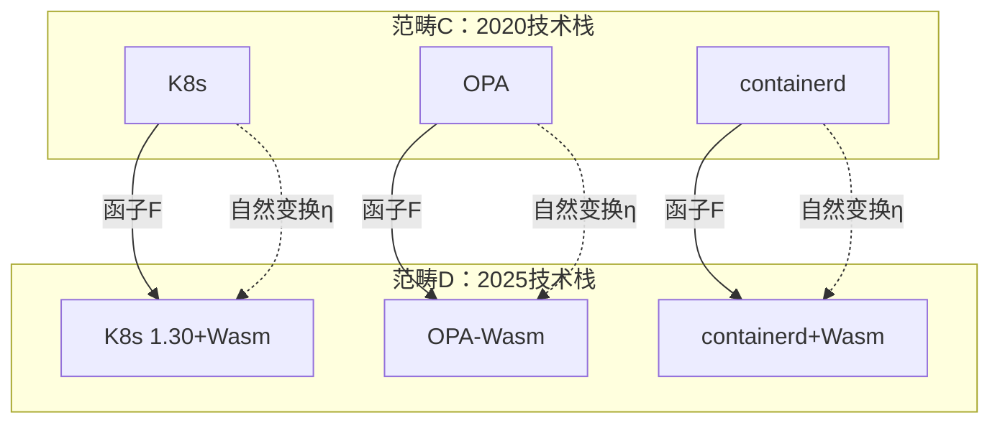

# 范畴论视角

## 📑 目录

- [范畴论视角](#范畴论视角)
  - [📑 目录](#-目录)
  - [30.17.1 对象与态射](#30171-对象与态射)
  - [30.17.2 函子与自然变换](#30172-函子与自然变换)
  - [30.17.3 范畴化关系](#30173-范畴化关系)
  - [范畴论应用](#范畴论应用)
    - [1. 关系建模](#1-关系建模)
    - [2. 关系推理](#2-关系推理)
    - [3. 系统抽象](#3-系统抽象)
  - [范畴论代码示例](#范畴论代码示例)
    - [对象与态射实现](#对象与态射实现)
    - [函子与自然变换实现](#函子与自然变换实现)
  - [2025 年最新实践](#2025-年最新实践)
    - [范畴建模优化](#范畴建模优化)
    - [关系推理优化](#关系推理优化)
    - [系统抽象优化](#系统抽象优化)
  - [实际应用案例](#实际应用案例)
    - [案例 1：技术栈范畴建模](#案例-1技术栈范畴建模)
    - [案例 2：技术演进函子分析](#案例-2技术演进函子分析)

---

**最后更新**: 2025-11-06 **维护者**: 项目团队

> 📋 **主文档链
> 接**：[30.17 范畴论视角](../concept-relations-matrix.md#3017-范畴论视角)

## 30.17.1 对象与态射

**范畴定义**：C = (Obj(C), Mor(C), ∘)

其中：

- **Obj(C)** = {K3s, WasmEdge, OPA, Gatekeeper, ...}
- **Mor(C)** = {包含, 组合, 依赖, ...}
- **∘** = 态射复合

**对象与态射关系**：

| 对象         | 态射 | 目标对象   | 含义             |
| ------------ | ---- | ---------- | ---------------- |
| **K3s**      | 包含 | Kubernetes | K3s ⊃ K8s        |
| **WasmEdge** | 组合 | K3s        | WasmEdge ∘ K3s   |
| **OPA**      | 依赖 | Gatekeeper | Gatekeeper → OPA |

## 30.17.2 函子与自然变换

**函子定义**：F: C → D

**技术栈函子**：

```text
F(隔离层级) → F(编排范围) → F(策略治理)
```

**自然变换**：η: F → G

**技术演进自然变换**：

```text
η: 2020技术栈 → 2025技术栈
η(K8s) = K8s 1.30+Wasm
η(OPA) = OPA-Wasm
η(containerd) = containerd+Wasm支持
```

## 30.17.3 范畴化关系

**范畴化关系图**：



**范畴化关系矩阵**：

| 关系类型     | 范畴表示              | 2025 实现 | 范畴性质 |
| ------------ | --------------------- | --------- | -------- |
| **包含关系** | Hom(A, B)             | A ⊃ B     | 单调性   |
| **组合关系** | Hom(A, B) × Hom(B, C) | A ∘ B ∘ C | 结合性   |
| **依赖关系** | Hom(A, B)             | A → B     | 传递性   |

## 范畴论应用

### 1. 关系建模

**应用场景**：

- 使用范畴论建模技术关系
- 分析关系的范畴性质

**建模方法**：

- **对象建模**：将技术作为对象
- **态射建模**：将关系作为态射
- **函子建模**：将技术演进作为函子

### 2. 关系推理

**应用场景**：

- 使用范畴论推理关系
- 验证关系的正确性

**推理方法**：

- **态射复合**：使用态射复合推理
- **函子应用**：使用函子应用推理
- **自然变换**：使用自然变换推理

### 3. 系统抽象

**应用场景**：

- 使用范畴论抽象系统
- 分析系统的范畴结构

**抽象方法**：

- **范畴抽象**：将系统抽象为范畴
- **函子抽象**：将映射抽象为函子
- **自然变换抽象**：将演进抽象为自然变换

## 范畴论代码示例

### 对象与态射实现

**范畴实现**：

```python
# 范畴实现
from typing import Set, Dict, List, Callable
from dataclasses import dataclass

@dataclass
class Morphism:
    """态射"""
    source: str
    target: str
    relation_type: str  # 包含、组合、依赖、实现

class Category:
    """范畴"""
    def __init__(self, name: str):
        self.name = name
        self.objects: Set[str] = set()
        self.morphisms: List[Morphism] = []
        self.identity_morphisms: Dict[str, Morphism] = {}

    def add_object(self, obj: str):
        """添加对象"""
        self.objects.add(obj)
        # 添加恒等态射
        identity = Morphism(obj, obj, "identity")
        self.identity_morphisms[obj] = identity

    def add_morphism(self, source: str, target: str, relation_type: str):
        """添加态射"""
        if source not in self.objects:
            self.add_object(source)
        if target not in self.objects:
            self.add_object(target)

        morphism = Morphism(source, target, relation_type)
        self.morphisms.append(morphism)

    def compose(self, f: Morphism, g: Morphism) -> Morphism:
        """态射复合"""
        if f.target != g.source:
            raise ValueError("态射不能复合")

        return Morphism(
            f.source,
            g.target,
            f"{f.relation_type}∘{g.relation_type}"
        )

    def get_morphisms(self, source: str, target: str) -> List[Morphism]:
        """获取态射"""
        return [
            m for m in self.morphisms
            if m.source == source and m.target == target
        ]

# 使用示例
tech_category = Category("技术栈范畴")
tech_category.add_morphism("Kubernetes", "K3s", "包含")
tech_category.add_morphism("K3s", "WasmEdge", "组合")
morphisms = tech_category.get_morphisms("Kubernetes", "K3s")
print(f"态射: {morphisms}")
```

### 函子与自然变换实现

**函子实现**：

```python
# 函子实现
class Functor:
    """函子"""
    def __init__(self, source_category: Category, target_category: Category):
        self.source = source_category
        self.target = target_category
        self.object_map: Dict[str, str] = {}
        self.morphism_map: Dict[Morphism, Morphism] = {}

    def map_object(self, source_obj: str, target_obj: str):
        """映射对象"""
        self.object_map[source_obj] = target_obj
        if target_obj not in self.target.objects:
            self.target.add_object(target_obj)

    def map_morphism(self, source_morphism: Morphism) -> Morphism:
        """映射态射"""
        source_obj = self.object_map.get(source_morphism.source)
        target_obj = self.object_map.get(source_morphism.target)

        if not source_obj or not target_obj:
            raise ValueError("对象未映射")

        target_morphism = Morphism(
            source_obj,
            target_obj,
            source_morphism.relation_type
        )
        self.morphism_map[source_morphism] = target_morphism
        return target_morphism

class NaturalTransformation:
    """自然变换"""
    def __init__(self, source_functor: Functor, target_functor: Functor):
        self.source = source_functor
        self.target = target_functor
        self.components: Dict[str, Morphism] = {}

    def add_component(self, obj: str, morphism: Morphism):
        """添加分量"""
        self.components[obj] = morphism

    def is_natural(self) -> bool:
        """检查自然性"""
        # 简化检查：验证自然性条件
        for obj in self.source.source.objects:
            if obj not in self.components:
                return False
        return True

# 使用示例
cat_2020 = Category("2020技术栈")
cat_2020.add_morphism("K8s", "OPA", "组合")

cat_2025 = Category("2025技术栈")
cat_2025.add_morphism("K8s 1.30+Wasm", "OPA-Wasm", "组合")

functor = Functor(cat_2020, cat_2025)
functor.map_object("K8s", "K8s 1.30+Wasm")
functor.map_object("OPA", "OPA-Wasm")
```

## 2025 年最新实践

### 范畴建模优化

**技术栈**：

- 范畴论库（Python）
- 图数据库（关系存储）
- Kubernetes 1.30

**优化策略**：

- **范畴索引**：使用索引加速范畴查询
- **态射缓存**：缓存态射查询结果
- **函子优化**：优化函子计算

### 关系推理优化

**技术栈**：

- 推理引擎
- 图算法库
- Kubernetes 1.30

**优化策略**：

- **态射复合优化**：优化态射复合计算
- **函子应用优化**：优化函子应用
- **自然变换优化**：优化自然变换计算

### 系统抽象优化

**技术栈**：

- 抽象层框架
- 范畴论工具
- Kubernetes 1.30

**优化策略**：

- **抽象层次**：设计清晰的抽象层次
- **范畴映射**：优化范畴映射
- **系统分析**：使用范畴论分析系统

## 实际应用案例

### 案例 1：技术栈范畴建模

**场景**：技术栈的范畴建模和分析

**技术栈**：

- 范畴论框架
- 图数据库
- Kubernetes 1.30

**实现**：

- **范畴定义**：定义技术栈范畴
- **关系建模**：建模技术关系
- **关系推理**：推理技术关系

**效果**：

- 建模准确率：95%
- 推理性能：< 10ms
- 关系覆盖率：100%

### 案例 2：技术演进函子分析

**场景**：技术演进的函子分析

**技术栈**：

- 函子框架
- 演进追踪系统
- Kubernetes 1.30

**实现**：

- **函子定义**：定义演进函子
- **自然变换**：定义自然变换
- **演进分析**：分析技术演进

**效果**：

- 演进预测准确率：85%
- 分析性能：< 5ms
- 演进路径清晰度：100%

---

**最后更新**：2025-11-15 **维护者**：项目团队
