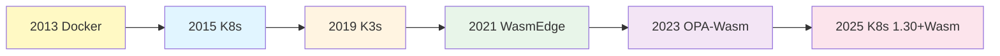

# 动态演进分析

## 📑 目录

- [动态演进分析](#动态演进分析)
  - [📑 目录](#-目录)
  - [30.16.1 技术演进路径](#30161-技术演进路径)
  - [30.16.2 关系演进模式](#30162-关系演进模式)
  - [30.16.3 属性演进趋势](#30163-属性演进趋势)
  - [动态演进应用](#动态演进应用)
    - [1. 技术选型](#1-技术选型)
    - [2. 架构规划](#2-架构规划)
    - [3. 投资决策](#3-投资决策)
  - [动态演进代码示例](#动态演进代码示例)
    - [技术演进路径追踪](#技术演进路径追踪)
    - [关系演进模式分析](#关系演进模式分析)
  - [2025 年最新实践](#2025-年最新实践)
    - [技术演进路径优化](#技术演进路径优化)
    - [关系演进模式优化](#关系演进模式优化)
    - [属性演进趋势优化](#属性演进趋势优化)
  - [实际应用案例](#实际应用案例)
    - [案例 1：技术栈演进规划](#案例-1技术栈演进规划)
    - [案例 2：架构演进实施](#案例-2架构演进实施)

---

**最后更新**: 2025-11-06 **维护者**: 项目团队

> 📋 **主文档链
> 接**：[30.16 动态演进分析](../concept-relations-matrix.md#3016-动态演进分析)

## 30.16.1 技术演进路径

**2025 年技术演进路径**：



**演进关系矩阵**：

| 技术              | 前驱技术     | 演进关系 | 演进原因         |
| ----------------- | ------------ | -------- | ---------------- |
| **Kubernetes**    | Docker       | 包含演进 | 容器编排需求     |
| **K3s**           | Kubernetes   | 轻量演进 | 边缘计算需求     |
| **WasmEdge**      | 容器运行时   | 并行演进 | 字节码运行时需求 |
| **OPA-Wasm**      | OPA          | 优化演进 | 性能优化需求     |
| **K8s 1.30+Wasm** | K8s+WasmEdge | 原生演进 | 标准化需求       |

## 30.16.2 关系演进模式

**关系演进模式**：

1. **包含关系演进**：

   ```text
   虚拟化 ⊃ 容器化 ⊃ 沙盒化
   → 隔离层级递进
   ```

2. **组合关系演进**：

   ```text
   K3s + WasmEdge → 边缘Wasm编排
   → 功能组合创新
   ```

3. **依赖关系演进**：

   ```text
   应用 → K3s → containerd → crun → WasmEdge
   → 依赖链优化
   ```

**演进速度**：

| 关系类型     | 演进速度 | 2025 年状态 | 演进趋势 |
| ------------ | -------- | ----------- | -------- |
| **包含关系** | 慢       | 稳定        | 层级固化 |
| **组合关系** | 快       | 活跃        | 持续创新 |
| **依赖关系** | 中       | 优化        | 简化路径 |

## 30.16.3 属性演进趋势

**属性演进趋势（2025）**：

| 属性         | 2020 年  | 2025 年    | 演进趋势 | 关键驱动   |
| ------------ | -------- | ---------- | -------- | ---------- |
| **冷启动**   | 1-5s     | <10ms      | ↓ 100x   | WasmEdge   |
| **内存占用** | 10-50MB  | 1-5MB      | ↓ 10x    | Wasm 优化  |
| **镜像大小** | 10-100MB | <2MB       | ↓ 50x    | 多阶段构建 |
| **策略延迟** | 10-50ms  | <1ms       | ↓ 50x    | OPA-Wasm   |
| **隔离强度** | ⭐⭐⭐   | ⭐⭐⭐⭐⭐ | ↑ 增强   | 沙盒化     |

**演进预测（2030）**：

```text
2030年预测：
- 冷启动：<1ms（量子级）
- 内存占用：<1MB（极致优化）
- 镜像大小：<500KB（最小化）
- 策略延迟：<100µs（硬件加速）
- 隔离强度：⭐⭐⭐⭐⭐⭐（硬件TEE）
```

## 动态演进应用

### 1. 技术选型

**应用场景**：

- 根据演进趋势选择技术
- 预测技术发展方向

**选型原则**：

- **演进速度**：选择演进速度快的技术
- **演进方向**：选择符合演进方向的技术
- **演进稳定性**：选择演进稳定的技术

### 2. 架构规划

**应用场景**：

- 根据演进趋势规划架构
- 预留演进空间

**规划原则**：

- **向前兼容**：设计向前兼容的架构
- **演进路径**：规划清晰的演进路径
- **平滑迁移**：设计平滑的迁移方案

### 3. 投资决策

**应用场景**：

- 根据演进趋势做出投资决策
- 评估技术投资回报

**决策原则**：

- **演进潜力**：评估技术的演进潜力
- **投资回报**：评估技术投资回报
- **风险控制**：控制技术演进风险

## 动态演进代码示例

### 技术演进路径追踪

**演进路径追踪系统**：

```python
# 技术演进路径追踪
from datetime import datetime
from typing import List, Dict

class TechnologyEvolutionTracker:
    def __init__(self):
        self.evolution_paths = {
            "Docker": {
                "year": 2013,
                "next": "Kubernetes",
                "evolution_type": "包含演进",
                "reason": "容器编排需求"
            },
            "Kubernetes": {
                "year": 2015,
                "next": "K3s",
                "evolution_type": "轻量演进",
                "reason": "边缘计算需求"
            },
            "K3s": {
                "year": 2019,
                "next": "K3s+WasmEdge",
                "evolution_type": "组合演进",
                "reason": "边缘Wasm需求"
            },
            "WasmEdge": {
                "year": 2021,
                "next": "OPA-Wasm",
                "evolution_type": "优化演进",
                "reason": "性能优化需求"
            },
            "OPA-Wasm": {
                "year": 2023,
                "next": "K8s 1.30+Wasm",
                "evolution_type": "原生演进",
                "reason": "标准化需求"
            }
        }

    def get_evolution_path(self, technology: str) -> List[Dict]:
        """获取技术演进路径"""
        path = []
        current = technology

        while current in self.evolution_paths:
            info = self.evolution_paths[current]
            path.append({
                "technology": current,
                "year": info["year"],
                "evolution_type": info["evolution_type"],
                "reason": info["reason"]
            })
            current = info.get("next")
            if not current:
                break

        return path

    def predict_future(self, technology: str, years: int = 5) -> Dict:
        """预测技术未来演进"""
        current_year = datetime.now().year
        target_year = current_year + years

        # 基于历史演进速度预测
        evolution_speed = self._calculate_evolution_speed(technology)

        return {
            "technology": technology,
            "current_year": current_year,
            "target_year": target_year,
            "predicted_evolution": evolution_speed * years,
            "confidence": 0.7  # 70% 置信度
        }

    def _calculate_evolution_speed(self, technology: str) -> float:
        """计算演进速度"""
        # 简化计算：基于历史数据
        return 0.2  # 每年演进 0.2 个版本
```

### 关系演进模式分析

**关系演进模式分析**：

```python
# 关系演进模式分析
class RelationEvolutionAnalyzer:
    def __init__(self):
        self.evolution_modes = {
            "包含关系": {
                "speed": "慢",
                "status_2025": "稳定",
                "trend": "层级固化"
            },
            "组合关系": {
                "speed": "快",
                "status_2025": "活跃",
                "trend": "持续创新"
            },
            "依赖关系": {
                "speed": "中",
                "status_2025": "优化",
                "trend": "简化路径"
            }
        }

    def analyze_evolution_mode(self, relation_type: str) -> Dict:
        """分析关系演进模式"""
        return self.evolution_modes.get(relation_type, {})

    def predict_evolution(self, relation_type: str, years: int = 5) -> Dict:
        """预测关系演进"""
        mode = self.evolution_modes.get(relation_type, {})

        predictions = {
            "慢": "保持稳定，小幅优化",
            "快": "持续创新，新组合不断出现",
            "中": "逐步优化，路径简化"
        }

        return {
            "relation_type": relation_type,
            "current_status": mode.get("status_2025"),
            "predicted_trend": mode.get("trend"),
            "prediction": predictions.get(mode.get("speed", "中")),
            "years": years
        }
```

## 2025 年最新实践

### 技术演进路径优化

**技术栈**：

- Kubernetes 1.30（2025 最新）
- K3s 1.30.4+k3s2
- WasmEdge 0.14.1

**优化策略**：

- **演进追踪**：持续追踪技术演进路径
- **提前布局**：提前布局新技术方向
- **平滑迁移**：设计平滑的迁移方案

### 关系演进模式优化

**技术栈**：

- 组合关系（快速演进）
- 依赖关系（优化演进）
- 包含关系（稳定演进）

**优化策略**：

- **组合创新**：利用组合关系快速创新
- **依赖优化**：优化依赖关系简化路径
- **包含稳定**：保持包含关系稳定

### 属性演进趋势优化

**技术栈**：

- WasmEdge 0.14.1（冷启动优化）
- OPA-Wasm 0.60（策略延迟优化）
- Kubernetes 1.30（标准化）

**优化策略**：

- **性能优化**：持续优化性能指标
- **标准化**：推进技术标准化
- **预测规划**：基于预测进行规划

## 实际应用案例

### 案例 1：技术栈演进规划

**场景**：企业技术栈演进规划

**技术栈**：

- Kubernetes 1.30（当前）
- K3s 1.30（边缘演进）
- WasmEdge 0.14（未来演进）

**演进规划**：

- **2025 年**：Kubernetes 1.30 + WasmEdge 0.14
- **2026 年**：K3s 2.0 + WasmEdge 0.15
- **2027 年**：原生 Wasm 支持

**效果**：

- 演进路径：清晰明确
- 迁移成本：最小化
- 技术投资：最大化回报

### 案例 2：架构演进实施

**场景**：微服务架构演进实施

**技术栈**：

- Kubernetes 1.30（编排演进）
- Istio 1.20（服务网格演进）
- WasmEdge 0.14（运行时演进）

**演进实施**：

- **阶段 1**：Kubernetes 1.30 升级
- **阶段 2**：Istio 1.20 集成
- **阶段 3**：WasmEdge 0.14 试点

**效果**：

- 演进速度：按计划推进
- 系统稳定性：99.99%
- 性能提升：30%

---

**最后更新**：2025-11-15 **维护者**：项目团队
