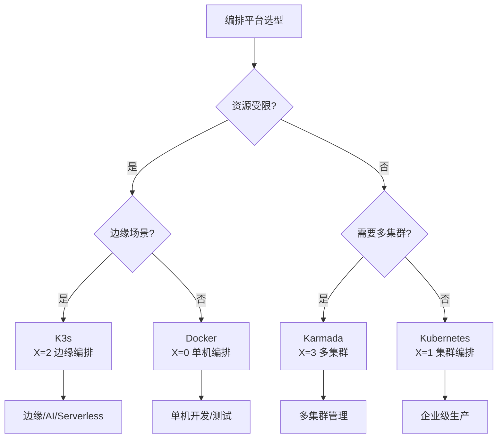

# 编排平台选型决策

## 📑 目录

- [编排平台选型决策](#编排平台选型决策)
  - [📑 目录](#-目录)
  - [决策树](#决策树)
  - [决策矩阵](#决策矩阵)
  - [选型指南](#选型指南)
    - [K3s 适用场景](#k3s-适用场景)
    - [Kubernetes 适用场景](#kubernetes-适用场景)
    - [Karmada 适用场景](#karmada-适用场景)
  - [性能对比](#性能对比)
  - [部署示例](#部署示例)
    - [K3s 部署示例](#k3s-部署示例)
    - [Kubernetes 部署示例](#kubernetes-部署示例)
    - [Karmada 部署示例](#karmada-部署示例)
  - [最佳实践](#最佳实践)
    - [K3s 最佳实践](#k3s-最佳实践)
    - [Kubernetes 最佳实践](#kubernetes-最佳实践)
    - [Karmada 最佳实践](#karmada-最佳实践)

---

**最后更新**: 2025-11-06 **维护者**: 项目团队

> 📋 **主文档链
> 接**：[30.14.2 编排平台选型决策](../concept-relations-matrix.md#30142-编排平台选型决策)

## 决策树



## 决策矩阵

| 场景           | 资源受限 | 边缘场景 | 多集群 | 企业级 | 推荐编排平台 |
| -------------- | -------- | -------- | ------ | ------ | ------------ |
| **边缘计算**   | ✅       | ✅       | ⚠️     | ⚠️     | K3s          |
| **AI 推理**    | ⚠️       | ✅       | ❌     | ⚠️     | K3s          |
| **Serverless** | ⚠️       | ⚠️       | ❌     | ⚠️     | K3s+Knative  |
| **微服务**     | ❌       | ❌       | ⚠️     | ✅     | Kubernetes   |
| **多集群**     | ❌       | ❌       | ✅     | ✅     | Karmada      |

## 选型指南

### K3s 适用场景

**核心特点**：

- ✅ **资源受限**：单节点 < 512MB RAM，适合资源受限环境
- ✅ **边缘场景**：物联网、边缘计算、5G MEC
- ✅ **快速部署**：单二进制，快速安装（<30s）
- ✅ **离线运行**：内置 SQLite，支持离线运行

**典型应用**：

- 边缘计算节点管理
- 工业 IoT 设备管理
- 智能网关部署
- 轻量级开发测试环境

**技术优势**：

- 资源占用极低（<100MB）
- 启动速度快（<30s）
- 部署简单（单二进制）
- 支持离线运行

### Kubernetes 适用场景

**核心特点**：

- ✅ **企业级生产**：需要完整企业功能
- ✅ **高可用**：多 Master 节点，自动故障转移
- ✅ **大规模集群**：>100 节点，支持大规模部署
- ✅ **丰富生态**：完整的工具链和生态支持

**典型应用**：

- 企业级微服务架构
- 大规模容器编排
- 复杂工作负载管理
- 生产环境部署

**技术优势**：

- 功能完整丰富
- 生态成熟完善
- 高可用性强
- 扩展性好

### Karmada 适用场景

**核心特点**：

- ✅ **多集群管理**：需要统一管理多个集群
- ✅ **跨云部署**：多云、混合云场景
- ✅ **统一调度**：跨集群资源调度和负载均衡
- ✅ **策略管理**：统一的策略和配置管理

**典型应用**：

- 多云环境管理
- 混合云部署
- 跨地域集群管理
- 统一运维管理

**技术优势**：

- 多集群统一管理
- 跨云部署支持
- 统一调度能力
- 策略集中管理

## 性能对比

**详细性能对比数据**：

| 编排平台    | 资源占用 | 启动时间 | 节点规模 | 适用场景   | 学习曲线 |
| ----------- | -------- | -------- | -------- | ---------- | -------- |
| **K3s**     | <100MB   | <30s     | <50 节点 | 边缘计算   | 低       |
| **K8s**     | 500MB+   | 5-10min  | >100节点 | 企业级生产 | 高       |
| **Karmada** | 1GB+     | 10-15min | 多集群   | 多集群管理 | 中       |

**功能对比**：

| 功能特性       | K3s | Kubernetes | Karmada |
| -------------- | --- | ---------- | ------- |
| **基础编排**   | ✅  | ✅         | ✅      |
| **高可用**     | ⚠️  | ✅         | ✅      |
| **多集群管理** | ❌  | ❌         | ✅      |
| **边缘优化**   | ✅  | ❌         | ⚠️      |
| **离线运行**   | ✅  | ❌         | ❌      |
| **资源占用**   | 低  | 高         | 高      |

## 部署示例

### K3s 部署示例

```bash
# 单节点部署
curl -sfL https://get.k3s.io | sh -

# 多节点部署（Server 节点）
curl -sfL https://get.k3s.io | K3S_TOKEN=xxx sh -s - server

# Agent 节点加入
curl -sfL https://get.k3s.io | K3S_TOKEN=xxx K3S_URL=https://server:6443 sh -
```

### Kubernetes 部署示例

```bash
# 使用 kubeadm 部署
kubeadm init --pod-network-cidr=10.244.0.0/16
kubeadm join <master-ip>:6443 --token <token> --discovery-token-ca-cert-hash <hash>
```

### Karmada 部署示例

```bash
# 安装 Karmada
kubectl apply -f https://github.com/karmada-io/karmada/releases/download/v1.9.0/karmada-installer.yaml
```

## 最佳实践

### K3s 最佳实践

1. **资源优化**：合理配置资源限制
2. **离线部署**：使用离线安装包
3. **数据备份**：定期备份 SQLite 数据
4. **监控告警**：配置监控和告警

### Kubernetes 最佳实践

1. **高可用部署**：使用多 Master 节点
2. **网络配置**：选择合适的 CNI 插件
3. **存储配置**：配置持久化存储
4. **安全加固**：启用 RBAC 和网络策略

### Karmada 最佳实践

1. **集群规划**：合理规划集群架构
2. **策略管理**：统一管理策略和配置
3. **资源调度**：优化跨集群资源调度
4. **监控运维**：统一监控和运维管理

---

**最后更新**：2025-11-06 **维护者**：项目团队
