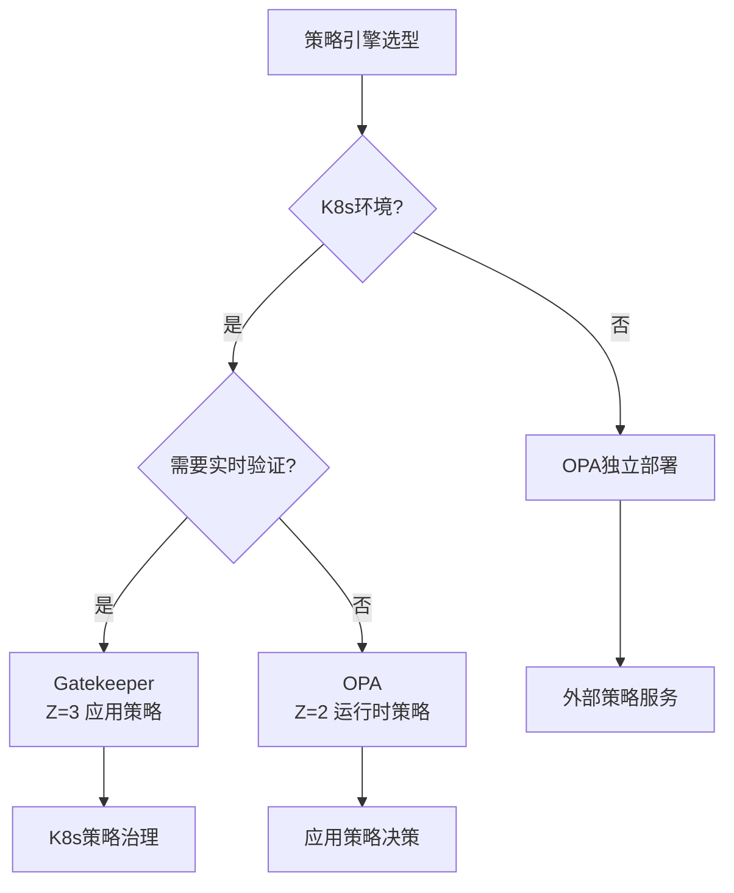

# 策略引擎选型决策

## 📑 目录

- [📑 目录](#-目录)
- [决策树](#决策树)
- [决策矩阵](#决策矩阵)
- [选型指南](#选型指南)
  - [Gatekeeper 适用场景](#gatekeeper-适用场景)
  - [OPA-Wasm 适用场景](#opa-wasm-适用场景)
  - [OPA 原生适用场景](#opa-原生适用场景)
- [性能对比](#性能对比)

---

**最后更新**: 2025-11-06 **维护者**: 项目团队

> 📋 **主文档链
> 接**：[30.14.3 策略引擎选型决策](../concept-relations-matrix.md#30143-策略引擎选型决策)

## 决策树

## 决策矩阵

| 场景             | K8s 环境 | 实时验证 | 高性能 | Wasm 支持 | 推荐策略引擎 |
| ---------------- | -------- | -------- | ------ | --------- | ------------ |
| **K8s 策略治理** | ✅       | ✅       | ⚠️     | ✅        | Gatekeeper   |
| **应用策略**     | ⚠️       | ❌       | ✅     | ✅        | OPA-Wasm     |
| **运行时策略**   | ❌       | ❌       | ✅     | ❌        | OPA          |
| **外部策略**     | ❌       | ❌       | ⚠️     | ❌        | OPA 独立部署 |

## 选型指南

### Gatekeeper 适用场景

- ✅ **K8s 环境**：需要 Kubernetes 集成
- ✅ **实时验证**：需要 Admission Controller
- ✅ **策略治理**：需要统一策略管理

### OPA-Wasm 适用场景

- ✅ **高性能**：需要 <1ms 策略执行
- ✅ **Wasm 支持**：需要 Wasm 编译策略
- ✅ **边缘场景**：资源受限环境

### OPA 原生适用场景

- ✅ **独立部署**：非 K8s 环境
- ✅ **通用策略**：需要通用策略引擎

## 性能对比

| 策略引擎       | 执行延迟 | Wasm 支持 | K8s 集成 |
| -------------- | -------- | --------- | -------- |
| **Gatekeeper** | 10-50ms  | ✅        | ✅       |
| **OPA-Wasm**   | <1ms     | ✅        | ⚠️       |
| **OPA**        | 10-50ms  | ❌        | ❌       |

---

**最后更新**：2025-11-06 **维护者**：项目团队
