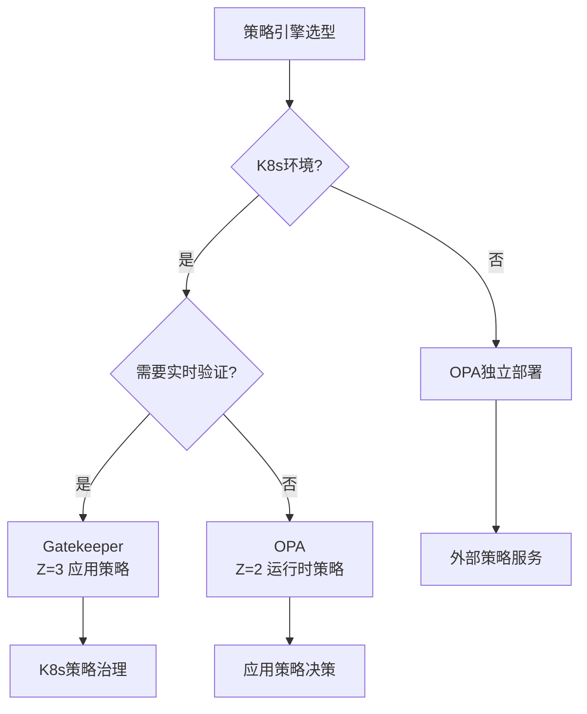

# 策略引擎选型决策

## 📑 目录

- [策略引擎选型决策](#策略引擎选型决策)
  - [📑 目录](#-目录)
  - [决策树](#决策树)
  - [决策矩阵](#决策矩阵)
  - [选型指南](#选型指南)
    - [Gatekeeper 适用场景](#gatekeeper-适用场景)
    - [OPA-Wasm 适用场景](#opa-wasm-适用场景)
    - [OPA 原生适用场景](#opa-原生适用场景)
  - [性能对比](#性能对比)
  - [部署示例](#部署示例)
    - [Gatekeeper 部署示例](#gatekeeper-部署示例)
    - [OPA-Wasm 部署示例](#opa-wasm-部署示例)
    - [OPA 原生部署示例](#opa-原生部署示例)
  - [最佳实践](#最佳实践)
    - [Gatekeeper 最佳实践](#gatekeeper-最佳实践)
    - [OPA-Wasm 最佳实践](#opa-wasm-最佳实践)
    - [OPA 原生最佳实践](#opa-原生最佳实践)

---

**最后更新**: 2025-11-06 **维护者**: 项目团队

> 📋 **主文档链
> 接**：[30.14.3 策略引擎选型决策](../concept-relations-matrix.md#30143-策略引擎选型决策)

## 决策树



## 决策矩阵

| 场景             | K8s 环境 | 实时验证 | 高性能 | Wasm 支持 | 推荐策略引擎 |
| ---------------- | -------- | -------- | ------ | --------- | ------------ |
| **K8s 策略治理** | ✅       | ✅       | ⚠️     | ✅        | Gatekeeper   |
| **应用策略**     | ⚠️       | ❌       | ✅     | ✅        | OPA-Wasm     |
| **运行时策略**   | ❌       | ❌       | ✅     | ❌        | OPA          |
| **外部策略**     | ❌       | ❌       | ⚠️     | ❌        | OPA 独立部署 |

## 选型指南

### Gatekeeper 适用场景

**核心特点**：

- ✅ **K8s 环境**：需要 Kubernetes 集成，原生支持
- ✅ **实时验证**：需要 Admission Controller，实时策略验证
- ✅ **策略治理**：需要统一策略管理，CRD 方式管理策略
- ✅ **策略即代码**：使用 Rego 语言编写策略

**典型应用**：

- Kubernetes 准入控制
- 资源规范验证
- 安全策略执行
- 合规性检查

**技术优势**：

- 原生 K8s 集成
- 实时策略验证
- 策略即代码
- 支持 Wasm 编译

### OPA-Wasm 适用场景

**核心特点**：

- ✅ **高性能**：需要 <1ms 策略执行，比原生 OPA 快 10-50 倍
- ✅ **Wasm 支持**：需要 Wasm 编译策略，轻量级部署
- ✅ **边缘场景**：资源受限环境，低资源占用
- ✅ **低延迟**：毫秒级策略执行，适合实时场景

**典型应用**：

- 边缘计算策略执行
- 实时策略验证
- 低延迟策略决策
- 资源受限环境

**技术优势**：

- 极低执行延迟（<1ms）
- 低资源占用（<5MB）
- Wasm 格式，快速分发
- 支持热更新

### OPA 原生适用场景

**核心特点**：

- ✅ **独立部署**：非 K8s 环境，独立策略服务
- ✅ **通用策略**：需要通用策略引擎，支持多种场景
- ✅ **灵活部署**：支持多种部署方式
- ✅ **丰富功能**：完整的策略语言和工具链

**典型应用**：

- 微服务策略决策
- API 授权策略
- 数据访问策略
- 通用策略服务

**技术优势**：

- 通用策略引擎
- 灵活部署方式
- 丰富功能特性
- 成熟稳定

## 性能对比

**详细性能对比数据**：

| 策略引擎       | 执行延迟 | Wasm 支持 | K8s 集成 | 资源占用 | 策略格式 |
| -------------- | -------- | --------- | -------- | -------- | -------- |
| **Gatekeeper** | 10-50ms  | ✅        | ✅       | 50-100MB | Rego     |
| **OPA-Wasm**   | <1ms     | ✅        | ⚠️       | <5MB     | Rego→Wasm|
| **OPA**        | 10-50ms  | ❌        | ❌       | 50-100MB | Rego     |
| **Kyverno**    | 5-20ms   | ❌        | ✅       | 30-50MB  | YAML     |

**功能对比**：

| 功能特性         | Gatekeeper | OPA-Wasm | OPA   | Kyverno |
| ---------------- | ---------- | -------- | ----- | ------- |
| **K8s 集成**     | ✅         | ⚠️       | ❌    | ✅      |
| **实时验证**     | ✅         | ⚠️       | ❌    | ✅      |
| **高性能**       | ⚠️         | ✅       | ⚠️    | ⚠️      |
| **Wasm 支持**    | ✅         | ✅       | ❌    | ❌      |
| **策略即代码**   | ✅         | ✅       | ✅    | ⚠️      |
| **策略热更新**   | ⚠️         | ✅       | ⚠️    | ✅      |

## 部署示例

### Gatekeeper 部署示例

```bash
# 安装 Gatekeeper
kubectl apply -f https://raw.githubusercontent.com/open-policy-agent/gatekeeper/release-3.15/deploy/gatekeeper.yaml

# 创建策略模板
kubectl apply -f - <<EOF
apiVersion: templates.gatekeeper.sh/v1beta1
kind: ConstraintTemplate
metadata:
  name: k8srequiredlabels
spec:
  crd:
    spec:
      names:
        kind: K8sRequiredLabels
  targets:
    - target: admission.k8s.gatekeeper.sh
      rego: |
        package k8srequiredlabels
        violation[{"msg": msg}] {
          required := input.parameters.labels
          provided := input.review.object.metadata.labels
          missing := required - provided
          count(missing) > 0
          msg := sprintf("Missing required labels: %v", [missing])
        }
EOF
```

### OPA-Wasm 部署示例

```bash
# 编译策略为 Wasm
opa build -t wasm -e data.example.allow policy.rego

# 部署 OPA-Wasm
kubectl apply -f - <<EOF
apiVersion: v1
kind: Pod
metadata:
  name: opa-wasm
spec:
  runtimeClassName: wasm
  containers:
    - name: opa
      image: openpolicyagent/opa:latest-envoy
      command: ["opa", "run", "--server", "--set", "plugins.envoy_ext_authz_grpc.enable_wasm=true"]
EOF
```

### OPA 原生部署示例

```bash
# 部署 OPA 服务
docker run -d --name opa -p 8181:8181 openpolicyagent/opa run --server

# 加载策略
curl -X PUT http://localhost:8181/v1/policies/example -d @policy.rego

# 查询策略
curl -X POST http://localhost:8181/v1/data/example/allow -d @input.json
```

## 最佳实践

### Gatekeeper 最佳实践

1. **策略设计**：使用 ConstraintTemplate 定义策略模板
2. **策略测试**：使用 gator 工具测试策略
3. **性能优化**：优化 Rego 策略性能
4. **监控告警**：监控策略执行情况

### OPA-Wasm 最佳实践

1. **策略编译**：将策略编译为 Wasm 格式
2. **性能优化**：优化策略逻辑，减少执行时间
3. **热更新**：支持策略热更新，无需重启
4. **资源管理**：合理配置资源限制

### OPA 原生最佳实践

1. **策略组织**：合理组织策略文件
2. **策略测试**：使用 OPA test 工具测试策略
3. **性能优化**：优化 Rego 策略性能
4. **安全加固**：配置认证和授权

---

**最后更新**：2025-11-06 **维护者**：项目团队
