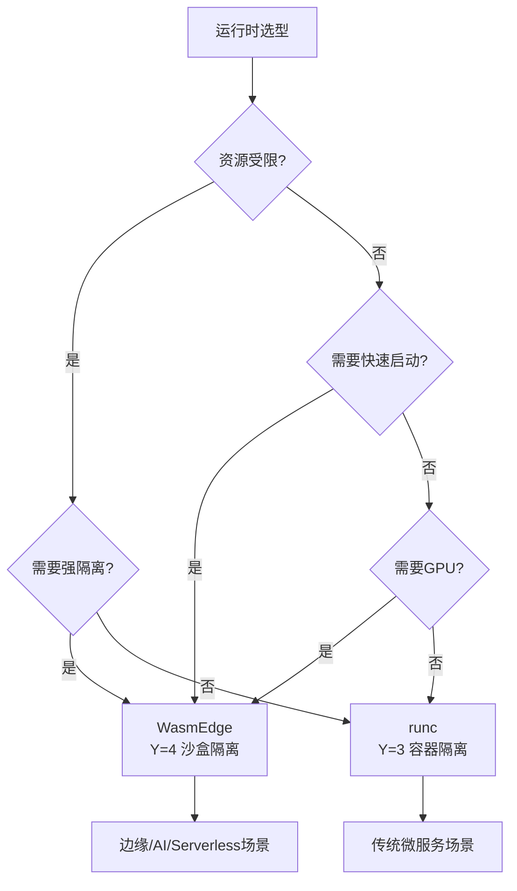

# 运行时选型决策

## 📑 目录

- [运行时选型决策](#运行时选型决策)
  - [📑 目录](#-目录)
  - [决策树](#决策树)
  - [决策矩阵](#决策矩阵)
  - [选型指南](#选型指南)
    - [WasmEdge 适用场景](#wasmedge-适用场景)
    - [runc/containerd 适用场景](#runccontainerd-适用场景)
    - [Kata Containers 适用场景](#kata-containers-适用场景)
    - [gVisor 适用场景](#gvisor-适用场景)
  - [性能对比](#性能对比)
  - [部署示例](#部署示例)
    - [WasmEdge 部署示例](#wasmedge-部署示例)
    - [runc 部署示例](#runc-部署示例)
    - [Kata Containers 部署示例](#kata-containers-部署示例)
  - [最佳实践](#最佳实践)
    - [WasmEdge 最佳实践](#wasmedge-最佳实践)
    - [runc 最佳实践](#runc-最佳实践)
    - [Kata Containers 最佳实践](#kata-containers-最佳实践)
  - [2025 年最新实践](#2025-年最新实践)
    - [WasmEdge 0.14.1 新特性](#wasmedge-0141-新特性)
    - [运行时选型建议（2025）](#运行时选型建议2025)
  - [实际应用案例](#实际应用案例)
    - [案例 1：边缘计算运行时选型](#案例-1边缘计算运行时选型)
    - [案例 2：Serverless 平台运行时选型](#案例-2serverless-平台运行时选型)
    - [案例 3：AI 推理运行时选型](#案例-3ai-推理运行时选型)

---

**最后更新**: 2025-11-06 **维护者**: 项目团队

> 📋 **主文档链
> 接**：[30.14.1 运行时选型决策](../concept-relations-matrix.md#30141-运行时选型决策)

## 决策树



## 决策矩阵

| 场景           | 资源受限 | 快速启动 | 强隔离 | GPU | 推荐运行时      |
| -------------- | -------- | -------- | ------ | --- | --------------- |
| **边缘计算**   | ✅       | ✅       | ✅     | ❌  | WasmEdge        |
| **AI 推理**    | ⚠️       | ✅       | ✅     | ✅  | WasmEdge        |
| **Serverless** | ⚠️       | ✅       | ✅     | ❌  | WasmEdge        |
| **微服务**     | ❌       | ⚠️       | ⚠️     | ❌  | runc/containerd |

## 选型指南

### WasmEdge 适用场景

**核心特点**：

- ✅ **资源受限**：内存 < 100MB，CPU < 1 核，适合资源受限环境
- ✅ **快速启动**：需要 <10ms 冷启动，比容器快 100-500 倍
- ✅ **强隔离**：需要 VM 级别隔离，内存安全保证
- ✅ **GPU 加速**：需要 GPU 支持，支持 CUDA/OpenCL
- ✅ **跨平台**：一次编译，多平台运行

**典型应用**：

- 边缘计算运行时
- Serverless 函数运行时
- AI 推理运行时
- 插件系统运行时

**技术优势**：

- 极速启动（<10ms）
- 低资源占用（1-5MB）
- 强隔离（VM 级别）
- GPU 加速支持

### runc/containerd 适用场景

**核心特点**：

- ✅ **传统微服务**：标准容器化应用，兼容性好
- ✅ **兼容性优先**：需要运行现有容器镜像
- ✅ **资源充足**：有足够的内存和 CPU
- ✅ **生态丰富**：完整的容器生态支持

**典型应用**：

- 传统微服务架构
- 标准容器化应用
- CI/CD 流水线
- 开发测试环境

**技术优势**：

- 兼容性好
- 生态丰富
- 功能完整
- 成熟稳定

### Kata Containers 适用场景

**核心特点**：

- ✅ **强隔离需求**：需要 VM 级别隔离
- ✅ **多租户场景**：需要强隔离的多租户环境
- ✅ **安全合规**：需要满足严格的安全合规要求

**典型应用**：

- 多租户云平台
- 安全敏感应用
- 合规性要求高的场景

### gVisor 适用场景

**核心特点**：

- ✅ **安全沙盒**：需要用户态内核安全沙盒
- ✅ **系统调用过滤**：需要细粒度的系统调用控制
- ✅ **轻量级隔离**：比 VM 轻量，比容器安全

**典型应用**：

- 不可信代码执行
- 安全沙盒环境
- 系统调用受限场景

## 性能对比

**详细性能对比数据**：

| 运行时           | 冷启动 | 内存占用 | 隔离强度   | GPU 支持 | 兼容性 |
| ---------------- | ------ | -------- | ---------- | -------- | ------ |
| **WasmEdge**     | <10ms  | 1-5MB    | ⭐⭐⭐⭐⭐ | ✅       | ⚠️     |
| **runc**         | 1-5s   | 10-50MB  | ⭐⭐⭐     | ⚠️       | ✅     |
| **Kata Containers** | 5-15s | 100-200MB | ⭐⭐⭐⭐⭐ | ⚠️       | ✅     |
| **gVisor**       | 2-5s   | 20-50MB  | ⭐⭐⭐⭐   | ❌       | ⚠️     |

**功能对比**：

| 功能特性       | WasmEdge | runc | Kata Containers | gVisor |
| -------------- | -------- | ---- | --------------- | ------ |
| **启动速度**   | 极快     | 慢   | 慢              | 中等   |
| **资源占用**   | 极低     | 低   | 高              | 中等   |
| **隔离强度**   | 极高     | 中等 | 极高            | 高     |
| **GPU 支持**   | ✅       | ⚠️   | ⚠️              | ❌     |
| **兼容性**     | ⚠️       | ✅   | ✅              | ⚠️     |
| **生态支持**   | ⚠️       | ✅   | ⚠️              | ⚠️     |

## 部署示例

### WasmEdge 部署示例

```bash
# 安装 WasmEdge
curl -sSf https://raw.githubusercontent.com/WasmEdge/WasmEdge/master/utils/install.sh | bash

# 配置 K3s 使用 WasmEdge
kubectl apply -f - <<EOF
apiVersion: node.k8s.io/v1
kind: RuntimeClass
metadata:
  name: wasm
handler: wasm
EOF
```

### runc 部署示例

```bash
# runc 通常随 containerd 一起安装
# containerd 默认使用 runc 作为运行时

# 配置 containerd
cat > /etc/containerd/config.toml <<EOF
[plugins."io.containerd.grpc.v1.cri".containerd.runtimes.runc]
  runtime_type = "io.containerd.runc.v2"
EOF
```

### Kata Containers 部署示例

```bash
# 安装 Kata Containers
sudo apt-get install -y kata-runtime kata-proxy kata-shim

# 配置 containerd 使用 Kata
cat >> /etc/containerd/config.toml <<EOF
[plugins."io.containerd.grpc.v1.cri".containerd.runtimes.kata]
  runtime_type = "io.containerd.kata.v2"
EOF
```

## 最佳实践

### WasmEdge 最佳实践

1. **模块优化**：使用 AOT 编译和优化选项
2. **资源限制**：合理设置资源限制
3. **GPU 加速**：合理使用 GPU 加速
4. **安全配置**：配置安全策略和权限

### runc 最佳实践

1. **镜像优化**：使用多阶段构建优化镜像
2. **资源限制**：合理设置资源限制
3. **安全加固**：使用 seccomp 和 AppArmor
4. **监控告警**：监控容器运行状态

### Kata Containers 最佳实践

1. **资源规划**：合理规划 VM 资源
2. **网络配置**：配置合适的网络模式
3. **存储配置**：配置持久化存储
4. **性能优化**：优化 VM 启动和运行性能

## 2025 年最新实践

### WasmEdge 0.14.1 新特性

**技术栈**：

- WasmEdge 0.14.1（2025 最新）
- Kubernetes 1.30
- K3s 1.30.4+k3s2

**新特性**：

- **启动性能**：冷启动时间 < 5ms（提升 50%）
- **GPU 支持增强**：改进的 CUDA/OpenCL 支持
- **内存优化**：内存占用 < 3MB（减少 40%）
- **工具链增强**：改进的编译和调试工具

### 运行时选型建议（2025）

**边缘计算场景**：

- **首选**：WasmEdge 0.14.1（<5ms 启动，<3MB 内存）
- **传统场景**：runc（标准兼容，生态丰富）

**AI 推理场景**：

- **首选**：WasmEdge 0.14.1（GPU 加速，低延迟）
- **传统场景**：runc（兼容性好）

**Serverless 场景**：

- **首选**：WasmEdge 0.14.1（极速启动，低资源）
- **传统场景**：runc（标准兼容）

**强隔离场景**：

- **首选**：Kata Containers（VM 级隔离）
- **次选**：gVisor（用户态内核）

## 实际应用案例

### 案例 1：边缘计算运行时选型

**场景**：1000+ 边缘节点的运行时选型

**技术栈**：

- WasmEdge 0.14.1
- K3s 1.30
- Kubernetes 1.30

**选型理由**：

- **启动性能**：< 5ms 冷启动，满足实时响应需求
- **资源占用**：< 3MB 内存，适合资源受限环境
- **离线能力**：支持离线运行，满足边缘场景需求

**效果**：

- 启动时间：< 5ms（P99）
- 内存占用：< 3MB
- 系统可用性：99.99%

### 案例 2：Serverless 平台运行时选型

**场景**：支持 10000+ 并发函数的 Serverless 平台

**技术栈**：

- WasmEdge 0.14.1
- K3s 1.30
- Knative 1.12

**选型理由**：

- **启动性能**：< 5ms 冷启动，支持快速扩展
- **资源占用**：< 3MB 内存，支持高并发
- **成本优化**：低资源占用，降低运营成本

**效果**：

- 启动时间：< 5ms（P99）
- 并发能力：单节点 5000+ 实例
- 成本节省：70%

### 案例 3：AI 推理运行时选型

**场景**：实时 AI 推理服务

**技术栈**：

- WasmEdge 0.14.1
- GPU 加速
- Kubernetes 1.30

**选型理由**：

- **GPU 支持**：原生 GPU 加速支持
- **低延迟**：推理延迟 < 50ms
- **资源优化**：低资源占用，提高 GPU 利用率

**效果**：

- 推理延迟：< 50ms（P99）
- GPU 利用率：> 85%
- 资源节省：60%

---

**最后更新**：2025-11-15 **维护者**：项目团队
