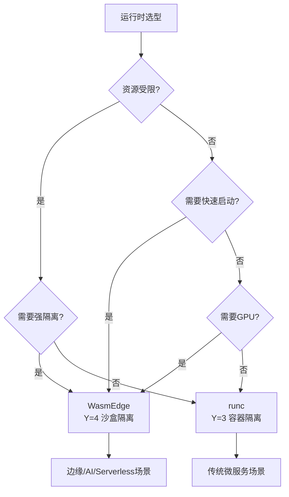

# 运行时选型决策

## 📑 目录

- [📑 目录](#-目录)
- [决策树](#决策树)
- [决策矩阵](#决策矩阵)
- [选型指南](#选型指南)
  - [WasmEdge 适用场景](#wasmedge-适用场景)
  - [runc/containerd 适用场景](#runccontainerd-适用场景)
- [性能对比](#性能对比)

---

**最后更新**: 2025-11-06 **维护者**: 项目团队

> 📋 **主文档链
> 接**：[30.14.1 运行时选型决策](../concept-relations-matrix.md#30141-运行时选型决策)

## 决策树

## 决策矩阵

| 场景           | 资源受限 | 快速启动 | 强隔离 | GPU | 推荐运行时      |
| -------------- | -------- | -------- | ------ | --- | --------------- |
| **边缘计算**   | ✅       | ✅       | ✅     | ❌  | WasmEdge        |
| **AI 推理**    | ⚠️       | ✅       | ✅     | ✅  | WasmEdge        |
| **Serverless** | ⚠️       | ✅       | ✅     | ❌  | WasmEdge        |
| **微服务**     | ❌       | ⚠️       | ⚠️     | ❌  | runc/containerd |

## 选型指南

### WasmEdge 适用场景

- ✅ **资源受限**：内存 < 100MB，CPU < 1 核
- ✅ **快速启动**：需要 <100ms 冷启动
- ✅ **强隔离**：需要 VM 级别隔离
- ✅ **GPU 加速**：需要 GPU 支持

### runc/containerd 适用场景

- ✅ **传统微服务**：标准容器化应用
- ✅ **兼容性优先**：需要运行现有容器镜像
- ✅ **资源充足**：有足够的内存和 CPU

## 性能对比

| 运行时       | 冷启动 | 内存占用 | 隔离强度   |
| ------------ | ------ | -------- | ---------- |
| **WasmEdge** | <10ms  | 1-5MB    | ⭐⭐⭐⭐⭐ |
| **runc**     | 1-5s   | 10-50MB  | ⭐⭐⭐     |

---

**最后更新**：2025-11-06 **维护者**：项目团队
