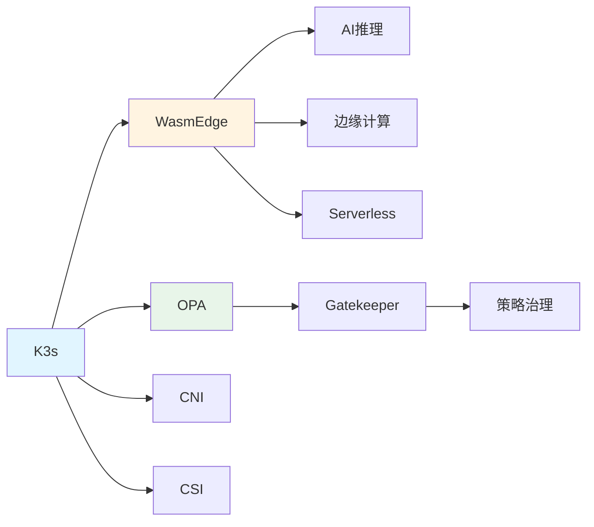

# 组合关系图谱

## 📑 目录

- [组合关系图谱](#组合关系图谱)
  - [📑 目录](#-目录)
  - [组合关系定义](#组合关系定义)
  - [组合关系示例](#组合关系示例)
    - [K3s 组合关系](#k3s-组合关系)
    - [WasmEdge 应用组合](#wasmedge-应用组合)
    - [策略组合关系](#策略组合关系)
  - [组合关系特性](#组合关系特性)
  - [组合关系应用](#组合关系应用)
    - [1. 技术栈组合](#1-技术栈组合)
    - [2. 架构设计](#2-架构设计)
    - [3. 性能优化](#3-性能优化)
  - [组合关系形式化](#组合关系形式化)
    - [组合关系定义](#组合关系定义-1)
    - [组合关系性质](#组合关系性质)
  - [实际应用案例](#实际应用案例)
    - [案例 1：边缘计算组合](#案例-1边缘计算组合)
    - [案例 2：微服务组合](#案例-2微服务组合)

---

**最后更新**: 2025-11-06 **维护者**: 项目团队

> 📋 **主文档链
> 接**：[30.7.2 组合关系图谱](../concept-relations-matrix.md#3072-组合关系图谱)

## 组合关系定义

**组合关系（∘）**：表示概念之间的组合关系，A ∘ B 表示 A 组合使用 B。



## 组合关系示例

### K3s 组合关系

- **K3s ∘ WasmEdge**：K3s 组合 WasmEdge 运行时
- **K3s ∘ OPA**：K3s 组合 OPA 策略引擎
- **K3s ∘ CNI**：K3s 组合 CNI 网络插件
- **K3s ∘ CSI**：K3s 组合 CSI 存储插件

### WasmEdge 应用组合

- **WasmEdge ∘ AI 推理**：WasmEdge 应用于 AI 推理场景
- **WasmEdge ∘ 边缘计算**：WasmEdge 应用于边缘计算场景
- **WasmEdge ∘ Serverless**：WasmEdge 应用于 Serverless 场景

### 策略组合关系

- **Gatekeeper ∘ OPA**：Gatekeeper 组合 OPA 进行策略执行
- **策略治理 ∘ Gatekeeper ∘ OPA**：多层次的策略组合

## 组合关系特性

**组合关系非传递性**：A ∘ B 和 B ∘ C 不意味着 A ∘ C

**组合关系可交换性**：某些组合可以交换顺序（如 CNI 和 CSI）

**组合关系结合性**：A ∘ (B ∘ C) = (A ∘ B) ∘ C

## 组合关系应用

### 1. 技术栈组合

**场景**：构建完整的技术栈

**示例**：

- **边缘计算栈**：K3s ∘ WasmEdge ∘ OPA
- **微服务栈**：K3s ∘ Istio ∘ WasmEdge ∘ OPA
- **AI 推理栈**：K3s ∘ WasmEdge ∘ Llama2 ∘ GPU

**组合原则**：

- 选择兼容的技术组合
- 优化组合顺序提升性能
- 考虑组合的复杂度

### 2. 架构设计

**场景**：设计系统架构时，利用组合关系

**示例**：

- **分层组合**：编排层 ∘ 运行时层 ∘ 策略层
- **功能组合**：计算 ∘ 存储 ∘ 网络
- **服务组合**：API 网关 ∘ 服务网格 ∘ 应用服务

**设计原则**：

- 模块化组合
- 松耦合设计
- 可替换组件

### 3. 性能优化

**场景**：通过优化组合关系提升性能

**示例**：

- **优化组合顺序**：K3s ∘ WasmEdge 比 WasmEdge ∘ K3s 性能更好
- **减少组合层数**：直接组合减少开销
- **并行组合**：某些组合可以并行执行

**优化原则**：

- 减少组合开销
- 优化组合顺序
- 利用并行组合

## 组合关系形式化

### 组合关系定义

```text
∘ : Concept × Concept → Concept
A ∘ B = C
```

**含义**：概念 A 组合概念 B 得到概念 C

### 组合关系性质

**结合律**：

```text
(A ∘ B) ∘ C = A ∘ (B ∘ C)
```

**交换律**（部分组合）：

```text
A ∘ B = B ∘ A  (当 A 和 B 可交换时)
```

**单位元**：

```text
A ∘ I = A  (I 是单位元)
```

## 实际应用案例

### 案例 1：边缘计算组合

**组合链**：

```text
K3s ∘ WasmEdge ∘ OPA = 边缘智能编排
```

**效果**：

- 轻量级编排（K3s）
- 快速启动（WasmEdge）
- 策略执行（OPA）

**性能指标**：

- 冷启动：< 10ms
- 资源占用：< 50MB
- 策略延迟：< 1ms

### 案例 2：微服务组合

**组合链**：

```text
K3s ∘ Istio ∘ WasmEdge ∘ OPA = 完整微服务栈
```

**效果**：

- 服务编排（K3s）
- 流量治理（Istio）
- 轻量运行时（WasmEdge）
- 策略治理（OPA）

**性能指标**：

- 服务间延迟：< 1ms
- 策略执行：< 1ms
- 资源利用率：> 80%

---

**最后更新**：2025-11-15 **维护者**：项目团队
