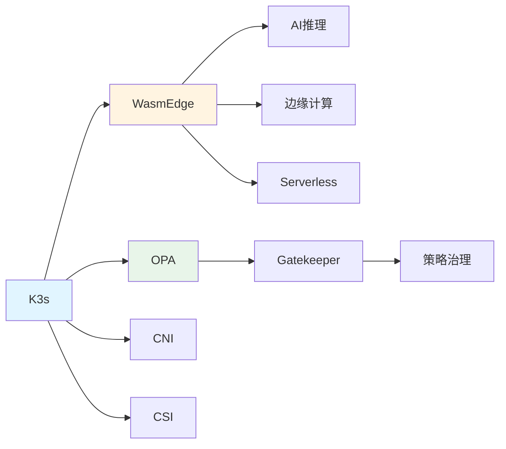

# 组合关系图谱

## 📑 目录

- [组合关系图谱](#组合关系图谱)
  - [📑 目录](#-目录)
  - [组合关系定义](#组合关系定义)
  - [组合关系示例](#组合关系示例)
    - [K3s 组合关系](#k3s-组合关系)
    - [WasmEdge 应用组合](#wasmedge-应用组合)
    - [策略组合关系](#策略组合关系)
  - [组合关系特性](#组合关系特性)

---

**最后更新**: 2025-11-06 **维护者**: 项目团队

> 📋 **主文档链
> 接**：[30.7.2 组合关系图谱](../concept-relations-matrix.md#3072-组合关系图谱)

## 组合关系定义

**组合关系（∘）**：表示概念之间的组合关系，A ∘ B 表示 A 组合使用 B。

## 组合关系示例

### K3s 组合关系

- **K3s ∘ WasmEdge**：K3s 组合 WasmEdge 运行时
- **K3s ∘ OPA**：K3s 组合 OPA 策略引擎
- **K3s ∘ CNI**：K3s 组合 CNI 网络插件
- **K3s ∘ CSI**：K3s 组合 CSI 存储插件

### WasmEdge 应用组合

- **WasmEdge ∘ AI 推理**：WasmEdge 应用于 AI 推理场景
- **WasmEdge ∘ 边缘计算**：WasmEdge 应用于边缘计算场景
- **WasmEdge ∘ Serverless**：WasmEdge 应用于 Serverless 场景

### 策略组合关系

- **Gatekeeper ∘ OPA**：Gatekeeper 组合 OPA 进行策略执行
- **策略治理 ∘ Gatekeeper ∘ OPA**：多层次的策略组合

## 组合关系特性

**组合关系非传递性**：A ∘ B 和 B ∘ C 不意味着 A ∘ C

**组合关系可交换性**：某些组合可以交换顺序（如 CNI 和 CSI）

---

**最后更新**：2025-11-06 **维护者**：项目团队
