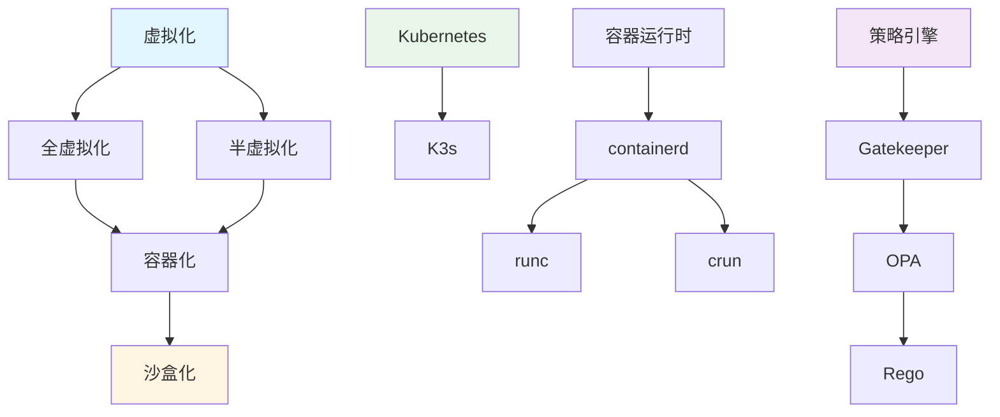

# 包含关系图谱

## 📑 目录

- [包含关系图谱](#包含关系图谱)
  - [📑 目录](#-目录)
  - [包含关系定义](#包含关系定义)
  - [包含关系示例](#包含关系示例)
    - [虚拟化层次关系](#虚拟化层次关系)
    - [编排层次关系](#编排层次关系)
    - [运行时层次关系](#运行时层次关系)
    - [策略层次关系](#策略层次关系)
  - [关系传递规则](#关系传递规则)

---

**最后更新**: 2025-11-06 **维护者**: 项目团队

> 📋 **主文档链
> 接**：[30.7.1 包含关系图谱](../concept-relations-matrix.md#3071-包含关系图谱)

## 包含关系定义

**包含关系（⊃）**：表示概念之间的层次包含关系，A ⊃ B 表示 A 包含 B。

## 包含关系示例

### 虚拟化层次关系

- **虚拟化 ⊃ 全虚拟化**
- **虚拟化 ⊃ 半虚拟化**
- **全虚拟化 ⊃ 容器化**
- **半虚拟化 ⊃ 容器化**
- **容器化 ⊃ 沙盒化**

### 编排层次关系

- **Kubernetes ⊃ K3s**
- **K3s ⊃ 边缘编排**
- **K3s ⊃ WasmEdge 支持**

### 运行时层次关系

- **容器运行时 ⊃ containerd**
- **containerd ⊃ runc**
- **containerd ⊃ crun**

### 策略层次关系

- **策略引擎 ⊃ Gatekeeper**
- **Gatekeeper ⊃ OPA**
- **OPA ⊃ Rego**

## 关系传递规则

**包含关系传递性**：如果 A ⊃ B 且 B ⊃ C，则 A ⊃ C

**示例**：

- 虚拟化 ⊃ 容器化 ⊃ 沙盒化
- Kubernetes ⊃ K3s ⊃ 边缘计算

---

**最后更新**：2025-11-06 **维护者**：项目团队
