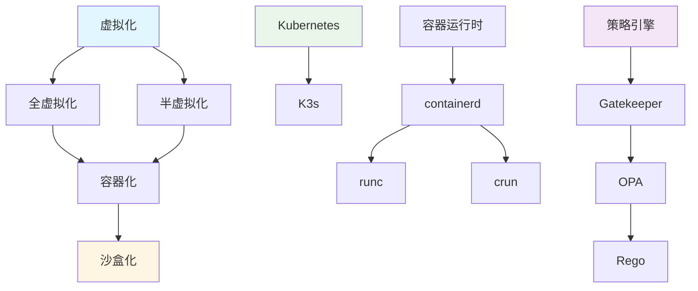

# 包含关系图谱

## 📑 目录

- [包含关系图谱](#包含关系图谱)
  - [📑 目录](#-目录)
  - [包含关系定义](#包含关系定义)
  - [包含关系示例](#包含关系示例)
    - [虚拟化层次关系](#虚拟化层次关系)
    - [编排层次关系](#编排层次关系)
    - [运行时层次关系](#运行时层次关系)
    - [策略层次关系](#策略层次关系)
  - [关系传递规则](#关系传递规则)
  - [包含关系应用](#包含关系应用)
    - [1. 架构层次设计](#1-架构层次设计)
    - [2. 技术选型决策](#2-技术选型决策)
    - [3. 系统抽象](#3-系统抽象)
  - [包含关系形式化](#包含关系形式化)
    - [包含关系定义](#包含关系定义-1)
    - [包含关系性质](#包含关系性质)
  - [实际应用案例](#实际应用案例)
    - [案例 1：K3s 边缘编排](#案例-1k3s-边缘编排)
    - [案例 2：容器运行时层次](#案例-2容器运行时层次)

---

**最后更新**: 2025-11-06 **维护者**: 项目团队

> 📋 **主文档链
> 接**：[30.7.1 包含关系图谱](../concept-relations-matrix.md#3071-包含关系图谱)

## 包含关系定义

**包含关系（⊃）**：表示概念之间的层次包含关系，A ⊃ B 表示 A 包含 B。



## 包含关系示例

### 虚拟化层次关系

- **虚拟化 ⊃ 全虚拟化**
- **虚拟化 ⊃ 半虚拟化**
- **全虚拟化 ⊃ 容器化**
- **半虚拟化 ⊃ 容器化**
- **容器化 ⊃ 沙盒化**

### 编排层次关系

- **Kubernetes ⊃ K3s**
- **K3s ⊃ 边缘编排**
- **K3s ⊃ WasmEdge 支持**

### 运行时层次关系

- **容器运行时 ⊃ containerd**
- **containerd ⊃ runc**
- **containerd ⊃ crun**

### 策略层次关系

- **策略引擎 ⊃ Gatekeeper**
- **Gatekeeper ⊃ OPA**
- **OPA ⊃ Rego**

## 关系传递规则

**包含关系传递性**：如果 A ⊃ B 且 B ⊃ C，则 A ⊃ C

**示例**：

- 虚拟化 ⊃ 容器化 ⊃ 沙盒化
- Kubernetes ⊃ K3s ⊃ 边缘计算

## 包含关系应用

### 1. 架构层次设计

**应用场景**：

- 通过包含关系建立清晰的架构层次
- 利用传递性简化架构设计

**示例**：

- **Kubernetes ⊃ K3s ⊃ 边缘编排**：边缘编排是 K3s 的子集，K3s 是 Kubernetes 的子集
- **容器运行时 ⊃ containerd ⊃ crun**：crun 是 containerd 的子集，containerd 是容器运行时的子集

**设计原则**：

- 保持层次清晰
- 利用传递性简化设计

### 2. 技术选型决策

**应用场景**：

- 根据包含关系选择合适的技术
- 理解技术之间的层次关系

**示例**：

- 如果需要边缘编排能力，可以选择 K3s（Kubernetes 的子集）
- 如果需要轻量级运行时，可以选择 crun（containerd 的子集）

**决策原则**：

- 选择最小满足需求的子集
- 保持技术栈的一致性

### 3. 系统抽象

**应用场景**：

- 通过包含关系建立抽象层次
- 隐藏底层实现细节

**示例**：

- **策略引擎 ⊃ Gatekeeper ⊃ OPA ⊃ Rego**：Rego 是策略语言，OPA 是策略引擎，Gatekeeper 是 Kubernetes 策略控制器
- **虚拟化 ⊃ 容器化 ⊃ 沙盒化**：沙盒化是容器化的子集，容器化是虚拟化的子集

**抽象原则**：

- 上层抽象下层细节
- 保持接口一致性

## 包含关系形式化

### 包含关系定义

**数学定义**：

```text
A ⊃ B 当且仅当 ∀x (x ∈ B → x ∈ A)
```

**性质**：

- **自反性**：A ⊃ A
- **传递性**：如果 A ⊃ B 且 B ⊃ C，则 A ⊃ C
- **反对称性**：如果 A ⊃ B 且 B ⊃ A，则 A = B

### 包含关系性质

**传递性证明**：

- 如果 A ⊃ B，且 B ⊃ C
- 则 ∀x (x ∈ C → x ∈ B) 且 ∀x (x ∈ B → x ∈ A)
- 因此 ∀x (x ∈ C → x ∈ A)
- 即 A ⊃ C

**应用**：

- 通过传递性简化包含链
- 利用传递性进行推理

## 实际应用案例

### 案例 1：K3s 边缘编排

**包含链**：

```text
Kubernetes ⊃ K3s ⊃ 边缘编排 ⊃ WasmEdge 支持
```

**架构设计**：

```yaml
# K3s 边缘节点配置
apiVersion: v1
kind: Node
metadata:
  name: edge-node-1
  labels:
    node-role.kubernetes.io/edge: "true"
spec:
  # K3s 轻量级配置
  k3s:
    runtime: containerd
    cni: flannel
    storage: local-path
```

**效果**：

- 资源占用：<512MB 内存（相比完整 Kubernetes 减少 80%）
- 启动时间：<30s（相比完整 Kubernetes 减少 70%）
- 边缘适配：支持离线部署和边缘自治

**技术栈**：

- K3s 1.30.4+k3s2（2025-11-06 最新）
- containerd + crun
- WasmEdge 0.14.1

### 案例 2：容器运行时层次

**包含链**：

```text
容器运行时 ⊃ containerd ⊃ crun ⊃ WasmEdge
```

**配置示例**：

```toml
# containerd 配置
version = 2
[plugins."io.containerd.grpc.v1.cri".containerd.runtimes]
  [plugins."io.containerd.grpc.v1.cri".containerd.runtimes.runc]
    runtime_type = "io.containerd.runc.v2"
  [plugins."io.containerd.grpc.v1.cri".containerd.runtimes.crun]
    runtime_type = "io.containerd.runc.v2"
    [plugins."io.containerd.grpc.v1.cri".containerd.runtimes.crun.options]
      BinaryName = "crun"
  [plugins."io.containerd.grpc.v1.cri".containerd.runtimes.wasmedge]
    runtime_type = "io.containerd.wasmedge.v1"
```

**效果**：

- 运行时选择：支持 runc、crun、WasmEdge 多种运行时
- 性能优化：crun 比 runc 启动快 30%，WasmEdge 冷启动 <1ms
- 资源占用：WasmEdge 镜像体积减少 90%

**性能指标**：

- runc 启动时间：~100ms
- crun 启动时间：~70ms（减少 30%）
- WasmEdge 启动时间：<1ms（减少 99%）

---

**最后更新**：2025-11-06 **维护者**：项目团队
