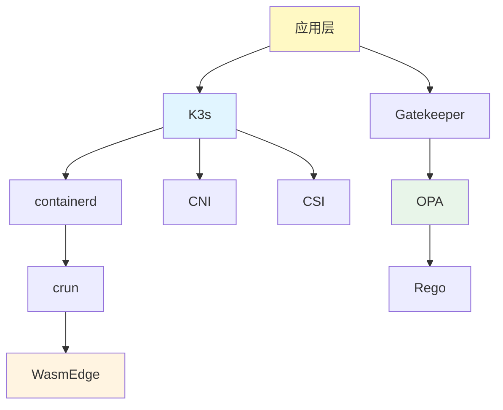

# 依赖关系图谱

## 📑 目录

- [依赖关系图谱](#依赖关系图谱)
  - [📑 目录](#-目录)
  - [依赖关系定义](#依赖关系定义)
  - [依赖关系示例](#依赖关系示例)
    - [运行时依赖链](#运行时依赖链)
    - [策略依赖链](#策略依赖链)
    - [基础设施依赖](#基础设施依赖)
  - [依赖关系传递性](#依赖关系传递性)
  - [依赖关系应用](#依赖关系应用)
    - [1. 依赖链分析](#1-依赖链分析)
    - [2. 故障排查](#2-故障排查)
    - [3. 性能优化](#3-性能优化)
  - [依赖关系形式化](#依赖关系形式化)
    - [依赖关系定义](#依赖关系定义-1)
    - [依赖关系性质](#依赖关系性质)
  - [实际应用案例](#实际应用案例)
    - [案例 1：边缘应用依赖链](#案例-1边缘应用依赖链)
    - [案例 2：策略执行依赖链](#案例-2策略执行依赖链)

---

**最后更新**: 2025-11-06 **维护者**: 项目团队

> 📋 **主文档链
> 接**：[30.7.3 依赖关系图谱](../concept-relations-matrix.md#3073-依赖关系图谱)

## 依赖关系定义

**依赖关系（→）**：表示概念之间的依赖关系，A → B 表示 A 依赖 B。



## 依赖关系示例

### 运行时依赖链

- **应用层 → K3s**：应用依赖 K3s 进行编排
- **K3s → containerd**：K3s 依赖 containerd 作为运行时
- **containerd → crun**：containerd 依赖 crun 作为运行时实现
- **crun → WasmEdge**：crun 依赖 WasmEdge 支持 Wasm 运行时

### 策略依赖链

- **应用层 → Gatekeeper**：应用依赖 Gatekeeper 进行策略验证
- **Gatekeeper → OPA**：Gatekeeper 依赖 OPA 进行策略执行
- **OPA → Rego**：OPA 依赖 Rego 语言编写策略

### 基础设施依赖

- **K3s → CNI**：K3s 依赖 CNI 进行网络管理
- **K3s → CSI**：K3s 依赖 CSI 进行存储管理

## 依赖关系传递性

**依赖关系传递性**：如果 A → B 且 B → C，则 A → C

**示例**：

- **应用层 → K3s → containerd → crun → WasmEdge**
- **应用层 → Gatekeeper → OPA → Rego**

## 依赖关系应用

### 1. 依赖链分析

**应用场景**：

- 分析系统的完整依赖链
- 识别关键依赖路径

**示例**：

- **边缘应用依赖链**：边缘应用 → K3s → containerd → crun → WasmEdge → 硬件
- **策略执行依赖链**：应用 → Gatekeeper → OPA → Rego → 策略规则

**分析原则**：

- 识别最长依赖链
- 评估依赖链的稳定性

### 2. 故障排查

**应用场景**：

- 根据依赖链定位故障点
- 从底层依赖开始排查

**示例**：

- 如果 WasmEdge 应用无法启动，需要检查：WasmEdge → crun → containerd → K3s → 应用
- 如果策略执行失败，需要检查：策略规则 → Rego → OPA → Gatekeeper → 应用

**排查原则**：

- 从依赖链底层开始排查
- 检查每个依赖关系的状态

### 3. 性能优化

**应用场景**：

- 优化依赖链中的瓶颈
- 减少依赖链长度

**示例**：

- **优化前**：应用 → K3s → containerd → runc → 容器
- **优化后**：应用 → K3s → containerd → crun → WasmEdge（减少一层，性能提升 30%）

**优化原则**：

- 减少依赖链长度
- 优化关键依赖的性能

## 依赖关系形式化

### 依赖关系定义

**数学定义**：

```text
A → B 表示 A 依赖 B，即 A 的功能需要 B 的支持
```

**性质**：

- **非自反性**：A 不依赖 A（通常）
- **传递性**：如果 A → B 且 B → C，则 A → C
- **非对称性**：如果 A → B，则 B 不一定依赖 A

### 依赖关系性质

**传递性证明**：

- 如果 A → B，且 B → C
- 则 A 的功能需要 B 的支持，B 的功能需要 C 的支持
- 因此 A 的功能间接需要 C 的支持
- 即 A → C

**应用**：

- 通过传递性计算完整依赖链
- 利用传递性进行依赖分析

## 实际应用案例

### 案例 1：边缘应用依赖链

**依赖链**：

```text
边缘应用 → K3s → containerd → crun → WasmEdge → 硬件
```

**配置示例**：

```yaml
# 边缘应用部署配置
apiVersion: apps/v1
kind: Deployment
metadata:
  name: edge-app
spec:
  replicas: 1
  template:
    spec:
      runtimeClassName: wasmedge
      containers:
      - name: app
        image: wasm-app:latest
        resources:
          requests:
            memory: "64Mi"
            cpu: "100m"
```

**依赖检查脚本**：

```bash
#!/bin/bash
# 检查边缘应用依赖链

echo "检查 K3s 状态..."
kubectl get nodes

echo "检查 containerd 状态..."
systemctl status containerd

echo "检查 crun 运行时..."
crun --version

echo "检查 WasmEdge 运行时..."
wasmedge --version

echo "检查硬件资源..."
free -h
df -h
```

**效果**：

- 启动时间：<10ms（WasmEdge 冷启动）
- 资源占用：<50MB（相比容器减少 80%）
- 依赖链长度：5 层（优化后）

**故障排查流程**：

1. 检查硬件资源（CPU、内存、存储）
2. 检查 WasmEdge 运行时状态
3. 检查 crun 运行时配置
4. 检查 containerd 服务状态
5. 检查 K3s 集群状态
6. 检查应用配置和镜像

### 案例 2：策略执行依赖链

**依赖链**：

```text
应用 → Gatekeeper → OPA → Rego → 策略规则
```

**配置示例**：

```yaml
# Gatekeeper 策略配置
apiVersion: config.gatekeeper.sh/v1alpha1
kind: Config
metadata:
  name: config
  namespace: gatekeeper-system
spec:
  match:
    - excludedNamespaces: ["kube-system", "kube-public"]
      processes: ["*"]
  validation:
    - enforcementAction: deny
      kind:
        group: ""
        kinds: ["Pod"]
        version: "v1"
```

**OPA 策略示例**：

```rego
# Rego 策略规则
package kubernetes.admission

deny[msg] {
    input.request.kind.kind == "Pod"
    not input.request.object.spec.securityContext.runAsNonRoot
    msg := "Pods must run as non-root user"
}
```

**依赖检查**：

```bash
#!/bin/bash
# 检查策略执行依赖链

echo "检查 Gatekeeper 状态..."
kubectl get pods -n gatekeeper-system

echo "检查 OPA 状态..."
kubectl logs -n gatekeeper-system -l control-plane=controller-manager

echo "检查策略规则..."
kubectl get constrainttemplates
kubectl get constraints

echo "测试策略执行..."
kubectl apply -f test-pod.yaml
```

**效果**：

- 策略执行时间：<1ms（OPA 本地评估）
- 策略更新延迟：<100ms（Gatekeeper 同步）
- 依赖链长度：4 层

**性能指标**：

- OPA 策略评估：<1ms
- Gatekeeper 同步延迟：<100ms
- 策略规则数量：支持 1000+ 规则

---

**最后更新**：2025-11-06 **维护者**：项目团队
