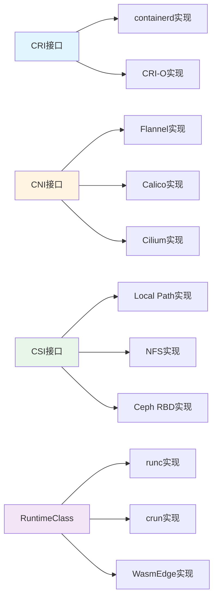

# 实现关系图谱

## 📑 目录

- [实现关系图谱](#实现关系图谱)
  - [📑 目录](#-目录)
  - [实现关系定义](#实现关系定义)
  - [实现关系示例](#实现关系示例)
    - [CRI 接口实现](#cri-接口实现)
    - [CNI 接口实现](#cni-接口实现)
    - [CSI 接口实现](#csi-接口实现)
    - [RuntimeClass 实现](#runtimeclass-实现)
  - [实现关系特性](#实现关系特性)
  - [实现关系应用](#实现关系应用)
    - [1. 接口抽象](#1-接口抽象)
    - [2. 实现替换](#2-实现替换)
    - [3. 标准兼容](#3-标准兼容)
  - [实现关系形式化](#实现关系形式化)
    - [实现关系定义](#实现关系定义-1)
    - [实现关系性质](#实现关系性质)
  - [实际应用案例](#实际应用案例)
    - [案例 1：CRI 运行时实现](#案例-1cri-运行时实现)
    - [案例 2：CNI 网络实现](#案例-2cni-网络实现)

---

**最后更新**: 2025-11-06 **维护者**: 项目团队

> 📋 **主文档链
> 接**：[30.7.4 实现关系图谱](../concept-relations-matrix.md#3074-实现关系图谱)

## 实现关系定义

**实现关系（≡）**：表示接口与实现的关系，A ≡ B 表示 A 接口由 B 实现。



## 实现关系示例

### CRI 接口实现

- **CRI 接口 ≡ containerd 实现**
- **CRI 接口 ≡ CRI-O 实现**

### CNI 接口实现

- **CNI 接口 ≡ Flannel 实现**
- **CNI 接口 ≡ Calico 实现**
- **CNI 接口 ≡ Cilium 实现**

### CSI 接口实现

- **CSI 接口 ≡ Local Path 实现**
- **CSI 接口 ≡ NFS 实现**
- **CSI 接口 ≡ Ceph RBD 实现**

### RuntimeClass 实现

- **RuntimeClass ≡ runc 实现**
- **RuntimeClass ≡ crun 实现**
- **RuntimeClass ≡ WasmEdge 实现**

## 实现关系特性

**接口抽象性**：接口定义抽象，可以有多个实现

**实现可替换性**：同一接口的不同实现可以相互替换

**标准兼容性**：实现必须符合接口标准

## 实现关系应用

### 1. 接口抽象

**应用场景**：

- 通过接口抽象隐藏实现细节
- 提供统一的接口规范

**示例**：

- **CRI 接口**：定义容器运行时接口，containerd 和 CRI-O 都实现此接口
- **CNI 接口**：定义网络接口，Flannel、Calico、Cilium 都实现此接口

**抽象原则**：

- 接口定义清晰
- 实现细节隐藏

### 2. 实现替换

**应用场景**：

- 根据需求选择不同的实现
- 在不改变接口的情况下替换实现

**示例**：

- **运行时替换**：从 runc 替换为 crun（性能提升 30%）
- **网络替换**：从 Flannel 替换为 Cilium（功能增强）

**替换原则**：

- 保持接口兼容
- 平滑迁移

### 3. 标准兼容

**应用场景**：

- 确保实现符合标准
- 保证互操作性

**示例**：

- **CRI 标准**：containerd 和 CRI-O 都符合 CRI 标准，可以互换
- **CNI 标准**：所有 CNI 插件都符合 CNI 标准，可以互换

**兼容原则**：

- 严格遵循标准
- 保证互操作性

## 实现关系形式化

### 实现关系定义

**数学定义**：

```text
A ≡ B 表示接口 A 由实现 B 实现，即 B 满足 A 的规范
```

**性质**：

- **多实现性**：一个接口可以有多个实现
- **可替换性**：同一接口的不同实现可以相互替换
- **标准性**：实现必须符合接口标准

### 实现关系性质

**多实现性**：

- 一个接口可以有多个实现
- 例如：CRI 接口 ≡ containerd 实现，CRI 接口 ≡ CRI-O 实现

**可替换性**：

- 同一接口的不同实现可以相互替换
- 例如：containerd 实现可以替换为 CRI-O 实现

**标准性**：

- 实现必须符合接口标准
- 例如：所有 CRI 实现都必须符合 CRI 标准

## 实际应用案例

### 案例 1：CRI 运行时实现

**接口定义**：

```protobuf
// CRI 接口定义（简化）
service RuntimeService {
  rpc RunPodSandbox(RunPodSandboxRequest) returns (RunPodSandboxResponse);
  rpc StopPodSandbox(StopPodSandboxRequest) returns (StopPodSandboxResponse);
  rpc CreateContainer(CreateContainerRequest) returns (CreateContainerResponse);
  rpc StartContainer(StartContainerRequest) returns (StartContainerResponse);
}
```

**containerd 实现**：

```toml
# containerd 配置
version = 2
[plugins."io.containerd.grpc.v1.cri"]
  sandbox_image = "registry.k8s.io/pause:3.9"
  [plugins."io.containerd.grpc.v1.cri".containerd]
    snapshotter = "overlayfs"
    default_runtime_name = "runc"
    [plugins."io.containerd.grpc.v1.cri".containerd.runtimes]
      [plugins."io.containerd.grpc.v1.cri".containerd.runtimes.runc]
        runtime_type = "io.containerd.runc.v2"
      [plugins."io.containerd.grpc.v1.cri".containerd.runtimes.crun]
        runtime_type = "io.containerd.runc.v2"
        [plugins."io.containerd.grpc.v1.cri".containerd.runtimes.crun.options]
          BinaryName = "crun"
```

**CRI-O 实现**：

```toml
# CRI-O 配置
[crio]
  runtime = "crun"
  [crio.runtime]
    default_runtime = "crun"
    [crio.runtime.runtimes]
      [crio.runtime.runtimes.runc]
        runtime_path = "/usr/bin/runc"
      [crio.runtime.runtimes.crun]
        runtime_path = "/usr/bin/crun"
```

**实现对比**：

| 特性 | containerd | CRI-O |
|------|-----------|-------|
| 性能 | ⭐⭐⭐⭐ | ⭐⭐⭐⭐⭐ |
| 资源占用 | 中等 | 低 |
| 功能完整性 | ⭐⭐⭐⭐⭐ | ⭐⭐⭐⭐ |
| 生产就绪 | ✅ | ✅ |

**替换示例**：

```bash
# 从 containerd 切换到 CRI-O
# 1. 停止 containerd
systemctl stop containerd

# 2. 安装 CRI-O
curl -fsSL https://get.opensuse.org/repositories/devel:kubic:libcontainers:stable/cri-o:/main/Debian_12/Release.key | gpg --dearmor -o /usr/share/keyrings/libcontainers-archive-keyring.gpg
echo "deb [signed-by=/usr/share/keyrings/libcontainers-archive-keyring.gpg] https://download.opensuse.org/repositories/devel:/kubic:/libcontainers:/stable:/cri-o:/main/Debian_12/ /" | tee /etc/apt/sources.list.d/cri-o.list
apt-get update
apt-get install -y cri-o cri-o-runc

# 3. 启动 CRI-O
systemctl start crio
systemctl enable crio

# 4. 更新 K3s 配置
k3s server --container-runtime-endpoint unix:///var/run/crio/crio.sock
```

### 案例 2：CNI 网络实现

**接口定义**：

```go
// CNI 接口定义（简化）
type CNI interface {
    AddNetwork(net *NetworkConfig, rt *RuntimeConf) (types.Result, error)
    DelNetwork(net *NetworkConfig, rt *RuntimeConf) error
    CheckNetwork(net *NetworkConfig, rt *RuntimeConf) error
}
```

**Flannel 实现**：

```yaml
# Flannel 配置
apiVersion: v1
kind: ConfigMap
metadata:
  name: kube-flannel-cfg
  namespace: kube-flannel
data:
  cni-conf.json: |
    {
      "name": "cbr0",
      "cniVersion": "0.3.1",
      "plugins": [
        {
          "type": "flannel",
          "delegate": {
            "hairpinMode": true,
            "isDefaultGateway": true
          }
        }
      ]
    }
  net-conf.json: |
    {
      "Network": "10.244.0.0/16",
      "Backend": {
        "Type": "vxlan"
      }
    }
```

**Cilium 实现**：

```yaml
# Cilium 配置
apiVersion: v1
kind: ConfigMap
metadata:
  name: cilium-config
  namespace: kube-system
data:
  cni-chaining-mode: "none"
  enable-ipv4: "true"
  enable-ipv6: "false"
  enable-bpf-masquerade: "true"
  enable-remote-node-identity: "true"
  identity-allocation-mode: "crd"
```

**实现对比**：

| 特性 | Flannel | Calico | Cilium |
|------|---------|--------|--------|
| 网络模型 | Overlay (VXLAN) | BGP/IPIP | eBPF |
| 性能 | ⭐⭐⭐ | ⭐⭐⭐⭐ | ⭐⭐⭐⭐⭐ |
| 安全策略 | ❌ | ✅ | ✅✅ |
| 可观测性 | ⭐⭐ | ⭐⭐⭐ | ⭐⭐⭐⭐⭐ |
| 资源占用 | 低 | 中 | 中 |

**替换示例**：

```bash
# 从 Flannel 切换到 Cilium
# 1. 卸载 Flannel
kubectl delete -f https://github.com/flannel-io/flannel/releases/latest/download/kube-flannel.yml

# 2. 安装 Cilium
helm repo add cilium https://helm.cilium.io/
helm install cilium cilium/cilium --version 1.15.0 \
  --namespace kube-system \
  --set ipam.mode=kubernetes

# 3. 验证
cilium status
cilium connectivity test
```

**效果**：

- 网络性能：Cilium eBPF 比 Flannel VXLAN 提升 50%
- 安全策略：支持 L3/L4/L7 策略
- 可观测性：提供完整的网络流量可视化

---

**最后更新**：2025-11-06 **维护者**：项目团队
