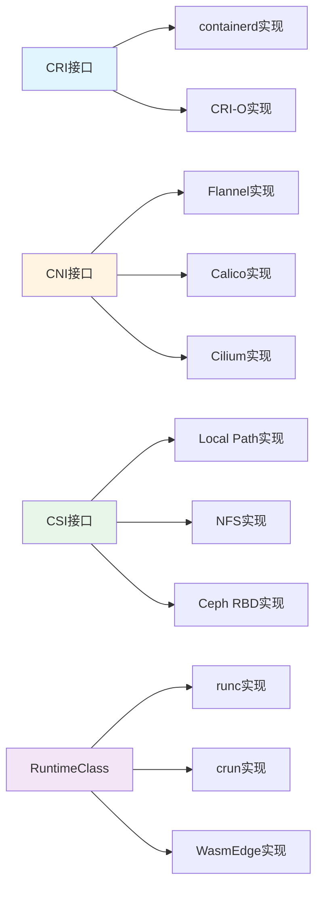

# 实现关系图谱

## 📑 目录

- [实现关系图谱](#实现关系图谱)
  - [📑 目录](#-目录)
  - [实现关系定义](#实现关系定义)
  - [实现关系示例](#实现关系示例)
    - [CRI 接口实现](#cri-接口实现)
    - [CNI 接口实现](#cni-接口实现)
    - [CSI 接口实现](#csi-接口实现)
    - [RuntimeClass 实现](#runtimeclass-实现)
  - [实现关系特性](#实现关系特性)

---

**最后更新**: 2025-11-06 **维护者**: 项目团队

> 📋 **主文档链
> 接**：[30.7.4 实现关系图谱](../concept-relations-matrix.md#3074-实现关系图谱)

## 实现关系定义

**实现关系（≡）**：表示接口与实现的关系，A ≡ B 表示 A 接口由 B 实现。

## 实现关系示例

### CRI 接口实现

- **CRI 接口 ≡ containerd 实现**
- **CRI 接口 ≡ CRI-O 实现**

### CNI 接口实现

- **CNI 接口 ≡ Flannel 实现**
- **CNI 接口 ≡ Calico 实现**
- **CNI 接口 ≡ Cilium 实现**

### CSI 接口实现

- **CSI 接口 ≡ Local Path 实现**
- **CSI 接口 ≡ NFS 实现**
- **CSI 接口 ≡ Ceph RBD 实现**

### RuntimeClass 实现

- **RuntimeClass ≡ runc 实现**
- **RuntimeClass ≡ crun 实现**
- **RuntimeClass ≡ WasmEdge 实现**

## 实现关系特性

**接口抽象性**：接口定义抽象，可以有多个实现

**实现可替换性**：同一接口的不同实现可以相互替换

**标准兼容性**：实现必须符合接口标准

---

**最后更新**：2025-11-06 **维护者**：项目团队
